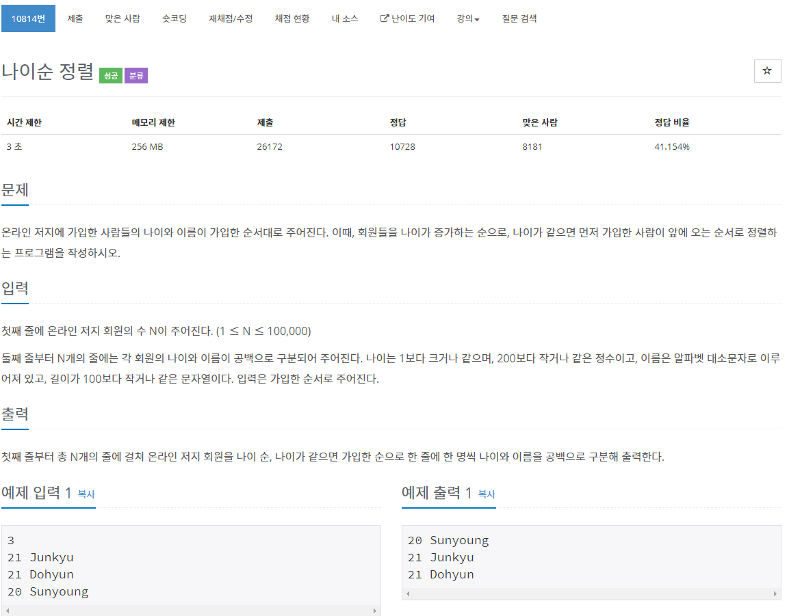
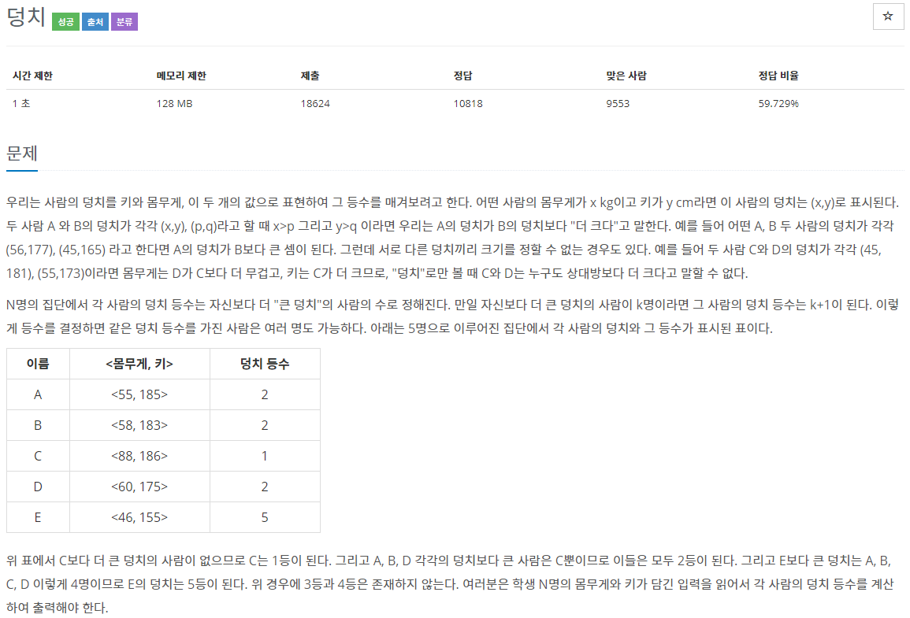

# 코딩 테스트 공부 1주차 - 2

### 10814번. 나이순 정렬



나이와 이름을 입력받아 나이순으로 정렬하고 나이가 같으면 입력 순서대로 정렬하는 것이 중요했던 문제였다. 처음에는 pair를 사용하려고 했는데 입력 순서도 같이 저장하면 편할 것 같아서 구조체를 사용하였다. algorithm의 sort를 구조체에 사용할 수 있는 것은 알았지만 구조체의 특정 속성을 기준으로 정렬하는 법을 몰랐었다. 이 부분은 검색을 통해 알게 되었고 sort를 활용하여 문제를 풀 수 있었다.

```c++
#include <iostream>
#include <string>
#include <algorithm>
#include <vector>

using namespace std;

struct man {
	int age;
	string name;
	int rank;
};

bool cmp(man a, man b) {
	if (a.age == b.age) // 나이가 같으면, rank가 적은 순서
		return a.rank < b.rank;
	else
		return a.age < b.age; // 나이가 다르면 나이 순서 그대로
}

int main() {
	int num;
	cin >> num;
	vector<man> people(num);

	for (int i = 0; i < num; i++) {
		cin >> people[i].age >> people[i].name;
		people[i].rank = i;
	}
	
	sort(people.begin(), people.end(), cmp);

	for (int l = 0; l < num; l++) {
		cout << people[l].age << ' ' << people[l].name << '\n';
	}
}
```

입력된 순서를 **rank** 라는 변수에 저장하여 해당 순서를 기반으로 나이가 같은 때의 정렬을 하였다.

- sort(v.begin(), v.end()): 단순히 start부터 end까지를 정렬한다.
- sort(v.begin(), v.end(), compare): compare은 사용자 정의 함수이며, 이것을 이용하여 정렬한다.
- sort(v.begin(), v.end(), greater<자료형>()): 내림차순으로 정렬한다.


### 7568번. 덩치



몸무게와 키를 쌍으로 입력받아 그것을 기준으로 등수를 정하는 문제이다. 이 때 몸무게와 키가 모두 커야 등수가 높으며, 몸무게는 무겁지만 키는 크지 않은 경우에는 그 사람과 같은 등수를 갖게 하는 부분이 어려웠다.

어렵게 생각했으나 배열을 돌면서 나보다 키와 몸무게가 모두 큰 사람을 발견할 경우에만 등수를 +1해주기만 하면 되는 간단한 문제였다. 항상 문제를 보고 생각할 때 너무 깊게 생각하는 경향이 있는 것 같고 이것을 고쳐야 겠다는 생각이 들게 한 문제였다.

```c++
#include <iostream>

using namespace std;

pair<int, int> people[50];
int Rank[50];

int main() {
	int num;
	cin >> num;

	for (int i = 0; i < num; i++) {
		cin >> people[i].first >> people[i].second;
	}

	for (int j = 0; j < num; j++) {
		int rank = 1;
		for (int k = 0; k < num; k++) {
			if (people[j].first < people[k].first && people[j].second < people[k].second) 
				rank += 1;
		}
		Rank[j] = rank;
	}

	for (int l = 0; l < num; l++) {
		cout << Rank[l] << ' ';
	}

}
```

Pair의 존재를 이 문제에서 처음 알게 되었는데 Pair는 원래 <utility> 헤더를 include해야 한다고 되어 있지만 왜인지 모르게 include 하지 않아도 작동하였다. 다음은 pair에 대한 간단한 사용법이다.

- 선언: pair<type, type> p 

- p.first: p의 첫 번째 인자를 반환
- p.second: p의 두 번째 인자를 반환
- make_pair(변1, 변2): 변1, 변2로 이루어진 pair를 생성
- sort사용이 가능하다. 첫 번째 인자를 기준으로 하되, 첫 번째가 같으면 두 번째 인자를 기준으로.


### 2609번. 최대공약수와 최소공배수


두 수의 최대공약수, 최소공배수를 구하는 문제이다. 개념은 알고 있었지만 그것을 코드로 구현하는데 애를 먹었던 문제이다.

우선 큰 수, 작은 수를 정하고 최대 공약수는 작은 수로부터 1씩 빼가며 두 수를 해당 수로 % 연산 했을 때 나머지가 0이 되는 수를 구함으로써 해결하였다. 이 때, 최대공약수를 1로 초기화 해야 하는 것을 생각하지 못해서 해결에 많은 시간이 걸렸다. 해당 개념에 대한 이해 부족이 원인이었다.

최소공배수는 1부터 증가시키며 해당 수를 큰 수,  작은 수에 곱해서 같은 수가 나왔을 때 그 값을 구하면 되는 문제였다. 두 수에 같은 수를 곱하면 절대 같은 수가 나올 수 없는데 이 부분을 착각하여 2중 반복문을 사용하지 않아서 시간이 많이 걸렸다. 

```c++
#include <iostream>

using namespace std;

bool isBigger(int a, int b) {
	if (a > b) return true;
	else return false;
}

int main() {
	int first, second;
	int gm = 1;
	int lm = 0;
	bool br = false;
	cin >> first >> second;

	if (!isBigger(first, second)) {
		int tmp;
		tmp = first;
		first = second;
		second = tmp;
	}

	for (int i = second; i > 1; i--) {
		if (first % i == 0 && second % i == 0) {
			gm = i;
			break;
		}
	}

	for (int j = 1; j < first; j++) {
		for (int k = 1; k <= first; k++) {
			if ((first * j) == (second * k)) {
				lm = first * j;
				br = true;
				break;
			}
		}
		if (br) break;
	}

	cout << gm << endl;
	cout << lm << endl;
}
```

전반적으로 수학 개념에 대한 지식이 부족함을 많이 느낄 수 있었다. 다른 문제들을 많이 풀어보며 개념들을 상기시켜야겠다는 생각이 든다.