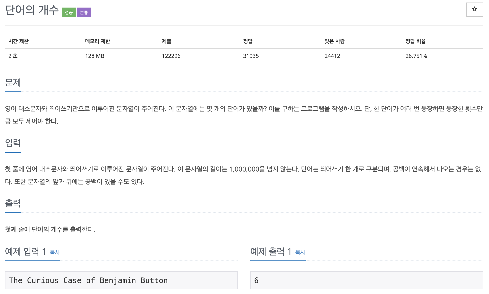
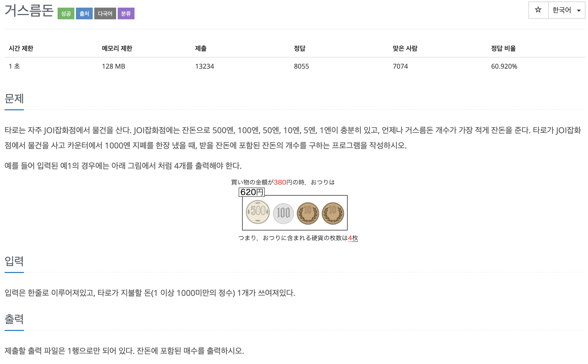
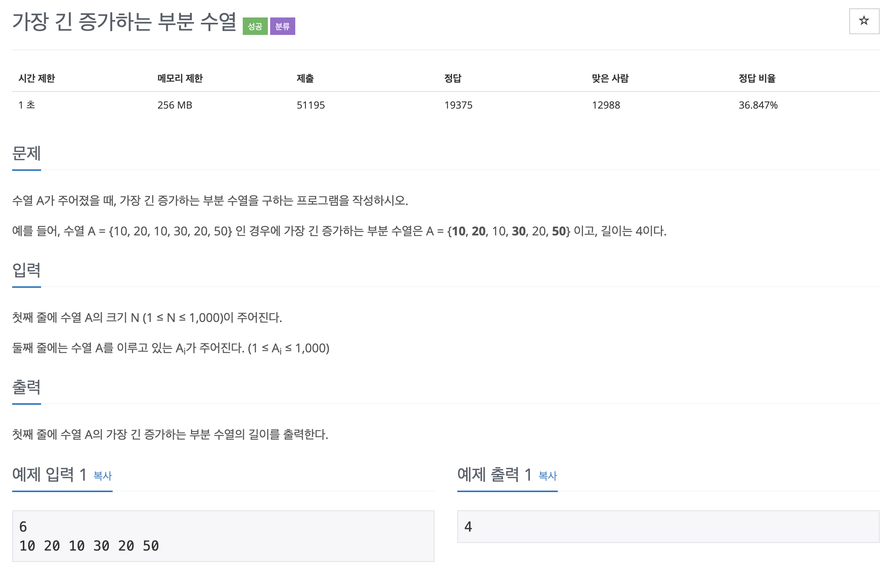

# 코딩 테스트 공부 2주차 - 1

### 1152번. 단어의 개수



문자열을 한 줄 입력받아 띄어쓰기로 구분하여 몇 단어로 이루어져 있는지를 구하는 문제이다. 

getline()으로 한 줄을 입력받고  시작한다. 맨 앞에도 띄어쓰기가 들어갈 수 있다는 조건이 있으므로 stringd의 맨 앞글자가 ' '인지를 검사하여 분기한다. 첫 count를 1로 초기화 했으므로 띄어쓰기로만 이루어진 문장이 들어오면 count를 빼준다. 이후에는 반복문을 돌며 ' '를 만나면 count++를 통해 카운트를 해준다. 

굉장히 쉽다고 생각했는데도 1~2번 실패했는데 그 이유는 **맨 마지막에도 ' '가 들어갈 수 있다는 점을 간과**해서이다. 이 부분은 문자열의 맨 마지막 부분일 때, 그것이 공백이면 count++을 하지 않고 break;함으로써 해결하였다.

```c++
#include <iostream>
#include <string>

using namespace std;

int main() {
    ios::sync_with_stdio(false);
    cin.tie(0);
    cout.tie(0);
    
    int count = 1;
    string str;
    getline(cin, str);
    
    if (str[0] == ' ') {
        if (str.size() == 1) count --;
        for (int i = 1; i < str.size(); i++) {
            if (i == str.size() - 1 && str[i] == ' ') break;
            if (str[i] == ' ') count ++;
        }
    } else {
        for (int j = 0; j < str.size(); j++) {
            if (j == str.size() - 1 && str[j] == ' ') break;
            if (str[j] == ' ') count ++;
        }
    }
    
    cout << count << '\n';
    
    return 0;
}
```


### 5585번. 거스름돈



작년 알고리즘 수업때 배운 **그리디 알고리즘**의 대표 예시문제이다. 거스름돈으로 줄 수 있는 동전의 종류를 배열에 큰 순서로 저장한 후, 거스름돈에서 동전을 빼며 count를 더해주었다. 잔돈이 동전 금액보다 크거나 같으면 해당 금액을 빼고 count(동전 갯수)를 +1 해주며 동전의 개수를 구하였다.

```c++
#include <iostream>

using namespace std;

int main() {
    ios::sync_with_stdio(false);
    cin.tie(0);
    cout.tie(0);
    
    int money[6] = {500, 100, 50, 10, 5, 1};
    int pay;
    int count = 0;
    cin >> pay;
    int change = 1000 - pay;
    
    for (int i = 0; i < 6; i++) {
        for (int j = 0; change >= money[i]; j++) {
            if (change >= money[i]) {
                change -= money[i];
                count ++;
            }
        }
    }
    
    cout << count << '\n';
    
    return 0;
}
```


### 11053번. 가장 긴 증가하는 수열



DP를 응용하는 문제이다. 처음에는 이중 반복문을 사용하여 풀려고 했었으나 반례 (1 4 2 3)의 경우를 통과하지 못했다. 내가 푼 방법으로 풀면 (1, 4)가 최대 길이 부분 수열이 되어 정답 (1, 2, 3)이 아닌 오답이 나오게 되었다. 도저히 혼자서는 풀 수가 없어서 어떤 방식으로 풀면 될지 찾아보게 되었다.

찾아본 바에 따르면 최대 길이 부분 수열을 찾는 방법은 다음과 같다.

- 첫 번째 수는 일단 배열에 넣는다
- 다음 수가 들어오면 배열의 맨 뒤부터 탐색한다.
- 탐색 인덱스가 맨 처음까지 가도 현재 수보다 작은 값이 없으면 맨 앞에 넣는다.
- 탐색 인덱스 < 현재 값 < 탐색 인덱스 + 1의 값이면 탐색 인덱스 + 1을 현재 값으로 대체한다.

해당 부분은 시간을 갖고 다시 생각해서 내 것으로 만들어야겠다.

```c++
#include <iostream>
#include <vector>

using namespace std;

int main() {
    ios::sync_with_stdio(false);
    cin.tie(0);
    cout.tie(0);
    
    int input[1001];
    int size;
    cin >> size;
    vector<int> maxLength;
    
    for (int i = 0; i < size; i++) {
        cin >> input[i];
        
        if (i == 0) maxLength.push_back(input[i]);
        else {
            for (int j = int(maxLength.size()) - 1; j >= 0; j--) {
                if (input[i] > maxLength.back()) maxLength.push_back(input[i]);
                else if (input[i] < maxLength[j] && input[i] > maxLength[j - 1]){
                    maxLength[j] = input[i];
                }
            }
        }
    }
    
    cout << maxLength.size() << '\n';
    
    return 0;
}
```

Reference: http://melonicedlatte.com/algorithm/2018/07/15/172615.html

