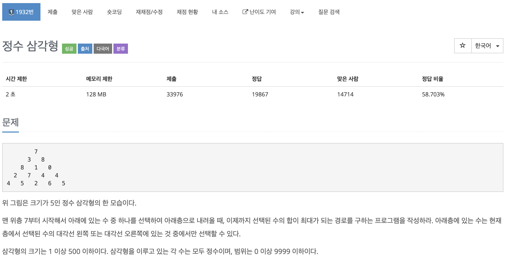
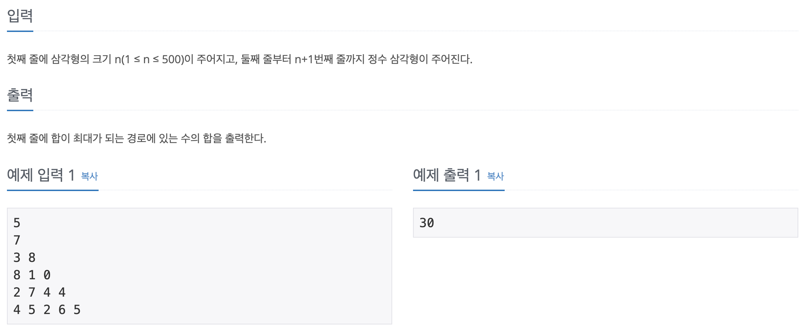
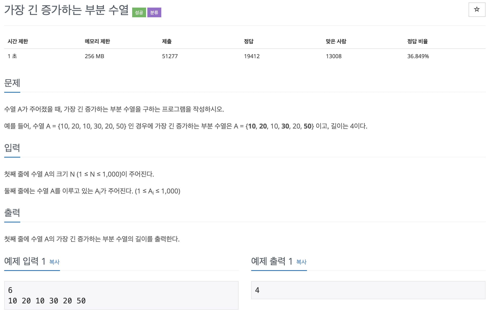
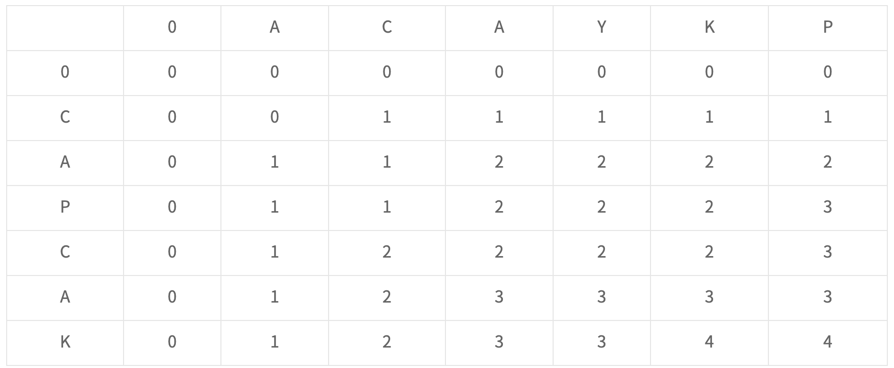
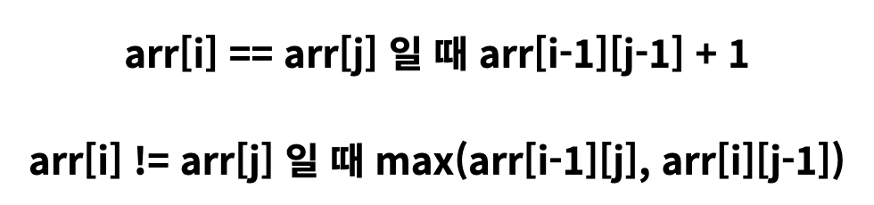
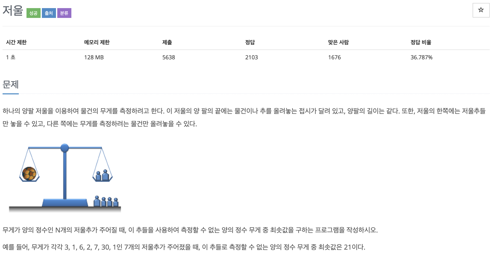
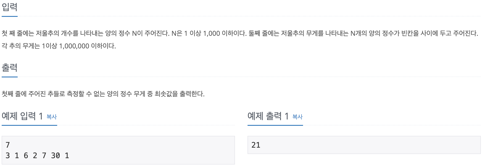
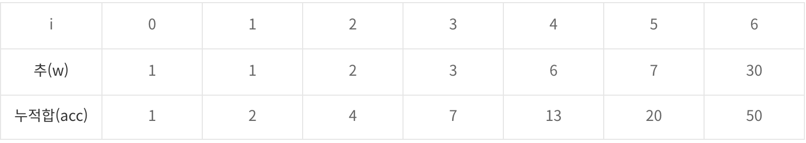
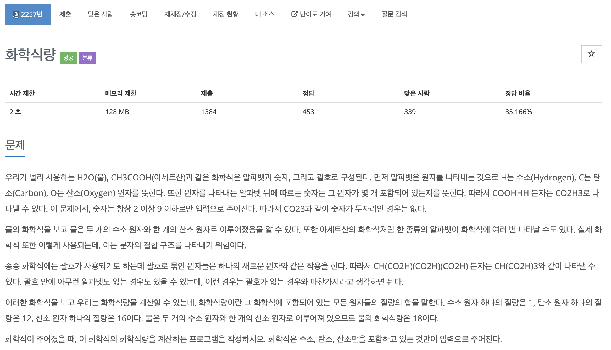
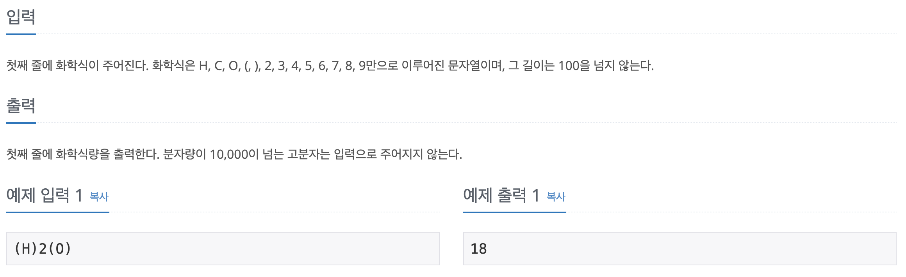

# 코딩 테스트 공부 2주차 - 2

### 1932번. 정수 삼각형





정수로 이루어진 삼각형을 입력받아 한 층에 하나의 수만 선택하여 최대 값을 구하는 문제이다. 이 때 주의할 점은 층을 내려갈 때 무조건 대각 왼쪽 혹은 오른쪽으로만 갈 수 있다는 것이다. 

처음에는 무조건 왼쪽 혹은 오른쪽으로 내려갈 때 그때그때 제일 큰 수를 고르면 답이 될 것이라고 생각했다. 하지만 (7+ 3+ 8)이 (7 + 8 + 1)보다 크므로 생각한 대로 풀어서는 안됐다. 따라서 입력과 똑같은 크기의 dp배열을 만들고 각 칸에는 그 칸에 올수 있는 경우의 수 중에 수의 합이 가장 큰 경우만 그 값을 기록하게 하였다. 

```c++
#include <iostream>
#include <string>

using namespace std;

int main() {
    ios::sync_with_stdio(false);
    
    int arr[501][501];
    int dp[501][501];
    int T;
    cin >> T;
    cin.ignore();
    
    for (int i = 0; i < T; i++) {
        for (int j = 0; j < i + 1; j++) {
            cin >> arr[i][j];
        }
    }
    
    dp[0][0] = arr[0][0]; // 맨 윗칸은 따져볼 것 없이 arr[0][0]과 같으므로 초기화
    
    for (int i = 1; i < T; i++) {
        dp[i][0] = arr[i][0] + dp[i - 1][0];
    }
    
    for (int i = 1; i < T; i++) {
        dp[i][i] = arr[i][i] + dp[i - 1][i - 1];
    }
    
    for (int i = 2; i < T; i++) {
        for (int j = 1; j < i; j++) {
            dp[i][j] = dp[i - 1][j - 1] > dp[i - 1][j] ? dp[i - 1][j - 1] : dp[i - 1][j];
            dp[i][j] += arr[i][j];
        }
    }
    
    int max = 0;
    for (int i = 0; i < T; i++) {
        if (dp[T - 1][i] > max) max = dp[T - 1][i];
    }
    
    cout << max << '\n';
    
    return 0;
}
```

맨 처음에  cin으로 int값을 받고 getline을 사용하니 쓰레기 값이 남아 있어서 getline을 사용하기 전에 cin.ignore()로 버퍼를 비워주었다.

dp 2차원 배열의 맨 왼쪽 대각과 오른쪽 대각의 dp값은 무조건 한가지(위에서부터 쭉 내려오는 것) 밖에 없으므로 for문을 통해 해당 dp값을 미리 채워준다. 이렇게 채우게 되면 1, 2번 줄은 전부 채워지게 되며 3번줄 부터 빈 dp칸을 채워주면 된다. 

아래 줄로 내려올 때 **무조건 대각 왼쪽 혹은 대각 오른쪽**으로만 갈 수 있으므로 dp값을 채워줄 때, 배열로 따지면 윗 줄의 왼쪽, 바로 윗 줄의 칸 두 개중에 큰 값을 선택하여 현재 칸의 수와 더해주면 dp값이 된다. 이러한 방식으로 dp 2차원 배열을 전부 채운 후, 마지막 줄의 dp값 중 가장 큰 값을 출력하면 정답이다.

### 11053번. 가장 긴 증가하는 부분 수열



어제 풀었던 문제이지만 오늘 dp를 이용하여 깔끔하게 한 번 더 풀어보았다.

```c++
#include <iostream>

using namespace std;

int main() {
    ios::sync_with_stdio(false);
    
    int arr[1000];
    int dp[1000];
    int T, result = 0;
    cin >> T;
    
    for (int i = 0; i < T; i++) {
        cin >> arr[i];
    }
    
    dp[0] = 1;
    result = 1;
    
    for (int i = 1; i < T; i++) {
        int max = 0;
        for (int j = i - 1; j >= 0; j--) {
            if (arr[j] < arr[i] && dp[j] > max) {
                max = dp[j];
            }
        }
        dp[i] = max + 1;
        if (result < dp[i]) result = dp[i];
    }
    
    cout << result << '\n';
    
    return 0;
}
```

맨 처음에 result값을 1로 초기화 하지 않아서 한 번 틀렸지만 간단하게 수정 후 통과하였다. 이 풀이에 대한 자세한 설명은 다른 포스트 (Lecture - Longest Increasing Subsequence)에 잘 나와있다.


### 9251번. LCS


LIS의 응용문제라고 들어서 LIS 처럼 풀려고 했지만 도저히 풀리지가 않아서 풀이를 보게 되었다. 풀이를 위해서는 점화식을 표로 표현하면 되는데 해당 표는 다음과 같다.



주어진 문자열의 길이보다 1칸씩 더 큰 2차원 정방행렬을 만든 후 칸을 채워나간다. 칸을 채울때에는 다음의 규칙을 따른다.

- 가로 세로 0번째 줄은 0으로 모두 채운다.
- 임의의 칸을 채울 때에는 해당 칸의 가로, 세로의 문자가 같다면 해당 칸의 왼쪽 대각선 칸의 값 + 1로 해당 칸을 채운다.
- 임의의 칸을 채울 때, 해당 칸의 가로, 세로의 문자가 다르다면 바로 윗칸과 왼쪽 칸 중 큰 값으로 해당 칸을 채운다.

위 방식을 점화식으로 나타낸다면 다음과 같다.



이러한 방식으로 반복하여 칸을 채운 후 오른쪽 맨 아래 마지막 칸의 값이 정답이 된다. 만약 오른쪽 맨 아래 칸의 왼쪽 칸을 선택한다면 해당 값은 ACAYK와 CAPCAK의 LCS값이 4라는 뜻이 된다. 풀이를 보며 작년 알고리즘 수업시간에 배웠던 내용인 것이 생각났다. 이러한 알고리즘들은 미리 외워두면 편할 것 같다.

Reference: https://far-simple.tistory.com/37


### 2437번. 저울






그리디 알고리즘을 활용하여 푸는 문제이다. 거스름돈 문제와 비슷하게 접근했지만 시간 초과가 떠서 결국 풀이를 보게 되었다. 일단 주어진 추 중에 1이 없다면 정답은 1이다. 모든 추가 1보다 크기 때문에 1을 측정할 수 없기 때문이다. 그 이외의 경우에는 주어진 추의 무게들을 일단 오름차순으로 정렬한다. 그러면 다음과 같은 결과가 나오게 된다.



무게가 1인 추가 있을 때, acc[i - 1] + 1 >= w[i]인 경우에는 acc[i - 1] ~ acc[i] 사이의 모든 수를 만들 수 있다**(이 부분이 이해가 가지 않는다...)**. i가 이 경우에 해당하지 않는다면 acc[i - 1] + 1의 값이 정답이 되게 된다.

```c++
#include <iostream>
#include <algorithm>

using namespace std;

int main(){
    int n;
    int num[1000];
    
    cin >> n;
    for (int i = 0; i < n; i++) cin >> num[i];
    
    sort(num, num + n);
    
    int result = 1;
    if (num[0] == 1) {
        int acc = num[0];
        for (int i = 1; i < n && acc >= num[i] - 1; i++) acc += num[i];
        result = acc + 1;
    }
    cout << result << '\n';
    return 0;
}
```

Reference: https://steadev.tistory.com/2


### 2257번. 화학식량





처음에는 스택을 이용해서 풀려고 했으나 풀다보니 재귀를 이용해서 풀어야 한다는 것을 알게 되었다. 재귀를 이용하여 풀려고 했으나 어떤 식으로 재귀를 구성해야 하는지 막히게 되어 풀이를 찾아보게 되었다.

```c++
#include <iostream>
#include <cstring>

using namespace std;

string s;
int answer = 0;
int temp[101] = { 0 };
int temp_idx = 0;
 
void recur(int idx, int sum) {
    if (idx == s.length()) {
        answer += sum;
        return;
    }
 
    if (s.at(idx) == 'H') {
        if (sum != 0)
            answer += sum;
        recur(idx + 1, 1);
    }
    else if (s.at(idx) == 'C') {
        if (sum != 0)
            answer += sum;
        recur(idx + 1, 12);
    }
    else if (s.at(idx) == 'O') {
        if (sum != 0)
            answer += sum;
        recur(idx + 1, 16);
    }
    else if (s.at(idx) >= '2' && s.at(idx) <= '9') {
        answer += (sum * (s.at(idx) - '0'));
        recur(idx + 1, 0);
    }
    else if (s.at(idx) == '(') {
        answer += sum;
        temp[temp_idx++] = answer;
        recur(idx + 1, 0);
    }
    else if (s.at(idx) == ')') {
        int t2 = answer + sum;
        answer = temp[--temp_idx];
        recur(idx + 1, t2 - temp[temp_idx]);
    }
}
 
int main(void) {
    cin >> s;
 
    memset(temp, 0, sizeof(temp));
 
    recur(0, 0);
    cout << answer << endl;
    return 0;
}
```

Reference: https://real-012.tistory.com/5