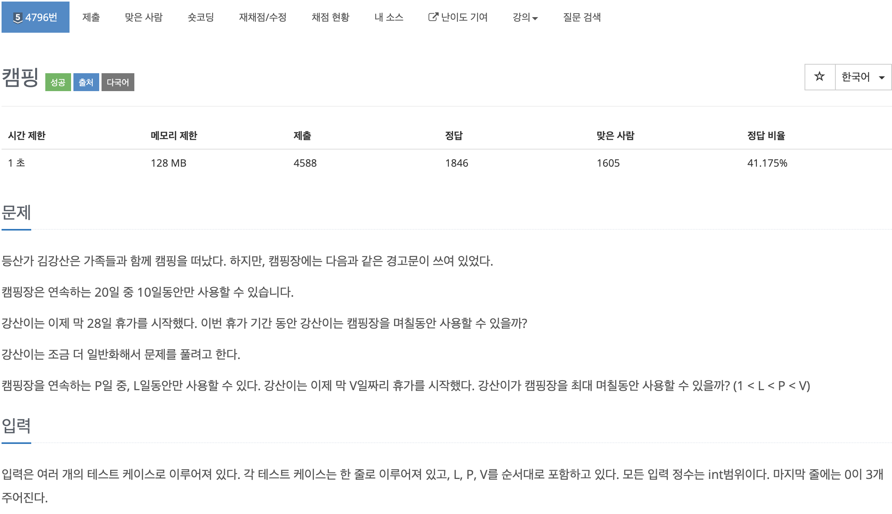
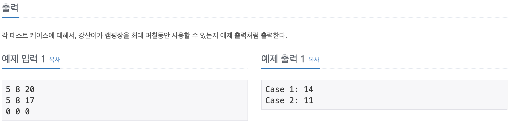
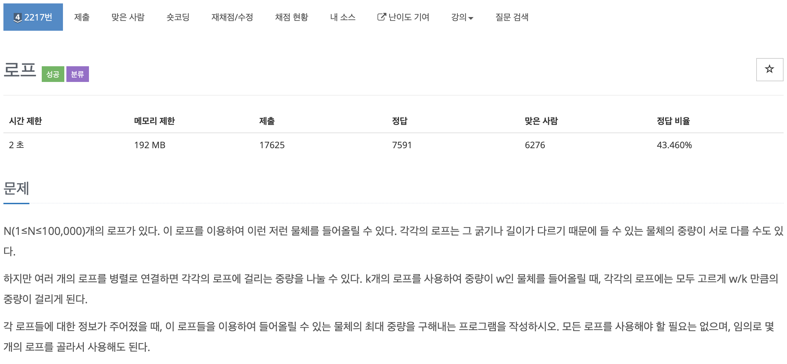
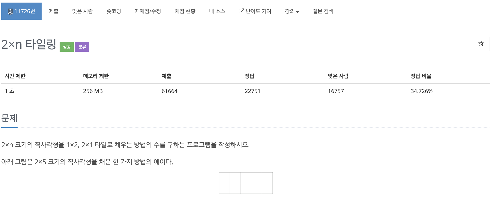
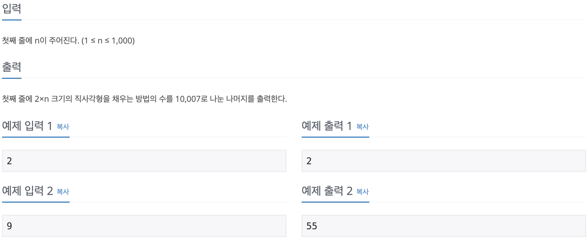

# 코딩 테스트 공부 2주차 - 3

### 10610번. 30


입력 받은 수의 수 배치를 바꾸어 가장 큰 30의 배수를 구하는 문제이다. 30의 배수를 만들 수 없으면 -1을 출력하면 된다. 입력을 받을 때 하나의 수로 받으면 각 자리의 수를 파싱할 수 없기 때문에 string으로 입력을 받아 시작한다. 이 때, 30의 배수를 구해야 하므로 항상 이 문자열에는 '0'이 포함 되어야 하며, 그렇지 않으면 -1을 출력하는 예외로 처리한다. 이후에는 각 자리 수의 수를 int형으로 변환(문자에서 - '0')하여 **전부 더해서 3의 배수가 되면** 해당 문자열을 이어 만든 수는 30의 배수가 되게 된다. 이런 조건을 모두 만족한다면 해당 수를 내림차순으로 정렬하여 출력하면 되는 문제였다.

이 문제에서 가장 어려웠던 점은 앞서 언급한 '0'을 포함하고 모든 자리 수를 다 더해 3의 배수가 되기만 하면 무조건 30의 배수를 만족하므로 내림차순으로 정렬한 수 외에 다른 경우를 생각할 필요가 없다는 것이었다. 정수론적 시각에 대해서 다시 한번 생각해 볼 수 있는 문제였다.

```c++
#include <iostream>
#include <string>
#include <algorithm>

using namespace std;

int main() {
    ios::sync_with_stdio(false);
    
    string Num;
    cin >> Num;
    
    int sum = 0;
    bool isContainZero = false;
    
    for (int i = 0; i < Num.size(); i++) {
        if (Num[i] == '0') isContainZero = true;
        sum += Num[i] - '0';
    }
    
    if (isContainZero && (sum % 3 == 0)) {
        sort(Num.begin(), Num.end(), greater<int>());
        cout << Num << '\n';
    } else cout << -1 << '\n';
    
    return 0;
}
```

Reference: https://sihyungyou.github.io/baekjoon-10610/


### 4796번. 캠핑





L, P, V가 주어지면 가장 길게 캠핑장을 사용하는 일수를 구하는 문제이다. 간단한 수학 연산으로 풀 수 있었던 문제였다. 우선 전체 일수로 주어진 V를 최대 사용 일수인 P로 나눈 일수 * L을 하여 결과 값에 더해준다. 그 이후에는 남은 휴가 일수 중에서 캠핑장을 사용할 수 있는 일수를 더해주면 되는데, 남은 휴가 일수보다 L값이 크다면 남은 휴가 일수(V % P) 모두를 캠핑장을 이용할 수 있으므로 남은 휴가 일수를 모두 더해준다. 그렇지 않다면 L값을 모두 사용할 수 있으므로 결과값에 L을 더한 후 결과값을 출력하면 해결되는 문제이다.

```c++
#include <iostream>

using namespace std;

int main() {
    ios::sync_with_stdio(false);
    cin.tie(0);
    cout.tie(0);
    
    int i = 1;
    
    while(true) {
        int L, P, V, result = 0;
        cin >> L >> P >> V;
        
        if (L == 0 && P == 0 && V == 0) break;
        
        result = (V / P) * L;
        if ((V % P) <= L) result += (V % P);
        else result += L;
        
        cout << "Case " << i << ": " << result << '\n';
        
        i++;
    }
    
    return 0;
}
```


### 2217번. 로프




주어진 갯수만큼의 로프를 이용하여 들 수 있는 최대 무게를 구하는 문제이다. 주의할 점은 각 로프에 모두 동일한 무게가 실려야 한다는 것이다. 처음에는 로프의 최대 중량을 오름차순으로 나열한 후 최소 중량 * 로프의 수로 정답을 구했다. 하지만 문제의 조건 중 **모든 로프를 사용하지 않아도 된다는 조건**을 보고 예외를 하나 더 생각할 수 있었다. (10 10 70)의 경우에는 최소 값 10 * 로프의 수 3을 하면 30이 되지만 70짜리 로프 하나를 사용하여 70의 무게를 메달면 30보다 더 큰 무게를 들어올릴 수 있다. 

이런 경우를 고려하기 위해 최소값 다음부터 끝까지 반복문을 돌면서 해당 로프의 최대 중량 * 그 뒤의 로프 수를 해서 max 보다 크면 max 값을 갱신하도록 했다. 여기서 로프의 최대 중량은 오름차순으로 되어 있으므로 그 뒤의 로프들은 해당 로프의 최대 중량보다 크거나 같기 때문이다. 이 예외를 처리하면 정답을 구할 수 있다.

```c++
#include <iostream>
#include <algorithm>

using namespace std;

int main() {
    ios::sync_with_stdio(false);
    cin.tie(0);
    cout.tie(0);
    
    int arr[100000];
    int T, max = 0;
    cin >> T;
    
    for (int i = 0; i < T; i++) {
        cin >> arr[i];
    }
    
    sort(arr, arr + T);
    max = arr[0] * T;
    
    for (int i = 1; i < T; i++) {
        if (arr[i] * (T - i) > max) max = arr[i] * (T - i);
    }
    
    cout << max << '\n';
    
    return 0;
}
```


### 11726번. 2 * n 타일링





2 * n 크기의 직사각형을 1 * 2, 2 * 1 크기의 타일로 채우는 방법의 수를 구하는 문제이다. 2 * n 크기의 직사각형이라고는 하지만 결국 N 미터의 네트워크 선을 1 또는 2m로 나누는 방법의 수를 구하는 것과 같다. 따라서 일반적인 형태의 dp를 이용하여 풀었지만 n이 1부터 1000까지 인것을 고려해야 했다. 

n이 100만 되어도 dp행렬의 값이 int의 표현 범위를 넘어서므로 그 값을 그대로 저장해서는 안됐다. 처음에는 string으로 나타내거나 long long을 사용하는 등의 방법을 고려했으나 문제를 자세히 보니 방법을 찾을 수 있었다. 문제에서 방법의 수를 10007로 나눈 수를 출력하라고 했으므로 **dp값이 10007보다 크다면 해당 값에서 10007을 뺀 값을 dp에 저장**함으로써 각 dp값이 int의 표현 범위를 넘어 서는 것을 막고 정답을 구할 수 있었다. 

```c++
#include <iostream>

using namespace std;

int main() {
    ios::sync_with_stdio(false);
    cin.tie(0);
    cout.tie(0);
    
    int dp[1001];
    int n;
    cin >> n;
    
    dp[1] = 1;
    dp[2] = 2;
    for (int i = 3; i <= n; i++) {
        dp[i] = dp[i - 1] + dp[i - 2];
        if (dp[i] > 10007) dp[i] %= 10007;
    }
    
    cout << dp[n] % 10007 << '\n';
    
    return 0;
}
```

