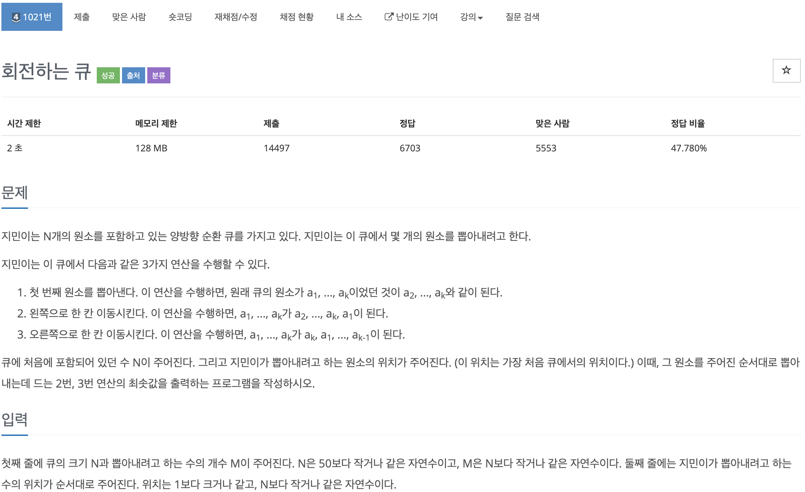

# 코딩 테스트 공부 3주차 - 1: 힙, 우선순위 큐

### 1021번. 회전하는 큐




배열에 저장된 값 중 맨 앞의 값만 뽑아낼 수 있는 상황에서 한 수가 주어지면 그 수를 빼기 위해 배열을 왼쪽 혹은 오른쪽으로 얼마나 밀어야 하는지를 구하는 문제이다. 앞, 뒤에 원소를 넣거나 뺄 수 있는 deque를 이용하여 배열을 구현하였고 효율적인 연산을 위해 최소한으로 미는 횟수를 구해야 했다. 이것은 현재 빼야 할 수가 배열의 몇 번째 인덱스에 있는지를 찾고, 이 인덱스가 배열의 중간 인덱스보다 작으면 왼쪽, 크면 오른쪽으로 밀도록 하여 효율적인 연산을 할 수 있도록 했다.

이 때, 배열 내부의 수의 갯수가 짝수이면 배열의 size / 2를 하여 해당 인덱스를 mid로 잡으면 됐는데, **홀수일 경우에는 size / 2 에 1을 더해주어야 했던 것이 중요**했다. move_left와 move_right가 호출될 때마다 횟수를 카운트하여 마지막에 출력해 주어 정답을 구하였다.

```c++
#include <iostream>
#include <deque>
#include <algorithm>

using namespace std;

deque<int> queue;
int sum = 0;

void move_left() {
    int tmp = queue.front();
    queue.pop_front();
    queue.push_back(tmp);
    sum ++;
    
    return ;
}

void move_right() {
    int tmp = queue.back();
    queue.pop_back();
    queue.push_front(tmp);
    sum ++;
    
    return ;
}

int main() {
    ios::sync_with_stdio(false);
    cin.tie(0);
    
    int m, n;
    cin >> n >> m;
    
    for (int i = 1; i <= n; i++) {
        queue.push_back(i);
    }
    
    for (int i = 0; i < m; i++) {
        int tmp;
        cin >> tmp;
        int mid = (int(queue.size()) % 2) == 0 ? (int(queue.size()) / 2) - 1 : (int(queue.size()) / 2);
        int tmp_address = int(find(queue.begin(), queue.end(), tmp) - queue.begin());
        
        if (tmp_address <= mid) {
            if (tmp == queue.front()) {
                queue.pop_front();
                continue;
            }
            for (int j = 0; queue.front() != tmp; j++) {
                move_left();
            }
            queue.pop_front();
        } else {
            for (int j = 0; queue.front() != tmp; j++) {
                move_right();
            }
            queue.pop_front();
        }
    }
    
    cout << sum << '\n';
    
    return 0;
}
```

여기서도 저번 주차와 마찬가지로 find함수를 썼는데 해당 수가 몇 번째 인덱스에 위치하는지를 찾기 위해 find값을 구하고 거기서 배열의 시작값을 빼주었다. 여기서 find 함수가 ```<algorithm>``` 헤더에 위치해 있는 것을 고려하지 못해서 컴파일 에러가 2번 났다. 사용하는 함수가 어떤 헤더에 들어있는지 확실히 기억해 둘 필요가 있을 것 같다.


### 11279번. 최대 힙


최대 힙이라고 해서 힙을 직접 구현해야 하는 줄 알았지만 ```<queue>``` 헤더의 priority_queue를 이용하여 쉽게 풀 수 있었다. 0이 들어왔을 때, priority_queue가 비어있다면 0을 출력하고 그렇지 않다면 priority_queue 의 top값이 자동으로 최댓값을 가르키고 있으므로 top을 출력해주고 pop을 통해 top값을 priority_queue에서 빼내준다. 만약 0이 아닌 다른 수가 들어온다면 push를 이용하여 priority_queue에 삽입해 준다.

```c++
#include <iostream>
#include <queue>

using namespace std;

int main() {
    ios::sync_with_stdio(false);
    cin.tie(0);
    
    int t;
    cin >> t;
    priority_queue<int> pq;
    
    for (int i = 0; i < t; i++) {
        int oper;
        cin >> oper;
        
        if (oper == 0) {
            if (pq.empty()) cout << 0 << '\n';
            else {
                cout << pq.top() << '\n';
                pq.pop();
            }
        } else {
            pq.push(oper);
        }
    }
    return 0;
}
```

여기서는 C++ STL중 ```<queue>```의 ```priority_queue```를 알게 되었다. 이 STL의 특징은 다음과 같다.

- 선언: priority_queue<자료형> 변수명; -> == priority_queue<int, vector<int>, less<int>>
- pq.push(변수): pq에 변수를 삽입한다.
- pq.top(): pq의 원소 중 가장 큰 값을 반환한다.
- pq.pop(): pq의 원소 중 top 값을 제거한다.
- pq.size(): pq내의 원소 수를 반환한다.
- pq.empty(): pq가 비었으면 1, pq에 원소에 있으면 0을 반환한다.
- Priority_queue의 디폴트는 내림차순이다.

References: 

힙: https://gmlwjd9405.github.io/2018/05/10/data-structure-heap.html

Priority_queue: https://twpower.github.io/93-how-to-use-priority_queue-in-cpp


### 1927번. 최소 힙


이전 문제와 모든 부분이 같지만 큐의 정렬 순서가 작은 것부터라는 것이 차이이다. Priority_queue를 선언할 때 parameter를 다르게 주어 해결하였다.

```c++
#include <iostream>
#include <queue>
#include <vector>

using namespace std;

int main() {
    ios::sync_with_stdio(false);
    cin.tie(0);
    
    priority_queue<int, vector<int>, greater<int>> pq;
    int t;
    cin >> t;
    
    for (int i = 0; i < t; i++) {
        int oper;
        cin >> oper;
        
        if (oper == 0) {
            if (pq.empty()) cout << 0 << '\n';
            else {
                cout << pq.top() << '\n';
                pq.pop();
            }
        } else pq.push(oper);
    }
    return 0;
}
```

우선순위 큐를 선언할 때 ```priority_queue<자료형, vector<자료형>, greater<자료형>> 변수명```과 같이 선언하면 오름차순으로 정렬되며 따라서 pq.top()이 가장 작은 수를 가르킬 수 있다.