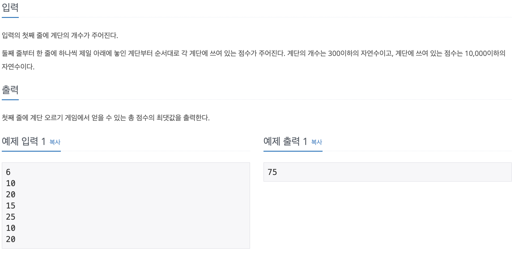

# 코딩 테스트 공부 2주차 - 4

### 2579번. 계단 오르기 - dp




기존에 많이 풀어보았던 dp문제와 크게 다를 것이 없어 보였으나 문제의 조건 중 세 개의 계단을 연속해서 밟으면 안된다는 조건이 까다로웠던 문제였다. 우선 각 계단에 도달할 때까지의 누적 최댓값을 저장하기 위해 dp배열을 선언하였다. 이 때, 바로 전 계단에서 올라 왔을 때, 한 계단을 뛰어 넘어 올라왔을 때 두 가지의 경우의 수를 저장해야 하므로 dp를 2차원 배열로 선언하였다. ```dp[i][0]```에는 바로 전계단을 밟고 i 번째 계단을 밟았을 때 까지의 최댓값, ```dp[i][1]```에는 전 전 계단을 밟고 i 번째 계단을 밟았을 때 까지의 최댓값을 저장하였다.

계단이 1개 일 때에는 ```dp[0][0]``` 값은 해당 계단의 가중치 하나만 더하면 될 것이고, ```dp[0][1]``` 값은 0이 될 것이다. 계단이 2개 인 경우에는 ```dp[1][0]``` 값은 계단 두 개의 가중치를 합한 값, ```dp[1][1]``` 값은 두 번째 계단의 가중치가 될 것이다. 이와 같이 초기화를 한 다음, 세 번째 계단부터 마지막 계단까지의 dp값을 구해준다. 

```dp[i][0]``` 값은 바로 전 계단을 밟고 현재 계단을 밟은 경우인데, 세 개의 계단을 연속으로 밟을 수 없으므로 전 계단을 밟았을 때 한 칸을 뛰어 넘어 밟았어야 한다. 따라서 현재 계단의 가중치```arr[i]```에 두 칸을 뛰어서 이전 계단을 밟았을 때의 최댓값 ```dp[i - 1][1]```값을 더해서 ```dp[i][0]```값을 구한다.

```dp[i][1]```값은 전전계단을 밟고 현재 계단을 밟은 경우인데, 이 경우에는 세 개의 계단을 연속으로 밟는 경우를 생각할 필요가 없으므로 현재 계단의 가중치 ```arr[i]```에 전전 계단의 가중치 중 최댓값```max(dp[i - 2][0], dp[i - 2][1])```을 더해주어 ```dp[i][1]```값을 구한다.

정답은 마지막 계단에서 전 계단을 밟고 올라온 경우, 전전 계단을 밟고 올라온 경우 중 큰 수를 골라 출력하면 된다.

```c++
#include <iostream>
#include <algorithm>

using namespace std;

int main() {
    ios::sync_with_stdio(false);
    cin.tie(0);
    
    int T;
    int arr[301];
    int dp[301][2] = {0, };
    cin >> T;
    
    for (int i = 0; i < T; i++) {
        cin >> arr[i];
    }
    
    dp[0][0] = arr[0];
    dp[0][1] = 0;
    dp[1][0] = arr[0] + arr[1];
    dp[1][1] = arr[1];
    
    for (int i = 2; i < T; i++) {
            dp[i][0] = arr[i] + dp[i - 1][1];
            dp[i][1] = arr[i] + max(dp[i - 2][0], dp[i - 2][1]);
    }
    
    cout << max(dp[T - 1][1], dp[T - 1][0]) << '\n';
    
    return 0;
}
```


### 1931번. 회의실 배정 - greedy


한 회의실에서 최대로 회의를 할 수 있는 횟수를 구하는 문제이다. 처음에는 회의 진행 시간을 기준으로 정렬을 하려고 했으나 도저히 풀리지가 않아서 풀이를 보게 되었다. 내가 계속해서 정렬하려고 했던 회의 진행 시간은 반례가 너무 많아 정렬 기준으로 사용할 수 없었고, 한 번도 생각해보지 못했던 회의 종료 시간을 기준으로 정렬하면 답을 찾을 수 있었다.

먼저 입력에 대해 회의 종료 시간을 기준으로 오름차순 정렬하고 종료시간이 같다면 시작 시간을 기준으로 오름차순 정렬한 후 ,  맨 처음 회의를 선택하고 해당 회의 시간의 종료시간보다 크거나 같은 시작시간을 회의를 선택하는 방법으로 계속하여 회의를 선택하여 문제를 해결하였다.

```c++
#include <iostream>
#include <vector>
#include <algorithm>

using namespace std;

vector<pair<int, int>> meetings(100001);
int T, result = 1;
int endTime = 0;

bool cmp(const pair<int, int> &A, const pair<int, int> &B) {
    if (A.second < B.second) return true;
    else if (A.second == B.second) return A.first < B.first;
    else return false;
}

int main() {
    ios::sync_with_stdio(false);
    cin.tie(0);
    
    cin >> T;
    meetings.resize(T);
    
    for (int i = 0; i < T; i++) {
        int start, end;
        cin >> start >> end;
        meetings[i] = make_pair(start, end);
    }
    
    sort(meetings.begin(), meetings.end(), cmp);
    endTime = meetings[0].second;
    
    for (int i = 1; i < T; i++) {
        if (endTime <= meetings[i].first) {
            endTime = meetings[i].second;
            result ++;
        }
    }
    
    cout << result << '\n';
    
    return 0;
}
```

코드 구현시에 유심히 봐야했던 것은 pair로 벡터를 만드는 것이었다. ```vector<pair<int, int>>```와 같이 pair 벡터를 만들 수 있었고 각 pair에 **first**, **second**로 접근할 수 있던 것도 상기할 수 있었다.  또한 sort시에 cmp함수를 만드는 것을 다시 한 번 상기해볼 수 있었는데  **parameter의 형식**에 유의해야 하는 것을 다시 한 번 확인할 수 있었다.

문제를 잘못 파악해서 불필요한 실패를 2번 늘렸다. 회의가 끝나는 시간과 다른 회의의 시작시간이 같아도 해당 회의가 선택될 수 있는데 무조건 커야만 선택될 수 있다고 생각해서 시간을 허비했다. 문제를 꼼꼼히 읽고 먼저 이해하는 습관을 들여야 한다.


### 11047번. 동전 0 - greedy


갖고 있는 동전을 이용하여 최소한의 갯수만으로 금액을 나타내는 문제이다. 거스름돈 문제와 같이 오름차순으로 입력받은 동전의 금액을 거꾸로 반복문을 돌며 나타낼 금액에서 빼가면서 동전의 갯수를 구할 수 있었다.

```c++
#include <iostream>

using namespace std;

int main() {
    ios::sync_with_stdio(false);
    cin.tie(0);
    
    int N, K, count = 0;
    cin >> N >> K;
    int coins[10];
    
    for (int i = 0; i < N; i++) {
        cin >> coins[i];
    }
    
    for (int i = N - 1; i >= 0; i--) {
        if (coins[i] <= K) {
            while(true) {
                K -= coins[i];
                count ++;
                if (K < coins[i]) break;
            }
        }
    }
    
    cout << count << '\n';
    
    return 0;
}
```

큰 동전의 금액부터 반복문을 돌며 나타낼 금액이 해당 동전보다 크거나 같다면 동전의 금액만큼 빼고 count를 ++한다. 나타낼 금액이 해당 동전의 금액보다 작아졌다면 빼는 작업을 중지하고 다음 크기의 동전으로 넘어간다.


### 12738번. 가장 긴 증가하는 부분 수열 3 - dp, LIS


저번 주차에 풀어보았던 LIS문제이다. 해당 문제와 동일하지만 저번 문제의 풀이는 n^2 시간복잡도를 가지고 있었다. 하지만 이번 문제는 입력의 범위가 크므로 n^2으로는 풀 수 없고 nlogn으로 풀어야 했던 문제이다. 이에 대한 해결 방법은 저번에 언급했던 바와 같다.

입력이 들어오면 다음의 조건을 만족하는 최장 배열을 만들도록 한다.

- 맨 처음 원소는 그냥 넣는다.
- 그 다음으로 들어오는 원소부터는 임시 배열의 최댓값보다 크다면 그 뒤에 넣는다.
- 그렇지 않다면 해당 수보다 크거나 같은 가장 작은 수의 인덱스를 찾아 그 위치에 해당 수를 넣는다.

```c++
#include <iostream>
#include <algorithm>

using namespace std;

const int MAX = 1000001;
int N;
int arr[MAX];
int longArr[MAX];

int LIS(void) {
    int idx = 0;
    longArr[idx] = arr[0];
    
    for (int i = 1; i < N; i++) {
        if (longArr[idx] < arr[i]) {
            longArr[++idx] = arr[i];
        } else {
            int idx2 = lower_bound(longArr, longArr + idx, arr[i]) - longArr;
            longArr[idx2] = arr[i];
        }
    }
    return idx + 1;
}

int main(void) {
    ios_base::sync_with_stdio(0);
    cin.tie(0);
    
    cin >> N;
    
    for (int i = 0; i < N; i++)
        cin >> arr[i];
    
    cout << LIS() << "\n";
    
    return 0;
}
```

인덱스의 추가가 이루어진 것에 1을 더하면 정답을 출력할 수 있다(idx + 1). 이 코드에서 어떤 수보다 크거나 같은 가장 작은 수를 구하기 위해 **algorithm**의 **lower_bound**함수를 사용하였는데, 해당 함수의 사용방법은 다음과 같다.

Lower_bound(first iterator, last iterator, value)

- First iteratord ~ last iterator 사이 중에서 **value보다 크거나 같은** **수중 가장 작은 수의 iterator**를 반환한다.
- 해당 수의 인덱스를 알고 싶으면 lower_bound의 값에서 **시작 배열의 주소를 빼주면** 구할 수 있다.
- 이진 탐색을 기반으로 하기 때문에 **사용하기 전에 정렬이 되어 있어야 한다!!!**

비슷한 함수로는 upper_bound가 있는데 이 함수는 value값을 **초과하는 값** **중 가장 작은 값**을 찾아주는 함수이다.

References: 

- 풀이 방법: http://melonicedlatte.com/algorithm/2018/07/15/171956.html

- lower_bound 함수: https://www.crocus.co.kr/913


### 1700번. 멀티탭 스케쥴링 - greedy


문제 이해는 어렵지 않았으나 구현에 애를 먹은 문제였다. 주어진 멀티탭의 구멍 수로 이루어진 int형 vector gr을 만들고 해당 배열에 교체가 일어나는 횟수를 카운팅하여 정답을 구하였다. 입력받은 제품의 사용 순서를 반복문으로 돌며 gr의 크기가 주어진 N보다 작으면 사용할 제품을 멀티탭에 꽂으며 시작하였다. 

문제는 멀티탭이 꽉 찼을 때 어떤 제품의 코드를 뽑을것인가 였는데, 이것은 현재 제품의 뒤부터 순서대로 검사하여 지금 gr배열(멀티탭)에 있는 제품을 N - 1개까지만 찾아서 나머지 1개의 값을 gr배열에서 제거하고 현재의 제품 이름을 gr배열에 넣는 방식으로 해결하였다. 이 때 pull 변수를 +1씩 증가시켜 마지막에 정답으로 출력하도록 했다. 한 가지 예외사항으로는 멀티탭의 제한 수가 1일 때에는 주어진 제품 사용 순서에서 제품 명이 다를 때마다 코드를 뽑아야 했으므로 해당 부분을 예외처리 하였다.

```c++
#include <iostream>
#include <vector>
#include <algorithm>

using namespace std;

int main() {
    ios::sync_with_stdio(false);
    cin.tie(0);
    
    int N, K, pull = 0;
    int arr[101];
    cin >> N >> K;
    vector<int> gr;
    
    for (int i = 0; i < K; i ++) {
        cin >> arr[i];
    }
    
    gr.push_back(arr[0]);
    
    if (N == 1) { // N = 1이면 제품명이 바뀔때마다 코드를 뽑아야 한다.
        for (int i = 1; i < K; i++) {
            if (arr[i] != arr[i - 1]) pull ++;
        }
    } else {
        for (int i = 1; i < K; i++) {
            if (gr.size() < N && (find(gr.begin(), gr.end(), arr[i]) == gr.end())) gr.push_back(arr[i]); // 아직 멀티탭이 다 차지 않고 지금 제품이 멀티탭에 꽂혀있지 않으면 멀티탭에 추가
            else { // 지금 제품이 멀티탭에 꽂혀 있지 않은 경우
                if (find(gr.begin(), gr.end(), arr[i]) == gr.end()) { 
                    vector<int> isIn(N); // 0 or 1로 gr에 해당 제품이 꽂혀있는지를 저장
                    int limit = 0; // 이 변수를 통해 N - 1개까지 앞으로 사용할 제품을 탐색
                    
                    for (int j = i + 1; j < K; j++) { // arr[j]가 gr안에 있는 경우
                        if (find(gr.begin(), gr.end(), arr[j]) != gr.end()) {
                            for (int m = 0; m < gr.size(); m++) { // isIn에 표시
                                if (gr[m] == arr[j] && isIn[m] != 1) {
                                    isIn[m] = 1;
                                    limit ++;
                                    break;
                                }
                            }
                            if (limit == gr.size() - 1) break; // N - 1만큼 찾고 나가기
                        }
                    }
                    // 앞으로 N - 1번동안 사용되지 않을 제품 하나 제거
                    for (int k = 0; k < N; k++) { 
                        if (isIn[k] != 1) {
                            gr[k] = arr[i];
                            pull ++;
                            break;
                        }
                    }
                }
            }
        }
    }
    
    cout << pull << '\n';
    
    return 0;
}
/*
testcase 모음

2 7
2 3 2 3 1 2 7
답: 2

2 5
5 2 2 3 5
답: 1

2 4
5 3 1 5
답: 1

3 6
1 1 1 1 2 3
답: 0

3 8
1 2 3 4 1 1 1 2
답: 1

2 15
3 2 1 2 1 2 1 2 1 3 3 3 3 3 3
답: 2

1 3
1 2 1
답: 2
*/
```

코드를 구현하며 상당히 유용하게 사용했던 함수 중 **algorithm**헤더의 **find**가 있다. find함수의 특징은 다음과 같다.

find(first iterator, last iterator, value);

- first iteratord와 last iterator 사이에서 value를 찾고 해당 주소를 return한다.
- value를 찾지 못했다면 구간의 끝점 주소를 return한다.
- 따라서 ```find(first iterator, last iterator, value) == last iterator```라면 해당 value는 지정한 구간에 존재하지 않는다는 뜻이다.
- 반대로 ```find(first iterator, last iterator, value) != last iterator```은 지정한 구간 안에 해당 value가 존재함을 뜻한다.

References:

- find함수: https://m.blog.naver.com/PostView.nhn?blogId=kks227&logNo=220248803548&proxyReferer=https:%2F%2Fwww.google.com%2F
- 반례: https://www.acmicpc.net/board/view/28395