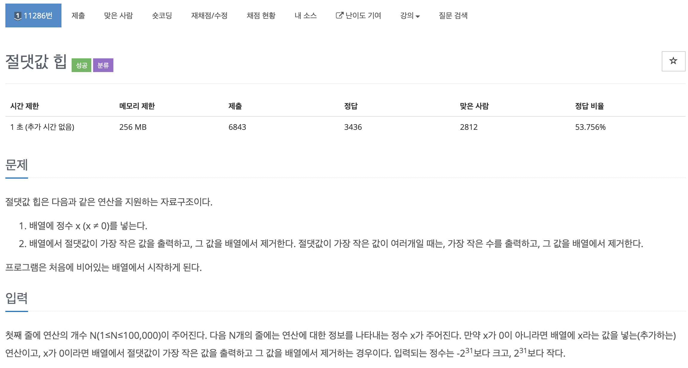

# 코딩 테스트 공부 3주차 - 2: 힙, 우선순위 큐

### 11286번. 절댓값 힙




이전 두 문제와 풀이 방법은 비슷하나 우선순위 큐 내부 원소들의 우선순위를 조정하는 것이 중요했던 문제였다. struct를 이용해 직접 비교함수를 이용해 우선순위 큐 내부 우선순위 정렬을 바꾸어 주었다. 이 때 operator를 struct로 감싸야 하고 이전에 sort함수의 비교 함수를 구현했을 때와 부등호 방향이 반대인 것이 인상 깊었다.

```c++
#include <iostream>
#include <queue>
#include <vector>
#include <cstdlib>

using namespace std;

struct cmp {
    bool operator()(int a, int b) {
        if (abs(a) > abs(b)) return true;
        else if (abs(a) == abs(b)) return a > b;
        else return false;
    }
};

int main() {
    ios::sync_with_stdio(false);
    cin.tie(0);
    
    priority_queue<int, vector<int>, cmp> pq;
    int t;
    cin >> t;
    
    for (int i = 0; i < t; i++) {
        int oper;
        cin >> oper;
        
        if (oper == 0) {
            if (pq.empty()) cout << 0 << '\n';
            else {
                cout << pq.top() << '\n';
                pq.pop();
            }
        } else {
            pq.push(oper);
        }
    }
    
    return 0;
}
```

cmp 구현 부분에서 struct 사용과 operator를 오버라이딩 하는 것을 주의깊게 봐야 한다. abs를 사용하기 위해 cstdlib을 import하여 사용했다.


### 2696번. 중앙값 구하기


수열을 입력받을 때, 입력받은 수가 홀수번째 일 때, 이제까지 입력받은 수열의 중앙값을 출력하는 문제이다. 맨 처음 들어오는 값은 들어온 값 자체가 중앙값이므로 바로 출력을 해준다. 

그 이후부터는 입력이 들어오면 이제까지 입력받았던 배열의 맨 끝보다 크다면 그 뒤에 저장, 그렇지 않다면 입력된 수의 **lower_boun**d를 구하여 해당 위치에 입력수를 넣고 나머지를 뒤로 한 칸씩 밀었다. 홀수 번째 입력시에만 중앙값을 구해 mediums 배열에 추가해 준 이후 중앙값의 출력 횟수는 입력 수열과 무관하므로 입력된 수열의 갯수로 계산하여 출력하였다. 마지막으로 mediums 배열을 10개씩 끊어서 출력해주었다.

```c++
#include <iostream>
#include <vector>
#include <algorithm>

using namespace std;

int main() {
    ios::sync_with_stdio(false);
    cin.tie(0);
    
    int t;
    cin >> t;
    
    for (int i = 0; i < t; i++) {
        int len;
        vector<int> mediums;
        
        cin >> len;
        vector<int> input_arr(len);
        
        for (int j = 0; j < len; j++) {
            int tmp;
            cin >> tmp;
                        
            // 맨 처음에는 그냥 input배열에 넣고 중앙값도 들어온 값 그대로 저장
            if (j == 0) {
                input_arr[j] = tmp;
                mediums.push_back(tmp);
                continue;
            }
            
            // 처음 값이 아니면 일단 정렬된 input_arr값의 맨 마지막 보다 크다면 input배열에 넣는다
            if (tmp > input_arr[j-1]) {
                input_arr[j] = tmp;
            } else { // input_arr값의 맨 마지막보다 작다면 lower_bound로 위치를 찾아서 삽입한다.
                int idx = int(lower_bound(input_arr.begin(), input_arr.begin() + j, tmp) - input_arr.begin());
                
                if (idx == 0) {
                    for (int k = j; k >= 1; k--) {
                        input_arr[k] = input_arr[k - 1];
                    }
                    input_arr[0] = tmp;
                } else {
                    for (int k = j + 1; k >= idx + 1; k--) {
                        input_arr[k] = input_arr[k - 1];
                    }
                    input_arr[idx] = tmp;
                }
            }
            
            // 홀수번째라면 입력값을 input 배열의 알맞은 위치에 넣고난 후 mid값을 구하여 저장한다.
            if (j % 2 == 0) {
                int mid_idx = (j + 1) / 2;
                mediums.push_back(input_arr[mid_idx]);
            }
        }
        
        int mid_count = (len % 2) == 0 ? len / 2: len / 2 + 1;
        cout << mid_count << '\n';
        // 중앙값 배열 출력
        for (int l = 0; l < mid_count; l++) {
            cout << mediums[l] << ' ';
            if (l % 10 == 9) cout << '\n';
        }
    }
    
    return 0 ;
}
```

문제를 풀며 lower_bound를 보다 자유자재로 사용해볼 수 있었고 배열에 대한 구현력을 더 키울 수 있었던 것 같다.


### 2252번. 줄 세우기


일부 학생들의 키를 잰 후 그 순서를 기반으로 키 줄을 세워 출력하는 문제이다. 예제에는 3명이면, 3명 다 키를 비교했던 경우만 나왔지만 5명이면 그 중 4명만 비교하는 경우도 있을 수 있기 때문에 예외를 생각하는 것이 중요했다. 

처음에는 각 사람마다 그 사람 앞에 위치한 사람의 수를 카운팅(indegree 배열)하여 출력하려 했으나 그렇게 하게 되면 예외사항이 발생했다. 따라서 그 앞에 어떤 사람이 위치하는지를 함께 기록해야만 했다(어떤 사람 기준 뒤에 누가 위치해야 하는지 back_people_nums 배열).

이후 비교되지 않은 사람은 어느 위치에 넣어도 된다고 했으므로 indegree 값이 0인 값을 전부 정답 큐인 ans 큐에 집어 넣는다. 정답 큐를 하나씩 비워가며 출력하되 해당 수가 출력이 되면 그 수 뒤에 위치할 사람의 indegree 값은 -1이 되도록 한다. 이 때 indegree 값이 0이라면 더 이상 고려할 사항이 없으므로 ans큐에 집어넣으며 그 과정을 반복하여 마지막에 정답을 출력한다.

```c++
#include <iostream>
#include <queue>
#include <algorithm>

using namespace std;

int indegree[32001] = {0, }; // 해당 칸 기준 앞에 설 사람의 수
vector<int> back_people_nums[32001]; // 해당 칸 기준 그 사람 뒤에 설 사람의 숫자(이름) -> 이차원 배열

int main() {
    ios::sync_with_stdio(false);
    cin.tie(0);
    
    int n, m, a, b;
    cin >> n >> m;
    
    for (int i = 0; i < m; i++) {
        cin >> a >> b;
        indegree[b]++;
        back_people_nums[a].push_back(b);
    }

    queue<int> ans;
    
    for (int i = 1; i <= n; i++)
        if (indegree[i] == 0) ans.push(i);

    while(!ans.empty()) {
        int i = ans.front();
        ans.pop();
        cout << i << ' ';

        for(int j = 0; j < back_people_nums[i].size(); j++)
            if (--indegree[back_people_nums[i][j]] == 0)
                ans.push(back_people_nums[i][j]);
    }
}

/* test case
5 3
1 4
2 4
4 3
*/

```

생각은 그렇게 어렵지는 않았으나 구현력에서 한계를 느껴 구현하지 못했던 문제였다. 구현력을 좀 더 키울 필요가 있을 것 같다.

References:

풀이 참고: https://m.blog.naver.com/PostView.nhn?blogId=zlzlzb&logNo=221192525884&proxyReferer=https:%2F%2Fwww.google.com%2F