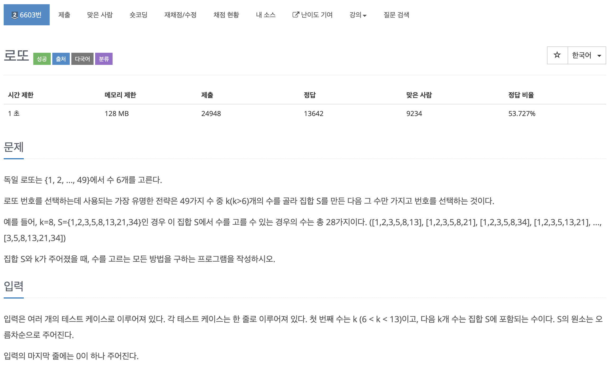
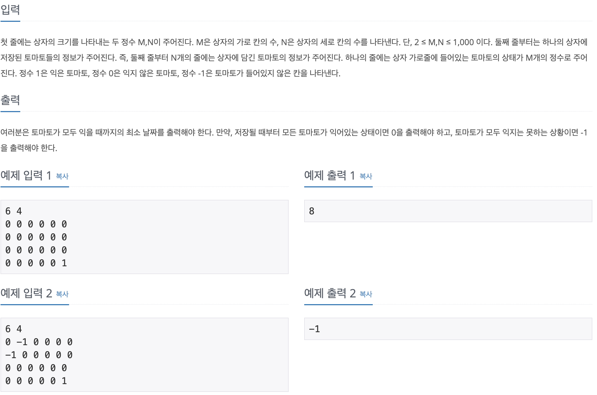

# 코딩 테스트 공부 4주차 - 1: DFS, BFS

### 1012번. 유기농 배추 - DFS


말은 어렵지만 결국 1로 이루어진 군집의 개수를 구하는 문제이다. 입력받은 수로 2차원 배열을 채우고 2차원 배열을 모두 돌면서 검사해야 하기 때문에 DFS로 접근하였다. 이중 반복문을 돌며 좌표 값이 1인 것을 검사하는데 배추 밭과 똑같은 크기의 chk 배열을 만들어 해당 칸을 검사했는지를 기록해가며 검사하게 된다.

DFS가 실행되면 해당 칸을 검사했다는 의미로 chk배열의 해당 칸의 값을 1로 바꾸어 준다. 배추 지렁이가 배추에 영향을 미치는 방향은 12시, 3시, 6시, 9시 방향이므로 네 방향을 모두 검사하기 위해 dx, dy를 선언해 주고, 이후 좌표 값에 dx, dy 를 더해가면서 갈 수 있는 모든 방향을 검사하였다. 이 때, 앞으로 나아갈 좌표인 xx와 yy가 배추밭의 범위를 벗어날 수 있기 때문에 그럴 경우에는 continue로 검사를 뛰어 넘게 처리 하였다. 그렇지 않다면 앞으로 검사할 좌표의 chk 값이 0(아직 검사하지 않음), 검사할 좌표의 map 값이 1(배추가 존재함) 일 때, 해당 칸을 검사하기 위해 DFS를 실행해 주었다. 

이 재귀는 상하좌우 네 방향 모두 검사할 수 없으면 자동으로 종료되므로 따로 종료 조건을 명시하지는 않았다. 또한 DFS 한 번이 종료될 때마다(상하좌우 모두 갈 수 없을 경우에 끝나니까 하나의 군집이 끝나게 된다) cnt를 1씩 증가시켜 최종적으로 출력하여 답을 구하였다.

```c++
#include <iostream>
#include <cstring>

using namespace std;

int map[51][51], chk[51][51], cnt = 0, M, N;
int dx[4] = {-1, 0, 1, 0};
int dy[4] = {0, 1, 0, -1};

void DFS(int x, int y) {
    chk[x][y] = 1;
    for (int i = 0; i < 4; i++) {
        int xx = x + dx[i];
        int yy = y + dy[i];
        if (xx < 0 || yy < 0 || xx >= N || yy >= M) continue;
        if (chk[xx][yy] == 0 && map[xx][yy] == 1) {
            chk[xx][yy] = 1;
            DFS(xx, yy);
        }
    }
    return ;
}

int main() {
    ios::sync_with_stdio(false);
    cin.tie(0);
    cout.tie(0);
    
    int T, K, x, y;
    cin >> T;
    
    for (int i = 0; i < T; i++) {
        cin >> M >> N >> K;
        
        for (int j = 0; j < K; j++) {
            cin >> y >> x;
            map[x][y] = 1;
        }
        
        for (int k = 0; k < N; k++) {
            for (int l = 0; l < M; l++) {
                if (map[k][l] == 1 && chk[k][l] == 0) {
                    DFS(k, l);
                    cnt ++;
                }
            }
        }
        
        cout << cnt << '\n';
        cnt = 0;
        memset(map, 0, sizeof(map));
        memset(chk, 0, sizeof(chk)); // 다른 테스트 케이스를 수행하기 위해 전역변수 리셋
    }
    
    return 0;
}
```

입력 받을 때, xy 좌표계에서 앞에 나오는 값은 가로 값이 어디인지를 뜻하는데 행렬에서 앞에 나오는 값은 세로 값이 어디인지를 뜻하므로 혼동이 있었다. 여기서는 입력을 받을 때 y와 x값을 받아 행렬의 인덱스에 반대로 집어 넣으면서 인덱스를 맞춰 주었다. 다른 문제를 풀 때에도 이 부분이 계속 헷갈리는데 이런 종류의 문제를 계속 풀어보면서 익혀야 할 것 같다.


### 7562번. 나이트의 이동 - BFS


칸을 전부 이동할 필요 없이 최소 횟수를 구하는 문제이므로 BFS로 접근하였다. 나이트가 이동할 수 있는 방향 총 8가지를 시작 좌표에 적용해서 검사하기 위해 8개짜리 배열 dx, dy를 선언하였다. 

해당 좌표로 이동 했었는지를 기록할 chk 배열을 만든 후 시작 좌표와 목표 좌표를 받아 각각 Knight, goal에 pair 형태로 저장하고 시작 좌표를 Queue에 넣어준다. 넣어줌과 동시에 chk배열의 시작 좌표 값을 1로 처리해주고 Q가 비워질 때까지 반복문을 실행한다. 

반복문에서는 맨 처음 Q의 front를 꺼낸 뒤, 해당 값이 goal과 일치하는지를 검사한다. 일치하지 않는다면 앞서 선언한 dx, dy를 현재 좌표에 더하여 이동할 수 있는 8개의 좌표를 모두 검사하게 된다. 이 때, 검사할 좌표(nx, ny) 값이 체스판을 벗어나는지를 체크한 후, ```chk[nx][ny]``` 값이 0인지를 검사한다 - 이미 갔던 좌표는 다시 가면 안되므로. 해당 값이 0이라면 그 좌표의 chk 값을 현재 좌표의 **chk 값 + 1(이동 횟수를 저장)**을 하여 갱신하고 해당 좌표값을 Q에 넣어준다.

이 과정을 반복하여 진행하는 도중 이동할 좌표의 값이 목표 값과 같다면 더이상 검사하지 않고 이동할 좌표가 아닌 현재 Q에서 뽑은 좌표의 값을 출력하고 반복문 전체를 빠져 나오게 된다. **이동할 좌표값이 아닌 현재 좌표의 값을 출력하는 이유는 처음에 출발할 때, 출발 좌표의 chk값을 0과 구분하기 위해 1로 초기화했기 때문**이다. 초기 값은 한 번도 움직이지 않은 상태인데 이를 1이라고 했으니 마지막 값에서 1을 빼는 것이 정답이다.

```c++
#include <iostream>
#include <cstring>
#include <queue>

using namespace std;

int chk[301][301];
int dx[8] = {-1, -2, -2, -1, 1, 2, 2, 1};
int dy[8] = {-2, -1, 1, 2, 2, 1, -1, -2};

int main() {
    ios::sync_with_stdio(false);
    cin.tie(0);
    cout.tie(0);
    
    int T;
    cin >> T;
    
    for (int i = 0; i < T; i++) {
        bool flag = false;
        int I;
        pair<int, int> x;
        queue<pair<int, int> > Q;
        pair<int, int> knight;
        pair<int, int> goal;
        
        cin >> I;
        cin >> knight.first >> knight.second;
        cin >> goal.first >> goal.second;
        
        chk[knight.first][knight.second] = 1;
        Q.push(knight);
        
        while(!Q.empty() && !flag) {
            x = Q.front();
            Q.pop();
            
            if (x.first == goal.first && x.second == goal.second) {
                cout << chk[knight.first][knight.second] - 1 << '\n';
                break;
            }
            
            for (int j = 0; j < 8; j++) {
                int nx = x.first + dx[j];
                int ny = x.second + dy[j];
                
                if (nx < 0 || ny < 0 || nx >= I || ny >= I) continue;
                
                if (nx == goal.first && ny == goal.second) {
                    cout << chk[x.first][x.second] << '\n';
                    flag = true;
                    break;
                } else {
                    if (chk[nx][ny] == 0) {
                        chk[nx][ny] = chk[x.first][x.second] + 1;
                        Q.push({nx, ny});
                    }
                }
            }
        }
        
        memset(chk, 0, sizeof(chk));
    }
    
    return 0;
}
```


### 6603번. 로또 - DFS




모든 경우의 수를 검사하고 그 중 일부 조건에 맞는 것만 출력하는 문제이기 때문에 DFS로 접근하였다. 

배열 arr에 입력된 번호들을 저장하고 번호 하나당 하나의 레벨로 생각하여 주어진 번호의 갯수의 레벨만큼 탐색한다. 이 때, 8개가 주어졌을 때, 8개 중 6개를 골랐으면 더 이상 수를 고를 수 없기 때문에 DFS 재귀의 종료 조건으로 하였다. 추가로 주어진 K 보다 레벨이 커진다면 arr의 주어진 수가 아닌 쓰레기 값을 선택할 것이기 때문에 idx(레벨)가 K보다 커지면 DFS 재귀를 종료하였다.

각 DFS는 arr의 다음 레벨 값을 가지칠 때 해당 숫자를 이미 골랐으면 가지를 칠 필요가 없으므로 chk[idx + 1] 값이 0이면 가지를 치게 된다. 그와 동시에 다음 검사할 index가 K보다 크다면 그것은 쓰레기 값일 것이므로 인덱스의 크기도 조사한다. 문제의 조건에서 사전순으로 처리하라고 했으므로 해당 레벨의 수를 선택 하는 경우의 DFS를 먼저 호출하고 그러지 않는 경우의 DFS를 그 다음에 호출한다. 다음 레벨의 수를 pick하는 경우에는 그 레벨의 chk값을 1로 바꾸어 주고 cnt + 1하여 DFS를 호출해 준다. 그 다음에 되돌아가서 탐색을 할 때 똑같은 레벨의 수를 재 탐색할 수 있기 때문에 chk값을 0으로 바꾸어 주고 cnt는 그대로 하여 idx만 + 1하여 DFS를 호출해 준다. 

이렇게 호출이 반복되어 종료 조건에 해당될 때, 6개의 값을 순서대로 출력해주면 정답을 구할 수 있다.

```c++
#include <iostream>
#include <cstring>
#include <vector>

using namespace std;

int K, arr[20], chk[20];

void DFS(int idx, int cnt) {
    if (cnt == 6 || idx > K) {
        if (cnt == 6) {
            for (int i = 1; i <= K; i++) {
                if (chk[i] != 0) cout << arr[i] << ' ';
            }
            cout << '\n';
        }
        return ;
    } else {
        if (chk[idx + 1] == 0 && idx + 1 <= K) {
            chk[idx + 1] = 1; 
            DFS(idx + 1, cnt + 1); // 해당 레벨의 수 선택
            chk[idx + 1] = 0;
            DFS(idx + 1, cnt); // 해당 레벨의 수 선택 X
        }
    }
}

int main() {
    ios::sync_with_stdio(false);
    cin.tie(0);
    cout.tie(0);
        
    while(true) {
        cin >> K;
        
        if(K == 0) break;
        else {
            for (int i = 1; i <= K; i++) {
                cin >> arr[i];
            }
            DFS(0, 0);
        }
        cout << '\n';
        
        memset(arr, 0, sizeof(arr));
        memset(chk, 0, sizeof(chk));
    }
    
    return 0;
}
```


### 2210번. 숫자판 점프 - DFS, 백트레킹


모든 6자리의 수를 검사해 보아야 하기 때문에 DFS로 접근하였다.

다른 문제와 마찬가지로 어떤 칸에서 이동할 수 있는 방향은 상하좌우 4방향이므로 이를 표현하기 위해 dx, dy 배열을 선언해 두었다. 이미 간 곳을 다시 방문할 수 있다는 조건이 있어서 chk배열을 따로 생성하지는 않았다. 모든 값을 입력 받은 다음, 이중 반복문을 돌며 각 좌표에 대해 DFS를 실행했다. 이 때 매개변수는 해당 좌표 즉 row, column값, count, 현재 수(cur)를 넘겨 주었다. 

종료 조건은 총 6자리 수를 만드는 것이므로 cnt가 5가 되면 종료되도록 설정하였고, 종료 조건에 해당하지 않는다면 dx, dy를 활용하여 이동할 좌표를 얻고 해당 좌표의 유효성 검사를 실시한 뒤, 해당 좌표로 이동하기 위해 DFS를 호출해 주었다. 이 때, cnt는 + 1이 되고, cur는 현재 숫자에 다음 숫자를 이어붙이는 것이므로 **현재 숫자 * 10 + 다음 숫자**를 해주었다. 

이렇게 모든 경우에 수에 대해 재귀를 돌고나서 각 종료조건에서는 **중복이 되지 않는 자료구조인 set**에 그 결과(cur)를 저장하게 된다. 마지막에 set의 size를 출력하면 정답을 구할 수 있다.

```c++
#include <iostream>
#include <set>
#include <vector>
#include <string>

using namespace std;

char map[5][5];
set<int> ans_sets;
int dx[4] = {-1, 0, 1, 0};
int dy[4] = {0, 1, 0, -1};

void DFS(int x, int y, int cnt, int cur) {
    if (cnt == 5) {
        ans_sets.insert(cur);
    } else {
        for (int i = 0; i < 4; i++) {
            int nx = x + dx[i];
            int ny = y + dy[i];
            
            if (nx < 0 || ny < 0 || nx >= 5 || ny >= 5) continue;
            DFS(nx, ny, cnt + 1, cur * 10 + map[nx][ny]);
        }
    }
    
    return ;
}

int main() {
    ios::sync_with_stdio(false);
    cin.tie(0);
    cout.tie(0);
    
    for (int i = 0; i < 5; i++) {
        for (int j = 0; j < 5; j++) {
            cin >> map[i][j];
        }
    }
    
    for (int i = 0; i < 5; i++) {
        for (int j = 0; j < 5; j++) {
            DFS(i, j, 0, map[i][j]);
        }
    }
    
    cout << ans_sets.size() << '\n';
    
    return 0;
}
```

처음에는 너무 복잡하게 생각해서 set에 string을 저장하려 했으나 단순하게 생각해 보면 자릿수를 하나 늘려서 처리할 수 있었다. 자료형에 대한 창의적인 생각도 평소에 해놔야 겠다.


### 2178번. 미로 탐색 - BFS


지나야 하는 **최소**칸 수를 구하는 문제였기 때문에 BFS로 접근하였다.

우선 입력을 띄어쓰기로 띄어서 주어주지 않아 귀찮았던 문제이다. getline을 통해 string 으로 받아와 하나하나 떼면서 문자 0을 빼주어 int형 2차 배열에 입력해 주었다. 이 때, cin 다음에 바로 getline 을 쓰면 버퍼가 비워지지 않아 쓰레기 값이 들어가는 문제가 발생하기 때문에 **cin.ignore()**를 반드시 써주어야 한다.

초기 출발점은 (1, 1)로 주어졌으므로 Q에 맨 처음 점(여기서는 idx를 0부터 저장했으므로) {0, 0}을 Q에 넣고, 중복 방문을 방지하기 위해 chk를 1로 변경해 준다. Q에 들어가서는 Q의 front를 기준으로 목적지에 도착했는지를 검사하고 그에 대한 처리를 해준다 - 문제에서는 인덱스를 1부터 시작했기 때문에 검사할 때는 N - 1, M - 1로 검사해준다..

이 문제도 마찬가지로 이동할 수 있는 방향은 상하좌우 네 방향이므로 해당 방향의 좌표를 구한 뒤 유효성 검사 후, 이동할 좌표의 chk 값이 0, map 값이 1인 경우만 해당 좌표의 chk값을 변경해주고 그 좌표를 Q에 넣는다. 이 때, **chk배열을 1로 변경하는 것이 아니라 이동 횟수를 표시하는 용도로 사용하기 위해 현재 좌표의 chk 값에 + 1을 하여 갱신**해 준다.

이렇게 반복문을 반복하다 보면 반복문 처음의 목적지 도착 검사에 걸리게 되고 결과를 출력 후 프로그램이 종료되게 된다.

```c++
#include <iostream>
#include <string>
#include <queue>

using namespace std;

int main() {
    ios::sync_with_stdio(false);
    cin.tie(0);
    cout.tie(0);
    
    int N, M;
    int map[100][100], chk[100][100] = { 0 };
    queue<pair<int, int> > Q;
    pair<int, int> now;
    int dx[4] = {-1, 0, 1, 0};
    int dy[4] = {0, 1, 0, -1};
    
    cin >> N >> M;
    cin.ignore();
    
    for (int i = 0; i < N; i++) {
        string tmp;
        getline(cin, tmp);
        for (int j = 0; j < M ; j++) {
            map[i][j] = tmp[j] - '0';
        }
    }
    
    chk[0][0] = 1;
    Q.push({0, 0});
    
    while(!Q.empty()) {
        now = Q.front();
        Q.pop();
        
        if (now.first == N - 1 && now.second == M - 1) {
            cout << chk[N - 1][M - 1] << '\n';
            break;
        }
        
        for (int i = 0; i < 4; i ++) {
            int nx = now.first + dx[i];
            int ny = now.second + dy[i];
            
            if (nx < 0 || ny < 0 || nx >= N || ny >= M) continue;
            
            if (chk[nx][ny] == 0 && map[nx][ny] == 1) {
                chk[nx][ny] = chk[now.first][now.second] + 1;
                Q.push({nx, ny});
            }
            
        }
    }
    
    /*
    for (int i = 0; i < N; i++) {
        for (int j = 0; j < M; j++) {
            cout << map[i][j] << ' ';
        }
        cout << '\n';
    }
    
    for (int i = 0; i < N; i++) {
        for (int j = 0; j < M; j++) {
            cout << chk[i][j] << ' ';
        }
        cout << '\n';
    }
    */
    
    return 0;
}
```

이번 문제도 xy좌표계와 행렬 좌표계가 헷갈렸지만 맨 처음 받을 때, xy좌표계를 행렬좌표계로 받아 놓으면 그 이후에 행렬 좌표계로 계속 쓸 수 있다는 것을 다시 한번 겪어 보았다. 이 문제는 계속해서 풀어봐야 적응될 것 같다.


### 7576번. 토마토 - BFS





한 토마토와 인접한 모든 토마토를 먼저 검색해야 하는 것을 보고 BFS로 접근하였다.

맨 처음에는 예제 4번이 이해가 가지 않아서 헤맸다. -1에 부호가 있어 윗 줄이랑 맞지 않아서 이해를 하지 못했는데 다음부터는 예제를 볼 때 꼼꼼히 읽어보아야겠다.

우선 입력을 받아 2차원 행렬인 map에 저장을 한다. 며칠 째에 해당 칸의 토마토가 익었는지를 기록하는 작업이 필요한데, 이것을 따로 배열을 만들어서 기록하지 않고 map배열의 값을 직접 바꾸도록 코드를 짰다. 2차원 배열을 돌며 토마토가 있는 칸 ```map[i][j] == 1``` 에서만 Q에 그 칸의 좌표를 집어 넣는다. 

이후 Q가 빌 때까지 반복되는 반복문에서는 Q의 front를 빼내고 앞선 문제들과 같이 상하좌우로 갈 수 있는 좌표를 구한다. 여기서 유효성 검사를 마친 뒤, 다음으로 향할 좌표의 map 값이 0일 때만 Q에 다음 좌표를 넣어준다. 이 때, 현재 좌표와 인접하고, 갈 수 있는 모든 좌표는 **현재 좌표의 값(날짜) + 1을 해주어 저장**한다.

작업이 종료되고 나면 map 배열은 익게 된 날짜 + 1값으로 수정이 되어있게 된다. 따라서 map의 값을 우선순위 큐에 넣고 내림차순으로 정렬하여 top - 1값을 출력하면 답을 구할 수 있다. 이 때, map의 원소중 하나라도 0이 남아 있으면 모든 토마토를 익게 할 수 없는 경우이므로 반복문을 중단하고 -1을 출력한다. 그렇지 않다면 map의 값중 **최댓 값 -1 을 출력하여 정답**을 구한다. 여기서 최댓값에서 1을 빼 주는 이유는 **맨 처음에 시작할 때, 시작점의 토마토 값을 1로 초기화 했기 때문**이다. 시작점의 토마토는 이미 익어있기 때문에 1이 아니라 0으로 했어야 했지만 익지 않은 토마토와의 구분을 위해 1로 초기화 했으므로 최댓값에서 1을 빼주어야 정답이다.

```c++
#include <iostream>
#include <cstring>
#include <queue>
#include <algorithm>

using namespace std;

queue<pair<int, int> > Q;
pair<int, int> x;
int map[1000][1000], M, N, cnt = 0;
int dx[4] = {-1, 0, 1, 0};
int dy[4] = {0, 1, 0, -1};

int main() {
    ios::sync_with_stdio(false);
    cin.tie(0);
    cout.tie(0);
    
    cin >> M >> N;
    
    for (int i = 0; i < N; i ++) {
        for (int j = 0; j < M; j++){
            cin >> map[i][j];
        }
    }
    
    for (int i = 0; i < N; i ++) {
        for (int j = 0; j < M; j++) {
            if (map[i][j] == 1) Q.push({i, j});
        }
    }
    
    while(!Q.empty()) {
        x = Q.front();
        Q.pop();
        
        for (int i = 0; i < 4; i++) {
            int nx = x.first + dx[i];
            int ny = x.second + dy[i];
            
            if (nx < 0 || ny < 0 || nx >= N || ny >= M) continue;
            
            if (map[nx][ny] == 0) {
                map[nx][ny] = map[x.first][x.second] + 1;
                Q.push({nx, ny});
            }
            
        }
    }
    
    priority_queue<int> pq;
    bool flag = false;
    for (int i = 0; i < N; i++) {
        if (flag) break;
        for (int j = 0; j < M; j++) {
            if (map[i][j] == 0) {
                flag = true;
                break;
            }
            pq.push(map[i][j]);
        }
    }
    
    if (flag) cout << -1 << '\n';
    else cout << pq.top() - 1 << '\n';
    
    /*
    cout << '\n';
    for (int i = 0; i < N; i ++) {
        for (int j = 0; j < M; j++ ){
            cout << map[i][j] << ' ';
        }
        cout << '\n';
    }
    */
    
    return 0;
}
```

