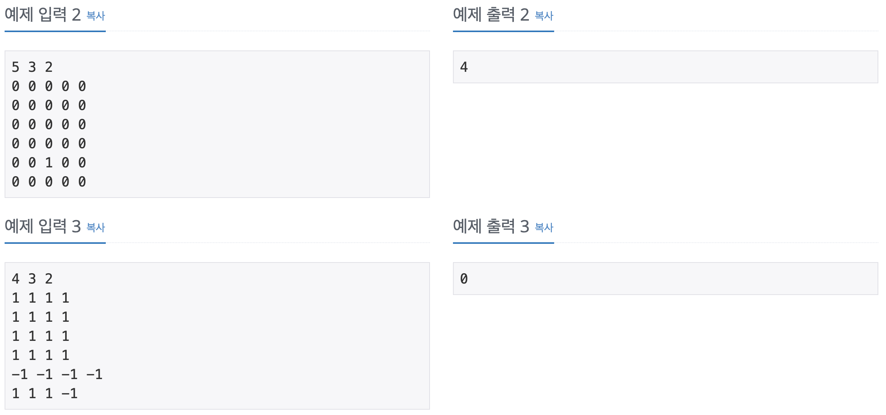

# 코딩 테스트 공부 5주차 - 1: DFS, BFS

### 2644번. 촌수 계산 - BFS


두 사람 간 최소의 촌수를 구해야 하므로 BFS로 접근하였다.

인접행렬, 인접리스트를 이용하여 접근하는 방법은 맞았지만 실제 구현에 있어서 한 가지를 생각하지 못해서 결국 구현부분을 다른 코드를 참고하여 작성하였다.

우선 두 사람이 부모, 자식 관계임을 받을 때, 양쪽 모두에게 촌수가 있음을 표시해 주어야 한다(각각 vector의 index push_back해줌). 이후 촌수를 알고 싶은 사람 중 한 명을 Q에 집어 넣고 그 사람과 촌수가 있는 사람들을 각각 검사한다. 이 때 이미 검사한 사람은 다시 한번 검사하면 안되므로 visited 배열을 만들어 검사 유무를 체크할 때 사용한다. 

Q에서 맨 앞에 있는 사람을 꺼낸 후 그 사람과 촌수가 존재하는 사람 모두를 검사한다. 이 때 그 사람을 검사했는지 visited값으로 체크한 후, 검사하지 않았다면 visited 값을 현재 사람의 visited 값 + 1하여 저장하고 그 사람을 Q에 집어 넣는다. 이렇게 반복하게 되면 결국 visited 배열의 촌수가 없는 사람을 인덱스로 하는 값은 전부 0일 것이고 촌수가 있는 사람은 그 사람과 몇 촌인지가 기록되게 된다.

따라서 마지막에 visited 배열에 0이 있다면 두 사람간 촌수를 구할 수 없는 것이므로 -1을 출력하고 그렇지 않다면 second를 인덱스로 갖는 visited의 배열의 값을 출력하면 답을 구할 수 있다.

```c++
#include <iostream>
#include <vector>
#include <queue>

using namespace std;
 
int main() {
 
    int n, p1, p2, m;
    cin >> n >> p1 >> p2 >> m;
 
    int x, y;
    vector<int> vec[101];
    vector<int> visited(101, 0);
    
    for (int i = 0; i < m; i++) {
        cin >> x >> y;
        vec[x].push_back(y);
        vec[y].push_back(x);
    }
 
    queue<int> q;
    q.push(p1);
    while (!q.empty()) {
        int p = q.front();
        q.pop();
 
        if (p == p2) {
            break;
        }
 
        for (int i = 0; i < vec[p].size(); i++) {
            if (!visited[vec[p][i]]) {
                visited[vec[p][i]] = visited[p] + 1;
                q.push(vec[p][i]);
            }
        }
    }
 
    if (visited[p2] != 0)
        cout << visited[p2] << endl;
    else
        cout << -1 << endl;
}
```


### 2667번. 단지 번호 붙이기 - DFS


배추 애벌레 문제와 비슷한 문제이고, 좌표 상의 모든 칸을 조사해야 하기에 DFS로 접근하였다. 

이 문제도 입력을 띄어쓰기 없이 한줄씩 여러번 입력을 주었기 때문에 string으로 받아 parsing해서 map에 넣어주었다. 배추 애벌레 문제와 비슷하게 입력을 전부 받은 다음, 2중 반복문을 돌면서 해당 인덱스의 map값이 1이고 chk값이 0일 경우에 DFS를 돌려 주었다. 

DFS는 이전과 마찬가지로 4방향을 이동할 좌표를 반복문으로 돌면서 만들고 이동할 좌표가 유효할 때, 해당 좌표의 map값이 1이고 chk값이 0이면 chk를 1로 바꾸어 주고 cnt를 +1해준 후, DFS를 호출해 주었다. 이 때 cnt는 각 아파트 단지 군집 내의 아파트 수를 나타내며 한 단지를 모두 검사하면 apart_num 벡터에 추가해 준다.

DFS 검사가 모두 끝나고 나면 apart_num에는 단지의 갯수만큼 숫자가 들어가 있을 것이며, 각 숫자는 각 단지의 아파트 수를 나타내게 된다. 따라서 apart_num의 size를 먼저 출력해준 후, sort를 사용해 오름차순으로 정리후 출력해 주면 정답을 구할 수 있다.

맨 처음에 cnt를 0으로 두고 DFS를 돌리는 바람에 하나의 아파트로 이루어진 단지가 있는 경우를 카운팅 하지 못했다. 항상 문제를 풀 때, 주어진 케이스 외에 **최소, 최대 케이스를 한번씩을 생각해 보아야겠다**.

```c++
#include <iostream>
#include <vector>
#include <algorithm>
#include <string>

using namespace std;

int T, map[30][30], chk[30][30], cnt = 0;
vector<int> apart_num;
int dx[4] = {-1, 0, 1, 0};
int dy[4] = {0, 1, 0, -1};

void DFS(int row, int col) {
    int nx, ny;
    
    for (int i = 0; i < 4; i ++) {
        nx = row + dx[i];
        ny = col + dy[i];
        
        if (nx < 0 || ny < 0 || nx >= T || ny >= T) continue;
        
        if (map[nx][ny] == 1 && chk[nx][ny] == 0) {
            chk[nx][ny] = 1;
            cnt ++;
            DFS(nx, ny);
        }
    }
}

int main() {
    ios::sync_with_stdio(false);
    cin.tie(0);
    cout.tie(0);
    
    string tmp;
    
    cin >> T;
    cin.ignore();
    
    for (int i = 0; i < T; i ++) {
        getline(cin, tmp);
        for (int j = 0; j < T; j ++) {
            map[i][j] = tmp[j] - '0';
        }
    }
   
    for (int i = 0; i < T; i ++) {
        for (int j = 0; j < T; j ++) {
            if (map[i][j] == 1 && chk[i][j] == 0) {
                cnt = 1;
                chk[i][j] = 1;
                DFS(i, j);
                if (cnt != 0) apart_num.push_back(cnt);
            }
        }
    }
    
    sort(apart_num.begin(), apart_num.end());
    
    cout << apart_num.size() << '\n';
    for (int i = 0; i < apart_num.size(); i ++) {
        cout << apart_num[i] << '\n';
    }
    
    return 0;
}
/* 처음에 생각 못했던 것
 2
 01
 10
 초깃값 초기화 안함
 
 TC
 7
 0110100
 0110101
 1110101
 0000111
 0100000
 0111110
 0111000
 
*/

```


### 7569번. 토마토 - BFS




지난번에 풀었던 토마토 문제의 응용 문제이다. 최소 일수를 구해야 하는 문제이므로 BFS로 접근하였다.

2차원 토마토와 동일하지만 위 아래 토마토도 함께 익는 조건을 추가해 주어야 했다. x, y, z 세 개의 좌표를 저장해야 했으므로 tomato라는 구조체를 만들었고, 삼중 반복문을 돌며 ```map[z][x][y]``` 값이 1일 것을 먼저 Q에 넣어주었다. x, y, z 의 순서는 내가 보기 편한 대로 맨 앞으로 위 아래를 구분하는 판으로 두었고, 두 번째를 행, 마지막을 열로 두었다.

이번 문제는 익는데 영향을 끼치는 방향이 6방향이므로 dx, dy, dz를 전부 6개짜리 배열로 선언을 해주어 각 이동 방향에 대해 변화되는 x, y, z 좌표를 더해주었다. 이번 문제도 따로 **chk 배열을 선언하지 않고 map 배열 자체의 값을 기존 값 +1**로 변화시켜 익는 시간을 직접 반영해 주었다.

맨 마지막에는 마찬가지로 3중 for문을 사용하여 map의 각 값을 우선순위 큐에 넣어주되, 0이 하나라도 있으면 익을 수 없는 토마토가 있는 것이므로 -1 출력 후 프로그램을 종료한다. 그렇지 않다면 최댓값에서 -1을 해서 정답을 출력해 준다. 여기서도 마찬가지로 최댓값은 맨 처음에 익은 토마토의 익은 일수를 1로 초기화 했기 때문에 1를 빼주어야 정답이 된다.

```c++
#include <iostream>
#include <queue>

using namespace std;

struct tomato {
    int x, y, z;
    tomato(int i, int j, int k) {
        z = i;
        x = j;
        y = k;
    };
};

int main() {
    ios::sync_with_stdio(false);
    cin.tie(0);
    cout.tie(0);
    
    queue<tomato> Q;
    priority_queue<int> PQ;
    int map[101][101][101], M, N, H;
    int dx[6] = {0, 0, -1, 0, 1, 0};
    int dy[6] = {0, 0, 0, 1, 0, -1};
    int dz[6] = {-1, 1, 0, 0, 0, 0};
    
    cin >> M >> N >> H;
    
    for (int i = 0; i < H; i ++) {
        for (int j = 0; j < N; j ++) {
            for (int k = 0; k < M; k++) {
                cin >> map[i][j][k];
            }
        }
    }
     
    for (int i = 0; i < H; i ++) {
        for (int j = 0; j < N; j ++) {
            for (int k = 0; k < M; k++) {
                if (map[i][j][k] == 1) Q.push(tomato(i, j, k));
            }
        }
    }
    
    while(!Q.empty()) {
        tomato t = Q.front();
        Q.pop();
        
        for (int i = 0; i < 6; i ++) {
            int nx = t.x + dx[i];
            int ny = t.y + dy[i];
            int nz = t.z + dz[i];
            
            if (nx < 0 || ny < 0 || nz < 0 || nx >= N || ny >= M || nz >= H) continue;
            
            if (map[nz][nx][ny] == 0) {
                map[nz][nx][ny] = map[t.z][t.x][t.y] + 1;
                Q.push(tomato(nz, nx, ny));
            }
        }
    }
    
    for (int i = 0; i < H; i ++) {
        for (int j = 0; j < N; j ++) {
            for (int k = 0; k < M; k++) {
                if (map[i][j][k] == 0) {
                    cout << -1 << '\n';
                    exit(0);
                } else PQ.push(map[i][j][k]);
            }
        }
    }
    
    cout << PQ.top() - 1 << '\n';
    
    return 0;
}
```


### 2468번. 안전영역 - DFS


배추 애벌레 문제를 반복해서 푸는 문제이다. 역시 DFS로 접근하였다.

맨 처음에 2중 for문을 사용하여 입력을 받는데, 이후에 각 높이별로 안전 영역을 구해야 하므로 최소값과 최대값을 갱신해가며 받는다. 검사는 최소값 ~ 최대값 - 1까지의 비가 왔을 경우를 검사하는데, 최대값을 검사하지 않는 이유는 최대값만큼 비가 오면 안전 영역은 없기 때문이다. 

최종적으로 출력하는 값은 result 인데 이 값은 선언할 때 초기값을 1로 선언해 준다. 그 이유는 각 지대의 높이는 2 이상이지만 비가 1만큼만 온다면 안전지대의 갯수는 1이기 때문이다(최소값을 잡음). 입력을 전부 받은 이후에는 min_height부터 max_height까지의 경우를 검사해준다. 각 경우마다 init 함수를 통해 map을 수정하고 chk배열, cnt를 초기화 한다. parameter로 주어진 height보다 같거나 작은 map의 수는 전부 0으로 바꾸어 주며 그렇지 않은 부분은 숫자로 남아있게 된다. 

init을 하고 나서는 이중 for문을 돌며 map의 값이 0이 아니고 chk의 값이 0인 좌표에 대해 DFS를 수행하게 된다. 이 DFS는 각 좌표에서 4방향으로 이동하고 결국에 갈 곳이 없으면 종료 되기 때문에 한 싸이클이 종료될 때마다 cnt를 1씩 증가시킨다. 이렇게 각 높이에 대해 cnt를 구하고 해당 cnt가 result보다 크다면 result에 cnt를 할당하게 되고 모든 높이에 대해 검사하 끝나면 result를 출력하여 정답을 구한다.

```c++
#include <iostream>
#include <cstring>

using namespace std;

int N, map[101][101], chk[101][101];
int min_height = 2147000000, max_height = -2147000000, result = 1, cnt = 0;
int dx[4] = {-1, 0, 1, 0};
int dy[4] = {0, 1, 0, -1};

void init(int height) {
    for (int i = 0; i < N; i ++) {
        for (int j = 0; j < N; j++) {
            if (map[i][j] <= height) map[i][j] = 0;
        }
    }
    memset(chk, 0, sizeof(chk));
    cnt = 0;
    return ;
}

void DFS(int x, int y) {
    int nx, ny;
    for (int i = 0; i < 4; i ++) {
        nx = x + dx[i];
        ny = y + dy[i];
        
        if (nx < 0 || ny < 0 || nx >= N || ny >= N) continue;
        
        if (map[nx][ny] != 0 && chk[nx][ny] == 0) {
            chk[nx][ny] = 1;
            DFS(nx, ny);
        }
    }
    return ;
}

int main() {
    ios::sync_with_stdio(false);
    cin.tie(0);
    cout.tie(0);
    
    cin >> N;
    for (int i = 0; i < N; i ++) {
        for (int j = 0; j < N; j ++) {
            cin >> map[i][j];
            if (map[i][j] < min_height) min_height = map[i][j];
            if (map[i][j] > max_height) max_height = map[i][j];
        }
    }
        
    for (int i = min_height; i < max_height; i++) {
        init(i);
        
        for (int j = 0; j < N; j ++) {
            for (int k = 0; k < N; k ++) {
                if (map[j][k] != 0 && chk[j][k] == 0) {
                    DFS(j, k);
                    cnt ++;
                }
            }
        }
        
        if (cnt > result) result = cnt;
    }
    
    cout << result << '\n';
    
    return 0;
}
```


### 10026번. 적록색 - DFS


배추 애벌레 문제와 같이 군집의 수를 구하는 문제이므로 DFS를 활용해서 풀어보았다.

입력이 띄어쓰기 없는 문자열로 주어지므로 string으로 받아 하나씩 parsing 해가며 char형 map에 입력해주었다. 다른 문제와 마찬가지로 4방향으로 이동할 수 있도록 dx, dy를 활용해 주었고, 먼저 정상인 관점의 군집 수를 구하기 위해 이중 for문 안에서 chk가 0인 좌표에 대해 DFS를 실행했다. 

DFS는 다음에 향할 좌표의 chk가 0이고, map값이 현재 문자와 같아야 DFS를 호출하므로 반복하여 DFS가 종료될 때마다 cnt를 증가시켜 전체 군집의 수를 구하였다. 이후 ch_map() 함수를 통해 map상의 모든 'G'를 'R'로 바꾸고 chk를 초기화한 후, 똑같이 DFS를 호출하여 적록색약 관점의 군집 수를 구하였다. 

```c++
#include <iostream>
#include <string>
#include <cstring>

using namespace std;

int N, chk[101][101], cnt_1 = 0, cnt_2 = 0;
int dx[4] = {-1, 0, 1, 0};
int dy[4] = {0, 1, 0, -1};
char map[101][101];
string tmp;

void ch_map() {
    for (int i = 0; i < N; i ++) {
        for (int j = 0; j < N; j ++) {
            if (map[i][j] == 'G') map[i][j] = 'R';
        }
    }
    memset(chk, 0, sizeof(chk));
    return ;
}

void DFS(int x, int y) {
    int nx, ny;
    for (int i = 0; i < 4; i ++) {
        nx = x + dx[i];
        ny = y + dy[i];
        if (nx < 0 || ny < 0 || nx >= N || ny >= N) continue;
        if (chk[nx][ny] == 0 && map[nx][ny] == map[x][y]) {
            chk[nx][ny] = 1;
            DFS(nx, ny);
        }
    }
}

int main() {
    ios::sync_with_stdio(false);
    cin.tie(0);
    cout.tie(0);
    
    cin >> N;
    cin.ignore();
    
    for (int i = 0; i < N; i ++) {
        cin >> tmp;
        for (int j = 0; j < N; j ++) {
            map[i][j] = tmp[j];
        }
    }
    
    for (int i = 0; i < N; i ++) {
        for (int j = 0; j < N; j++) {
            if (chk[i][j] == 0) {
                DFS(i, j);
                cnt_1 ++;
            }
        }
    }
    
    ch_map();
    
    for (int i = 0; i < N; i ++) {
        for (int j = 0; j < N; j++) {
            if (chk[i][j] == 0) {
                DFS(i, j);
                cnt_2 ++;
            }
        }
    }
    
    cout << cnt_1 << ' ' << cnt_2 << '\n';
    
    return 0;
}
```

