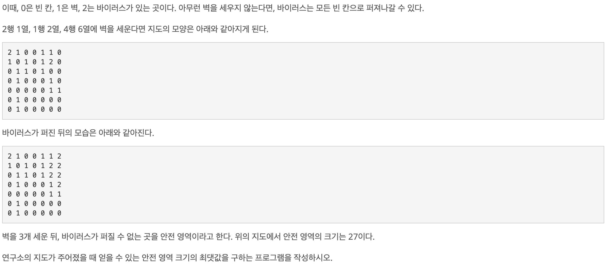
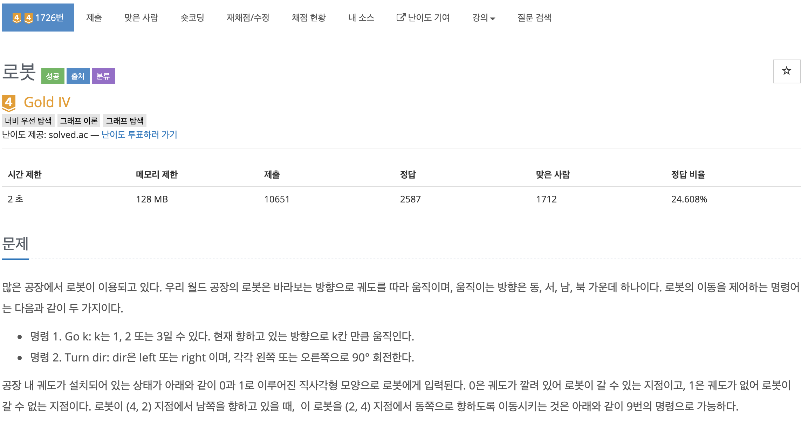

# 코딩 테스트 공부 5주차 - 2: DFS, BFS

### 14502번. 연구소 - DFS





입력받은 모든 0에 대해서 벽을 세워보아야 각 경우의 안전 영역의 갯수를 알 수 있으므로 DFS로 접근하였다.

먼저 입력을 받을 map과 벽을 세워서 안전영역을 구한 뒤 다시 되돌려서 다른 위치에 벽을 세워 검사해야 하므로 pre_map을 생성해 초기 입력값을 유지하였다. 또한 한 번 검사한 곳은 다시 검사하면 안되므로 chk 배열을 같은 크기로 선언해 주었다. 각 경우의 안전 영역의 수 중 최댓값을 비교하여 저장할 max_cnt를 선언하고 상하좌우 이동을 위해 dx, dy를 선언해 주었다. 마지막으로 0인 경우 중 3가지만을 뽑아서 계속해서 벽을 세운 후 비교해야 하므로 입력에 0이 들어올 경우 해당 좌표를 저장해 줄 zero_vec 벡터를 선언하였다.

각 함수에 대한 설명을 하면, spread_virus() 함수는 현재 map에서 바이러스 즉, 2인 부분을 확장할 수 있는 최대 위치까지 흩뿌리는 함수이다. 여기서는 이중 for문을 돌며 map값이 2이고 chk값이 0인 좌표에 대해 v_DFS를 호출한다. v_DFS() 함수는 호출된 좌표의 chk 값을 1로 설정하고 상하좌우 이동 좌표를 구하여 이동할 좌표의 map값이 0이고 chk값이 0이면 해당 좌표의 chk 값을 1로, map 값을 2로 변경 후 v_DFS를 재귀 호출한다. reset_map() 함수는 chk배열을 다시 0으로 초기화 하고 map 배열을 pre_map을 이용하여 다시 복원한다. 마지막 chk_are() 함수는 바이러스가 퍼진 map에서 0의 갯수를 찾아 리턴해 준다.

전체적인 로직은 2중 for문을 통해 입력을 받으며 각 값을 map에 저장하고 동일한 값을 pre_map에 저장을 한다. 이 때, 해당 좌표의 값이 0이라면 zero_vec 벡터에 추가해준다. 전부 입력을 받았다면 3중 for문을 통해 zero_vec에서 3 개씩을 골라 해당 좌표를 1로 바꾼 다음 spread_virus()를 호출하여 바이러스를 전부 흩뿌린 다음 chk_area()로 0의 갯수를 구하고 그 값이 max보다 크다면 max에 할당한다. 이후 reset_map() 함수로 map을 리셋해준 후 다른 좌표에 벽을 세운 경우를 검사하는 것을 반복한다.

이 과정을 전부 끝낸 후 max_cnt를 출력하면 최대 안전영역의 크기를 출력할 수 있다.

```c++
#include <iostream>
#include <vector>
#include <cstring>

using namespace std;

int N, M, map[10][10], pre_map[10][10], chk[10][10], max_cnt = -2147000000;
int dx[4] = {-1, 0, 1, 0};
int dy[4] ={0, 1, 0, -1};
vector<pair<int, int> > zero_vec;

void v_DFS(int x, int y) {
    chk[x][y] = 1;
    
    int nx, ny;
    for (int i = 0; i < 4; i ++) {
        nx = x + dx[i];
        ny = y + dy[i];
        
        if (nx < 0 || ny < 0 || nx >= N || ny >= M) continue;
        if (map[nx][ny] == 0 && chk[nx][ny] == 0) {
            chk[nx][ny] = 1;
            map[nx][ny] = 2;
            v_DFS(nx, ny);
        }
    }
    
    return ;
}

void spread_virus() {
    for (int i = 0; i < N; i ++) {
        for (int j = 0; j < M; j++) {
            if (map[i][j] == 2 && chk[i][j] == 0) v_DFS(i, j);
        }
    }
    return ;
}

void reset_map() {
    memset(chk, 0, sizeof(chk));
    for (int i = 0; i < N; i ++) {
        for (int j = 0; j < M; j ++) {
            map[i][j] = pre_map[i][j];
        }
    }
    
    return ;
}

int chk_area() {
    int area_cnt = 0;
    
    for (int i = 0; i < N; i ++) {
        for (int j = 0; j < M; j ++) {
            if (map[i][j] == 0) area_cnt ++;
        }
    }
    
    return area_cnt;
}

int main() {
    ios::sync_with_stdio(false);
    cin.tie(0);
    cout.tie(0);
    
    cin >> N >> M;
    for (int i = 0; i < N; i ++) {
        for (int j = 0; j < M; j ++) {
            cin >> map[i][j];
            pre_map[i][j] = map[i][j];
            if (map[i][j] == 0) zero_vec.push_back({i, j});
        }
    }
    
    for (int i = 0; i < zero_vec.size() - 2; i ++) {
        for (int j = i + 1; j < zero_vec.size() - 1; j ++) {
            for (int k = j + 1; k < zero_vec.size(); k ++) {
                map[zero_vec[i].first][zero_vec[i].second] = 1;
                map[zero_vec[j].first][zero_vec[j].second] = 1;
                map[zero_vec[k].first][zero_vec[k].second] = 1;
                spread_virus();
                
                int tmp = chk_area();
                if (tmp > max_cnt) max_cnt = tmp;
                
                reset_map();
            }
        }
    }
    
    cout << max_cnt << '\n';
        
    return 0;
}
```


### 9019번. DSLR - BFS


BFS로 접근하여 정답에 근접했으나 세부 구현에서 깔끔하지 못해 결국 풀이를 보게 되었다.

맨 처음 주어진 숫자를 Queue에 넣은 다음 하나씩 꺼내서 D, S, L, R를 전부 수행한 후에 맞지 않으면 그 다음 경우의 수를 Queue에 넣고, 목표한 숫자와 일치하면 break를 걸어 전체 반복문을 빠져나오면 되는 문제였다. 이미 체크한 수를 중복 체크하는 것을 막기 위해 크기가 10000인 배열을 통해 중복 검사를 해줬어야 했다는 점, 한 숫자를 Q에서 꺼내서 D, S, L, R을 각각 실행할 때 각각의 경우에 대해 검사를 실행해야 했어야 하는 점을 간과하여 제대로 풀지 못햇던 문제였다.

너무 어렵게 생각하여 풀지 못했지만 다시 한 번 차분히 풀면 풀 수 있을 정도의 문제이다. 반복(재귀)에 약점을 가진 내 문제가 여실히 드러난 문제라고 생각하며 스터디원들의 코드를 보며 배워야 겠다는 생각이 들었다..

```c++
#include <iostream>
#include <queue>
#include <cstring>
#include <vector>
#define mod 10000
#define p pair<int, string>
using namespace std;

int visit[mod];

int main(){
    ios::sync_with_stdio(0);
    cin.tie(0);
    
    int tc;
    cin >> tc;
    for(int i=0; i<tc; i++){
        memset(visit,0,sizeof(visit));
        int st;
        int dest;
        cin >> st >> dest;
        
        queue<p> q;
        q.push({st,""});
        
        while (! q.empty()) {
            int top = q.front().first;
            string operation = q.front().second;
            q.pop();
            
            if( top == dest) {
                cout << operation << endl;
                break;
            }

            int _top = top;
            operation += "D";
            if( ! visit[_top * 2 % mod] )
                q.push( { _top * 2 % mod, operation } );
            visit[ _top * 2 % mod ] = 1;
            operation.pop_back();
            
            _top = _top == 0 ? 9999 : _top - 1;
            operation += "S";
            if( ! visit[_top ] )
                q.push( { _top, operation } );
            visit[ _top ] = 1;
            operation.pop_back();
            
            operation += "L";
            _top = top / 1000;
            _top += top % 1000 * 10;
            if( ! visit[_top ] )
                q.push( {_top, operation } );
            visit[ _top ] = 1;
            operation.pop_back();
            
            operation += "R";
            _top = top % 10;
            _top = (top / 10) + (_top * 1000);
            if( ! visit[_top ] )
                q.push( { _top, operation } );
            visit[ _top ] = 1;
            operation.pop_back();
            
        } // end of while
    } // end of for i
    
    return 0;
}
```


### 1726번. 로봇 - BFS




기존의 최단거리 미로 찾기 문제에서 바라보는 방향이 추가된 문제이다. BFS로 접근하는 것은 알았지만 또 다시 반복문에 약점을 보여 하드코딩식으로 구현하다가 결국은 제대로 풀지 못하였다. 이 문제에서 내가 간과했던 점은, **chk배열을 2차원이 아닌 3차원으로 선언했어야 하는 것**, 한 칸에서 뒤로 돌릴필요까지는 없고 **왼쪽, 오른쪽으로만 돌리면 됐던 것** 두 가지이다.

chk배열을 2차원이 아닌 3차원으로 선언했어야 하는 이유는 BFS로 풀며 Q에 좌표를 집어 넣을 때, 현재 향하고 있는 방향이 막혀 있으면 왼쪽, 오른쪽으로 방향을 바꾼 뒤 갈 수 있는지 검사하여 Q에 넣는 작업을 한번에 하기 때문이다. 이렇게 되면 다음과 같은 예제에서 예외가 발생하게 된다.

```c++
1 1 1 1 1 1   // 로봇은 (2, 2)에 위치하고 남쪽을 바라보고 있다
1 0 0 0 0 1   // 도착점은 (4, 5)이다.
1 0 1 1 0 1   
1 0 0 0 0 1
1 1 1 1 1 1
```

위와 같은 경우에, 최소한의 경로는 ```(2, 2) -> (4, 2) -> (4, 5)``` 이며, 명령의 수는 이동 2번 + 방향전환 1번 총 3번이다. 하지만 BFS 특성상 ```(2, 2) -> (2, 5) -> (4, 5)```경로 즉 이동 2번 + 방향전환 2번 총 4번인 경우가 먼저 (4, 5)에 도착하여 ```chk[4][5]```가 이미 1이 되어 있어 가지 못하고 최소 명령어 수가 정답인 3이 아닌 4가 나오는 경우가 발생한다. 따라서 chk배열에서 체크를 할 때, 해당 좌표에 도착할 당시에 로봇이 향하고 있는 방향을 추가로 검사해 주어야 최적의 값이 목적지에 도착하지 못하는 상황을 방지할 수 있다.

또한 아예 반대 방향으로 돌릴 필요가 없던 것은 결국에 BFS를 돌면서 왼쪽이나 오른쪽으로 돌았던 로봇이 다시 한번 왼쪽이나 오른쪽으로 돌면 기존 방향의 반대 방향으로 돈 경우를 검사하게 되므로 복잡하게 생각할 필요가 없었다.

```c++
#include<iostream>
#include<queue>
using namespace std;
 
int M, N, ans;
int startx, starty, startdir, destx, desty, destdir;
// 로봇의 x좌표, y좌표, 방향
queue <pair<pair<int, int>, int>> robot;
int visited[101][101][5];
int factory[101][101];
 
// 동, 서, 남, 북
int dx[4] = {0, 0, 1, -1};
int dy[4] = {1, -1, 0, 0};
 
int bfs()
{
    int count = 0;
    while (!robot.empty())
    {
        int qsz = int(robot.size());
 
        while (qsz--)
        {
            int x = robot.front().first.first;
            int y = robot.front().first.second;
            int d = robot.front().second;
            robot.pop();
 
            if (x == destx && y == desty && d == destdir) return count;
 
            // d 방향으로 최대 3칸까지 갈 수 있다.
            int mx = x + dx[d-1];
            int my = y + dy[d-1];
            int md = d;
            int k = 3;
 
            while (k > 0)
            {
                if (mx < 1 || mx > M || my < 1 || my > N) break;
                if (factory[mx][my] == 1) break;
                if (!visited[mx][my][md]) {
                    visited[mx][my][md] = 1;
                    robot.push(make_pair(make_pair(mx, my), md));
                }
                mx += dx[d-1];
                my += dy[d-1];
                k--;
            }
 
            if (d <= 2) md = 3;
            else md = 1;
 
            // 왼쪽/오른쪽 2 방향으로 회전할 수 있다.
            for (int i = 0; i < 2; i++)
            {
                mx = x;
                my = y;
                md += i;
 
                if (visited[mx][my][md]) continue;
                visited[mx][my][md] = 1;
                robot.push(make_pair(make_pair(mx, my), md));
            }
        }
        count++;
    }
    return count;
}
 
int main()
{
    cin >> M >> N;
 
    for (int i = 1; i <= M; i++)
    {
        for (int j = 1; j <= N; j++)
        {
            cin >> factory[i][j];
        }
    }
 
    cin >> startx >> starty >> startdir;
    robot.push(make_pair(make_pair(startx, starty), startdir));
    visited[startx][starty][startdir] = 1;
 
    cin >> destx >> desty >> destdir;
 
    ans = bfs();
 
    cout << ans;
 
    return 0;
}
```

여기서 코드 구현 시 아쉬웠던 점은, 향하는 방향으로 1칸, 2칸, 3칸을 갈지 결정할 때에 증가하는 순서로 검사하는 것을 좋았지만 이것을 하드코딩식으로 각각의 경우를 구하려 했던 것이다. 이것은 for문을 3번 돌리면서 차근차근히 구현했으면 더 쉽게 구현했을 수 있을 것 같다.