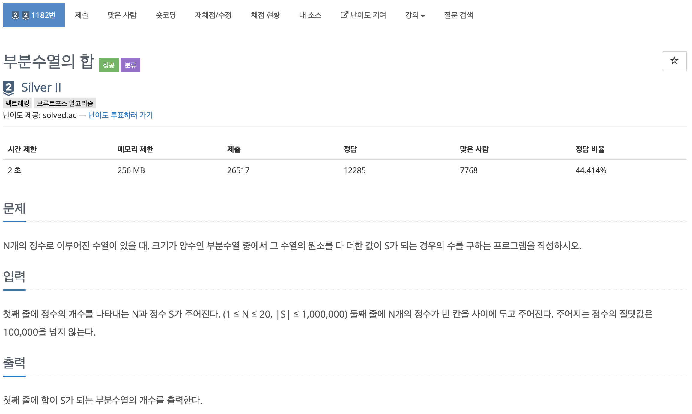
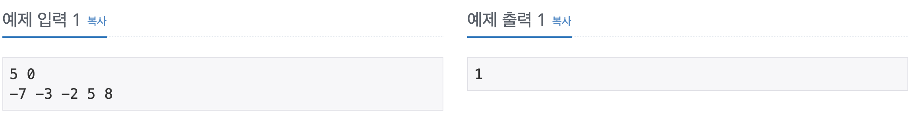
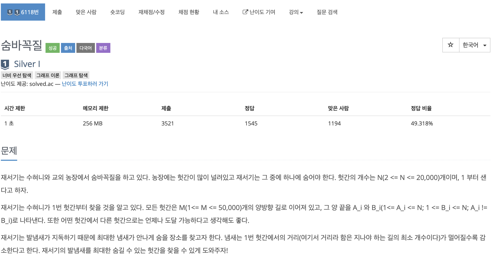
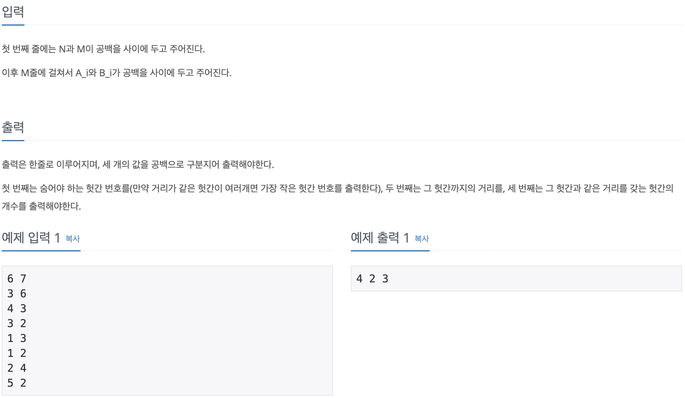
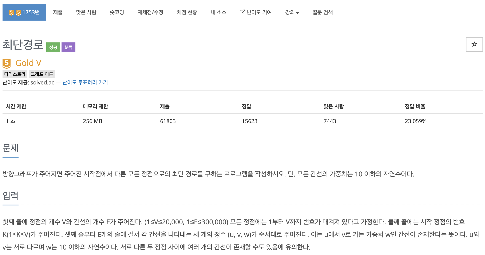
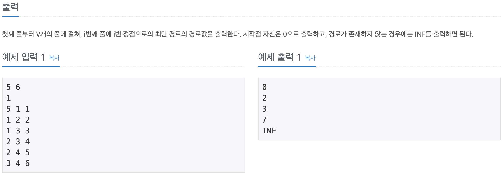
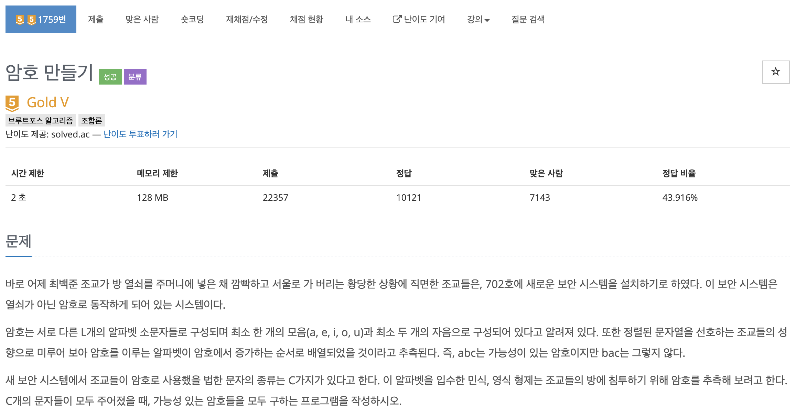
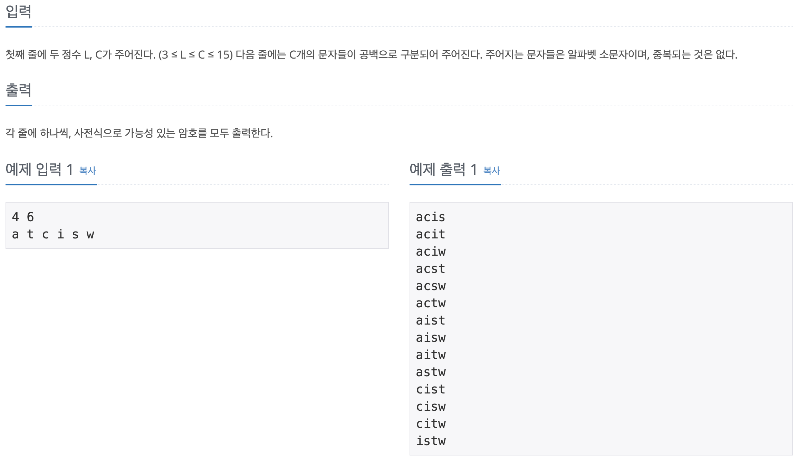
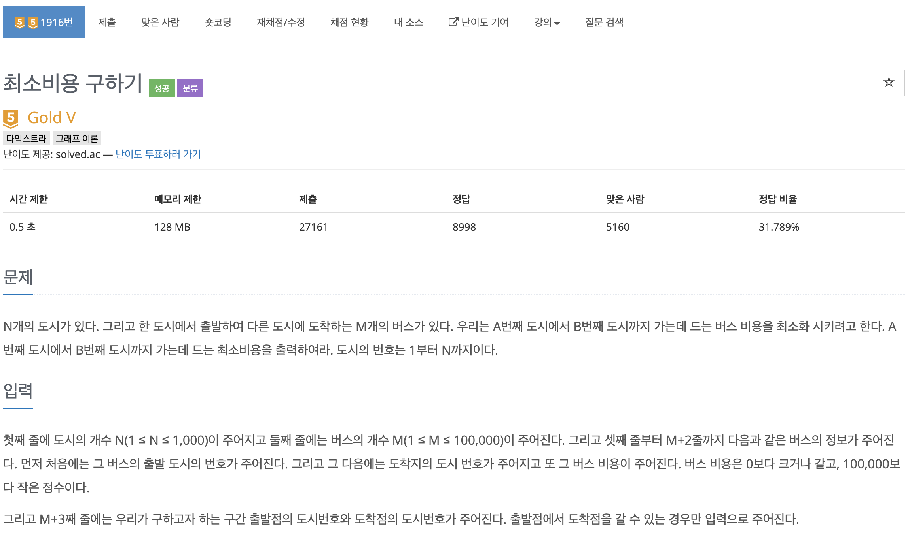
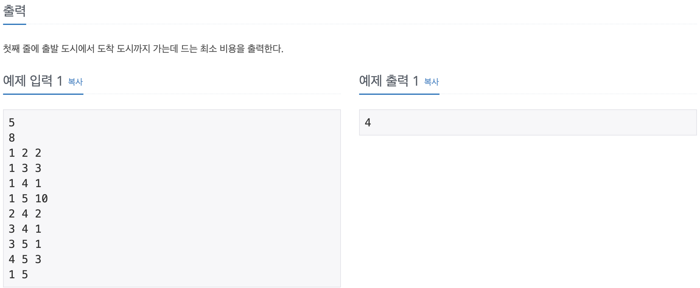

# 코딩 테스트 공부 6주차 - DFS, 백트레킹, 다익스트라

### 1182번. 부분 수열의 합 - DFS





크기가 1보다 크거나 같은 모든 수열의 경우의 수를 검사해야 했기 때문에 DFS로 접근하였다. 

처음에는 입력 받은 수를 배열에 저장하고 배열의 길이만큼의 레벨을 모두 검사한 다음 그 중에서 하나 이상의 정수로 이루어진 부분 수열의 값들의 합이 S 인경우만 카운트를 증가시켰다. 이러한 방식으로 구현하면 정답을 구할 수는 있었으나 너무 많은 탐색으로 인해 시간 초과가 발생하였다.

따라서 시간 초과를 피하기 위해 N개의 수를 입력 받았다면 N개의 수를 무조건 포함하도록 하여 DFS를 실행했다. 수를 입력받을 때 vector에 입력받은 후 총 N번 반복되는 반복문 안에서 **입력 배열의 맨 앞의 수를 무조건 포함**하도록 하였다. 이 때, 반복되면서 맨 앞의 수를 맨 뒤에 붙이고 두 번째 수를 맨 앞으로 당겨오는 작업을 해주었다. 이러한 방식으로 탐색 깊이를 1단계 줄여서 많은 갯수의 입력이 주어졌을 때의 시간을 절약할 수 있었다. 

최근에 DFS를 활용하여 푸는 문제를 많이 풀었는데 그것때문에 DFS의 기본 개념이 조금 흐릿해진 것 같다. 1주일 마다 복기하며 기본 개념을 확고히 다지는 시간을 가져야겠다.

```c++
#include <iostream>
#include <queue>

using namespace std;

int N, S, tmp, cnt = 0;
deque<int> nums;

void DFS(int Lv, int sum) {
    if (Lv == N - 1) {
        if (sum == S) cnt ++;
    } else {
        DFS(Lv + 1, sum + nums[Lv + 1]);
        DFS(Lv + 1, sum);
    }
    return ;
}

int main() {
    ios::sync_with_stdio(false);
    cin.tie(0);
    cout.tie(0);
    
    cin >> N >> S;
    
    for (int i = 0; i < N; i ++) {
        cin >> tmp;
        nums.push_back(tmp);
    }
    
    while(N > 0) {
        DFS(0, nums.front());
        nums.push_back(nums.front());
        nums.pop_front();
        N --;
    }
    
    cout << cnt << '\n';
    
    return 0;
}
```


### 6118번. 숨바꼭질 - BFS





다익스트라를 이용하여 푸는 문제라고 되어 있지만 다익스트라를 공부하지 않은 상태에서 접했을 때 이전에 풀어보았던 BFS를 응용한 촌수 구하기 문제와 유사해 보여 BFS를 이용하여 풀어보았다.

입력을 받아 인접리스트를 만든 후 Q에 시작점인 1번 노드를 넣는다. dist 배열은 노드를 체크했는지와 1번 노드와 다른 노드 사이의 거리를 저장하는 두 가지 용도로 사용한다. Q에서 노드를 빼면 해당 노드에 연결된 노드 전부에 대해 검사를 한다. 꺼낸 노드의 dist값이 0이면 검사를 하지 않은 노드이므로 해당 노드와의 거리를 현재 노드 dist값 + 1로 정하여 dist값을 저장해준다. 이 과정을 반복하게 되면 dist배열은 1노드와의 거리 +1로 수정되게 된다.

dist를 갱신할 때 마다 max_dist 값을 갱신해 주었기 때문에 dist배열의 index를 1씩 증가시키며 그 값이 max_dist와 같다면 그 값을 출력하고 break해준다. 이후 dist값을 내림차순으로 sort해준 후, top()값 -1을 출력해주고 똑같은 값이 몇개인지를 세어 마지막으로 출력해 주었다.

```c++
#include <iostream>
#include <vector>
#include <queue>
#include <algorithm>

using namespace std;

int main() {
    ios::sync_with_stdio(false);
    cin.tie(0);
    cout.tie(0);
    
    int N, M, frt, back, x, max_dist = -2147000000, same_barn = 1;
    queue<int> Q;
    vector<int> barn[20010];
    int dist[20010] = { 0 };
    
    cin >> N >> M;
    for (int i = 0; i < M; i ++) {
        cin >> frt >> back;
        barn[frt].push_back(back);
        barn[back].push_back(frt);
    }
    
    Q.push(1);
    dist[1] = 1;
    
    while(!Q.empty()) {
        x = Q.front();
        Q.pop();
        
        for (int i = 0; i < barn[x].size(); i ++) {
            if (dist[barn[x][i]] == 0) {
                Q.push(barn[x][i]);
                dist[barn[x][i]] = dist[x] + 1;
                if (dist[x] + 1 > max_dist) max_dist = dist[x] + 1;
            }
        }
    }
    
    for (int i = 1; i <= N; i ++) {
        if (dist[i] == max_dist) {
            cout << i;
            break;
        }
    }
    
    sort(dist + 1, dist + N + 1, greater<>());
    
    for (int i = 2; i <= N; i ++) {
        if (dist[i] == dist[1]) same_barn ++;
        else break;
    }
    cout << ' ' << dist[1] - 1 << ' ' << same_barn << '\n';
    
    return 0;
}
```


### 1753번. 최단경로 - Dijkstra





간선의 가중치가 주어지고 모두 자연수이므로 다익스트라를 사용하여 구할 수 있던 문제였다.

시간복잡도를 낮추기 위해 min heap을 이용하여 구현해 보았다. dist 배열을 최댓값인 대략 2147000000으로 초기화한 후, cmp 구조체를 선언하여 pair의 두번 째 값 기준으로 오름차순 정렬한다. Q에 맨 처음에 시작점인 K와 가중치인 0을 pair로 넣어준다. Q에서 top()을 뽑고 나면 가중치가 가장 작은 값이 뽑힐 것이므로 뽑은 pair의 first와 연결된 모든 노드를 검사한다. 검사하는 노드의 dist값과 pair의 second값을 먼저 비교한다. second값이 기존의 값보다 더 크다면 개선의 여지가 없으므로 continue를 한다. 그렇지 않다면 현재 dist값에 뽑은 노드의 가중치를 더하여 뽑은 노드와 연결하여 Q에 삽입해준다.

이 과정을 반복하게 되면 dist배열이 K와의 거리로 수정된다. 따라서 반복문을 통해 각 인덱스의 값을 출력해 주면 된다. 이 때, 출력될 값이 2147000000과 같다면 그 정점으로 갈 수 없는 것이므로 INF를 출력해 준다.

구현할 때 꼼꼼히 코드를 살피지 않아 cmp를 구현해 놓고 사용하지 않아 계속 틀렸다. 코딩할 때 꼼꼼히 확인하는 습관을 들여야겠다.

```c++
#include <iostream>
#include <vector>
#include <queue>

#define MAX 2147000000

using namespace std;

struct cmp {
    bool operator() (pair<int, int> A, pair<int, int> B) {
        if (A.second > B.second) return true;
        else return false;
    }
};

int main() {
    ios::sync_with_stdio(false);
    cin.tie(0);
    cout.tie(0);
    
    int V, E, K, a, b, c;
    priority_queue<pair<int, int>, vector<pair<int, int> >, cmp> Q;
    vector<pair<int, int> > graph[20010];
    vector<int> dist(20010, MAX);
    
    cin >> V >> E >> K;
    
    for (int i = 0; i < E; i ++) {
        cin >> a >> b >> c;
        graph[a].push_back({b, c});
    }
    
    dist[K] = 0;
    Q.push({K, 0});
    
    while(!Q.empty()) {
        pair<int, int> edge = Q.top();
        Q.pop();
        
        int end = edge.first;
        int val = edge.second;
        
        if (val > dist[end]) continue;
        
        for (int i = 0; i < graph[end].size(); i ++) {
            int next_node = graph[end][i].first;
            int next_weight = graph[end][i].second + val;
            
            if (next_weight < dist[next_node]) {
                dist[next_node] = next_weight;
                Q.push({next_node, next_weight});
            }
        }
    }
    
    for (int i = 1; i <= V; i ++) {
        if (dist[i] != MAX) cout << dist[i] << '\n';
        else cout << "INF" << '\n';
    }
    
    return 0;
}
```


### 1759번. 암호 만들기 - DFS





ㅁ

```c++
#include <iostream>
#include <algorithm>

using namespace std;

void dfs(int l_size, int c_size, char ch_input[], char ch_result[], int node, int cnt) {
    // 재귀함수 종료 조건
    if (cnt == l_size) {
        int vowel = 0, consonant = 0;
        for (int i = 0; i < l_size; i++) {
            if (ch_result[i] == 'a' || ch_result[i] == 'e' || ch_result[i] == 'i' || ch_result[i] == 'o' || ch_result[i] == 'u')
                vowel++;
            else consonant++;
        }

        // 자음, 모음이 기준치를 넘지 못했을 때, 그때의 경우의수는 출력하지 않음.
        if (!(vowel >= 1 && consonant >= 2)) return;

        // 츨력단
        for (int i = 0; i < l_size; i++) {
            cout << ch_result[i];
        }
        cout << "\n";
        return;
    }

    // 탐색
    for (int i = node; i < c_size; i++) {
        ch_result[cnt] = ch_input[i];
        dfs(l_size, c_size, ch_input, ch_result, i + 1, cnt + 1);
    }
}

int main() {
    ios_base::sync_with_stdio(false);
    cin.tie(NULL);

    int l_size, c_size;
    char ch_input[15], ch_result[15];


    // 입력단
    cin >> l_size >> c_size;
    for (int i = 0; i < c_size; i++)
        cin >> ch_input[i];
    
    // 알파벳 순으로 입력 정렬
    sort(ch_input, ch_input + c_size);

    // DFS
    dfs(l_size, c_size, ch_input, ch_result, 0, 0);

    return 0;
}
```


### 1916번. 최소비용 구하기 - Dijkstra





앞서 풀어보았던 최단경로 문제와 똑같이 다익스트라 알고리즘을 이용해서 풀어보았던 문제이다. 이전과 구현방식은 동일하지만 이번에는 pair가 아닌 구조체를 선언하여 구현해 보았다. 이 방법이 보다 깔끔하고 보기 좋은 것 같다.

```c++
#include <iostream>
#include <vector>
#include <queue>

#define MAX 2147000000

using namespace std;

struct Edge {
    int end;
    int val;
    Edge(int a, int b) {
        end = a;
        val = b;
    }
};

struct cmp {
    bool operator () (Edge a, Edge b) {
        if (a.val > b.val) return true;
        else return false;
    }
};

int main() {
    ios::sync_with_stdio(false);
    cin.tie(0);
    cout.tie(0);
    
    int N, M, a, b, c, start, destination;
    vector<Edge> graph[1010];
    priority_queue<Edge, vector<Edge>, cmp> Q;
    vector<int> dist(1010, MAX);
    
    cin >> N >> M;
    
    for (int i = 0; i < M; i ++) {
        cin >> a >> b >> c;
        graph[a].push_back(Edge(b, c));
    }
    
    cin >> start >> destination;
    
    dist[start] = 0;
    Q.push(Edge(start, 0));
    
    while(!Q.empty()) {
        int now = Q.top().end;
        int dis = Q.top().val;
        Q.pop();
        
        if (dis > dist[now]) continue;
        
        for (int i = 0; i < graph[now].size(); i ++) {
            int next_node = graph[now][i].end;
            int next_dis = graph[now][i].val + dis;
            
            if (next_dis < dist[next_node]) {
                dist[next_node] = next_dis;
                Q.push(Edge(next_node, next_dis));
            }
        }
    }
    
    cout << dist[destination] << '\n';
    
    return 0;
}
```


### 1987번. 알파벳 - DFS


배추 애벌레문제를 2번 정도 꼬아서 생각해야 하는 문제였다. DFS를 이용하여 전부 탐색했어야 하는데 탐색할 때 이전까지 사용했던 알파벳 중에 하나라도 겹치면 뒤돌아 가도록 구현해야 하는 문제였다. DFS 내부에서 조건을 검사하고 DFS를 재귀 호출할 때, 해당 **DFS가 종료된 이후 chk배열과 visited(사용할 알파벳)을 DFS 호출 이전으로 되돌려 주어야** 다른 검사에서 사용할 수 있다. 이 부분을 간과하여 몇 번 틀렸었는데 DFS의 기본 개념을 다시 숙지해야겠다.

```c++
#include <iostream>
#include <string>

using namespace std;

int R, C, max_val = -2147000000;
int dx[4] = {-1, 0, 1, 0};
int dy[4] = {0, 1, 0, -1};
char map[21][21];
int chk[21][21];
int visited[200];
string tmp;

void DFS(int x, int y, int cnt) {
    if (cnt > max_val) max_val = cnt;
    
    for (int i = 0; i < 4; i ++) {
        int nx = x + dx[i];
        int ny = y + dy[i];
        
        if (nx < 0 || ny < 0 || nx >= R || ny >= C) continue;
       
        if (chk[nx][ny] == 0 && visited[map[nx][ny]] == 0) {
            chk[nx][ny] = 1;
            visited[map[nx][ny]] = 1;
            DFS(nx, ny, cnt + 1);
            chk[nx][ny] = 0;
            visited[map[nx][ny]] = 0;
        }
    }
    
    return ;
}

int main() {
    ios::sync_with_stdio(false);
    cin.tie(0);
    cout.tie(0);
    
    cin >> R >> C;
    
    cin.ignore();
    for (int i = 0; i < R; i ++) {
        getline(cin, tmp);
        for (int j = 0; j < C; j ++) {
            map[i][j] = tmp[j];
        }
    }
    
    chk[0][0] = 1;
    visited[map[0][0]] = 1;
    DFS(0, 0, 1);
    
    cout << max_val << '\n';
    
    return 0;
}
```

