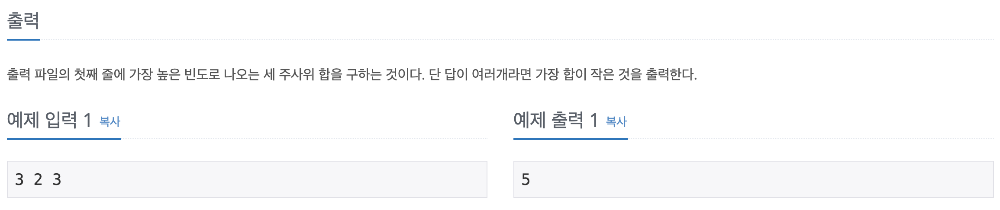

# 코딩 테스트 공부 7주차 - 다익스트라, BFS, 백트래킹

## 1233번. 주사위 - DFS




처음 읽었을 때 문제가 가지 않아 브론즈인지 다시 보았던 문제이다. 결국 세 개의 주사위가 있을 때, 모든 경우의 수 중에서 세 주사위의 합을 구해서 그 빈도가 제일 잦은 값을 출력하는 문제이다. 주사위가 3개밖에 되지 않고, 모든 경우의 수를 따져봐야할 것 같아서 DFS로 접근하였다.

구현 방식은 일단 세 주사위의 최댓값이 주어지면 각 주사위의 배열(vec_s1, vec_s2, vec_s3)을 1부터 N까지 채워준다. 세 주사위의 값의 합을 저장할 배열 sum_chk를 선언하고 DFS의 레벨이 3이 될 때마다 DFS 재귀호출을 멈추고 그 당시의 주사위 값의 합을 sum_chk의 인덱스와 대치하여 그 값을 +1 해주었다. 종료조건에 해당하지 않는 DFS에서는 각 레벨에서 for문을 사용하여 주사위의 각 눈을 전부 탐색하도록 했다.

Lv 0은 첫 번째 주사위, 1은 두 번째 주사위, 2는 세 번째 주사위를 탐색하는 것이며 DFS를 돌면서 세 주사위의 값 중 최고값을 max_bin에 저장한다. DFS가 모두 종료되고 난 뒤 sum_chk 배열을 반복문을 통해 검사하다가 max_bin과 같은 값이 나오면 해당 인덱스를 출력하고 프로그램을 종료한다.

```c++
#include <iostream>
#include <vector>

using namespace std;

int s1, s2, s3, max_bin = -2147000000;
vector<int> vec_s1, vec_s2, vec_s3;
vector<int> sum_chk;

void DFS(int Lv, int sum) {
    if (Lv == 3) {
        sum_chk[sum] += 1;
        if (sum_chk[sum] > max_bin) max_bin = sum_chk[sum];
    } else {
        if (Lv == 0) {
            for (int i = 0; i < vec_s1.size(); i ++) {
                DFS(Lv + 1, sum + vec_s1[i]);
            }
        } else if (Lv == 1) {
            for (int i = 0; i < vec_s2.size(); i ++) {
                DFS(Lv + 1, sum + vec_s2[i]);
            }
        } else {
            for (int i = 0; i < vec_s3.size(); i ++) {
                DFS(Lv + 1, sum + vec_s3[i]);
            }
        }
    }
    
    return ;
}

int main() {
    ios::sync_with_stdio(false);
    cin.tie(0);
    cout.tie(0);
    
    cin >> s1 >> s2 >> s3;
    
    sum_chk.resize(s1 + s2 + s3 + 1, 0);
    
    for (int i = 1; i <= s1; i ++) {
        vec_s1.push_back(i);
    }
    for (int i = 1; i <= s2; i ++) {
        vec_s2.push_back(i);
    }
    for (int i = 1; i <= s3; i ++) {
        vec_s3.push_back(i);
    }
    
    DFS(0, 0);
    
    for (int i = 1; i <= s1 + s2 + s3; i ++) {
        if (sum_chk[i] == max_bin) {
            cout << i << '\n';
            break;
        }
    }
    
    return 0;
}
```


## 14503번. 로봇 청소기 - 시뮬레이션


while문을 사용하여 푸는데 까지는 접근했으나 요즘 BFS, 다익스트라 알고리즘에 익숙해져 Queue로 접근한게 실수였다. 

맨 처음에는 로봇 청소기가 위치한 좌표의 값이 0이라면 2로 바꾸고 cnt를 증가시켜 청소하였다는 것을 표시한다. 이후에는 2번 동작을 반복하는데 현재 로봇이 바라보고 있는 방향에 따라 dir를 수정하고 4방향을 검사한다. 이 때, 한 번 회전 시켰을 때, 그 다음 좌표의 map값이 0이라면 x와 y를 nx ny로 바꾸어 주고 다시 1번으로 돌아가기 위해 chk 플래그를 1로 바꾸어 준다. chk 플래그가 1이면 continue를 사용하여 밑의 코드는 전부 뛰어 넘고 다시 while문을 시작하게 된다.

네 방향을 모두 다 돌았는데도 나아가지 못한 경우는 for문이 4번 돌고 난 후로 정의할 수 있으며 해당 경우에는 뒤로 갈 좌표를 구한 후, 해당 좌표가 1이라면 프로그램 종료, 그렇지 않으면 x, y를 수정하고 다시 while문을 돈다.

단순하게 문제에 주어진 대로 구현하였다면 어렵지 않을 문제였지만 굳이 어렵게 생각하여 푸는데 오래 걸렸던 문제이다. 시뮬레이션 문제를 좀 더 연습해야겠다.

```c++
#include <iostream>

using namespace std;

int main() {
    ios::sync_with_stdio(false);
    cin.tie(0);
    cout.tie(0);
    
    int N, M, r, c, d, map[51][51] = { 0 }, cnt = 0;
    int dx[4] = {-1, 0, 1, 0}; // 북 동 남 서
    int dy[4] = {0, 1, 0, -1};
    
    cin >> N >> M;
    
    cin >> r >> c >> d;
    
    for (int i = 0; i < N; i ++) {
        for (int j = 0; j < M; j ++) {
            cin >> map[i][j];
        }
    }
    
    int x = r, y = c, dir = d;
    
    while(true) {
        if (map[x][y] == 0) {
            map[x][y] = 2;
            cnt ++;
        }
        
        int chk = 0;
        
        for (int i = 0; i < 4; i ++) {
            dir = dir - 1;
            if (dir < 0) dir = 3;
            int nx = x + dx[dir];
            int ny = y + dy[dir];
            
            if (map[nx][ny] == 0) {
                x = nx;
                y = ny;
                chk = 1;
                break;
            }
        }
        
        if (chk == 1) continue;
        
        int back_dir = dir - 2;
        
        if (back_dir == -2) back_dir = 2;
        if (back_dir == -1) back_dir = 3;
        
        x = x + dx[back_dir];
        y = y + dy[back_dir];
        
        if (map[x][y] == 1) break;
    }
    
    cout << cnt << '\n';
    
    return 0;
}
```


## 4485번. 녹색 옷 입은 애가 젤다지? - Dijkstra


한 점에서 다른 점으로 가는 최소한의 가중치를 구하는 문제이고 가중치가 전부 양수이므로 다익스트라를 이용하여 풀어보았다.

여기서는 정점과 간선으로 주어지지는 않았지만 좌표를 정점, 해당 좌표의 값을 정점으로 향하는 간선의 가중치라고 생각하고 dist값을 2차원 배열로 구하였다. 우선 room이라는 구조체를 선언하여 좌표와 해당 좌표의 가중치 값을 저장하였다. room의 가중치를 기준으로 min heap인 Q를 선언하였고 2차원 배열에 좌표값을 저장하여 인접행렬과 비슷한 형태로 만들었다.

시작 위치는 (0, 0)으로 정해져 있으므로 ```dist[0][0]```값을 ```cave[0][0]```으로 초기화 하고 우선순위 큐에 ```room(0, 0, cave[0][0])```을 넣어주고 시작했다(**시작점의 가중치도 포함**시켜야 하므로). 그 이후는 우선 수위 큐에서 맨 위의 값을 뽑아서 해당 좌표의 dist값과 해당 좌표 값을 비교하여 dist값이 더 작으면 검사를 하지 않도록 continue 처리를 해주었다.

링크는 현재 위치에서 4 방향으로 이동할 수 있으므로 for문을 4번 반복하여 다음 위치를 정하고 유효성 검사를 거친 뒤에 다음에 향할 좌표와 **다음 좌표까지의 거리를 계산한다(다음 좌표의 값 + 현재 거리)**. 다음 좌표의 dist값과 다음 좌표까지의 거리를 계산하여 dist값이 더 크다면 값을 갱신하고 우선순위 큐에 다음 좌표 값과 거리를 room으로 생성하여 넣는다.

다익스트라를 구현할 때 항상 헷갈리는 것이지만 **부등호의 착각에 유의**해야 했고 마지막에 ```dist[n - 1][n - 1]``` 값을 출력하면 정답을 구할 수 있다.

```c++
#include <iostream>
#include <cstring>
#include <queue>
#include <vector>

#define INF 987654321

using namespace std;

struct room {
    int x, y, dis;
    room(int a, int b, int c) {
        x = a;
        y = b;
        dis = c;
    }
};

struct cmp {
    bool operator() (room a, room b) {
        if (a.dis > b.dis) return true;
        else return false;
    }
};

int main() {
    ios::sync_with_stdio(false);
    cin.tie(0);
    cout.tie(0);
    
    int size, seq = 1;
    int dx[4] = {-1, 0, 1, 0};
    int dy[4] = {0, 1, 0, -1};
    priority_queue<room, vector<room>, cmp> Q;
    
    while(true) {
        cin >> size;
        if(size == 0) break;
        
        vector<vector<int>> cave(size, vector<int>(size, 0));
        vector<vector<int>> dist(size, vector<int>(size, INF));
    
        for (int i = 0; i < size; i ++) {
            for (int j = 0; j < size; j ++) {
                cin >> cave[i][j];
            }
        }
        
        dist[0][0] = cave[0][0];
        Q.push(room(0, 0, cave[0][0]));
        
        while(!Q.empty()) {
            int tmp_x = Q.top().x;
            int tmp_y = Q.top().y;
            int tmp_dis = Q.top().dis;
            Q.pop();
                        
            if (dist[tmp_x][tmp_y] < tmp_dis) continue;
            
            for (int i = 0; i < 4; i ++) {
                int nx = tmp_x + dx[i];
                int ny = tmp_y + dy[i];
                
                if (nx < 0 || ny < 0 || nx >= size || ny >= size) continue;
                int nxt_dis = cave[nx][ny] + tmp_dis;
                
                if (dist[nx][ny] > nxt_dis) {
                    dist[nx][ny] = nxt_dis;
                    Q.push(room(nx, ny, nxt_dis));
                }
            }
        
        }
       
        cout << "Problem " << seq << ": " << dist[size - 1][size - 1] << '\n';
        seq ++;
    }
    
    return 0;
}
```

이 문제에서는 2차원 배열을 선언함과 동시에 초기화를 해주었어야 하는데 이 작업에 ```memset```을 사용했더니 제대로 초기화 되지 않았다. 알고 보니 ```memset(변수, int value, 크기)```와 같이 되어있지만 value를 저장할 때 4바이트가 아닌 1바이트로 바꾸어 저장하기 때문이었다. 따라서 **memset을 통해 0이 아닌 수로 초기화 하는 것은 제대로 이루어 지지 않았**으며 2차원 벡터를 사용하여 해결하였다.

2차원 벡터의 선언 부분이 많이 헷갈리는데 계속해서 사용해 보며 익숙해지도록 노력해야겠다.


## 1261번. 알고스팟 - Dijkstra


 


모든 가중치가 1이여서 BFS로 도전해 보았지만 예외의 경우를 생각할 것이 많아져서 그냥 젤다와 비슷하게 다익스트라를 적용하여 풀었다.

맨 처음 시작점의 가중치를 값에 포함시키지 않아도 되는 점, 입력받을 때 string으로 입력이 되어 한글자씩 떼어 '0'을 빼고 push_back으로 저장했던 점을 제외하면 젤다 문제와 크게 다를 바가 없었다. 가장 큰 차이는 **next dist값을 구할 때 다음 좌표의 값이 0이면 현재 dist 값 그대로, 그렇지 않으면 현재 dist값 + 1**을 해주었어야 했던 것이었다. 나는 삼항연산자를 사용했지만 딱히 삼항 연산자를 안쓰고 기존 문제에서 하던대로 구했어도 될 것 같긴 하다.

```c++
#include <iostream>
#include <cstring>
#include <vector>
#include <queue>

using namespace std;

#define INF 2147000000

struct room {
    int x, y, cnt;
    room(int a, int b, int c) {
        x = a;
        y = b;
        cnt = c;
    }
};

int main() {
    ios::sync_with_stdio(false);
    cin.tie(0);
    cout.tie(0);
    
    int N, M;
    int dx[4] = {-1, 0, 1, 0};
    int dy[4] = {0, 1, 0, -1};
    queue<room> Q;
    string tmp;
    
    cin >> M >> N;
    
    vector<int> map[N];
    vector<vector<int>> dist(N, vector<int>(M, INF));
    
    cin.ignore();
    for (int i = 0; i < N; i ++) {
        cin >> tmp;
        for (int j = 0; j < M; j ++) {
            map[i].push_back(tmp[j] - '0');
        }
    }
    
    dist[0][0] = 0;
    Q.push(room(0, 0, 0));
    
    while(!Q.empty()) {
        room tmp = room(Q.front().x, Q.front().y, Q.front().cnt);
        Q.pop();
        
        if (dist[tmp.x][tmp.y] < tmp.cnt) continue;;
        
        for (int i = 0; i < 4; i ++) {
            int nx = tmp.x + dx[i];
            int ny = tmp.y + dy[i];
            
            if (nx < 0 || ny < 0 || nx >= N || ny >= M) continue;
            
            int next_cnt = map[nx][ny] == 1 ? tmp.cnt + 1 : tmp.cnt;
            if (dist[nx][ny] > next_cnt) {
                dist[nx][ny] = next_cnt;
                Q.push(room(nx, ny, next_cnt));
            }
            
        }
    }
    
    cout << dist[N - 1][M - 1] << '\n';
    
    return 0;
}
```


## 1238번. 파티 - Dijkstra


최단거리를 구해야 했지만 왕복거리를 구해야 해서 모든 정점에 대해 dist를 전부 구했어야 하는 문제였다. 당연하게 다익스트라로 접근하였다. 

입력은 인접리스트를 선언하여 저장하였고 N개의 정점이 주어지면 N개의 정점을 출발점으로 하는 dist를 전부 구해서 2차원 배열 dist에 저장하였다. 기존 다익스트라와 다를 것이 없지만 배열 인덱스에 주의가 필요했다. 모든 dist가 구해지면 모든 정점에 대해 검사하며 **각 지점에서 목적지까지의 최소 거리 + 목적지에서 각 지점으로의 거리를 전부 비교**하여 최댓값을 구하여 출력하면 된다.

```c++
#include <iostream>
#include <vector>
#include <queue>

#define INF 2147000000

using namespace std;

struct Edge {
    int node, dist;
    Edge (int a, int b) {
        node = a;
        dist = b;
    }
};

struct cmp {
    bool operator() (Edge a, Edge b) {
        if (a.dist > b.dist) return true;
        else return false;
    }
};

int main() {
    ios::sync_with_stdio(false);
    cin.tie(0);
    cout.tie(0);
    
    int N, M, X, a, b, c, max_dist = -2147000000;
    
    cin >> N >> M >> X;
    
    vector<Edge> graph[N + 1];
    vector<vector<int>> dist(N + 1, vector<int>(N + 1, INF));
    
    for (int i = 0; i < M; i ++) {
        cin >> a >> b >> c;
        graph[a].push_back(Edge(b, c));
    }
     
    for (int i = 1; i <= N; i ++) {
        priority_queue<Edge, vector<Edge>, cmp> Q;
        
        Q.push(Edge(i, 0));
        dist[i][i] = 0;
        
        while(!Q.empty()) {
            int now = Q.top().node;
            int dis = Q.top().dist;
            Q.pop();
            
            if (dis > dist[i][now]) continue;
            
            for (int j = 0; j < graph[now].size(); j ++) {
                int nxt_node = graph[now][j].node;
                int nxt_dist = graph[now][j].dist + dis;
                
                if (dist[i][nxt_node] > nxt_dist) {
                    dist[i][nxt_node] = nxt_dist;
                    Q.push(Edge(nxt_node, nxt_dist));
                }
            }
        }
    }
    
    for (int i = 1; i <= N; i ++) {
        if (dist[i][X] + dist[X][i] > max_dist) max_dist = dist[i][X] + dist[X][i];
    }
    
    cout << max_dist << '\n';
    
    return 0;
}
```


## 2234번. 성곽 - BFS


비트마스크를 이용하면 쉽게 접근할 수 있었던 문제였다. 잘 모르겟...

```c++
#include <iostream>
#include <queue>
#include <algorithm>
using namespace std;

int n, m;
int board[50][50];
int d[50][50];
int rooms[50 * 50];

// 서 북 동 남
const int dy[4] = { 0,-1,0,1 };
const int dx[4] = { -1,0,1,0};
int solve(int y, int x, int roomNum)
{
    queue<pair<int, int>> q;
    q.push({ y,x });
    d[y][x] = roomNum;
    int cnt = 0;
    while (!q.empty())
    {
        y = q.front().first;
        x = q.front().second;
        // 방의 넓이 카운트
        cnt++;
        q.pop();
        for (int i = 0; i < 4; ++i)
        {
            int ny = y + dy[i];
            int nx = x + dx[i];
            // 범위 체크
            if (nx < 0 || nx >= n || ny < 0 || ny >= m) continue;
            // 방문 체크
            if (d[ny][nx] != 0) continue;
            // 벽 체크
            if (board[y][x] & (1 << i)) continue;
            
            // ny,nx는 몇번방인지
            d[ny][nx] = roomNum;
            q.push({ ny,nx });
        }
    }
    return cnt;
}
int main()
{
    cin >> n >> m;
    for(int i=0; i<m; ++i)
        for (int j = 0; j < n; ++j)
        {
            cin >> board[i][j];
        }

    int num = 0;
    for (int i = 0; i < m; ++i)
        for (int j = 0; j < n; ++j) {
            if (d[i][j] == 0) {
                num++;
                // num번방의 넓이는 = solve(i,j,num);
                rooms[num] = solve(i, j, num);
            }
        }
    // 개수 출력
    cout << num << "\n";

    int ret = 0;
    // 가장 큰 넓이 구한다
    for (int i = 1; i <= num; ++i)
    {
        ret = max(ret, rooms[i]);
    }
    cout << ret << "\n";

    // d 에는 각 방의 번호가 적혀있고
    // 합칠수있는 방이라면 합친후 최대값 계산
    ret = 0;
    for(int i=0; i<m; ++i)
        for (int j = 0; j < n; ++j)
        {
            int y = i;
            int x = j;
            for (int k = 0; k < 4; ++k)
            {
                int ny = y + dy[k];
                int nx = x + dx[k];
                if(nx < 0 || nx >= n || ny < 0 || ny >= m) continue;

                if (d[ny][nx] == d[y][x]) continue;
                // 벽일때 뿌수고 최대값 구해야한다.
                if (board[y][x] & (1 << k)) {
                    ret = max(ret, rooms[d[ny][nx]] + rooms[d[y][x]]);
                }
            }
        }
    cout << ret << "\n";
    return 0;
}
```

