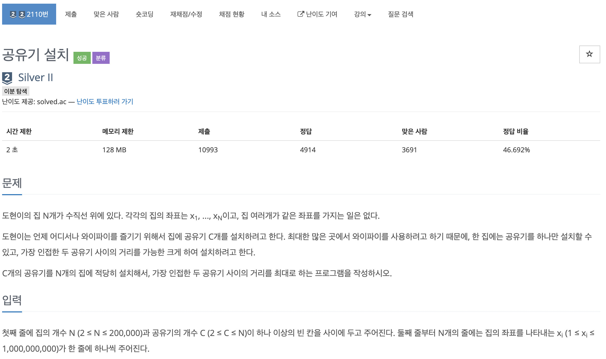
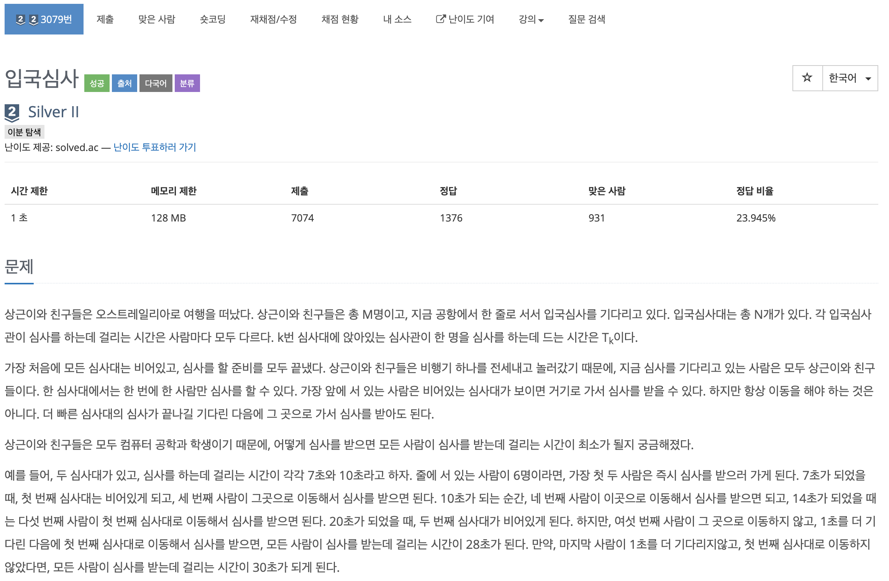
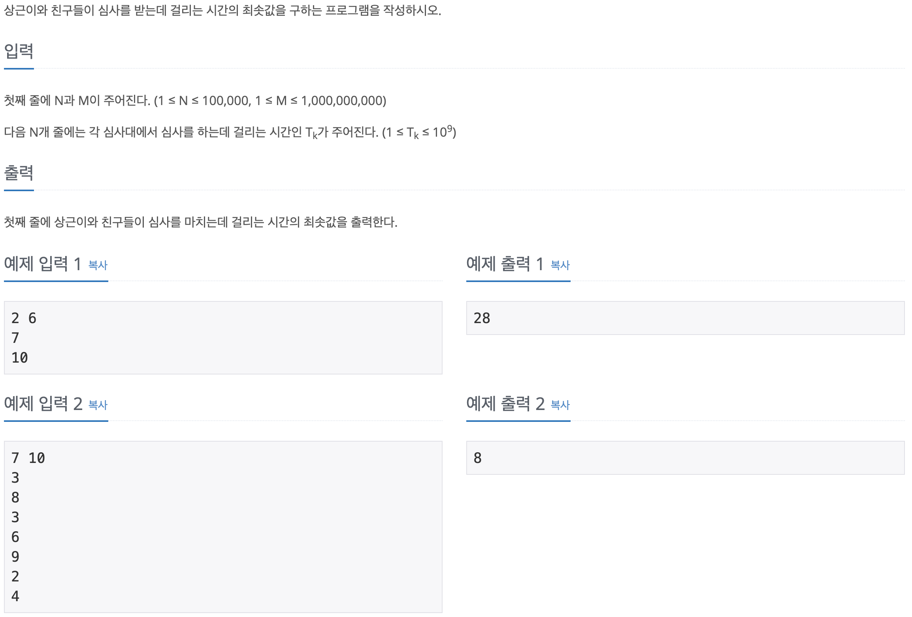
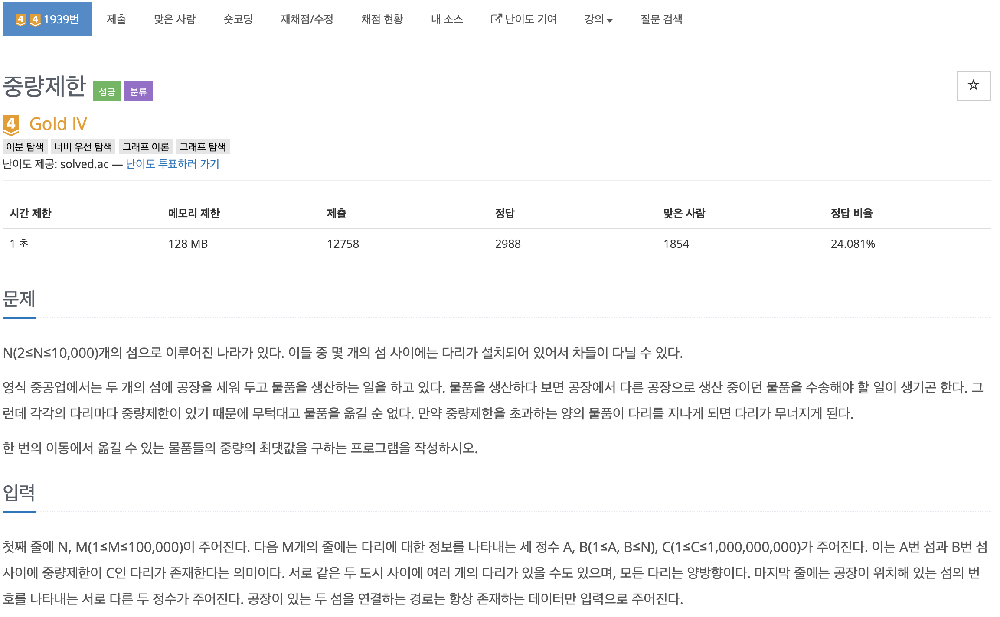
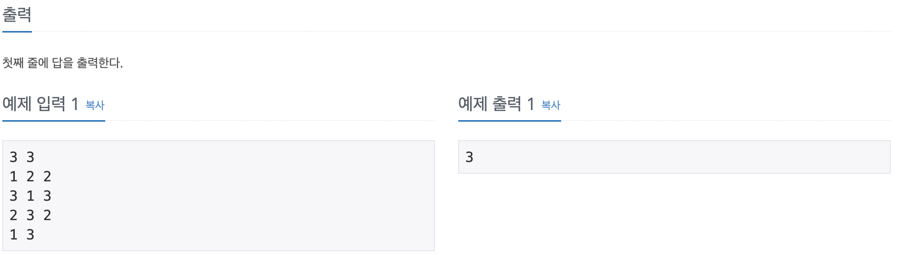
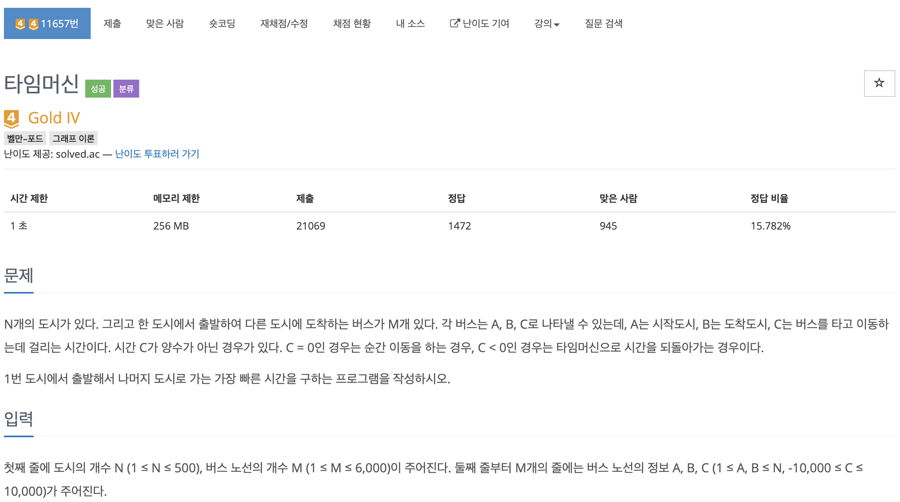
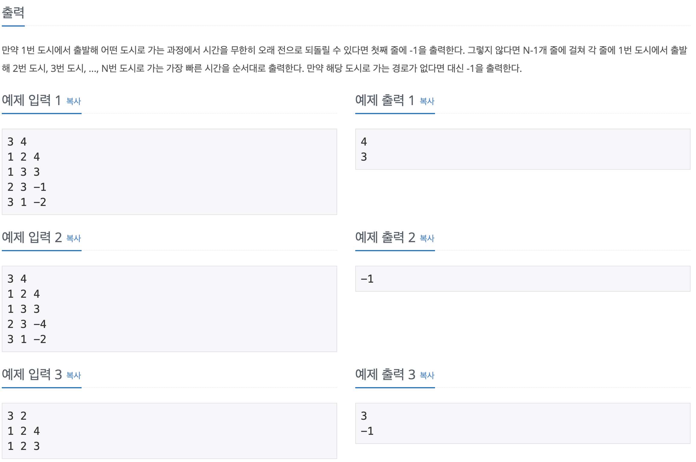

# 코딩 테스트 공부 7주차 - 백트레킹, 다익스트라, 이진 탐색, 벨만 포드

## 2110번. 공유기 설치 - 이진 탐색




이진 탐색을 이용해 의사결정을 하는 대표적인 문제이다.

공유기는 한 집에 한 개만 설치할 수 있으므로 두 공유기 사이의 거리의 최소 값은 1이다. 최대값은 최대 좌표를 가지고 있는 집의 좌표가 될 것이다. 따라서 **1 ~ 최대 좌표 사이의 값** 중에서 두 공유기 사이의 최대 거리를 찾으면 된다.

이진 탐색을 하기 전에 이진 탐색의 전제 조건은 정렬이 되어 있는 것이므로 sort 함수를 통하여 houses를 정렬해 준다.

검사를 맨 처음 시작할 때는 1을 left, houses 중 최대 좌표의 값을 right로 놓고 mid를 구하여 mid값을 두 공유기 사이의 최대 거리로 가정한 후 주어진 C개 이상의 집에 공유기를 설치할 수 있는지를 검사하면 된다. 

이것은 house_num_share_machine 함수로 검사를 하며 맨 첫 번째 집에 공유기를 일단 설치한 후 그 다음 번째 집의 좌표에서 공유기가 있는 집의 좌표를 뺀 후 그 값이 dist 값보다 크거나 같다면 해당 집에 공유기를 설치한 후 기준을 그 집으로 옮긴다. 이 때 공유기가 한 개 더 늘어난 것이므로 cnt를 +1 해준다. 모든 집에 대해 검사를 하고 나면 dist로 주어진 값을 두 공유기 사이의 거리로 하는 경우 설치할 수 있는 공유기의 갯수를 return하게 된다.

main 함수에서는 return 값을 받아 C 값과 비교하게 되고 만약 C값 보다 리턴 값이 크다면 현재 mid보다 작은 값은 전부 정답이 될 수 있으므로 더 이상 검사할 필요가 없다. 따라서 ```lt = mid + 1```하여 오른쪽을 같은 방법으로 검사해 나가면 된다.

```c++
#include <iostream>
#include <vector>
#include <algorithm>

using namespace std;

int N, C, tmp, mid, lt = 1, rt = -2147000000, result = 0;
vector<int> houses;

int house_num_share_machine(int dist) {
    int share_machine_pos = houses[0], cnt = 1;
    
    for (int i = 1; i < N; i ++) {
        if (houses[i] - share_machine_pos >= dist) {
            share_machine_pos = houses[i];
            cnt ++;
        }
    }
    
    return cnt;
}

int main() {
    ios::sync_with_stdio(false);
    cin.tie(0);
    cout.tie(0);
    
    cin >> N >> C;
    
    for (int i = 0; i < N; i ++) {
        cin >> tmp;
        houses.push_back(tmp);
        if (tmp > rt) rt = tmp;
    }
    
    sort(houses.begin(), houses.end());
    
    while(lt <= rt) {
        mid = (lt + rt) / 2;
        
        if (house_num_share_machine(mid) >= C) {
            lt = mid + 1;
            result = mid;
        } else {
            rt = mid - 1;
        }
    }
    
    cout << result << '\n';
    
    return 0;
}
```


## 3079번. 입국심사 - 이진탐색





앞서 풀었던 공유기 문제와 접근하는 방식은 똑같고, 확인하는 함수를 구현하는 것이 어려웠던 문제이다.

최소값은 1로 두었고, 최대값은 모든 사람이 가장 오래 걸리는 심사대에서 심사를 받는 경우로 가정하였다. 이 때, N * M을 계산해야 하는데 각각의 최대값이 10만, 10억이었으므로 **곱했을 때의 최대값은 int형의 표현 범위를 넘게** 되었다. 따라서 관련 변수를 생성할 때 ```long long```형으로 생성해야 했던 것이 중요했다.

다른 접근 방법은 이전 문제와 같고, mid값이 주어졌을 때 해당 시간동안 몇 명의 사람이 통과할 수 있는지 구하는 함수만 달랐다. 이 함수를 구현하는 것이 이 문제를 풀고 못 풀고를 결정하는 것인데, 도저히 생각해 봐도 알 수가 없어서 이 부분은 다른 코드를 참고하였다.

각 심사대는 병렬로 심사를 하기 때문에 심사대 각각을 for문으로 돌며 **주어진 시간을 각 심사대의 심사 시간으로 나눈 값을 전부 더한 값이 주어진 시간 안에서 통과할 수 있는 사람 수**이다. 여기서도 long long을 써주어야 해서 전체적으로 이 문제는 자료형과 수학적 사고를 요하는 문제였던 것 같다.

```c++
#include <iostream>
#include <vector>
#include <algorithm>

using namespace std;

int N;
vector<long long> test_times;

long long test_people_num(long long time) {
    long long cnt = 0;
    
    for (int i = 0; i < N; i ++) {
        cnt += time / test_times[i];
    }
    
    return cnt;
}

int main() {
    ios::sync_with_stdio(false);
    cin.tie(0);
    cout.tie(0);
    
    int M;
    long long lt = 1, rt, mid, res = 0, tmp;
    
    cin >> N >> M;
    
    for (int i = 0; i < N; i ++) {
        cin >> tmp;
        test_times.push_back(tmp);
    }
    
    sort(test_times.begin(), test_times.end());
    
    rt = test_times[N - 1] * M;
    
    while (lt <= rt) {
        mid = (lt + rt) / 2;
        
        if (test_people_num(mid) >= M) {
            rt = mid - 1;
            res = mid;
        } else {
            lt = mid + 1;
        }
    }
    
    cout << res << '\n';
    
    return 0;
}
```


## 1939번. 중량제한 - 이진 탐색





이전의 두 문제와 동일하게 이진탐색을 이용하여 풀 수 있던 문제였다.

lt값은 1, rt 값은 주어진 가중치 중 최대값으로 설정하였다. 처음에는 문제가 이해가 가지 않았는데 결국 주어진 출발지에서 목적지로 갈 수 있는 모든 경로를 통틀어서 옮길 수 있는 최대값을 구하는 문제이다. 이 때 만약 경로에서 ```1 90 100```의 가중치를 가진 엣지를 지난다고 하더라도 최대값은 1이다. 

이진 탐색의 접근 방법은 위 두 문제와 같으며 시작점에서 도착점으로 갈 수 있는지를 BFS를 사용하여 구해야 했다. 이전에 많이 풀어보았던 BFS 방식과 유사했으며 차이점이라면 갈 수 있는 다음 노드를 Queue에 넣을 때 주어진 weight보다 해당 노드로 가는 다리의 중량 제한이 커야 한다는 것이다.

체크 함수로 BFS를 사용한다는 것만 제외하면 이전의 두 문제와 같은 맥락이다. 다만 오랜만에 순수 BFS 문제를 보아서 익숙치가 않았다. 가끔씩 너무 어려운 문제만 푸는게 아니라 가벼운 문제도 풀어봐야겠다.

```c++
#include <iostream>
#include <vector>
#include <queue>
#include <cstring>

using namespace std;

int n, start, goal;
int chk[100001];
vector<pair<int, int> > nodes[100001];

bool possible(int weight) {
    queue<int> Q;
    Q.push(start);
    chk[start] = 1;
    
    while(!Q.empty()) {
        int now_node = Q.front();
        Q.pop();
        
        if (now_node == goal) return true;
        
        for (int i = 0; i < nodes[now_node].size(); i ++) {
            int next_node = nodes[now_node][i].first;
            int next_edge = nodes[now_node][i].second;
            
            if (next_edge >= weight && chk[next_node] == 0) {
                chk[next_node] = 1;
                Q.push(next_node);
            }
        }
    }
    
    return false;
}

int main() {
    ios::sync_with_stdio(false);
    cin.tie(0);
    cout.tie(0);
    
    int m, a, b, c, lt = 1, rt = 0, mid, res = 0;
    
    cin >> n >> m;
    
    for (int i = 0; i < m; i ++) {
        cin >> a >> b >> c;
        nodes[a].push_back({b, c});
        nodes[b].push_back({a, c});
        if (c > rt) rt = c;
    }
    
    cin >> start >> goal;
    
    while(lt <= rt) {
        memset(chk, 0, sizeof(chk));
        
        mid = (lt + rt) / 2;
        if (possible(mid)) {
            lt = mid + 1;
            res = mid;
        } else {
            rt = mid - 1;
        }
    }
    
    cout << res << '\n';
    
    return 0;
}
```


## 11657번. 타임머신 - 벨만 포드





가중치에 음수가 존재하여 벨만 포드를 이용해서 풀어야 했던 문제이다.

맨 처음에 dist를 INF로 초기화 하고 1번도시에서 출발하므로 dist[1]만 0으로 바꾸고 간선을 M - 1번 사용했을때 까지 1 ~ M - 1번 반복문을 통해 각 버스를 검사하면 풀 수 있던 문제이다.

관건은 그래프에 음의 사이클이 존재하면 아예 -1을 출력하고 한 노드에서 다른 노드로 갈 수 없으면 그 경우만 -1을 출력하는 것이었다. 음의 사이클을 검출하기 위해서는 N - 1 번 실행했을 때의 dist와 N번 실행했을 때의 dist를 비교하여 다르면 음의 사이클이 존재한다고 할 수 있다. 

dist값을 갱신 할 때 이전 값과의 대소 비교하기 전에 **해당 dist 값이 무한대가 아닐 때에만 갱신을 시도해야 하는 점**이 중요했다. 또한 dist 배열을 int로 선언 했을 때는 통과하지 못했는데 long long으로 선언한 후에는 통과할 수 있었다. 

질문 게시판을 보니 다음과 같은 경우에는 500 바퀴를 돌기 전에 음의 방향 오버플로우가 나기 때문이라는데 정확히 이해가 가지 않는다... 추가적으로 찾아보아야겠다.

```
1 --(-10000)--> 2 --(-10000)--> ... --(-10000)--> 500
^                                                  |
 \-------------------(-10000)---------------------/
```


```c++
#include <iostream>
#include <vector>
#include <climits>

using namespace std;

struct bus {
    int start, end, dist;
    bus(int a, int b, int c) {
        start = a;
        end = b;
        dist = c;
    }
};

int main() {
    ios::sync_with_stdio(false);
    cin.tie(0);
    cout.tie(0);
    
    int N, M, a, b, c;
    vector<bus> buses;
    
    cin >> N >> M;
    
    vector<long long> dist(N + 1, INT_MAX);

    for (int i = 0; i < M; i ++) {
        cin >> a >> b >> c;
        buses.push_back(bus(a, b, c));
    }
    
    dist[1] = 0;
    
    for (int i = 1; i < M; i ++) {
        for (int j = 0; j < buses.size(); j ++) {
            int now_start = buses[j].start;
            int now_end = buses[j].end;
            int now_dist = buses[j].dist;
            
            if (dist[now_start] != INT_MAX && now_dist + dist[now_start] < dist[now_end]) {
                dist[now_end] = dist[now_start] + now_dist;
            }
        }
    }
    
    for (int i = 0; i < buses.size(); i ++) {
        int a = buses[i].start;
        int b = buses[i].end;
        int c = buses[i].dist;
        if (dist[a] != INT_MAX && dist[a] + c < dist[b]) {
            cout << -1 << '\n';
            exit(0);
        }
    }
    
    for (int i = 2; i <= N; i ++) {
        if (dist[i] != INT_MAX) cout << dist[i] << '\n';
        else cout << -1 << '\n';
    }
    
    return 0;
}
```

