# 코딩 테스트 공부 8주차 - 혼합

## 1969번. DNA - 브루트 포스


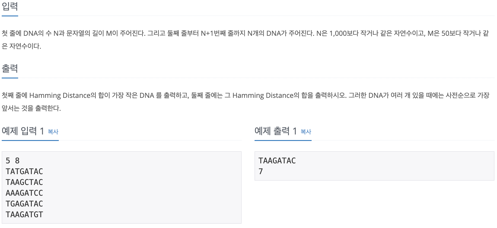

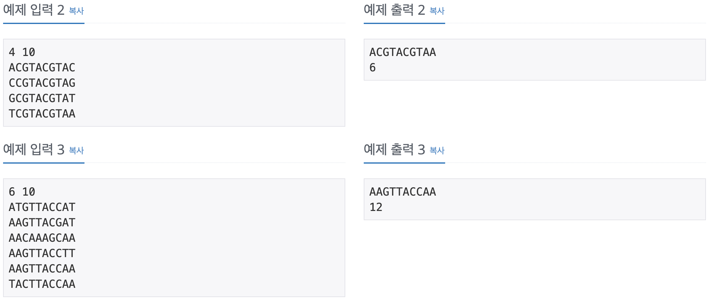

처음에 문제 이해를 잘못해서 푸는데 시간이 걸렸던 문제이다. 해밍 거리를 최소화 하기 위해 입력을 받을 때 이차원 배열 head_num을 선언하여 그 내부 값을 갱신하며 받았다. 원래대로라면 문자열의 길이 M만큼만 필요하겠지만 각 칸에 4개의 카운팅을 추가로 할 수 있도록 하였다. index는 0 ~ 3 사이이며 A C G T 순서로 갯수를 카운트 하였다. 예를 들어 예제 2번을 보면 4개의 각 DNA의 맨 첫 글자가 A, C, G, T가 한 개 씩 있으므로 ```head_num[0][0] = head_num[0][1] = head_num[0][2] = head_num[0][3] = 1```이 된다. 

위와 같이 head_num에 자리별로 A, C, G, T의 갯수를 저장한 후 M개(DNA 길이)만큼 반복문을 돌며 ```head_num[i][0] ~ head_num[i][3]``` 사이에서 최댓값을 갖는 index에 맞게 문자를 정답 배열인 result에 push해준다. 이 때 해밍 거리도 함께 구해주어야 하므로 전체 DNA 갯수에서 최댓값을 빼서 result_num에 더해준다. 

위 과정이 모두 종료되면 result와 result_num을 출력하여 정답을 구할 수 있다.

```c++
#include <iostream>
#include <string>
#include <vector>

using namespace std;

int main() {
    ios::sync_with_stdio(false);
    cin.tie(0);
    cout.tie(0);
    
    int N, M, result_num = 0;
    int head_num[51][4] = { 0 }; // A C G T
    string tmp, result;
    
    cin >> N >> M;
    for (int i = 0; i < N; i ++) {
        cin >> tmp;
        for (int j = 0; j < M; j ++) {
            switch(tmp[j]) {
                case 'T':
                    head_num[j][3] ++;
                    break;
                case 'A':
                    head_num[j][0] ++;
                    break;
                case 'C':
                    head_num[j][1] ++;
                    break;
                case 'G':
                    head_num[j][2] ++;
                    break;
            }
        }
    }
    
    for (int i = 0; i < M; i ++) {
        int tmp_max = 0;
        char tmp_char = ' ';
        for (int j = 0; j < 4; j ++) {
            if (head_num[i][j] > tmp_max) {
                tmp_max = head_num[i][j];
                if (j == 0) tmp_char = 'A';
                else if (j == 1) tmp_char = 'C';
                else if (j == 2) tmp_char = 'G';
                else tmp_char = 'T';
            }
        }
        result.push_back(tmp_char);
        result_num += (N - tmp_max);
    }
    
    cout << result << '\n' << result_num << '\n';
    
    return 0;
}
```


## 1431번. 시리얼 번호 - 정렬


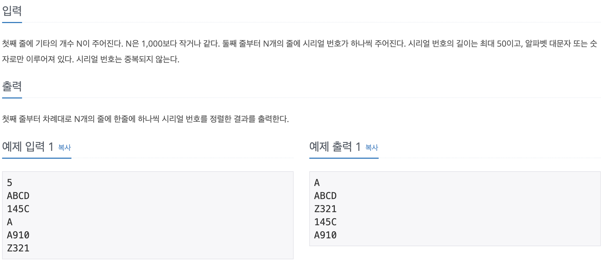

Sort 함수의 cmp를 직접 구현하여 풀 수 있는 문제였다. 처음에는 요즘 우선순위 큐를 활용한 문제를 너무 많이 풀다보니 우선순위 큐를 활용했는데 굳이 그럴 필요 없이 구조체를 만들고 vector에 전부 넣은 다음 sort로 정렬해주면 되는 문제였다.

정렬 기준으로는 길이, 모든 자리 수의 합, 숫자와 알파벳이 있으므로 size, sum, str를 갖는 guitar 구조체를 만들고 입력을 받을때마다 해당 값을 계산하여 vector에 넣어주었다(vector 이름은 Q). 이후 algorithm의 sort함수를 이용하여 정렬해 주었고, 이 때 정렬에 사용할 cmp 함수를 직접 구현하였다.

첫 번째로 문자열의 길이를 통해 정렬하고, 만약 같다면 미리 구해두었던 숫자들의 합으로 비교한다. 만약 그것도 같다면 두 문자열을 처음부터 순회하며 각 자릿수를 비교한 후 그 자릿수에 위치한 수가 다르다면 비교하여 그 대소를 정렬에 반영한다. 

어렵지는 않은 문제였지만 sort 함수를 오랜만에 사용해봐서 cmp 함수 구현할 때 많이 헷갈렸다. 너무 어려운 문제만 풀지 말고 이런 문제도 섞어가며 공부를 해야겠다.

```c++
#include <iostream>
#include <string>
#include <vector>
#include <algorithm>

using namespace std;

struct guitar {
    int size, sum;
    string str;
    guitar(int a, int b, string tmp) {
        size = a;
        sum = b;
        str = tmp;
    }
};

bool cmp (guitar a, guitar b) {
    if (a.size < b.size) return true;
    else if (a.size == b.size) {
        if (a.sum < b.sum) return true;
        else if (a.sum == b.sum) {
            for (int i = 0; i < a.size; i ++) {
                if (a.str[i] < b.str[i]) return true;
                else if (a.str[i] == b.str[i]) continue;
                else return false;
            }
            return false;
        }
        else return false;
    } else
        return false;
}

int main() {
    ios::sync_with_stdio(false);
    cin.tie(0);
    cout.tie(0);
    
    int N;
    string tmp;
    vector<guitar> Q;
    
    cin >> N;
    for (int i = 0; i < N; i ++) {
        cin >> tmp;
        int serial_size, serial_sum = 0;
        serial_size = int(tmp.size());
        for (int j = 0; j < serial_size; j ++) {
            if (tmp[j] - '0' >= 0 && tmp[j] - '0' <= 9) serial_sum += tmp[j] - '0';
        }
        Q.push_back(guitar(serial_size, serial_sum, tmp));
    }
    
    sort(Q.begin(), Q.end(), cmp);
    
    for (int i = 0; i < N; i ++) {
        cout << Q[i].str << '\n';
    }
    
    return 0;
}
```


## 1325번. 효율적인 해킹 - BFS

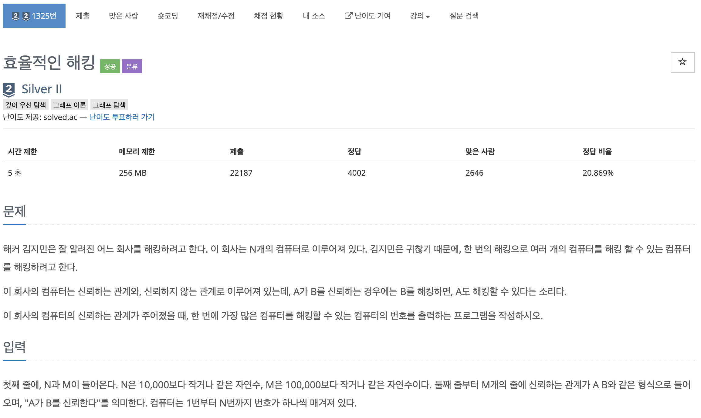

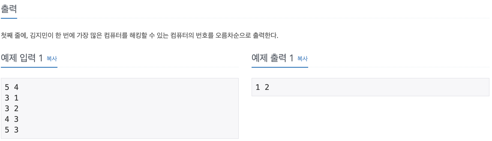

전형적인 BFS 문제라고 생각하여 생각없이 접근했다가 원하는대로 결과가 나오지 않아 다시 문제를 읽고 풀어보았다.

일반 BFS와 다른 것은 어떤 노드에서 다른 노드로 이어지는 점이 있을 때, 시작 노드가 아닌 도착 노드가 몇 번 나타나는지를 카운팅 하는것이 중요했다. 총 노드의 수는 10,000 이하이므로 모든 노드에 대해 검사할 수 있다고 생각하며 1부터 마지막 노드까지를 반복문을 통해 전부 시작점으로 하여 어떤 노드와 연결되는지를 검사하였다.

예를 들어 4번 노드가 Q에 들어가서 시작하면 먼저 4를 Q에서 빼고 4가 믿고 있는 모든 노드를 검사한다. 예제에서는 3번 노드만 믿으므로 3번 노드의 chk가 0이면 해당 값을 1로 바꾸고 possible_num[3]의 값을 + 1 해준다. 이는 3번을 믿는 사람이 1명 추가되었다는 의미이다.

다음으로는 Q에서 3번을 빼고 3번이 믿는 1, 2에 대해 검사한다. 둘 다 chk가 0이므로 chk를 1로 바꾸고 possible_num[1], possible_num[2]를 + 1해주고 1과 2를 Q에 넣는다. 1과 2는 믿는 사람이 없으므로 반복문이 종료되고 5번 노드를 시작으로 하는 경우의 수를 검사한다.

위와 같은 과정을 통해 몇 번 노드를 몇 개의 노드가 믿는지를 카운팅할 수 있으며 최대 갯수를 미리 구해놓은 뒤, 1부터 반복문을 돌아 그 값이 최대 갯수와 같으면 index와 그 값을 출력해서 답을 구할 수 있다.

```c++
#include <iostream>
#include <vector>
#include <queue>

using namespace std;

int main() {
    ios::sync_with_stdio(false);
    cin.tie(0);
    cout.tie(0);
    
    int N, M, a, b, max_num = 0;
    
    cin >> N >> M;
    
    vector<int> network[N + 1];
    vector<int> possible_num(N + 1, 0);
    
    for (int i = 0; i < M; i ++) {
        cin >> a >> b;
        network[a].push_back(b);
    }
    
    for (int i = 1; i <= N; i ++) {
        vector<int> chk(N + 1, 0);
        queue<int> Q;
        Q.push(i);
        chk[i] = 1;
        
        while(!Q.empty()) {
            int believer = Q.front();
            Q.pop();
            
            for (int j = 0; j < network[believer].size(); j ++) {
                int target = network[believer][j];
                if (chk[target] == 0) {
                    chk[target] = 1;
                    possible_num[target] ++;
                    if (possible_num[target] > max_num) max_num = possible_num[target];
                    Q.push(target);
                }
            }
        }
    }
    
    for (int i = 1; i <= N; i ++) {
        if (possible_num[i] == max_num) cout << i << ' ';
    }
    
    return 0;
}
```


## 1915번. 가장 큰 정사각형 - DP

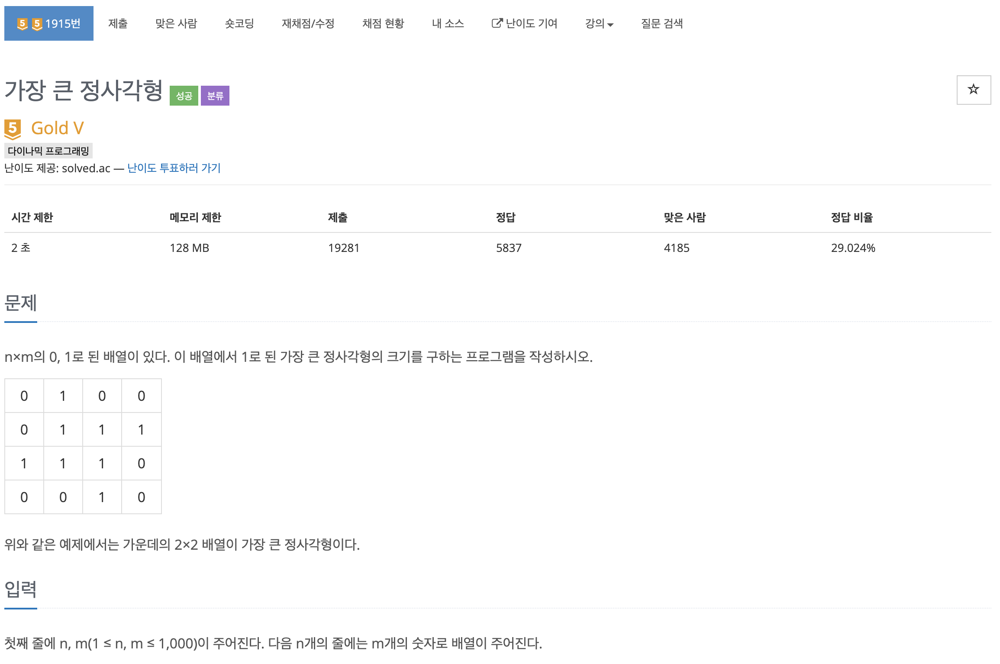

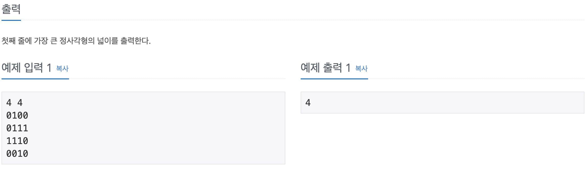

dp를 이용해서 풀 수 있는 문제였다. ```dp[i][j]``` 값을 i, j 좌표를 오른쪽 아래로 해서 만들 수 있는 정사각형의 갯수로 생각해서 dp를 구하고 그 최댓값의 제곱을 출력하면 답이 되는 문제였다.

먼저 1행과 1열의 값은 무조건 그 값이 0이면 0, 1이면 1이기 때문에 dp를 초기화 해준다. 이후 이중 반복문을 돌며 ```map[i][j]```가 1이라면 해당 수를 기준으로 왼쪽, 위, 왼쪽 위 대각선 3 개의 값 중 최소값을 구해서 그 값에 + 1한 값을 ```dp[i][j]``` 에 저장한다. 

위 과정을 통해 dp 배열을 채우고 마지막에 최댓값의 제곱을 출력하면 답을 구할 수 있다. 주의해야 했던 것은 max_val을 INT_MIN으로 초기화 하고 시작했는데 배열이 전부 0으로 들어오게 되면 max_val을 갱신하지 않아 틀린 값이 나오게 됐다. 따라서 ```dp[0][0]``` 값으로 초기화 해 주었고 통과할 수 있었다.

```c++
#include <iostream>
#include <string>
#include <algorithm>
#include <cmath>

using namespace std;

int main() {
    ios::sync_with_stdio(false);
    cin.tie(0);
    cout.tie(0);
    
    int n, m, map[1000][1000] = { 0 }, dp[1000][1000] = { 0 }, max_val = -2147000000;
    string tmp;
    
    cin >> n >> m;
    
    for (int i = 0; i < n; i ++) {
        cin >> tmp;
        for (int j = 0; j < m; j ++) {
            map[i][j] = tmp[j] - '0';
        }
    }
    
    for (int i = 0; i < n; i ++) {
        if (map[i][0] == 1) {
            dp[i][0] = 1;
            max_val = max(dp[i][0], max_val);
        }
    }
    
    for (int i = 0; i < m; i ++) {
        if (map[0][i] == 1) {
            dp[0][i] = 1;
            max_val = max(dp[0][i], max_val);
        }
    }
    
    max_val = dp[0][0]; // 이거 안해줘서 계속 틀림
    
    for (int i = 1; i < n; i ++) {
        for (int j = 1; j < m; j ++) {
            if (map[i][j] == 1) {
                int min_val = min({dp[i - 1][j - 1], dp[i - 1][j], dp[i][j - 1]});
                dp[i][j] = min_val + 1;
                if (dp[i][j] > max_val) max_val = dp[i][j];
            }
        }
    }
    
    cout << pow(max_val, 2) << '\n';
    
    return 0;
}
```

Tip) min 함수를 사용할 때, 중괄호 안에 여러 수를 넣으면 두 개 이상의 경우에서 최솟값을 찾을 수 있다.


## 2352번. 반도체 설계 - LIS

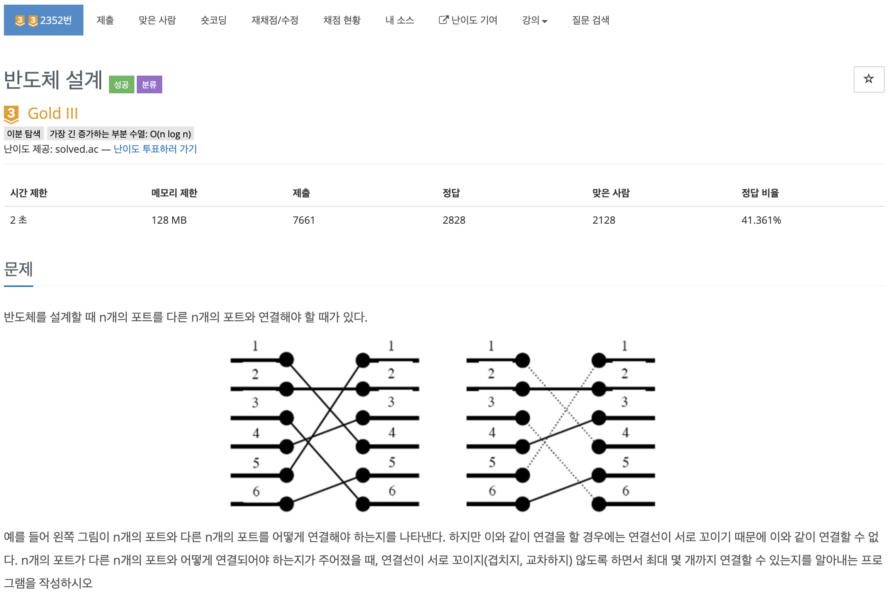

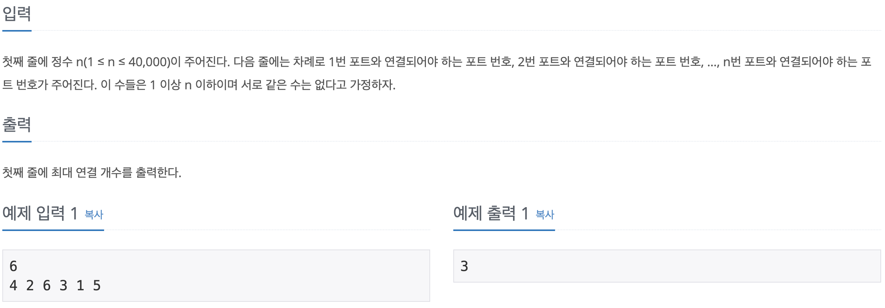

예전에 공부했던 LIS를 활용해서 풀면 되는 문제였다. 주어진 수열 중에서 수를 고를 때 뒤로 갈수록 증가하는 수만 골라야 선이 교차하지 않게 된다. 한 개라도 이전에 골랐던 수보다 작은 수를 고르게 되면 교차하게 되므로 증가하는 최대 부분수열을 구하는 LIS 문제라는 것을 알 수 있었다.

처음에는 O(n^2) 의 풀이법으로 풀었으나 시간 초과가 나서 O(nlogn)의 풀이로 풀었다. 풀어본 지 오래 되어 실수를 했는데 for문을 돌며 각 입력값에 대해 검사를 할 때 현재 값을 정답 배열의 맨 뒤와 비교해야 하는데 바로 앞의 입력값과 비교하여 한 번 틀렸다. 한 번 풀어보았던 문제라도 안 보고 알고리즘을 구현해 보는 연습을 해야겠다.

```c++
#include <iostream>
#include <vector>
#include <algorithm>

using namespace std;

int main() {
    ios::sync_with_stdio(false);
    cin.tie(0);
    cout.tie(0);
    
    int n;

    cin >> n;
    vector<int> ports(n);
    vector<int> answer;
    
    for (int i = 0; i < n; i ++) {
        cin >> ports[i];
    }
    
    answer.push_back(ports[0]);
    
    for (int i = 1; i < n; i ++) {
        if (ports[i] > answer.back()) answer.push_back(ports[i]);
        else {
            int l_bound = int(lower_bound(answer.begin(), answer.end(), ports[i]) - answer.begin());
            answer[l_bound] = ports[i];
        }
    }
    
    cout << answer.size() << '\n';
    
    return 0;
}
```


## 12100번. 2048(Easy) - 시뮬레이션, 브루트포스

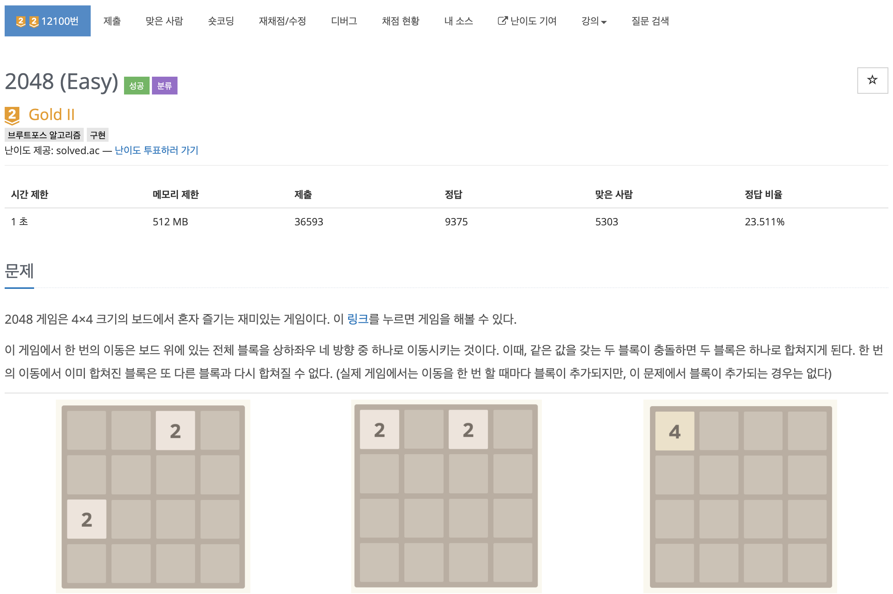

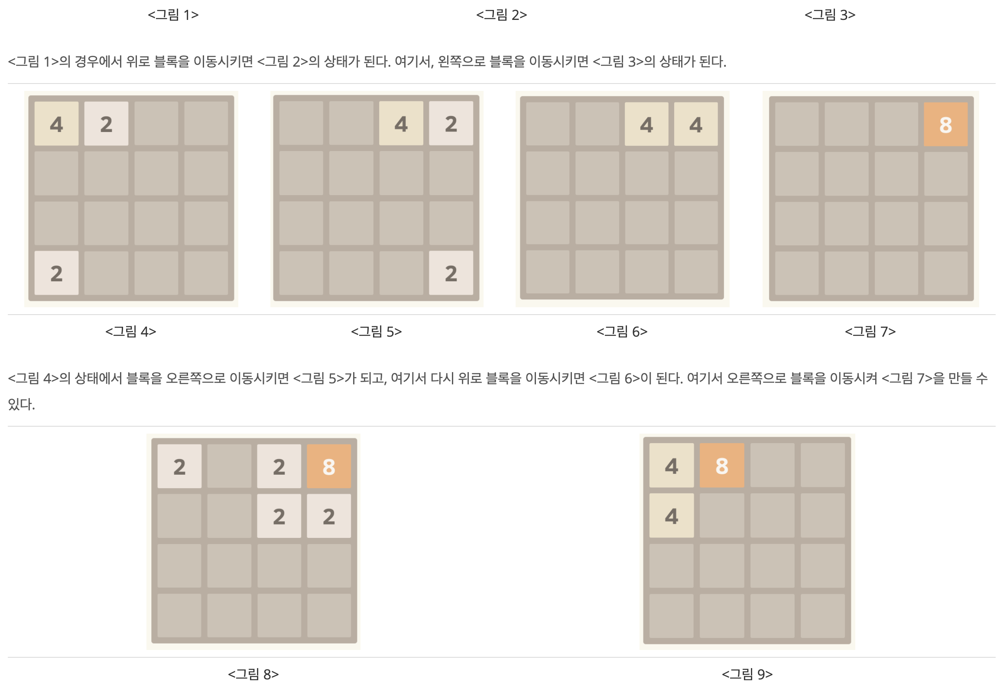

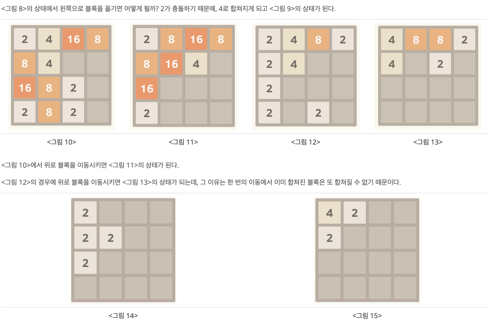

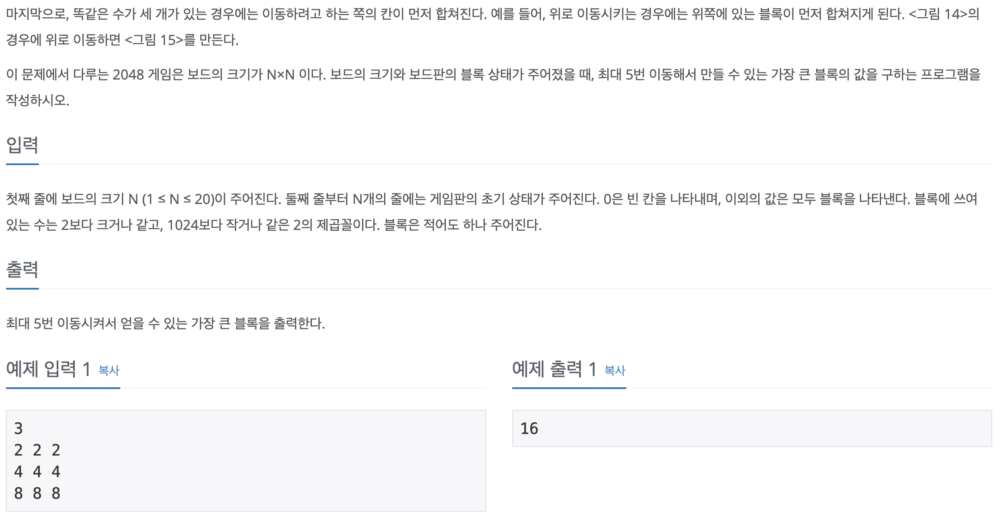

예전에 많이 해보았던 게임이라 예외 상황을 생각하는데 있어서 용이했던 문제이다. 우선 위, 아래, 왼쪽, 오른쪽으로 이동하는 경우를 함수로 모두 구현한 후, DFS를 통해 5번 이동하는 모든 경우의 수를 구했다. 

각 경우에 수에 대해 미리 구현한 함수를 통해 보드를 수정하고 그 때의 최댓값을 구해서 계속해서 갱신해 나가는 방식으로 구현했다. 이동하는 4개의 함수가 비슷한 부분이 많은데 깔끔하게 정리하는 것이 너무 어려워서 그냥 통으로 구현했다. 다른 깔끔한 방법이 있는지 한 번 찾아봐야겠다.

또한 각 이동 때 현재 칸이 0이면 그 다음칸부터 0이 아닌 수를 찾아보고 만약 있다면 그 칸의 다음칸부터 검사하며 0이 아닌 수가 처음으로 나왔을 때, 그 수가 같다면 더해주고 아니라면 원래의 수를 현재 칸에 넣어주어야 하는데, continue와 break 등의 세밀한 사용이 되지 않아 처음 구현했을 때에는 답을 구하지 못했다. 반복문을 보다 세밀하게 사용하는 방법을 연습해야겠다.

```c++
#include <iostream>
#include <string>

using namespace std;

int N, map[21][21], store_map[21][21], max_val = -2147000000;
char dir[4] = {'u', 'd', 'r', 'l'};

void up() {
    for (int i = 0; i < N; i ++) {
        for (int j = 0; j < N; j ++) {
            if (map[i][j] == 0) {
                for (int k = i + 1; k < N; k ++) {
                    if (map[k][j] != 0) {
                        bool flag = false;
                        for (int m = k + 1; m < N; m ++) {
                            if (map[m][j] == 0) continue;
                            else {
                                if (map[m][j] == map[k][j]) {
                                    map[i][j] = map[k][j] * 2;
                                    map[k][j] = 0;
                                    map[m][j] = 0;
                                    flag = true;
                                    break;
                                } else break;
                            }
                        }
                        if (flag) break;
                        map[i][j] = map[k][j];
                        map[k][j] = 0;
                        break;
                    }
                }
            } else {
                for (int k = i + 1; k < N; k ++) {
                    if (map[k][j] == 0) continue;
                    else {
                        if (map[k][j] == map[i][j]) {
                            map[i][j] *= 2;
                            map[k][j] = 0;
                            break;
                        } else break;
                    }
                }
            }
        }
    }
}

void down() {
    for (int i = N - 1; i >= 0; i --) {
        for (int j = N - 1; j >= 0; j --) {
            if (map[i][j] == 0) {
                for (int k = i - 1; k >= 0; k --) {
                    if (map[k][j] != 0) {
                        bool flag = false;
                        for (int m = k - 1; m >= 0; m --) {
                            if (map[m][j] == 0) continue;
                            else {
                                if (map[m][j] == map[k][j]) {
                                    map[i][j] = map[k][j] * 2;
                                    map[k][j] = 0;
                                    map[m][j] = 0;
                                    flag = true;
                                    break;
                                } else break;
                            }
                        }
                        if (flag) break;
                        map[i][j] = map[k][j];
                        map[k][j] = 0;
                        break;
                    }
                }
            } else {
                for (int k = i - 1; k >= 0; k --) {
                    if (map[k][j] == 0) continue;
                    else {
                        if (map[k][j] == map[i][j]) {
                            map[i][j] *= 2;
                            map[k][j] = 0;
                            break;
                        } else break;
                    }
                }
            }
        }
    }
}

void right() {
    for (int i = N - 1; i >= 0; i --) {
        for (int j = N - 1; j >= 0; j --) {
            if (map[i][j] == 0) {
                for (int k = j - 1; k >= 0; k --) {
                    if (map[i][k] != 0) {
                        bool flag = false;
                        for (int m = k - 1; m >= 0; m --) {
                            if (map[i][m] == 0) continue;
                            else {
                                if (map[i][m] == map[i][k]) {
                                    map[i][j] = map[i][k] * 2;
                                    map[i][k] = 0;
                                    map[i][m] = 0;
                                    flag = true;
                                    break;
                                } else break;
                            }
                        }
                        if (flag) break;
                        map[i][j] = map[i][k];
                        map[i][k] = 0;
                        break;
                    }
                }
            } else {
                for (int k = j - 1; k >= 0; k --) {
                    if (map[i][k] == 0) continue;
                    else {
                        if (map[i][k] == map[i][j]) {
                            map[i][j] *= 2;
                            map[i][k] = 0;
                            break;
                        } else break;
                    }
                }
            }
        }
    }
}

void left () {
    for (int i = 0; i < N; i ++) {
        for (int j = 0; j < N; j ++) {
            if (map[i][j] == 0) {
                for (int k = j + 1; k < N; k ++) {
                    if (map[i][k] != 0) {
                        bool flag = false;
                        for (int m = k + 1; m < N; m ++) {
                            if (map[i][m] == 0) continue;
                            else {
                                if (map[i][m] == map[i][k]) {
                                    map[i][j] = map[i][k] * 2;
                                    map[i][k] = 0;
                                    map[i][m] = 0;
                                    flag = true;
                                    break;
                                } else break;
                            }
                        }
                        if (flag) break;
                        map[i][j] = map[i][k];
                        map[i][k] = 0;
                        break;
                    }
                }
            } else {
                for (int k = j + 1; k < N; k ++) {
                    if (map[i][k] == 0) continue;
                    else {
                        if (map[i][k] == map[i][j]) {
                            map[i][j] *= 2;
                            map[i][k] = 0;
                            break;
                        }
                        else break;
                    }
                }
            }
        }
    }
}

void DFS(int Level, string str) {
    if (Level == 5) {
        for (int i = 0; i < 5; i ++) {
            switch(str[i]) {
                case 'u':
                    up();
                    break;
                case 'd':
                    down();
                    break;
                case 'r':
                    right();
                    break;
                case 'l':
                    left();
                    break;
            }
        }
        
        for (int i = 0; i < N; i ++) {
            for (int j = 0; j < N; j ++) {
                if (map[i][j] > max_val) {
                    max_val = map[i][j];
                }
            }
        }
        
        for (int i = 0; i < N; i ++) {
            for (int j = 0; j < N; j ++) {
                map[i][j] = store_map[i][j];
            }
        }
    
        return ;
    }
    
    for (int i = 0; i < 4; i ++) {
        str.push_back(dir[i]);
        DFS(Level + 1, str);
        str.pop_back();
    }
}

int main() {
    ios::sync_with_stdio(false);
    cin.tie(0);
    cout.tie(0);
    
    cin >> N;
    for (int i = 0; i < N; i ++) {
        for (int j = 0; j < N; j ++) {
            cin >> map[i][j];
            store_map[i][j] = map[i][j];
        }
    }
    
    DFS(0, "");
    
    cout << max_val << '\n';
    return 0;
}
```


## 1194번. 달이 차오른다, 가자 - BFS


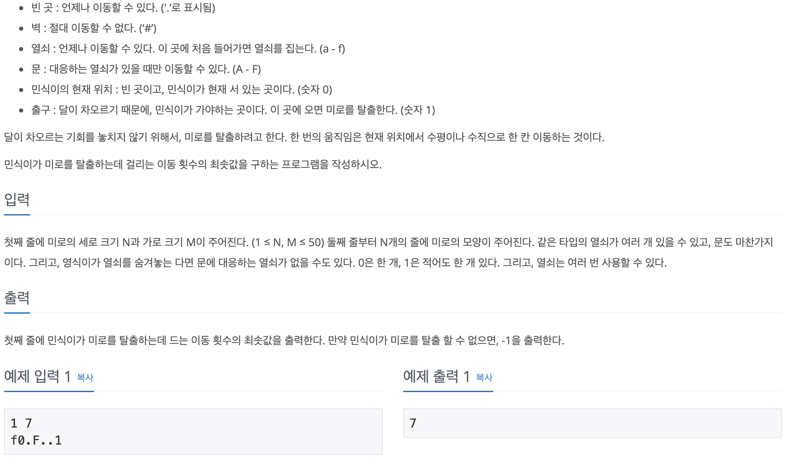

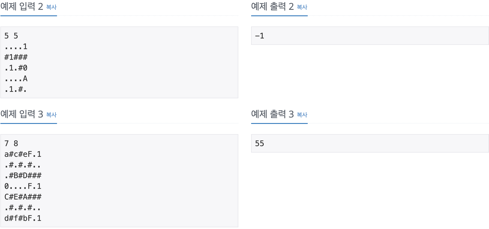


```c++
#include <iostream>
#include <queue>
#include <vector>

using namespace std;

struct room {
    int x, y, cnt, key;
    room (int a, int b, int c, int d) {
        x = a;
        y = b;
        cnt = c;
        key = d;
    }
};

int main() {
    ios::sync_with_stdio(false);
    cin.tie(0);
    cout.tie(0);
    
    int N, M, result = -1, chk[51][51][64] = { 0 };
    int dx[4] = {-1, 0, 1, 0};
    int dy[4] = {0, 1, 0, -1};
    char map[51][51];
    queue<room> Q;
    
    cin >> N >> M;
    
    for (int i = 0; i < N; i ++) {
        for (int j = 0; j < M; j ++) {
            cin >> map[i][j];
            if (map[i][j] == '0') {
                Q.push(room(i, j, 0, 0));
                chk[i][j][0] = 1;
            }
        }
    }
    
    while(!Q.empty()) {
        room now_room = room(Q.front().x, Q.front().y, Q.front().cnt, Q.front().key);
        Q.pop();
        
        if (map[now_room.x][now_room.y] == '1') {
            result = now_room.cnt;
            break;
        }
        
        for (int i = 0; i < 4; i ++) {
            int nx = now_room.x + dx[i];
            int ny = now_room.y + dy[i];
            
            if (nx < 0 || ny < 0 || nx >= N || ny >= M || chk[nx][ny][now_room.key] == 1 || map[nx][ny] == '#') continue;
            
            if (map[nx][ny] == '.' || map[nx][ny] == '0' || map[nx][ny] == '1') {
                chk[nx][ny][now_room.key] = 1;
                Q.push(room(nx, ny, now_room.cnt + 1, now_room.key));
            } else if (map[nx][ny] >= 'a' && map[nx][ny] <= 'f') {
                int n_key = now_room.key | (1 << (int(map[nx][ny]) - 97));
                if (chk[nx][ny][n_key] == 0) {
                    chk[nx][ny][now_room.key] = 1;
                    chk[nx][ny][n_key] = 1;
                    Q.push(room(nx, ny, now_room.cnt + 1, n_key));
                }
            } else if (map[nx][ny] >= 'A' && map[nx][ny] <= 'F') {
                if (now_room.key & 1 << (int(map[nx][ny]) - 65)) {
                    chk[nx][ny][now_room.key] = 1;
                    Q.push(room(nx, ny, now_room.cnt + 1, now_room.key));
                }
            }
        }
    }
    
    cout << result << '\n';
     
    return 0;
}
```

