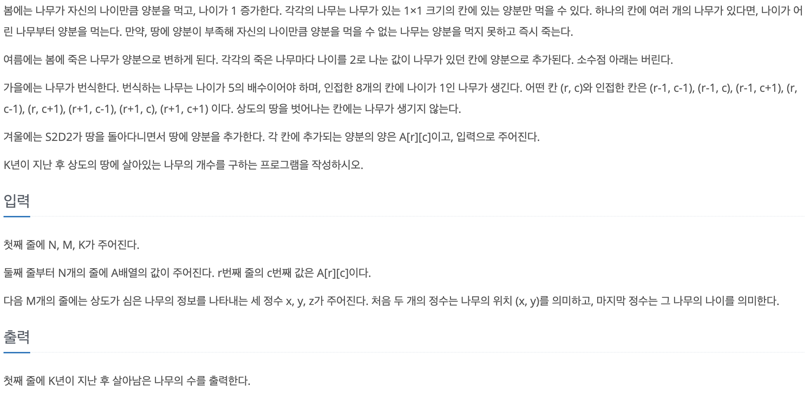

# 코딩 테스트 공부 9주차 - 혼합


## 14501번. 퇴사 - DP


DP 를 이용하여 풀 수 있었던 문제이다.

처음에는 앞에서부터 DP를 활용하려 했으나 따져야 할 조건이 너무 많아서 뒤에서부터 앞으로 DP를 채워나가도록 했다. 제일 먼저 검사해야할 것은 현재 날짜에서 할 수 있는 일을 했을 때, 전체 일수 N을 넘는가이다. 이럴 경우 그 일을 할 수 없기 때문에 바로 앞의 dp 값으로 dp를 채워준다.

오늘의 일을 하더라도 전체 일수 N을 넘지 않는다면 여기서도 두 가지의 경우 중 하나를 골라야 한다. 오늘 주어진 일을 하는 것과 오늘 주어진 일을 하지 않는 것, 두 가지 중에서 큰 값을 dp에 저장해 나가며 dp 배열을 채운다.

결국 최대 이익은 dp[1]에 저장되어 있을 것이므로 dp[1]를 출력하여 정답을 구한다.

```c++
#include <iostream>
#include <vector>

using namespace std;

int max (int a, int b) {
    return a > b ? a : b;
}

int main() {
    ios::sync_with_stdio(false);
    cin.tie(0);
    cout.tie(0);
    
    int N, a, b, dp[100] = { 0 };
    vector<pair<int, int> > counsel(100);
    
    cin >> N;
    
    for (int i = 1; i <= N; i ++) {
        cin >> a >> b;
        counsel[i] = {a, b};
    }
    
    for (int i = N; i > 0; i --) {
        if (i + counsel[i].first > N + 1)
            dp[i] = dp[i + 1];
        else {
            dp[i] = max(dp[i + 1], (counsel[i].second + dp[i + counsel[i].first]));
        }
    }
    
    cout << dp[1] << '\n';
    
    return 0;
}
```


## 2343번. 기타 레슨 - 이분 탐색


전형적인 이분탐색 문제였다. 

우선 최솟값과 최대값을 구하는 것이 중요했다. 최솟값의 경우 주어진 노래의 길이 중에서 최대값 부터 시작해야했다. 그렇지 않으면 블루레이가 어느 한 노래를 담지 못하는 경우가 생기는 반례가 생기므로 통과하지 못한다. 이분 탐색의 최대값은 모든 노래의 길이의 합으로 하여 이분 탐색을 하였다.

(최소 + 최대) / 2를 하여 mid를 구하고 해당 값이 조건을 만족하는지를 dvd_num 함수를 통해 검사하였다. 이 함수는 dvd의 크기가 주어지면 모든 노래를 담기 위해서 해당 크기의 dvd가 몇 개 필요한지를 return하는 함수이다. 이 때 반환된 값이 주어진 M보다 작으면 조건을 만족하는 경우이기 때문에 좀 더 작은 경우의 값을 찾기 위해 ```rt = mid - 1```로 범위를 줄여 탐색해 나간다. 그 반대의 경우에는 dvd 크기를 좀 더 키워야 하기 때문에 ```lft = mid + 1```로 범위를 조절하여 답을 구한다.

```c++
#include <iostream>
#include <vector>

using namespace std;

int N, M, tmp, lft, rt, sum = 0, mid = 0, result, max_len = -2147000000;
vector<int> lessons;

int dvd_num(int size) {
    int cnt = 1, sum = 0;
    
    for (int i = 0; i < N; i ++ ) {
        if (sum + lessons[i] > size) {
            cnt ++;
            sum = lessons[i];
        } else {
            sum += lessons[i];
        }
    }
    
    return cnt;
}

int main() {
    ios::sync_with_stdio(false);
    cin.tie(0);
    cout.tie(0);
    
    cin >> N >> M;
    for (int i = 0; i < N; i ++) {
        cin >> tmp;
        lessons.push_back(tmp);
        if (tmp > max_len) max_len = tmp;
        sum += tmp;
    }
    
    lft = max_len;
    rt = sum;
        
    while(lft <= rt) {
        mid = (lft + rt) / 2;
        
        if (dvd_num(mid) <= M) {
            result = mid;
            rt = mid - 1;
        } else {
            lft = mid + 1;
        }
    }
    
    cout << result << '\n';
    
    return 0;
}
```


## 11052번. 가장 긴 바이토닉 부분 수열 - LIS


이전에 많이 풀어 보았던 LIS를 응용하는 문제였다. 

시간복잡도 O(nlogn)인 방식은 전체 수열에 대해 적용하는 방식이므로 주어진 수열의 부분 수열을 계속해서 구해나가면서 그 길이를 구해야 했다. 따라서 O(n^2)인 방식을 사용하였다. 주어진 수열의 크기의 최댓값이 1,000이기 때문에 시간복잡도를 초과하지는 않을 것 같아서 풀이를 진행하였다.

풀이 방법은 단순하게 접근하였다. 순방향의 LIS의 크기를 저장할 dp_l, 역방향의 LIS 크기를 저장할 dp_r을 생성하여 각각 값을 채워나간다(LIS의 풀이는 algoLecture 카테고리의 LIS에도 잘 나와있다). 이후 두 dp의 값을 합쳐가면서 답을 구한다. 이 때, 해당 위치의 값은 두 번 더해졌으므로 두 dp 값의 합에서 1을 뺀 값이 답이 된다.

```c++
#include <iostream>

using namespace std;

int main() {
    ios::sync_with_stdio(false);
    cin.tie(0);
    cout.tie(0);
    
    int N, result = -2147000000;
    int arr[1000], dp_l[1000], dp_r[1000];
    
    cin >> N;
    
    for (int i = 0; i < N; i ++) {
        cin >> arr[i];
    }
    
    dp_l[0] = 1;
    for (int i = 1; i < N; i ++) {
        int max_dp = 0;
        for (int j = 0; j < i; j ++) {
            if (arr[j] < arr[i])
                if (dp_l[j] > max_dp) max_dp = dp_l[j];
        }
        dp_l[i] = max_dp + 1;
    }
    
    dp_r[N - 1] = 1;
    for (int i = N - 2; i >= 0; i --) {
        int max_dp = 0;
        for (int j = N - 1; j > i; j --) {
            if (arr[j] < arr[i])
                if (dp_r[j] > max_dp) max_dp = dp_r[j];
        }
        dp_r[i] = max_dp + 1;
    }
    
    for (int i = 0; i < N; i ++) {
        if (dp_r[i] + dp_l[i] > result)
            result = dp_r[i] + dp_l[i];
    }
    
    cout << result - 1 << '\n';
    
    return 0;
}
```


## 16235번. 나무 재테크 - 시뮬레이션





문제에 주어진대로 구현하면 되는 시뮬레이션 문제였다. 평소 시뮬레이션 문제를 가장 어려워 하는데 그래도 다른 문제들보다는 쉬운 편에 속하는 문제였다.

각 격자에 있는 나무들을 어떻게 처리할지 고민햇었는데 2차원 배열을 생성하여 push_back으로 각 나무들을 넣어주었다. 다른 부분을 어렵지 않았지만 합쳐서 구현한 봄, 여름 부분이 조금 골치 아팠다. 나무를 정렬해서 어린 나이의 나무부터 양분을 주는 것 까지는 괜찮았는데 그보다 나이가 많은 죽을 나무들을 제거하는 것을 생각하는데 시간이 걸렸다. 결국 tmp 배열을 만들어 죽일 나무들을 저장하고 erase 함수를 사용하여 나무들을 제거해 주었다. 

최종적으로 trees 배열을 돌며 각 칸의 사이즈를 전부 더해서 정답을 구했다.

```c++
#include <iostream>
#include <vector>
#include <algorithm>

using namespace std;

int main() {
    ios::sync_with_stdio(false);
    cin.tie(0);
    cout.tie(0);
    
    int N, M, K, A[11][11], map[11][11], a, b, c, year = 0, result = 0;
    int dx[8] = {-1, -1, -1, 0, 0, 1, 1, 1};
    int dy[8] = {-1, 0, 1, -1, 1, -1, 0, 1};
    vector<int> trees[11][11];
    cin >> N >> M >> K;
    
    for (int i = 1; i <= N; i ++) {
        for (int j = 1; j <= N; j ++) {
            map[i][j] = 5;
        }
    }
    
    for (int i = 1; i <= N; i ++) {
        for (int j = 1; j <= N; j ++) {
            cin >> A[i][j];
        }
    }
    
    for (int i = 0; i < M; i ++) {
        cin >> a >> b >> c;
        trees[a][b].push_back(c);
    }
    
    while (year < K) {
        for (int i = 1; i <= N; i ++) { // spring, summer
            for (int j = 1; j <= N; j ++) {
                
                vector<int> tmp[11][11];
                int erase_start = 0, cnt = 0;
                
                sort(trees[i][j].begin(), trees[i][j].end());
                
                for (int k = 0; k < trees[i][j].size(); k ++) {
                    if (trees[i][j][k] <= map[i][j]) {
                        map[i][j] -= trees[i][j][k];
                        trees[i][j][k] += 1;
                    } else {
                        erase_start = k;
                        for (int l = k; l < trees[i][j].size(); l ++) {
                            tmp[i][j].push_back(trees[i][j][l]);
                            cnt ++;
                        }
                        break;
                    }
                }
                if (tmp[i][j].size() > 0) {
                    for (int n = 0; n < tmp[i][j].size(); n ++) {
                        map[i][j] += (tmp[i][j][n] / 2);
                    }
                    trees[i][j].erase(trees[i][j].begin() + erase_start, trees[i][j].begin() + erase_start + cnt);
                }
            }
        }
        
        for (int i = 1; i <= N; i ++) { // fall
            for (int j = 1; j <= N; j ++) {
                for (int k = 0; k < trees[i][j].size(); k ++) {
                    if (trees[i][j][k] % 5 == 0) {
                        
                        for (int m = 0; m < 8; m ++) {
                            int nx = i + dx[m];
                            int ny = j + dy[m];
                            
                            if (nx < 1 || ny < 1 || nx > N || ny > N) continue;
                            
                            trees[nx][ny].push_back(1);
                        }
                    }
                }
            }
        }
        
        for (int i = 1; i <= N; i ++) { // winter
            for (int j = 1; j <= N; j ++) {
                map[i][j] += A[i][j];
            }
        }
        
        year ++;
    }
    
    for (int i = 1; i <= N; i ++) {
        for (int j = 1; j <= N; j ++) {
            result += trees[i][j].size();
        }
    }
    
    cout << result << '\n';
    
    return 0;
}
```

- vector.erase: 벡터의 특정 원소를 삭제하고 벡터의 크기를 줄인다.
  - vector.erase(index): index에 해당하는 위치의 값을 지우고 벡터의 크기를 줄인다. index에는 vector.begin() + idx의 형태가 들어갈 수 있다.
  - vector.erase(idx_start, idx_end) : idx_start에 해당하는 원소 포함, idx_end의 바로 앞 원소까지를 지운다. 


## 9935번. 문자열 폭발 - 문자열 컨트롤


인덱스를 조정하여 풀 수 있던 문제였다. 처음에는 stack도 사용해 보고 일반 시뮬레이션처럼도 구현해 보았지만 해결이 되지 않아 풀이를 보게 되었다.

문자열의 최대 길이는 1000000이므로 해당 크기의 배열 result를 만들고 주어진 문자열의 길이만큼 반복문을 돌며 각 문자에 대해 검사한다. 폭탄 문자와 일치하는 것을 처음부터 검사하게되면 복잡하므로 폭탄 문자의 맨 마지막과 일치할 경우에만 폭탄 문자의 길이만큼 그 앞의 문자를 검사한다. 만약 그 앞의 문자열이 폭탄 문자열과 같다면 idx를 폭탄 문자열의 길이만큼 앞으로 이동시켜준다. 

만약 주어진 문자열이 모두 폭발하였다면 idx가 0일 것이므로 FRULA를 출력하고 아니라면 0부터 idx까지 result 문자열을 출력한다.

```c++
#include <iostream>
#include <string>

using namespace std;

const int MAX = 1000001;
string s, bomb;
char result[MAX];

int main(void) {
    
    ios_base::sync_with_stdio(0);
    cin.tie(0);
    
    cin >> s >> bomb;
    cin.ignore();
    
    int idx = 0;
    
    for (int i = 0; i < s.length(); i++) {
        result[idx++] = s[i];
        //폭탄으로 추정되는 부분 문자열 발견
        if (result[idx - 1] == bomb[bomb.length() - 1]) {
            //기저 사례
            if (idx - bomb.length() < 0)
                continue;
            //폭탄 여부 파악
            bool detected = true;
            for(int j = 0; j < bomb.length(); j++)
                if (result[idx - j - 1] != bomb[bomb.length() - j - 1]) {
                    detected = false;
                    break;
                }
            
            //폭탄 제거
            if (detected)
                idx -= bomb.length();
        }
    }
        
    if (!idx)
        cout << "FRULA\n";
    else {
        for (int i = 0; i < idx; i++)
            cout << result[i];
        cout << "\n";
    }
    
    return 0;
}
```


## 1300번. K번째 수 - 이분탐색


이분탐색이라고 감은 왔지만 판별함수를 어떻게 구현할지를 몰라 풀이를 보았던 문제이다.


위와 같은 논리를 통해 min(num / i, N)을 계속해서 더한 다음 그것을 K와 비교하면 된다.

```c++
#include <iostream>

using namespace std;

int N, K;

int min (int a, int b) {
    return a < b ? a : b;
}

int front_count(int num) {
    int cnt = 0;
    
    for (int i = 1; i <= N; i ++) {
        cnt += min(num / i, N);
    }
    
    return cnt;
}

int main() {
    ios::sync_with_stdio(false);
    cin.tie(0);
    cout.tie(0);
    
    int lft, rt, mid = 0, result = 0;
    cin >> N >> K;
    
    lft = 1;
    rt = K;
    
    while(lft <= rt) {
        mid = (lft + rt) / 2;
        
        if (front_count(mid) < K) {
            lft = mid + 1;
        } else {
            result = mid;
            rt = mid - 1;
        }
    }
    
    cout << result << '\n';
    
    return 0;
}
```

