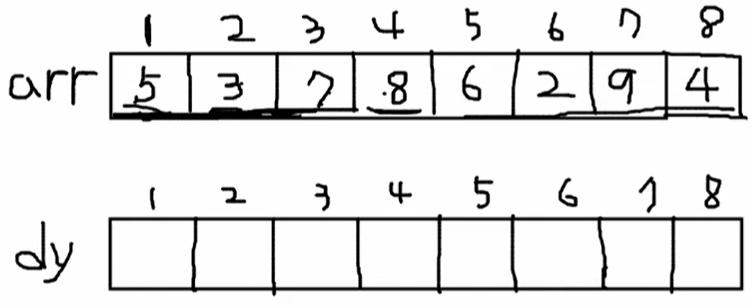

# 최대 부분 증가 수열(LIS)

### 최대 부분 증가 수열이란?

어떤 수열이 주어졌을 때, 순서를 바꾸지 않고 오름차순으로 나열할 수 있는 최대 길이의 부분 집합을 뜻한다. 예를 들어 (1 4 3 2) 가 주어졌을 때, 최대 부분 증가 수열은 (1 3 2)이다.

##### ex) 주어진 입력의 최대 부분 증가 수열 구하기


(5 3 7 8 6 2 9 4)로 이루어진 입력의 LIS를 구하는 문제이다. 네트워크 선 문제와 마찬가지로 작은 단위부터 생각해 본다. arr[1] 즉, 5가 마지막인 LIS는 5 한개, arr[2] = 3이 마지막인 LIS도 1개이다. arr[3] = 7이 마지막인 LIS는 (3 7), (5 7) 2개이며 동일한 방식으로 뒤로 확장해 나가면 길이를 구할 수 있다.



이것을 dp로 해결하기 위해 다음과 같이 dy 배열을 선언한 후, dy 배열을 채운다. 이 때, dy[i]는 arr[i]의 숫자가 맨 뒤에 위치한 최대 길이 수열의 길이를 뜻한다. 예를 들어 dy[3]의 값에는 arr[3]의 값 즉, 7이 맨 마지막에 있는 최대 길이 수열의 길이를 저장하면 된다. 이 과정을 통해 전부 채운 dy 배열의 값은 다음과 같다.


- dy[1]인 경우는 arr[1]로 만들 수 있는 단 하나의 경우밖에 없으므로 1로 초기화 한다.
- dy[2]부터는 arr[2]부터 그 앞의 인덱스를 모두 검사하며 arr[2] > arr[1]이라면 dy[1]의 값에 +1을 하여 dy[2]에 저장한다. 그렇지 않으면 1을 저장한다.
- 같은 방식으로 반복하여 dy[7]의 경우에는 arr[1] ~ arr[6]의 값이 모두 arr[7]보다 작으므로 dy[1] ~ dy[6]  값 중의 최대값인 3에 +1을 하여 dy[7]에 저장하면 된다(최대 수열에 arr[7]값이 추가되므로 +1을 해주어야 한다).
- 여기서 dy[5]의 경우에는 arr[5] = 6 값이 arr[1] ~ arr[4] 값 중에 arr[1] = 5, arr[2] = 3 보다는 크지만 arr[3] = 7, arr[4] 보다는 작으므로 arr[1], arr[2] 값 중 큰 값에 1을 더하여 dy[5]에 저장하므로 dy[5] =2가 된다.

```c++
int main() {
    ios_base::sync_with_stdio(false);
    int n, res = 0;
    cin >> n;
    vector<int> arr(n+1), dy(n+1); // 이렇게 선언만 해도 vector는 0으로 초기화 됨! 인덱스 1부터 사용하려고 n+1로 선언
    
    for (int i = 1; i <= n; i++) { // 입력 받음
        cin >> arr[i];
    }
    
    dy[1] = 1; // dy[1]은 어차피 1이므로 초기화
    for (int i = 2; i <= n; i++) {
        int max = 0; // dy[1] ~ dy[i - 1]값 중의 최댓값을 저장할 변수
        for (int j = i - 1; j >= 1; j--) { // arr[i] 앞의 모든 인덱스를 반복문으로 검사
            if (arr[j] < arr[i] && dy[j] > max) max = dy[j]; // 현재 arr 값보다 작고 dy값이 max보다 큰 값을 max로 설정
        }
        dy[i] = max + 1; // 앞서 구한 max에 arr[i]를 이어붙이므로 1을 더하여 dy[i]에 삽입
        if (dy[i] > res) res = dy[i]; // 구한 dy[i] 값이 미리 구했던 res 값보다 크다면 해당 값으로 할당
    }
    
    cout << res << '\n';
    
    return 0;
}
```


##### ex)  최대 선 연결하기(LIS 응용)


왼쪽과 오른쪽의 같은 수를 연결하되 연결 선이 다른 선을 가로지르지 않게 연결하는 최대 선의 갯수를 구하는 문제이다.  왼쪽의 번호는 오름차순이므로 오른쪽에서 내림차순인 두 수를 연속으로 이어버릴 경우 필연적으로 선이 교차하게 된다. 따라서 오른쪽의 번호도 증가하는 수열만을 선택해야 한다(LIS). 결국 (4 1 2 3 9 7 5 6 10 8) 로 이루어진 수열의 LIS를 구하면 답이 된다. 

##### ex) 최대 선 연결하기 변형

1 ~ 10까지를 전부 연결해 놓고 이 중에서 몇 개의 선을 제거해야 최대 연결선을 남길 수 있는가? 라고 물어볼 수 있다. 이 때 오른쪽의 배열에서 LIS를 구한 다음 최댓값에서 그 값을 빼면 된다. 즉 최댓값(10)에서 LIS값(6) 을 뺀 값 (4)가 제거해야할 선의 갯수이다.


##### ex) 가장 높은 탑 쌓기(LIS 응용)


LIS를 거꾸로 뒤집어 생각해 보면 될법한 문제이다. 구조체를 만들어 밑면 넓이, 높이, 무게를 넣고 해당 구조체로 배열을 만든다. 이후 밑면 넓이를 기준으로 감소하는 최대길이 힝렬을 구하는데 이 때, 무게도 함께 감소해야 하는 조건을 넣고, 해당되는 모든 벽돌의 높이를 더하면 답이 나올 것이라고 생각했다.


위와 같이 S(넓이)와 W(무게)를 동시에 고려하기는 복잡하기 때문에 먼저 S를 내림차순으로 정렬하고 W만 고려하여 dp를 생각하면 된다. 여기서 dy[2]의 값은 2번 벽돌이 꼭대기에 있을 때 탑의 최대 높이를 뜻한다.  이 과정을 반복하여 채운 dy의 값은 다음과 같다.


```c++
#include <iostream>
#include <vector>
#include <algorithm>

using namespace std;

struct block {
	int area;
	int height;
	int weight;
};

bool cmp(const block &a, const block &b) {
	if (a.area > b.area) return true;
	else return false;
}

int main() {
	ios::sync_with_stdio(false);

	int T, maxHeight = 0;
	cin >> T;
	vector<block> blocks(T);
	vector<int> dy(T, 0);

	for (int i = 0; i < T; i++) {
		cin >> blocks[i].area >> blocks[i].height >> blocks[i].weight;
	}

	sort(blocks.begin(), blocks.end(), cmp);

	dy[0] = blocks[0].height;
	maxHeight = dy[0];
	for (int i = 1; i < T; i++) {
		int max = 0;
		for (int j = i - 1; j >= 0; j--) {
			if (blocks[i].weight < blocks[j].weight && dy[j] > max) max = dy[j];
		}
		dy[i] = max + blocks[i].height;
		if (dy[i] > maxHeight) maxHeight = dy[i];
	}

	cout << maxHeight << '\n';

	return 0;
}
```

위 코드는 앞서 배웠던 LIS 코드를 활용하여 직접 구현한 코드이다. 여기서 구조체 정렬 시 cmp 함수를 직접 만들어야 했는데 이 때 parameter로 받는 형식을 제대로 받지 않아서 에러가 났다. cmp 함수의 parameter는 꼭 ```const <자료형> &<변수명>```임을 명심해야 한다. 또한 sort를 사용할 때, 입력을 index 0부터가 아닌 1부터 받게 되어 제대로 sort가 되지 않아서 계속해서 오류가 났다. **sort를 사용하면 index = 0 부터 정렬**이 되기 때문에 이 점도 주의해서 사용해야 한다. 그 외 모든 부분은 앞서 배운 LIS와 별반 다를 것이 없어서 어렵지 않은 문제였다.