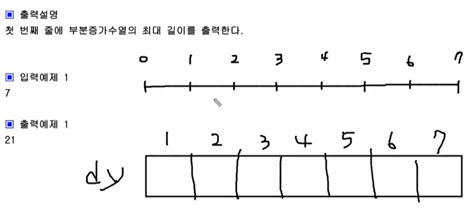
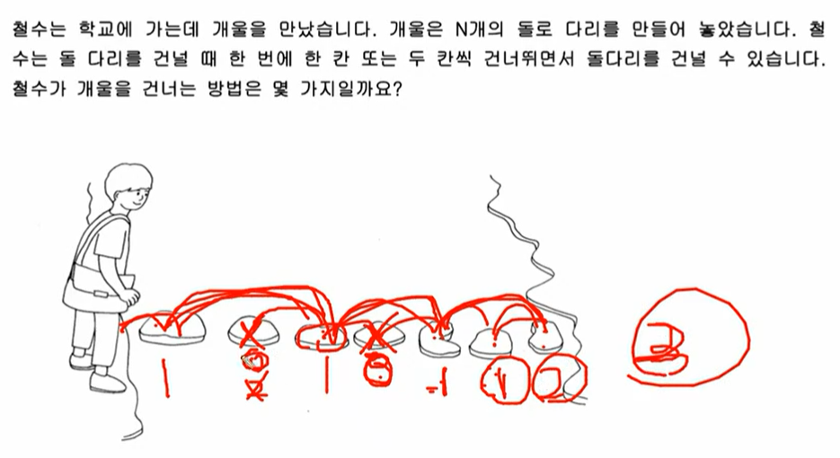

# Dynamic Programming

### Dynamic Programming이란?

Dynamiac Programming(동적 계획법)이란 어떠한 문제가 주어 졌을 때, 그 문제를 작게 잘라서 푼 다음 해당 결과를 바탕으로 그 다음 큰 문제의 값을 구하며 최종 답을 구하는 방식이다 - Bottom up 방식. 예전 고등학생 때 배웠던 점화식과 같은 형태로 문제를 푼다고 생각하면 이해가 편했다.


##### ex) 네트워크 선 자르기(Bottom - up)



7m짜리 네트워크 선을 1 또는 2m로 자르는 것을 생각하는 문제이다. 한 번에 7m짜리를 생각하기는 어려우므로 1m, 2m 짜리를 먼저 생각해보고 dy라는 배열에 입력하고 시작한다. 1m 짜리를 자르는 방법은 한 가지, 2m 자리를 자르는 방법은 두 가지(1+1 / 2) 이므로 다음과 같이 **쉬운 값으로 배열을 초기화** 하고 시작한다.


위처럼 dy의 인덱스를 네트워크 선의 길이로 보고(**여기서는 1부터 시작**) 방법의 수를 해당 인덱스에 넣어주고 시작한다. 여기서 길이가 3m인 선을 자르는 경우의 수를 생각했을 때, 맨 뒤를 1m만 남기고 자른다고 하면 그 앞을 자르는 경우의 수는 1+1 / 2 의 총 두 가지이다. 맨 뒤를 2m만 남기고 자른다고 하면 그 앞을 자르는 경우의 수는 1 한 가지 이므로 3m일 경우 자르는 방법의 수는 총 3가지라고 볼 수 있다.


여기서 같은 방법으로 계속해서 추론해 보면 n 미터 길이의 줄을 자르는 방법의 수는 n-1, n-2 미터 길이의 줄을 자르는 방법의 수의 합과 같다는 것을 알 수 있다. => **f(n) = f(n-2) + f(n-1)**

```c++
int main() {
    int dy[50];
    int n;
    cin >> n;
    dy[1] = 1;
    dy[2] = 2;
    
    for (int i = 3; i <= n; i++) {
        dy[i] = dy[i-2] + dy[i-1];
    }
    
    cout << dy[n] << '\n';
    
    return 0;
}
```

위 코드는 앞서 설명한 것을 c++로 구현한 것이다. 제일 먼저 45m길이 제한이 있기 때문에 넉넉하게 dy배열을 50 크기로 선언하였다. 이후 1m와 2m의 경우의 수를 미리 계산하여 삽입한 후, **3m인 경우부터 반복문**을 통해 dy배열을 채워나가면 답을 쉽게 구할 수 있다.


##### ex) 네트워크 선 자르기(Top - Down: 재귀, 메모이제이션)

위 문제를 DFS방식으로 바라본다면 아래와 같이 생각해 볼 수 있다. DFS(7) 은 결국 맨 뒤를 1, 2m로 자르는 것을 생각해 보았을 때 DFS(6) + DFS(5)이다.


이것을 쭉 정리해보면 아래와 같이 되고, D(2) = 2, D(1) = 1을 리턴하게 해주면 답을 구할 수 있다.


하지만 여기서 문제는 D(3)를 구했음에도 불구하고 다른 가지로 뻗어나갈 때 똑같은 값을 또 구한다는 것이다. 이를 해결하기 위해 dy 배열을 만들어 구한 값을 해당 인덱스에 저장을 해놓는 방식을 통해 효율적으로 구현할 수 있다.


위와 같이 이미 구한 값을 적어놓고 똑같은 연산을 할 때, 재연산 대신 적어 놓은 값을 활용하는 것을 메모이제이션이라고 한다(불필요한 재귀호출 방지).

```c++
int dy[101]; // 0으로 초기화

int DFS(int n) {
    if(dy[n] > 0) return dy[n]; // 이미 구한 값은 계산을 하지 않고 dy배열에서 바로 return**
    if (n == 1 || n == 2) return n; // 1, 2일 경우 리턴값 정해주기
    else return dy[n] = DFS(n-1) + DFS(n-2); // 리턴과 동시에 dy값 채우기
}

int main() {
    int n;
    cin >> n;
    
    cout << DFS(n);
    
    return 0;
}
```

위 코드는 같은 문제를 DFS(Top-down) 방식으로 코딩한 것이다. dy[n]값을 조사해서 return을 하지 않으면 모든 경우의 수를 다 계산하기 때문에 n을 45로만 설정해도 8초 정도의 시간이 걸린다. 하지만 if문 한 줄만 추가하더라도 1초도 안걸리게 시간이 단축되는 것을 확인할 수 있었다. **메모이제이션**의 중요성을 실감할 수 있었다.

##### ex) 변형 - 돌다리 건너기



위와 같이 중간의 돌은 딛지 못한다는 등의 변형 문제를 낼 수도 있다. 하지만 이것도 전과 같이 Bottom - up 방식으로 하나씩 차근차근 생각해 보면, 결국 6번째 돌까지 가는 방법은 단 1가지임을 알 수 있다. 