# 깊이 우선 탐색(DFS)

### 이진트리 깊이 우선 탐색

아래와 같은 트리가 있을 때, 깊이 우선 탐색은 노드 중 하나를 정해 맨 밑까지 검색하고 더 이상 내려갈 곳이 없으면 뒤로 되돌아가서 탐색해 보지 않았던 노드로 가서 다시 제일 깊이 탐색하는 방식으로 탐색하는 방식이다. 전위, 중위, 후위 탐색은 이 탐색에 어느 정도의 규칙을 더해주는 탐색 방식이다. 각 탐색 방법은 부모 노드를 언제 출력하느냐에 따라 분류된다.

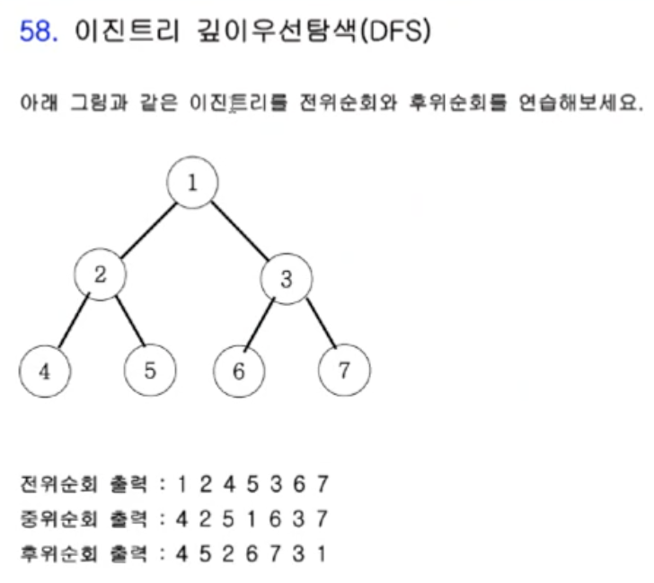

여기서 각 노드의 자식 노드는 **부모 노드 * 2(왼쪽 자식)**, **부모 노드 * 2 + 1(오른쪽 자식)**으로 구할 수 있다. 이를 활용하여 전위 순회 출력을 코드로 구현하면 다음과 같다. 여기에서 전위, 중위, 후위 순회를 나타내는 것은 print문을 어디에 넣느냐에 따라 달라지는데 자식 노트의 호출 앞, 중간, 뒤에 넣으면 원하는 결과를 얻을 수 있다. 이는 위 그림에 대입하여 생각해 보면 직관적으로 이해할 수 있는데 평소 DFS를 생각할 때 머리로만 생각해서 이해가 안 되면 그림을 그려서 이해해야겠다는 것을 느꼈다.

```c++
#include <iostream>

using namespace std;

void D(int n) {
    if (n > 7) return;
    else {
        cout << n << ' '; // 자식 호출 전에 루트 노드의 task를 해결
        D(n * 2);
      	// 중위 순회를 표현하고 싶다면 print문을 여기에 삽입
        D(n * 2 + 1);
    		// 후위 순회를 표현하고 싶다면 print문을 여기에 삽입 - 병합 정렬에 응용
    }
    return ;
}

int main() {
    ios::sync_with_stdio(false);
    cin.tie(0);
    cout.tie(0);
    
    D(1);
    
    return 0;
}
// 출력: 1 2 4 5 3 6 7
```

위 코드를 실행하게 되면 D(1) -> D(2) -> D(4) -> D(8), 7보다 크므로 곧바로 종료됨 -> D(9), 7보다 크므로 곧바로 종료됨 -> D(2)로 돌아감 -> D(5) 순서로 전개되게 된다. 이를 반복하여 최종 완성된 트리를 그림으로 나타내면 다음과 같다.

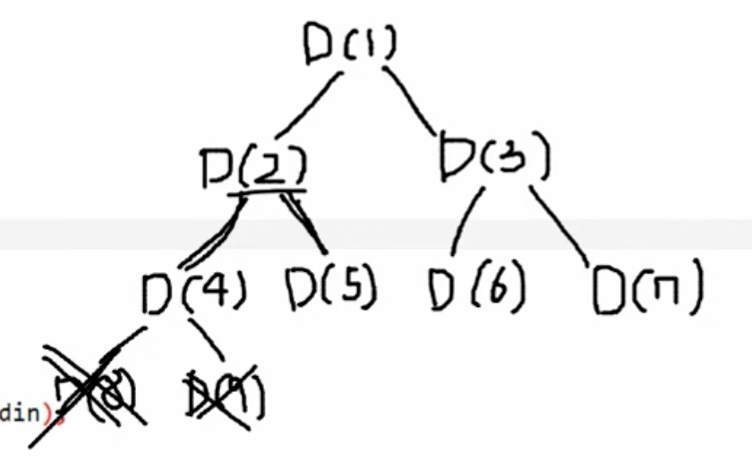

### Ex) 모든 부분집합 출력 문제

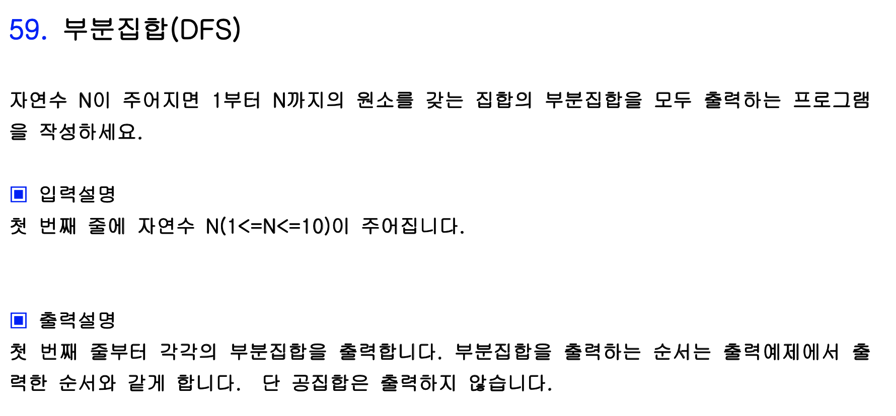

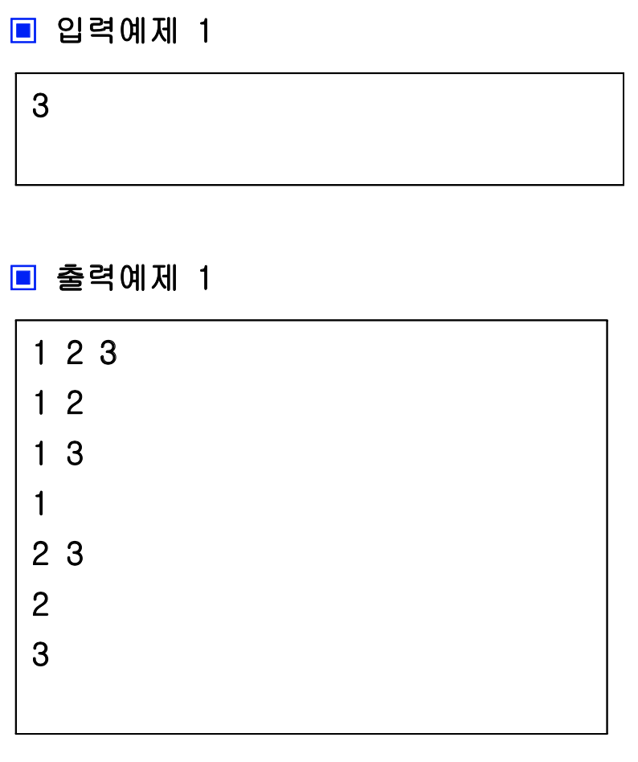

자연수가 주어지면 1 ~ 수 까지의 수로 이루어진 집합의 부분집합을 모두 출력하는 문제이다. 문제 접근은 트리의 레벨을 기준으로 접근하였고 다음 레벨로 넘어갈 때에는 그 수가 부분집합에 포함이 되는지, 안 되는지의 2 가지의 경우의 수로 분리되었다.

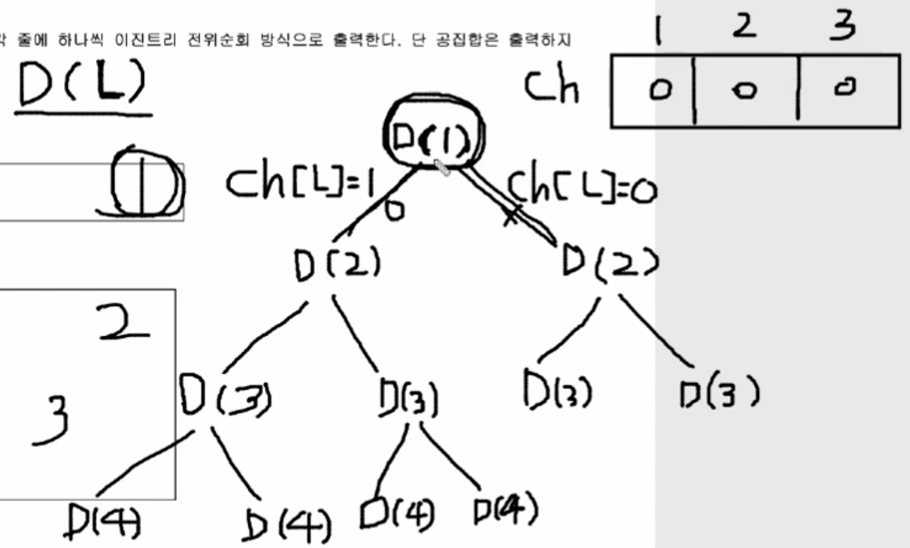

위 그림에서 DFS를 전위탐색하며 ch배열을 수정한다. 맨 첫 번째 과정만 설명하자면 맨 처음 D(1) 에서 왼쪽으로 가지를 뻗으면 1은 이 부분집합에 존재하는 경우이므로 ch에서 1번 인덱스의 값을 1로 바꾸어 준다. 그 다음 D(2) 에서 왼쪽으로 가지를 뻗으면 이 경우는 2가 부분집합에 속하는 경우이므로 ch 의 2번 인덱스의 값을 1로 바꾸어 준다. D(3) 에서 왼쪽으로 가지를 뻗으면 3이 부분집합에 속하는 경우이므로 ch의 3번 인덱스의 값을 1로 바꾸어 준다. 마지막으로 D(4)로 가지를 뻗을 때, ```L == n + 1``` 이므로 재귀를 종료하고 그 시점의 ch 배열을 검사하여 그 값이 1인 칸의 인덱스만 출력해주고 다시 위로 돌아가서 재귀를 실행하면 된다. 

이것을 반복하게 되면 D(4)의 갯수 즉 총 8번의 print를 실행하게 되는데 이는 1, 2, 3으로 이루어진 집합의 부분집합 수 8과 일치한다. ch가 0, 0, 0일 경우는 공집합일 경우이며 이 경우에는 출력을 제외하라고 했으므로 나머지 7개를 출력하면 정답이 된다. 이를 코드로 구현하면 다음과 같다.

```c++
#include <iostream>

using namespace std;

int N, ch[10];

void DFS(int Level) {
    if (Level == N + 1) {
        for (int i = 0; i <= N; i++) {
            if (ch[i] == 1) cout << i << ' ';
        }
        cout << '\n';
    }
    else {
        ch[Level] = 1; // 왼쪽 가지
        DFS(Level + 1);
        ch[Level] = 0; // 오른쪽 가지
        DFS(Level + 1);
    }
    
    return ;
}

int main() {
    ios::sync_with_stdio(false);
    cin.tie(0);
    cout.tie(0);
    
    cin >> N;
    
    DFS(1);
    
    return 0;
}
```


### Ex) 아마존 기출문제 - 합이 같은 부분집합

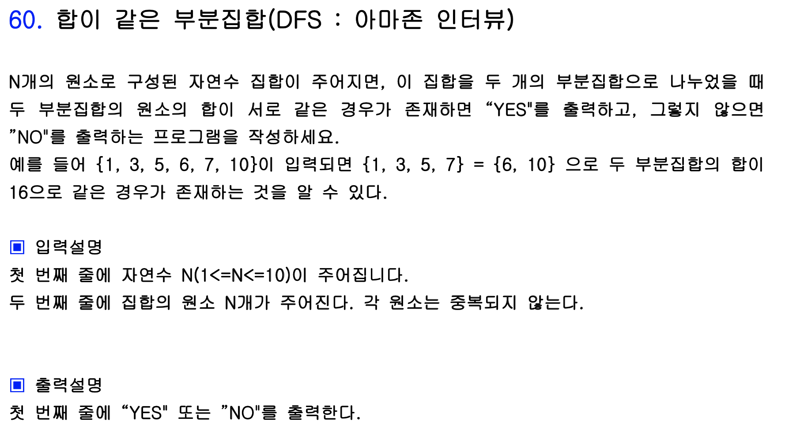

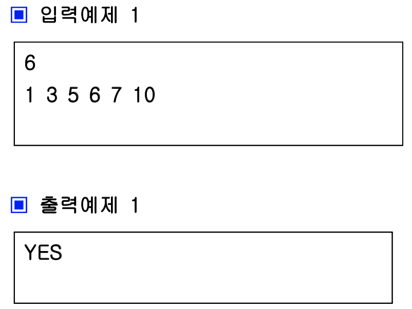

앞의 문제를 응용하면 풀 수 있는 문제이다. 기존에는 순서대로 증가하는 인덱스를 중시하여 풀었다면 이번에는 입력된 값 자체를 더해가며 전체 값과 비교해서 풀어야 했다. 왼쪽, 오른쪽으로 뻗을 때가 가장 중요한 것 같은데 a 배열에 저장한 수를 sum에 더한 것이 왼쪽, 더하지 않은 것이 오른쪽으로 생각해서 가지를 치면 된다.

```c++
#include <iostream>

using namespace std;

int N, a[10], total = 0;
bool flag = false;

void DFS(int Lv, int sum) {
  	if (sum > total / 2) return;
    if (flag) return;
    if (Lv == N + 1) {
        if (sum == total - sum) flag = true;
    } else {
        DFS(Lv + 1, sum + a[Lv - 1]);
        DFS(Lv + 1, sum);
    }
    
    return ;
}

int main() {
    ios::sync_with_stdio(false);
    cin.tie(0);
    cout.tie(0);
    
    cin >> N;
    
    for (int i = 0; i < N; i++) {
        cin >> a[i];
        total += a[i];
    }
    
    DFS(1, 0); // 레벨, 원소의 합
    
    if (flag) cout << "YES" << '\n';
    else cout << "NO" << '\n';
    
    return 0;
}
```

위 코드의 트리 가지치기를 그림으로 나타낸다면 다음과 같다. D(7, 16)에서 total의 절반과 같은 값이 나왔으므로 flag를 ㅅrue로 만들어 재귀를 종료한다. 전개 과정에서 sum이 total의 반보다 커져버리면 그 다음 가지는 볼 필요가 없기 때문에 해당 코드를 추가했다.

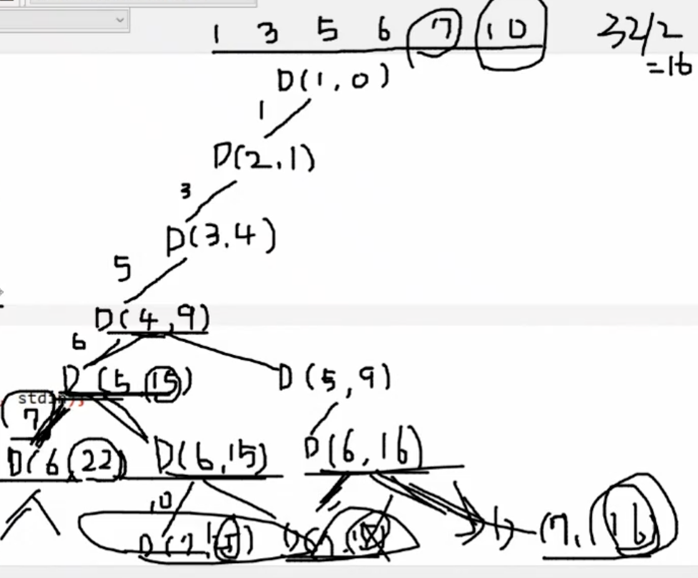


### Ex) 특정 수 만들기 - MS 기출문제

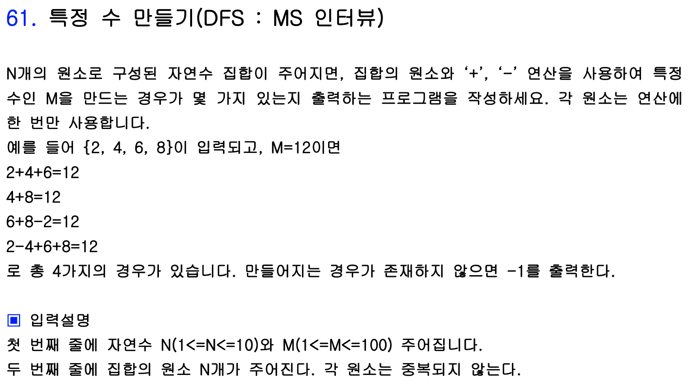

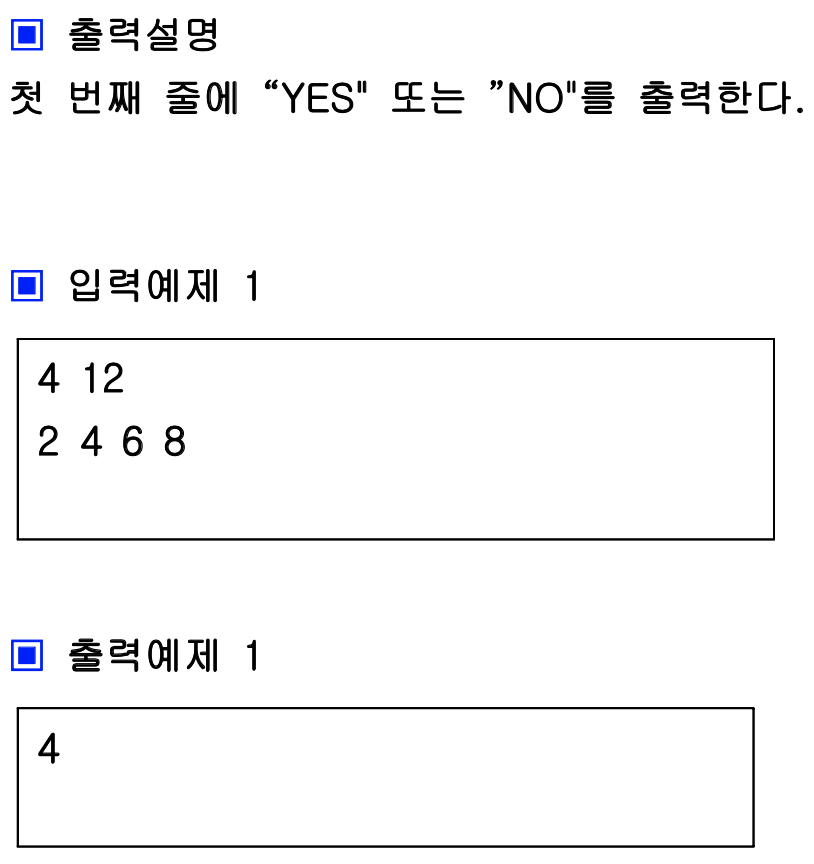

앞 문제가 거의 동일한 메커니즘으로 풀 수 있었다. 차이점이라면 각 노드마다 자식 노드가 3개씩 생긴다는 점이다. 해당 값을 연산에 사용하지 않는 경우, 더하는 경우, 빼는 경우를 생각해볼 수 있다. 이전 풀이에 DFS를 한번 더 호출하도록 하여 해결하였다. 그림으로 나타내면 다음과 같다.

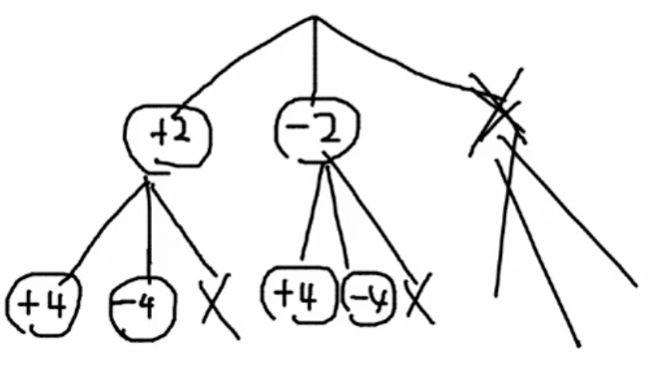

```c++
#include <iostream>

using namespace std;

int N, M, arr[10], path[10], cnt = 0;

void DFS(int Lv, int sum) {
    if (Lv == N + 1) {
        if (sum == M) {
            cnt ++;
            for (int i = 0; i < Lv; i++) {
                if (path[i] != 0) cout << path[i] << ' ';
            }
            cout << '\n';
        }
    } else {
        path[Lv - 1] = arr[Lv - 1];
        DFS(Lv + 1, sum + arr[Lv - 1]);
        path[Lv - 1] = -arr[Lv - 1];
        DFS(Lv + 1, sum - arr[Lv - 1]);
        path[Lv - 1] = 0;
        DFS(Lv + 1, sum);
    }
    
    return ;
}

int main() {
    ios::sync_with_stdio(false);
    cin.tie(0);
    cout.tie(0);
    
    cin >> N >> M;
    for (int i = 0; i < N; i ++) {
        cin >> arr[i];
    }
    
    DFS(1, 0);
    
    if (cnt == 0) cout << -1 << '\n';
    else cout << cnt << '\n';
    
    return 0;
}
```

총 경우의 수 뿐만 아니라 어떤 수들의 연산으로 M과 같은 값이 만들어지는 지를 알아보기 위해 각 DFS를 호출하기 전에 path라는 배열을 만들어 그 배열을 수정하는 코드를 추가해 주었다. DFS가 반복되며 path 배열이 계속해서 수정되며 세 가지 경우씩 모두 검사하게 된다.