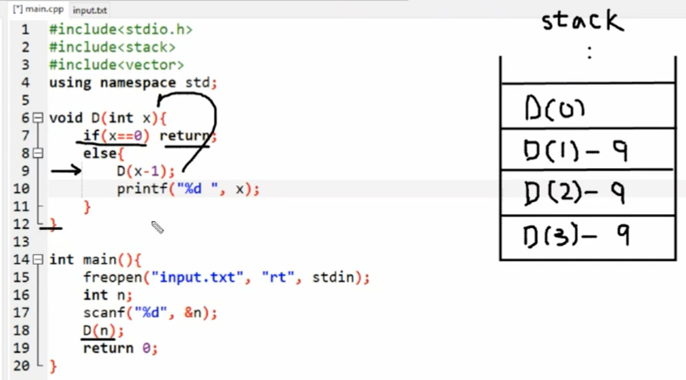
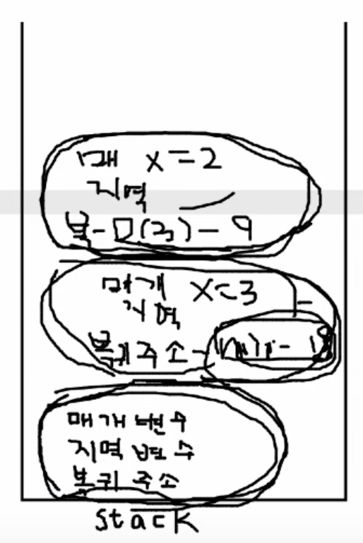

# Lecture - Recursive Function

### C의 재귀 함수

C언어에서는 재귀 함수를 호출할 때, 스택의 형태로 호출된다. 현재 실행되는 함수는 스택의 최상단에 위치하는 것으로 이해하면 되며 해당 함수의 실행이 끝나면 stack의 top에서 pop되게 된다.



위 예제는 수를 입력받고 1부터 해당 수까지 출력하는 예제이다. 처음 봤을 때에는 단순하게만 생각해서 재귀함수의 인자에 1을 넣고 해당 수를 출력한 뒤, +1을 하여 재귀 함수를 출력하여 구현하였다. 하지만 단순이 재귀 호출을 하는 라인과 출력하는 라인의 순서만 바꿔도 원하는 대로 출력할 수 있음을 생각해 볼 수 있었다(**스택 구조**이기 때문!!).

```c++
#include <iostream>

using namespace std;

int num;

void print_num(int n) {
    if (n == num) {
        cout << n;
        return ;
    } else {
        cout << n << ' ';
        print_num(n + 1);
    }
}

void recur(int num) {
    if (num == 0) return;
    else {
        recur(num - 1); // 역순으로 출력하려면 print문을 recur 다음에 넣으면 된다!
        cout << num << ' ';
    }
}

int main() {
    ios::sync_with_stdio(false);
    cin.tie(0);
    cout.tie(0);
    
    cin >> num;
    
    // print_num(1);
    recur(num);
    
    return 0;
}
```

### 실제 C에서의 **스택 프레임**

위에서 설명한 스택 개념은 간편하게 보기 쉬운 용도로 설명된 것이고, C에서는 어떤 함수던 간에 호출이 되면 스택에 그 함수 정보를 기록하게 되며, 기록된 것 하나 하나를 **Stack Frame**이라고 한다. Stack frame에는 크게 지역 변수, 매개 변수, 복귀 주소등이 기록된다.



위 그림에서 맨 아래 Stack framed은 main() 함수의 것이고 그 위는 각각 recur(3), recur(2) 의 Stack frame이 쌓인 것을 나타낸 것이다. 여기에서 어떤 함수가 완료되어 스택에서 빠지지 않고 계속해서 스택에 Stack frame이 쌓여가고, 이로 인해 스택이 넘치게 되면 그것이 바로 많이 들어보았던 **Stack Overflow**이다.

