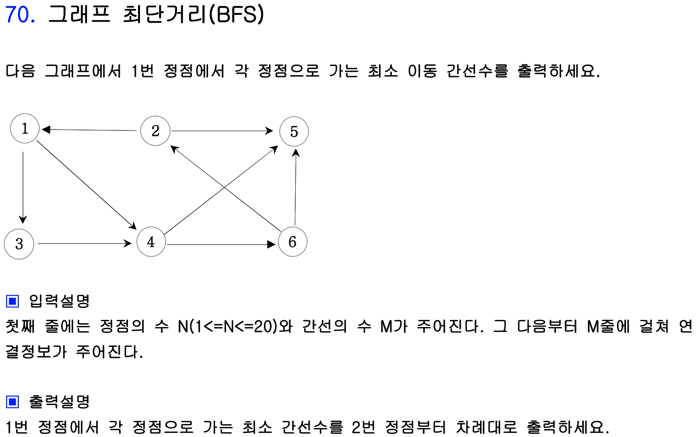

# 이진 트리의 넓이 우선 탐색(BFS)

넓이 우선 탐색이란 DFS와 다르게 같은 레벨을 먼저 전부 탐색하고 하위 레벨을 탐색하는 방법이다 - Level 탐색이라고도 한다. 아래 그림에서 BFS로 출력을 한다면 Level 1에 있는 1이 제일 먼저 출력되고 Level 2로 넘어간다. 그 다음 Level 2의 2, 3이 출력되고 Level 3으로 넘어가서 나머지 수를 전부 출력하므로 출력은 1 2 3 4 5 6 7 순서로 되게 된다.


넓이 우선 탐색은 자료구조 중 Queue를 활용하여 구현한다. 배열을 사용하여 Queue를 구현한다면 다음 그림과 같은 형태가 되고, 자료를 넣을때는 b(back)이라는 인덱스 변수를 활용하고, 뺄 때는 f(front)라는 인덱스 변수를 사용하여 빼게 된다. 


여기서 1을 집어넣고자 하면 우선 b를 + 1한 다음, b가 가르키는 인덱스에 1을 삽입하게 된다. b의 초깃값은 -1이므로 Q[++b] = Q[0]에 1을 집어 넣게 된다. 그 다음 바로 1을 빼고자 하면 f 인덱스를 + 1한 다음 f 인덱스가 가르키는 값을 빼게 된다. 즉, Q[++f] = Q[0]이므로 1이 바로 빠져나오게 된다. 숫자를 하나 빼면 그 숫자와 연결된 모든 노드를 Q에 넣어준다. 따라서 이후 2, 3까지 Q에 추가하고 나면 다음과 같은 그림이 된다.


이 상황에서 Q에서 하나의 수를 빼고자 하면 Q[++f]값 즉 Q[1] = 2 값이 빠져나오게 되고, 그 노드와 연결된 모든 노드를 Q에 추가해 주어야 하므로 4, 5가 Q에 들어가게 된다. 

이후 3을 빼 내면 6, 7이 Q에 들어가게 되고 Q에 남은 4 5 6 7을 순서대로 출력하면 결과가 나오게 된다. 이 과정에서는 어느 한 노드가 주어지면 가장 가까운 노드를 최 우선적으로 방문하기 때문 **최단거리, 최소 횟수** 등을 구할 때 유용하다. 위 과정을 코드로 구현하면 아래와 같다.

```c++
#include <iostream>
#include <vector>

using namespace std;

int Q[100], front = -1, back = -1, ch[10];
vector<int> map[10];

int main() {
    ios::sync_with_stdio(false);
    cin.tie(0);
    cout.tie(0);
   
    int a, b, x;
    
    for (int i = 1; i <= 6; i ++) {
        cin >> a >> b;
        map[a].push_back(b);
        map[b].push_back(a);
    }
    
    Q[++back] = 1;
    ch[1] = 1;
    while(front < back) {
        x = Q[++front];
        cout << x << ' ';
        
        for (int i = 0; i < map[x].size(); i++) {
            if (ch[map[x][i]] == 0) {
                ch[map[x][i]] = 1;
                Q[++back] = map[x][i];
            }
        }
    }
    
    return 0;
}
/*입력
1 2
1 3
2 4
2 5
3 6
3 7
*/
```


### Ex) 그래프 최단거리(BFS)




Q를 이용하여 풀되 배열을 하나 선언하여 1번 정점에서 해당 정점까지의 최소 간선 수를 기록한다.


맨 처음에 Q에 1을 넣고 1을 빼면서 시작한다. 1을 빼면 1과 연결된 모든 정점을 탐색해야 하므로 먼저 3을 Q에 넣고, dis[3]에는 dis[1] + 1을 한 값을 집어 넣는다. 이후 1과 연결된 또 다른 하나의 정점인 4를 Q에 넣고 dis[4]에 dis[4] + 1한 값을 집어 넣는다. 

그 다음에는 Q 에서 3이 나오게 되고 3에서 갈 수 있는 유일한 정점인 4는 이미 chk가 0이 아니므로 넘어가게 된다. 그 다음으로는 Q 에서 4가 나오게 되고 Q에 5을 집어넣고, dis[5]에는 dis[4] + 1 즉, 2를 집어넣게 된다. 마찬가지로 6도 Q에 넣고, dis[6] = dis[4] + 1 = 2를 넣게 된다.


그 다음에는 Q 에서 5가 나오지만 갈 수 있는 정점이 없으므로 Q에서 다음 원소를 pop하게 되고 마지막으로 나온 6은 2로 갈 수 있고 Q에 2를 넣고 dis[2]의 값이 0이므로 dis[2]에 dis[6] + 1 = 3을 집어 넣게 된다.


마지막으로 Q에 남은 2를 pop하고 Q가 비워지므로 작업은 끝나게 된다.

```c++
#include <iostream>
#include <vector>
#include <queue>

using namespace std;

int main() {
    ios::sync_with_stdio(false);
    cin.tie(0);
    cout.tie(0);
    
    int n, m, a, b, x;
    vector<int> map[30];
    queue<int> Q;
    
    cin >> n >> m;
    for (int i = 1; i <= m; i++) {
        cin >> a >> b;
        map[a].push_back(b);
    }
   
    Q.push(1);
    ch[1] = 1;
    while(!Q.empty()) {
        x = Q.front();
        Q.pop();
        for (int i = 0; i < map[x].size(); i++) {
            if (ch[map[x][i]] == 0) {
                ch[map[x][i]] = 1;
                Q.push(map[x][i]);
                dis[map[x][i]] = dis[x] + 1;
            }
        }
    }
    
    for (int i = 2; i <= n; i ++) {
        cout << i << " : " << dis[i] << '\n';
    }
    
    return 0;
}
```


### Ex) 송아지 찾기(BFS 상태트리 탐색)


처음에는 그리디 알고리즘으로 생각했으나 다시 한번 보니 BFS를 이용해서 구할 수 있을 것 같았다. 상태트리를 만들어 각 노드에서 갈 수 있는 노드들을 전부 검색하는 방식으로 접근하였다. 상태트리를 나타내는 방식은 다음과 같다.


상태 트리의 가지를 뻗어나갈 때, 이미 갔던 지점을 다시 돌아간다면 새로운 가지를 또 뻗어야 하기 때문에 chk 배열을 만들어서 pruning을 해준다. 이렇게 나열하다 보면 Level 3에서 답이 나오는 것을 알 수 있다.

```c++
#include <iostream>
#include <vector>
#include <queue>

using namespace std;

// chk는 점프 횟수
int chk[10001], d[3] = {-1, 1, 5};

int main() {
    ios::sync_with_stdio(false);
    cin.tie(0);
    cout.tie(0);
    
    // pos: 가고자 하는 좌표
    int s, e, x, pos;
    queue<int> Q;
    cin >> s >> e;
    
    chk[s] = 1;
    Q.push(s);
    
    while(!Q.empty()) {
        x = Q.front();
        Q.pop();
        
        for (int i = 0; i < 3; i++) {
            pos = x + d[i];
            if (pos < 1 || pos > 10000) continue;
            if (pos == e) {
                // 초기화를 1로 했으므로 chk[pos]가 아니라 chk[x]를 답으로 한다.
                cout << chk[x] << '\n';
                exit(0);
            } else {
                if (chk[pos] == 0) {
                    chk[pos] = chk[x] + 1;
                    Q.push(pos);
                }
            }
        }
    }
        
    return 0;
}
```

