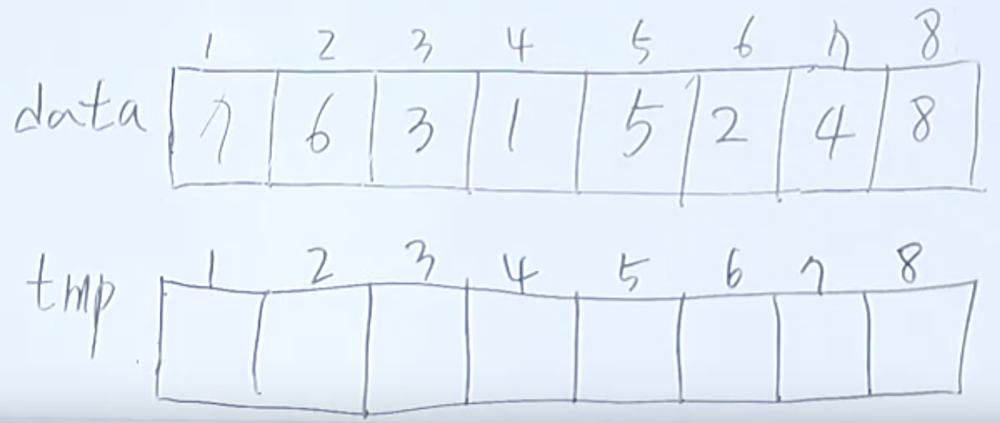

# DFS를 위한 몇 가지 개념과 DFS

### 병합 정렬(Merge Sort)

정렬 알고리즘 중, 퀵 소트와 마찬가지로 O(nLogn)의 시간복잡도를 가지는 정렬 방식이다. 분할 - 정복 방식으로 정렬을 하며 정렬할 행렬이 주어지면 해당 행렬을 계속 반으로 나눈 후, 가장 작은 단위부터 합쳐가며 정렬하는 방식이다. 예를 들어 인덱스가 1 ~ 8까지 있는 행렬을 병합 정렬을 수행하게 되면 다음 그림처럼 분해한 후 합치며 정렬을 수행하게 된다.


왼쪽 값이 오른쪽 값 보다 클 경우에만 (right - left) / 2를 수행하여 mid값을 구하고 d(left, mid), d(mid + 1, right)를 재귀 호출한다. 계속해서 분할하다 보면 right와 left가 똑같은 형태로 재귀함수가 호출되게 되는데 이 때는 mid를 구하는 조건을 충족하지 못하므로 함수가 바로 종료되게 된다. 



```c++
#include <iostream>

using namespace std;

int data[10], tmp[10];

void divide(int lft, int rt) {
    int mid;
    int p1, p2, p3;
    if (lft < rt) {
        mid = (lft + rt) / 2;
        divide(lft, mid);
        divide(mid + 1, rt);
        p1 = lft;
        p2 = mid + 1;
        p3 = lft;
        
        while(p1 <= mid && p2 <= rt) {
            if (data[p1] < data[p2]) tmp[p3++] = data[p1++];
            else tmp[p3++] = data[p2++];
        }
        while(p1 <= mid) tmp[p3++] = data[p1++];
        while(p2 <= rt) tmp[p3++] = data[p2++];
        for (int i = lft; i <= rt; i++) {
            data[i] = tmp[i];
        }
    }
  	return 0;
}

int main() {
    ios::sync_with_stdio(false);
    cin.tie(0);
    cout.tie(0);
    
    int n;
    cin >> n;
    for (int i = 1; i <= n; i++) {
        cin >> data[i];
    }
    divide(1, n);
    
    for (int i = 1; i <= n; i++) {
        cout << data[i] << ' ';
    }
    
    return 0;
}
```

위 그림과 코드를 바탕으로 d(1, 2)를 수행해보자. 먼저 mid = (1+2)/2이므로 1이다. 이를 바탕으로 data[p1]과 data[p2]의 값을 비교하면 data[p1] > data[p2] 이므로 tmp[1]에 data[p2] 값을 넣고 p3와 p2를 전부 1씩 증가시킨다. 이렇게 되면 p2(3)가 rt(2)보다 커지므로 while문을 빠져나오게 되고 그 다음 while문의 p1(1) <= mid(1) 조건만 참이 되어 tmp[p3] 즉 tmp[2]에 data[1] 값을 넣고 p1을 증가시킨다. 그렇게 되면 p1(2) > mid(1)가 되므로 반복문을 빠져나오게 된다. 마지막으로 tmp의 값을 left ~ right 만큼 data에 복사해 넣으면 해당 부분은 정렬이 된다. 이 과정을 반복하면 최종적으로 오름차순으로 정렬되게 된다.

### 인접 행렬

노드와 노드 간의 연결 정보를 행렬로 나타낸 것이다. 방향, 무방향 그래프가 있으며 무방향 그래프의 경우에는 1번 노드와 2번 노드가 이어져 있으면 1행 2열, 2행 1열을 모두 1로 바꾸어 주며 방향 그래프의 경우에는 만족하는 하나의 칸만 바꾸어 준다. 무방향 그래프와 그 인접행렬의 예는 다음과 같다.


가중치 방향 그래프의 경우에는 1 대신 해당 edge의 가중치를 저장해 주면 된다. 인접행렬 자체 보다는 앞으로 DFS 문제를 해결할 때 활용이 되므로 기본 개념을 다지고 가는 느낌으로 정리를 해 보았다.


### Ex) 경로 탐색(DFS)


방향 그래프가 주어졌을 때, 특정 노드로 가는 경로의 수를 구하는 문제이다. 우선 입력을 받아 2차원 배열에 저장을 하고 DFS를 써야 한다는 것은 알겠는데, DFS를 어떻게 구성해야 할지가 어려웠다. 

```c++
#include <iostream>

using namespace std;
// ch배열로 방문 했는지를 체크, 이게 없으면 무한루프
int N, M, map[21][21] = { 0 }, ch[30], cnt = 0;

void DFS(int v) {
    if (v == N) {
        cnt ++;
    } else {
        for (int i = 1; i <= N; i ++) {
            if(map[v][i] == 1 && ch[i] == 0) {
                ch[i] = 1;
                DFS(i);
                ch[i] = 0; // 다른 경우의 수를 위해 물러날 때 체크를 풀어준다.
            }
        }
    }
}

int main() {
    ios::sync_with_stdio(false);
    cin.tie(0);
    cout.tie(0);
   
    cin >> N >> M;
    for (int i = 0; i < M; i++) {
        int a, b;
        cin >> a >> b;
        map[a][b] = 1;
    }
    ch[1] = 1;
    DFS(1);
    
    cout << cnt << '\n';
    return 0;
}
```


### Ex) 미로탐색(DFS)


앞선 문제와 매우 유사한 문제이다. 다만 다른 점은 여기서는 체크 배열을 2차원으로 만들어야 했다는 점이고 각 칸에서 4방향으로 갈 때 어떻게 처리할 것인가가 관건이었다. 각 칸에서 갈 수 있는 방향은 12시, 3시, 6시, 9시 이고 이것을 순서대로 가기 위해 주어진 좌표에 더해줄 값으로 배열을 두 개(dx, dy) 선언하여 for문을 돌리면서 검사하였다. 앞으로 검사할 좌표가 격자를 벗어날 경우 continue로 처리해 주는 부분을 제외하면 이전 문제의 코드와 거의 똑같은 코드였다.

```c++
#include <iostream>

using namespace std;

int cnt = 0, map[7][7], chk[7][7] = { 0 };
int dx[4] = {-1, 0, 1, 0};
int dy[4] = {0, 1, 0, -1};

void DFS(int x, int y) {
    int xx, yy;
    if (x == 6 && y == 6) {
        cnt ++;
    } else {
        for (int i = 0; i < 4; i++) {
            xx = x + dx[i];
            yy = y + dy[i];
           
            if (xx < 0 || xx > 6 || yy < 0 || yy > 6) continue;
            
            if (chk[xx][yy] == 0 && map[xx][yy] == 0) {
                chk[xx][yy] = 1;
                DFS(xx, yy);
                chk[xx][yy] = 0;
            }
            
        }
    }
    
    return ;
}

int main() {
    ios::sync_with_stdio(false);
    cin.tie(0);
    cout.tie(0);
    
    for (int i = 0; i < 7; i++) {
        for (int j = 0; j < 7; j++) {
            cin >> map[i][j];
        }
    }
    
    chk[0][0] = 1;
    DFS(0, 0);
    
    cout << cnt << '\n';
   
    return 0;
}
```


### Ex) 경로 탐색 - 인접 리스트 활용

64번 문제와 동일한 문제를 인접행렬이 아닌 인접 리스트를 활용하여 해결하였다. vector로 인접 노드들을 저장하였고 해당 노드들에 대해서만 검사를 수행하면 됐다. 아래 방법이 이전 방법보다 메모리, 시간복잡도에서 더 우월한 것을 확인할 수 있다.

```c++
#include <iostream>
#include <vector>

using namespace std;
// ch배열로 방문 했는지를 체크, 이게 없으면 무한루프
int N, M, ch[30], cnt = 0;
vector<int> map[30];

void DFS(int v) {
    if (v == N) {
        cnt ++;
    } else {
        for (int i = 0; i < map[v].size(); i++){
            if (ch[map[v][i]] == 0) {
                ch[map[v][i]] = 1;
                DFS(map[v][i]);
                ch[map[v][i]] = 0;
            }
        }
    }
}

int main() {
    ios::sync_with_stdio(false);
    cin.tie(0);
    cout.tie(0);
   
    cin >> N >> M;
    for (int i = 0; i < M; i++) {
        int a, b;
        cin >> a >> b;
        map[a].push_back(b);
    }
    ch[1] = 1;
    DFS(1);
    
    cout << cnt << '\n';
    return 0;
}
```


### Ex) 최소비용 - 인접행렬 활용

앞서 풀었던 인접행렬 문제에서 한 단계 더 나아가 각 간선에 가중치가 주어지고 최소한의 가중치만으로 끝까지 도달하는 경우의 가중치 합을 출력하는 문제이다. 앞선 풀이와 대부분 동일하지만 끝까지 검색 할 때, 각 경우의 sum 값을 계산해야 하므로 sum 값을 parameter로 함께 넘겨주어야 했다.

```c++
#include <iostream>

using namespace std;
// ch배열로 방문 했는지를 체크, 이게 없으면 무한루프
int N, M, map[21][21] = { 0 }, ch[30], cost = 2147000000;

void DFS(int v, int sum) {
    if (v == N) {
        if (sum < cost) cost = sum;
    } else {
        for (int i = 1; i <= N; i ++) {
            if(map[v][i] != 0 && ch[i] == 0) {
                ch[i] = 1;
                DFS(i, map[v][i] + sum); // 해당 정점으로 가는 간선의 가중치를 더해준다.
                ch[i] = 0; // 다른 경우의 수를 위해 물러날 때 체크를 풀어준다.
            }
        }
    }
}

int main() {
    ios::sync_with_stdio(false);
    cin.tie(0);
    cout.tie(0);
   
    cin >> N >> M;
    for (int i = 0; i < M; i++) {
        int a, b, c;
        cin >> a >> b >> c;
        map[a][b] = c;
    }
    ch[1] = 1;
    DFS(1, 0);
    
    cout << cost << '\n';
    return 0;
}
```


### Ex) 최소비용 - 인접리스트 활용

위 문제와 동일한 문제를 인접행렬이 아닌 인접 리스트로 보다 효율적으로 구현해 보았다. 인접 리스트를 생성할 때 벡터의 선언 부분과, 페어를 이용하는 부분에 주의가 필요했다.

```c++
#include <iostream>
#include <vector>

using namespace std;
// ch배열로 방문 했는지를 체크, 이게 없으면 무한루프
int N, M, ch[30], cost = 217000000;
vector<pair<int, int>> map[30];

void DFS(int v, int sum) {
    if (v == N) {
        if (sum < cost) cost = sum;
    } else {
        for (int i = 0; i < map[v].size(); i++){
            if (ch[map[v][i].first] == 0) {
                ch[map[v][i].first] = 1;
                DFS(map[v][i].first, sum + map[v][i].second);
                ch[map[v][i].first] = 0;
            }
        }
    }
}

int main() {
    ios::sync_with_stdio(false);
    cin.tie(0);
    cout.tie(0);
   
    cin >> N >> M;
    for (int i = 0; i < M; i++) {
        int a, b, c;
        cin >> a >> b >> c;
        map[a].push_back({b, c});
    }
    ch[1] = 1;
    DFS(1, 0);
    
    cout << cost << '\n';
    return 0;
}
```

