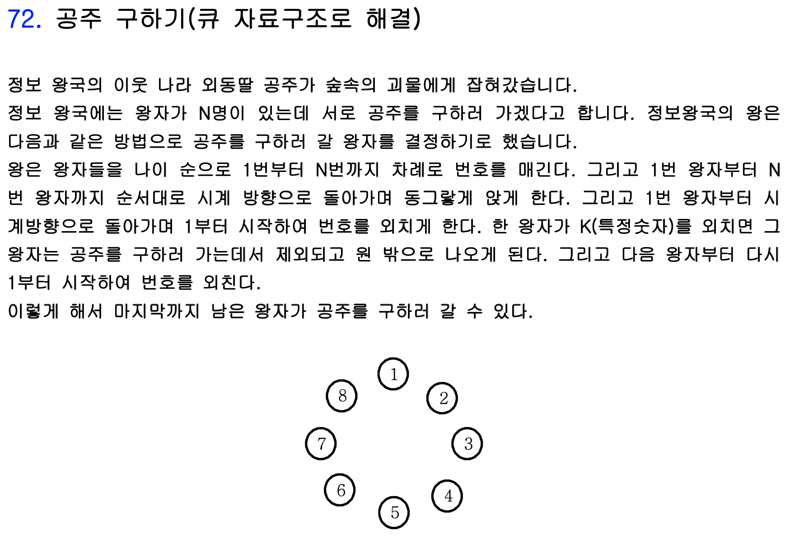
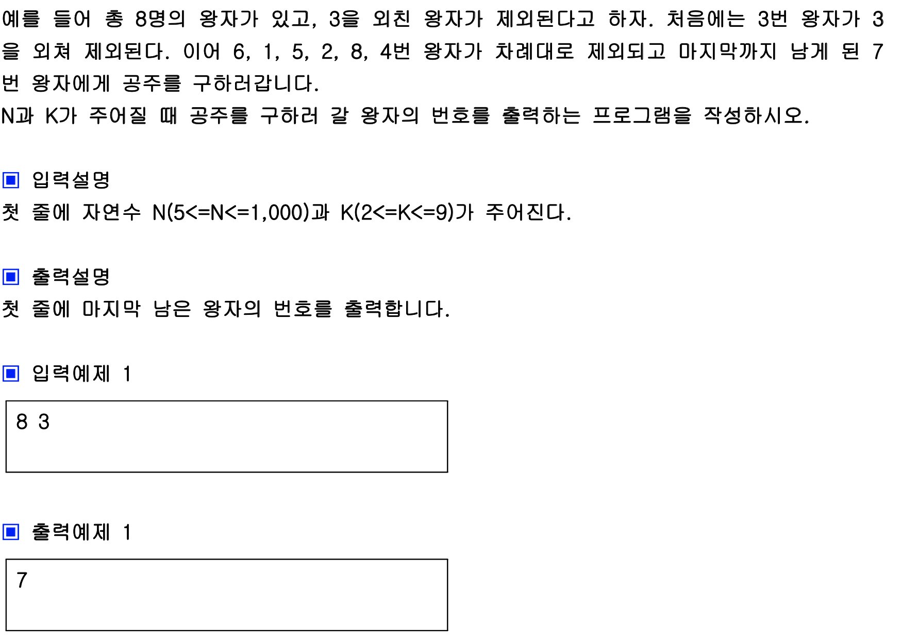
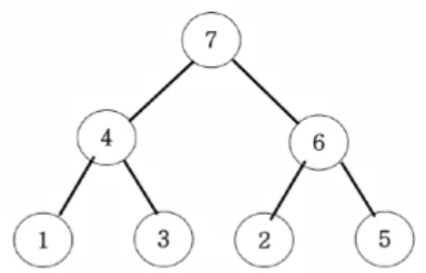
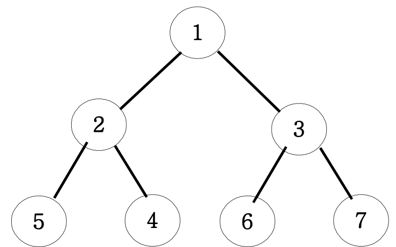
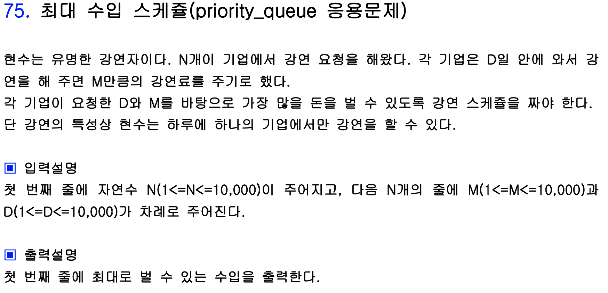
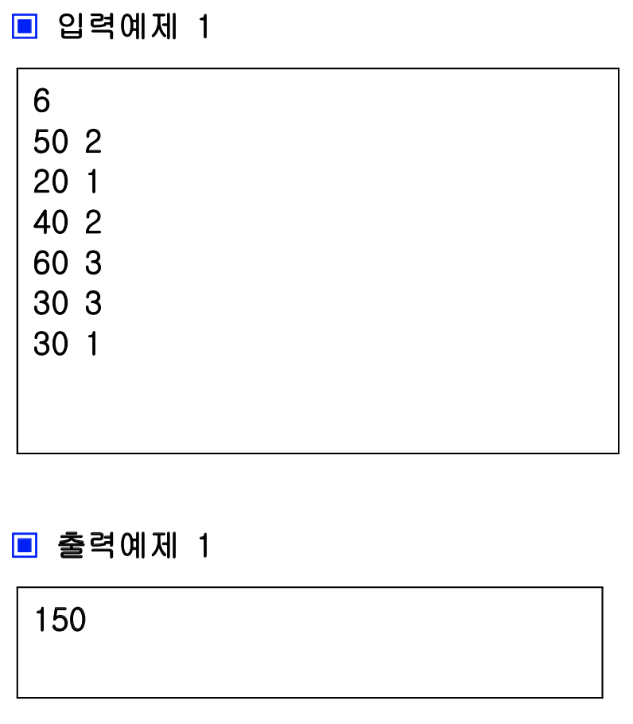

# 큐(Queue), 우선순위 큐(Priority Queue)

### Ex) 공주 구하기





원형 큐를 이용하여 푸는 문제인 것 같다. 주어지는 수도 많지 않아 시간초과가 날 일이 없을 것 같아서 회전하는 것을 하나의 함수로 만들고 K - 1번 씩 N - 1번 반복하고 큐에 남는 수를 출력했다.

```c++
#include <iostream>
#include <queue>

using namespace std;

queue<int> Q;

void rotate_q() {
    Q.push(Q.front());
    Q.pop();
    
    return ;
}

int main() {
    ios::sync_with_stdio(false);
    cin.tie(0);
    cout.tie(0);
    
    int N, K;
    cin >> N >> K;
    
    for (int i = 1; i <= N; i ++) {
        Q.push(i);
    }
    
    for (int i = 0; i < N - 1; i ++) {
        for (int j = 0; j < K - 1; j++) {
            rotate_q();
        }
      	Q.pop();
    }
    
    cout << Q.front() << '\n';
        
    return 0;
}
```


### 우선순위 큐(Priority Queue)

Max 힙을 구현해 놓은 queue STL의 priory_queue를 이용한다. Max 힙이란 부모 노드가 자신의 자식 노드보다 항상 큰 것을 뜻하며, Min 힙은 그 반대로 부모 노드가 자식 노드보다 항상 작은 값을 갖고 있는 힙을 뜻한다.



위 그림이 Max heap, 아래 그림이 Min heap 이다.



최대 힙의 경우에는 c++ 환경에서 ```#include <queue>```를 한 다음 ```priority_queue<int> 이름```과 같이 선언 하여 사용하면 된다. Priority_queue의 디폴트 값이 내림 차순 정렬이기 때문이다.

최소 힙의 경우에는 priority_queue에 숫자를 넣을 때 앞에 **-**를 붙여 넣고, 출력할 때 그 부호를 반대로 해주면 된다. 아예 선언할 때 우선순위를 바꾸어줄 수 있는데 이는 ```priority_queue<int, vector<int>, greater<> >``` 와 같이 선언해 주면 된다. 자세한 포스트는 백준 알고리즘 포스트에 잘 나와있으니 추후 참고하면 될 것 같다.


### Ex) 최대 수입 스케쥴





마지막날까지 와도 되는 강연을 오늘 할 수도 있으니 스케쥴링 순서는 마지막날의 최고 액 -> 오늘 날짜의 최고액 순으로 구해야 한다. 문제 이해를 잘못 했었는데 **D가 2인 것은 D가 1인 것을 구할 때에도 선택할 수가 있다**!!! 이 점을 이해하지 못해서 문제의 답이 이상하다고 생각했었는데 생각을 너무 단순하게 했던 것 같다.

```c++
#include <iostream>
#include <vector>
#include <queue>
#include <algorithm>

using namespace std;

struct Data {
    int money;
    int when;
    Data(int a, int b) {
        money = a;
        when = b;
    }
    bool operator<(Data &b) {
        return when > b.when;
    }
};

int main() {
    ios::sync_with_stdio(false);
    cin.tie(0);
    cout.tie(0);
    
    int N, M, D, max = - 2147000000, res = 0;
    priority_queue<int> PQ;
    vector<Data> T;
    cin >> N;
    for (int i = 0; i < N; i++) {
        cin >> M >> D;
        T.push_back(Data(M, D));
        if (D > max) max = D;
    }
    
    sort(T.begin(), T.end());
    
    int j = 0;
    for(int i = max; i >= 1; i--) {
        for ( ; j < N; j++) {
            if (T[j].when < i) break;
            PQ.push(T[j].money);
        }
        if (!PQ.empty()) {
            res += PQ.top();
            PQ.pop();
        }
    }
    
    cout << res << '\n';
    
    return 0;
}
```

