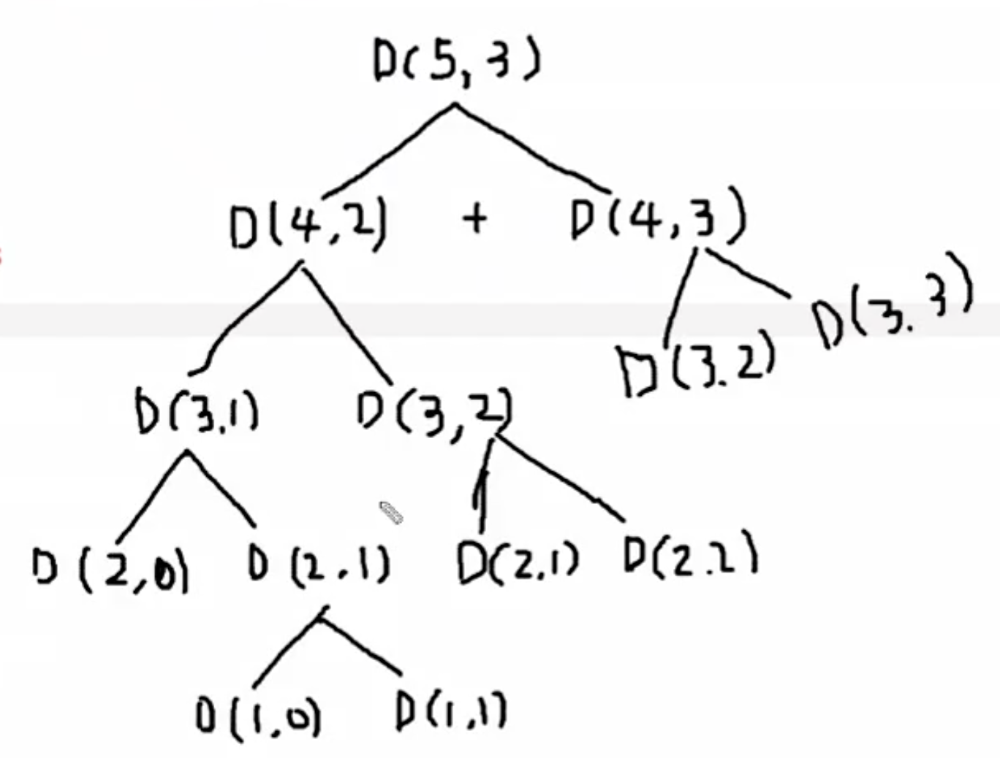

# 이항계수 구하기 (메모이제이션 활용)

### 이항계수?

이항계수란 고등학생 때 배웠던 조합을 뜻한다. 예를 들어 7명 중에 중복되지 않고 순서 없이 3명을 뽑는 경우의 수는 7C3이다. 이것은 7! / 3!으로 계산할 수 있는데 일반화 하면 nCr일 경우 이 값은 n! / r!으로 구할 수 있다. 이 방법 외에 다른 방법으로 nCr의 값을 구할 수 있는 방법이 있는데, ```nCr = n-1Cr-1 + n-1Cr```과 같은 공식으로 구할 수 있다. 

위 공식을 풀어서 설명하자면 다음과 같다. 5명 중에 3명을 뽑는 경우의 수를 생각해 볼 때, 5C3은 4C2 + 4C3과 같다고 할 수 있는데, 이는 ```1 2 3 4 | 5``` 와 같이 맨 뒤의 5를 잘라 놓고 생각해보면 쉽게 유도할 수 있다. 5C3은 5를 제외한 앞의 ```1 2 3 4 ```에서 2명을 뽑고 5를 무조건 포함하는 경우(4C2)와, 5를 제외한 앞의 ```1 2 3 4 ```에서 3명을 뽑고 5를 무조건 포함하지 않는 경우(4C3)의 합임을 직관적으로 알 수 있다. 이에 기반하여 이항계수를 구하는 것을 코드로 구현하면 다음과 같다.

```c++
#include <iostream>

using namespace std;
int dy[21][21];

int DFS(int n, int r) {
  if (dy[n][r] > 0) return dy[n][r];
  if (n == r || r == 0) return 1;
  else return dy[n][r] = DFS(n - 1, r - 1) + DFS(n - 1, r);
}

int main() {
  int n, r;
  cin >> n >> r;
  cout << DFS(n, r);
  return 0;
}
```

5C3의 재귀 호출을 그림으로 표현하면 아래와 같은데, 왼쪽에서 D(3, 2)를 호출해서 그 값을 구하지만 오른쪽 D(4, 3)의 하위에서 같은 값을 또 구하게 된다. 이런 경우에는 불필요한 연산을 방지하기 위해 **메모이제이션** 기법을 활용한다. 

메모이제이션을 하기 위해 2차원 배열 dy를 생성한 후, DFS 재귀 호출값을 리턴할 때, ```dy[n][r]```에 해당 값을 할당 하며 리턴해 준다. 그리고 DFS가 호출되었을 때 ```dy[n][r]```의 값이 0이 아니라면 미리 그 값을 구해놓은 것이므로 재귀호출을 하는 대신, 해당 값을 리턴해줌으로써 불필요한 재귀 호출을 막을 수 있다.



