# Union & Find

### Disjoint Set

Disjoint set이란 한글로 직역하면 서로소 집합이다. 풀어서 설명하자면 각 여러 집합이 있을 때, 이 집합들 사이에는 교집합 관계가 하나도 없을 때 이를 disjoint set이라고 한다. 예를 들어 {1, 2}와 {2, 3}이 주어진다면 이를 합쳐 {1, 2, 3}으로 만들어 버리면 집합들간에 교집합이 없어지게 되고 이를 disjoint set이라고 할 수 있다. 

Disjoint set은 tree구조로 구현하는데, {1, 2}, {2, 3}, {3, 4}, {4, 5}, {6, 7}, {7, 8}, {8, 9}와 같이 관계가 주어진다면 

```
5
|
1 - 2 - 3 - 4                 6 - 7 - 8 - 9
```

와 같이 Disjoint Set이 생성되게 된다. 이 때, 3과 8의 관계를 묻는다면 둘은 다른 집합에 속에 있으므로 관계가 없다고 할 수 있다.

### Ex) 77번. 친구인가?

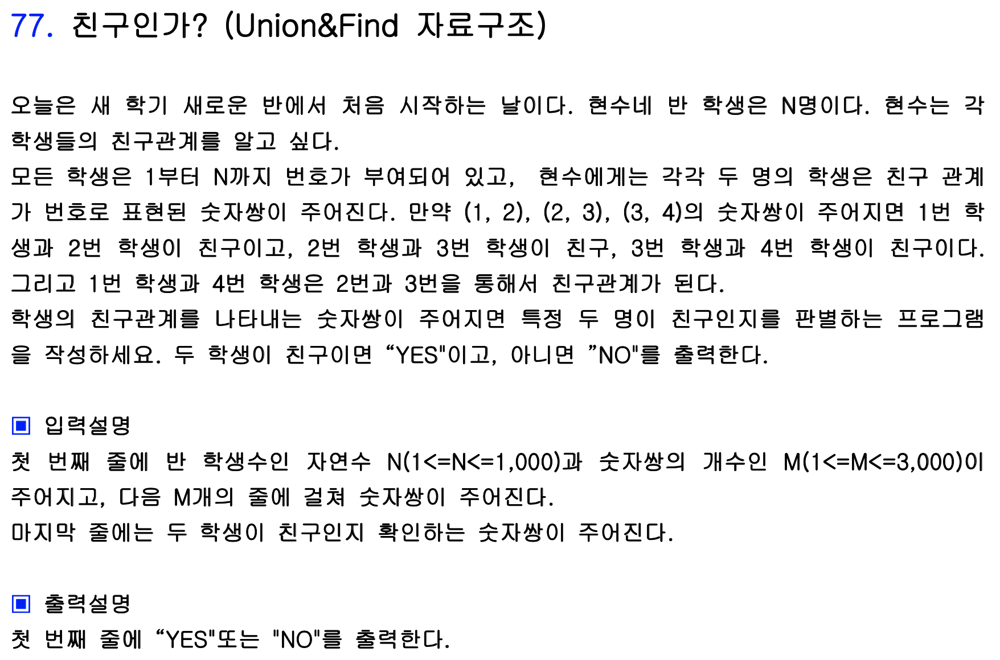

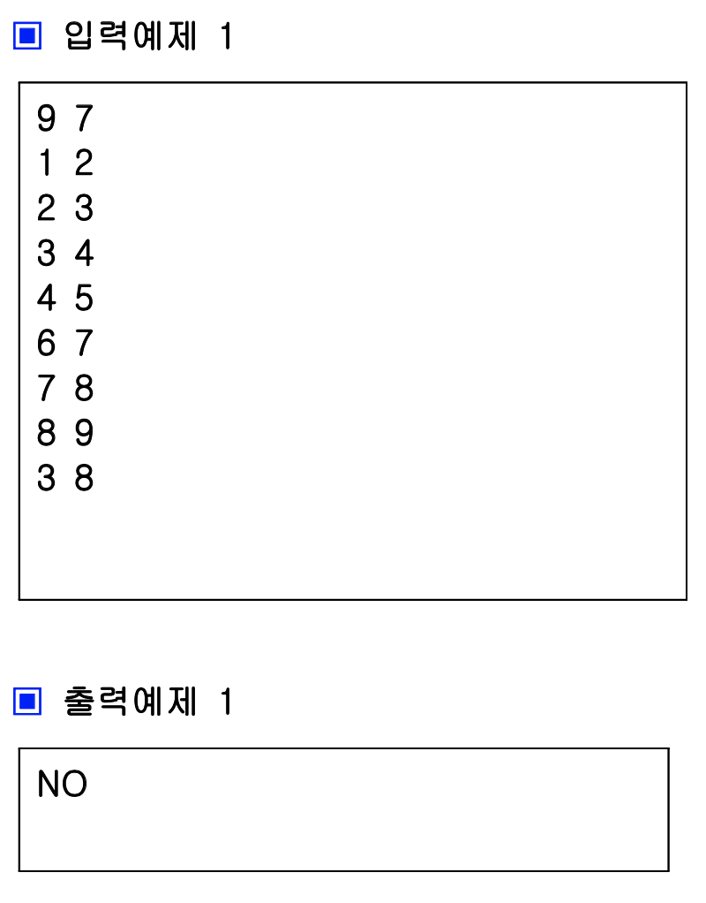

위와 같은 문제가 주어졌을 때, Disjoint Set을 이용하여 풀 수 있는데 그 풀이는 다음과 같다.

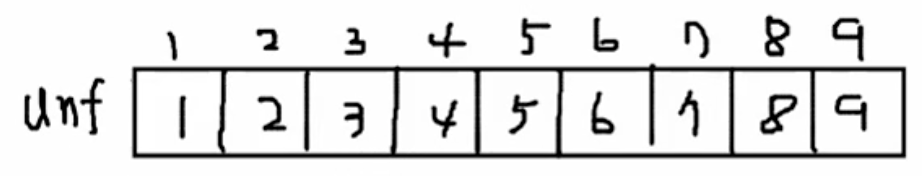

위와 같이 1차원 배열을 선언했을 때, 각 배열의 index 번호는 각 학생을 뜻한다. 각 칸에 있는 수는 집합의 이름을 뜻한다. 맨 처음에는 각 학생이 전부 다른 집합에 속해있다. 이 때 {1, 2}라는 관계가 인풋으로 들어오게 되면 Union(1, 2)를 호출하게 된다. Union 내부에서는 a와 b에 대해 Find를 호출하여 각 학생이 속한 집합의 이름을 리턴받아 오게 된다. 이 때 두 집합의 이름이 다르다면 a학생 을 b학생의 집합에 속하게 한다. 즉 unf[a] = b를 삽입하게 된다.

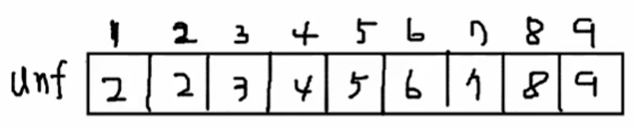

위 연산을 수행하고 난 뒤의 unf 배열의 모습이다. 1번 학생이 2번 학생의 집합과 똑같은 집합에 속하게 된 것을 알 수 있다. 이를 트리로 나타내면 다음과 같다.

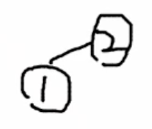

이를 반복하여 {2, 3}, {3, 4}가 들어왔을 때까지 작업하면 unf배열과 트리는 다음과 같이 변하게 된다.

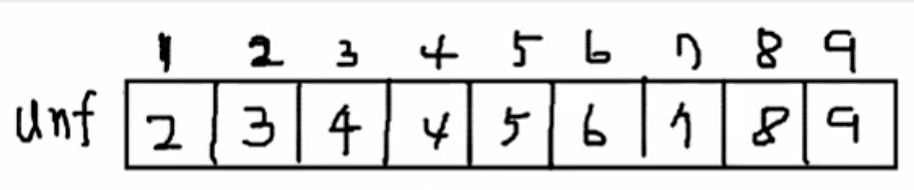

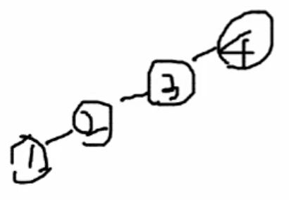

이후 {1, 5}가 들어오게 되면 Find(1) 값은 index와 그 칸의 값이 다르므로 ```Find(2) -> Find(3) -> Find(4) = 4```와 같이 재귀호출되어 결국 4를 리턴받게 된다. Find(2)와 Find(3)도 마찬가지로 4를 리턴 받게 되므로 여기서 Find값은 해당 집합의 루트 값을 반환한다는 것을 알 수 있다. 리턴값을 토대로 기존의 작업을 마무리 하게 되면 아래와 같은 그림이 만들어지게 된다.

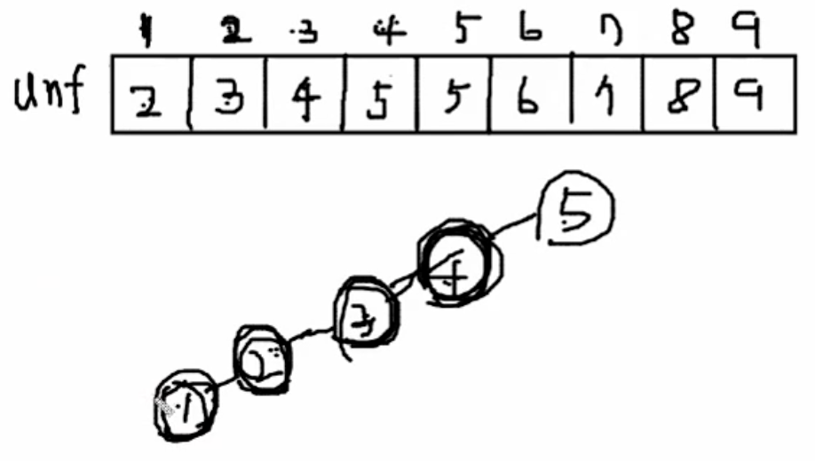

이 규칙에 따라 {6, 7}, {7, 8}, {8, 9}를 순서대로 완료하면 아래 그림이 된다.

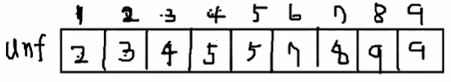

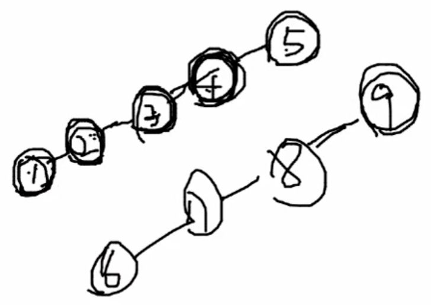

여기서 3과 8이 주어진다면 Find(3)과 Find(8)을 비교하여 같다면 같은 집합 즉, 관계가 있는 것이고 다르다면 관계가 없다고 할 수 있다. Find(3)값은 그 집합의 루트 노드인 5이고 Find(8)값은 그 집합의 루트 노드인 9이다. 따라서 3과 8은 관계가 없다고 할 수 있다.

이를 구현한 코드는 다음과 같다.

```c++
#include<stdio.h>
#include<algorithm>
#include<queue>
#include<vector>
using namespace std;
int unf[1001];

int Find(int v){
    if(v==unf[v]) return v;
    else return Find(unf[v]);
}

void Union(int a, int b){
    a=Find(a);
    b=Find(b);
    if(a!=b) unf[a]=b;
}

int main(){
    freopen("input.txt", "rt", stdin);
    int i, n, m, a, b, fa, fb, j;
    scanf("%d %d", &n, &m);
    for(i=1; i<=n; i++){
        unf[i]=i;
    }
    for(i=1; i<=m; i++){
        scanf("%d %d", &a, &b);
        Union(a, b);
    }
    scanf("%d %d", &a, &b);
    fa=Find(a);
    fb=Find(b);
    if(fa==fb) printf("YES\n");
    else printf("NO\n");
    return 0;
}
```

위와 같이 구현한다면 답을 구할 수 있겠지만 1~100까지 이어진 경우를 생각할 때, Find(1)을 호출하면 재귀가 99번 일어나게 돼 굉장히 비효율적이다. 이를 해결하기 위해 일렬로 쭉 트리를 만드는 것이 아니라 루트 노드 아래의 모든 노드가 1의 레벨만 갖도록 수정할 수 있다. 위 Find 함수 내에서 ```else return Find(unf[v]);``` 코드를 **```else return unf[v] = Find(unf[v]);```로 수정하면 경로를 압축할 수 있다**.

위와 같이 코드를 수정하면 {1, 5}에서 기존과의 차이를 알 수 있다.

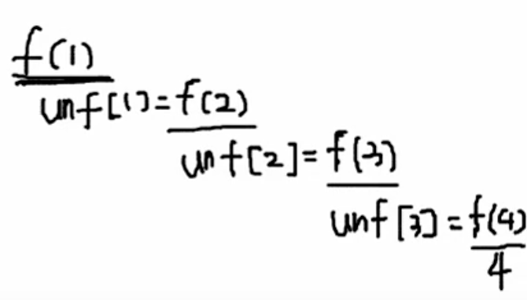

메모이제이션 기법처럼 재귀를 호출하며 unf를 갱신하며 리턴값을 받기 때문에 Find(1)을 완료하고 나면 unf배열은 다음과 같이 변한다.

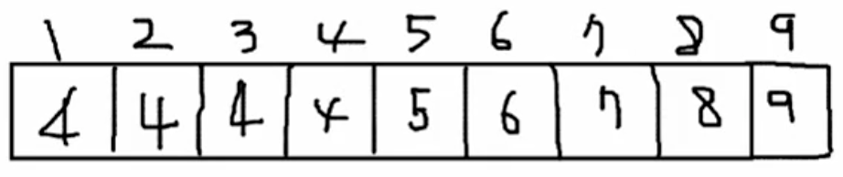

Find(5)까지 완료하고 Union을 완료하게 되면 unf와 트리 상태는 다음과 같이 변하게 된다.

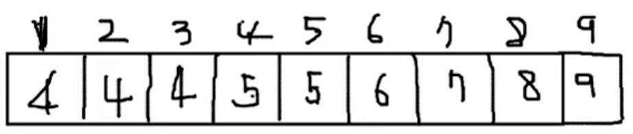

```
		5
		|
		4
	/ | \
1   2  3 
```

따라서 Find(1)을 수행하면 ```Find(4) - > Find(5)```로 경로가 단축되어 시간을 절약할 수 있다!!


### Kruskal MST

### Ex) 78번 원더랜드

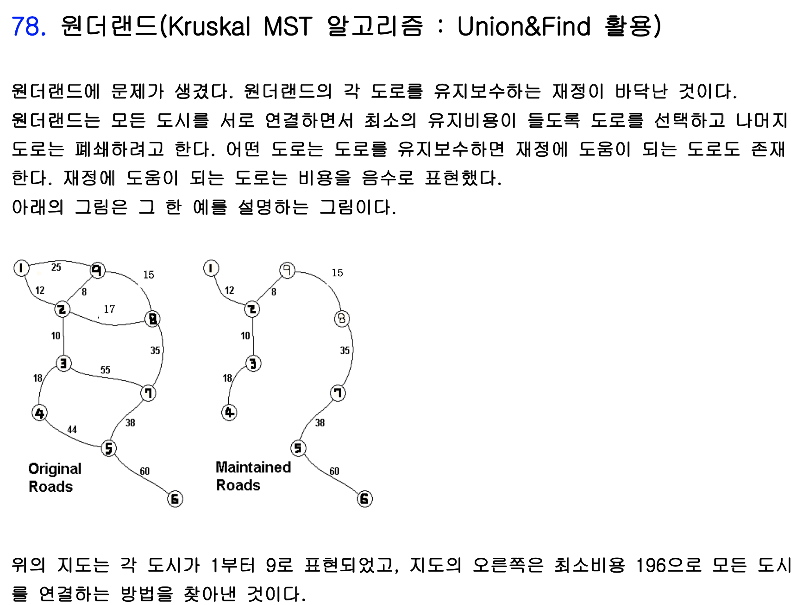

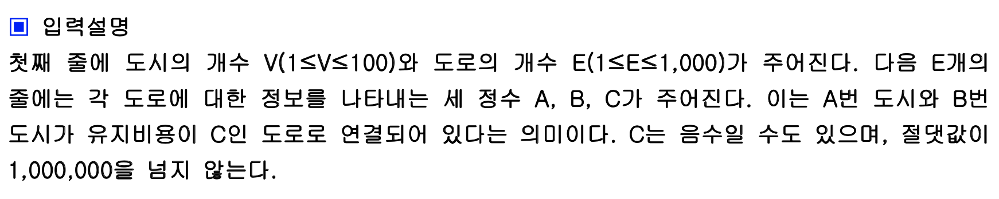

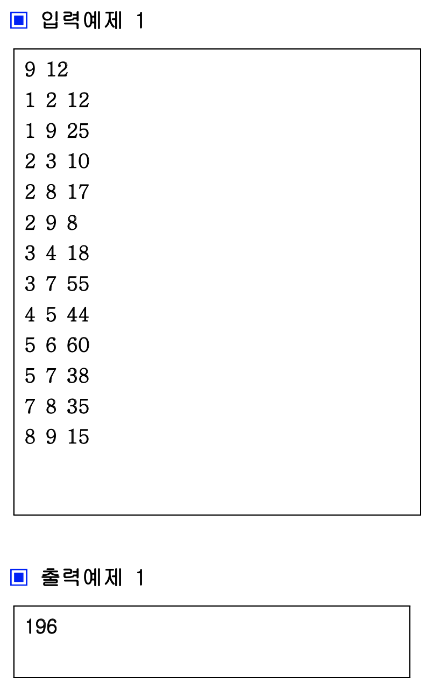

이 문제의 경우 그래프가 주어지면 최소한의 간선만을 남기기 위해 트리 구조로 만들면 된다. **트리의 경우 n개의 노드가 있으면 n-1개의 간선만 있으면 되기 때문**이다.

간선의 정보가 주어지면 간선의 가중치를 기준으로 오름차순으로 정렬한다. 여기서 가중치가 작은 순서대로 선택을 하되 선택했을 때 그래프상에서 회로가 만들어지면 안된다!! 이 때 union and find를 응용하여 두 노드가 주어졌을 때 Find 값이 다르면 union을 하게 된다.

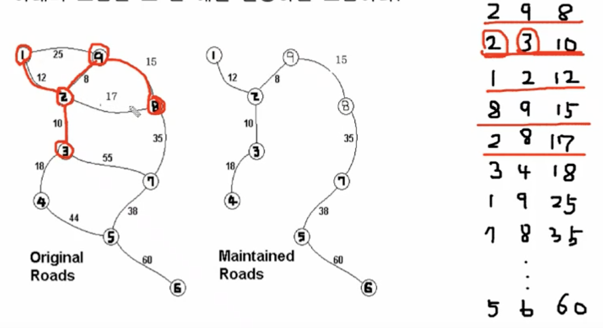

오름차순 정렬한 간선을 차례대로 선택해 나가면 위와 같은 간선들을 선택하게 되는데, {2, 8, 17}을 만나서 2와 8의 Find값을 구하면 9라는 같은 값이 나오게 된다. 따라서 해당 간선은 거르고 다음 간선으로 넘어가게 된다. 이 과정을 코드로 구현하면 다음과 같다.

```c++
#include<stdio.h>
#include<algorithm>
#include<queue>
#include<vector>
using namespace std;
int unf[10001];

struct Edge{
	int s;
	int e;
	int val;
	Edge(int a, int b, int c){
		s=a;
		e=b;
		val=c;
	}
	bool operator<(const Edge &b)const{
		return val<b.val;
	}
};

int Find(int v){
	if(v==unf[v]) return v;
	else return unf[v]=Find(unf[v]);
}

void Union(int a, int b){
	a=Find(a);
	b=Find(b);
	if(a!=b) unf[a]=b;
}

int main(){
	//freopen("input.txt", "rt", stdin);
	vector<Edge> Ed;
	int i, n, m, a, b, c, cnt=0, res=0;
	scanf("%d %d", &n, &m);
	for(i=1; i<=n; i++){
		unf[i]=i;
	}
	for(i=1; i<=m; i++){
		scanf("%d %d %d", &a, &b, &c);
		Ed.push_back(Edge(a, b, c));	
	}
	sort(Ed.begin(), Ed.end());
	for(i=0; i<m; i++){
		int fa=Find(Ed[i].s);
		int fb=Find(Ed[i].e);
		if(fa!=fb){
			res+=Ed[i].val;
			Union(Ed[i].s, Ed[i].e);
		}
	}
	printf("%d\n", res);
	return 0;
}
```


### Prim 알고리즘

동일 문제를 Prim 알고리즘으로 접근하는 방법이다. 앞서 간선을 오름차순으로 정렬하여 선택해 간 방법과는 달리 시작 노드를 하나 정하고 노드를 추가하면서 진행하는 방식이다. 우선순위 큐를 사용하며 큐에는 {노드 이름, 그 노드로 향하는 간선의 가중치} 를 저장한다. 우선순위 큐는 간선의 가중치를 기준으로 오름차순으로 정렬하여 min Heap을 생성한다.

대략적인 Prim 알고리즘의 전개는 다음과 같다. 맨 처음 기준을 1번 노드로 잡으면 {1, 0}에서 시작한다. 처음 시작할 때는 1번 노드로 이어지는 간선이 없으므로 가중치는 0이다. 우선순위 큐에서 {1, 0}을 꺼내고 chk배열의 1번 인덱스가 0이라면 해당 노드와 연결된 모든 노드를 우선순위 큐에 넣는다. 예제에서는 {2, 12}, {9, 25}가 있으므로 두 pair를 우선순위 큐에 넣게 된다. 우선 순위 큐 내부에서 가중치를 기준으로 작은 것이 먼저 나오기 때문에 {2, 12}가 큐에서 빠져 나오고 chk배열의 2번 인덱스가 0이라면 chk배열의 2번 인덱스를 1로 체크해 준다. 이후 2번 노드와 연결된 모든 노드를 큐에 넣어준다. 예제에서는  {9, 8}, {3, 10}, {8, 17}이 들어간다. 이렇게 되면 큐에는 ```{9, 8}, {3, 10}, {8, 17}, {9, 15}``` 와 같이 정렬되어 있고, top을 뽑아 작업을 계속 반복한다.

중간에 뽑은 노드를 체크했을 때, chk배열의 값이 1일 경우에는 continue를 사용하여 넘어가면 된다. 이런 작업을 반복하게 되면 결국 앞에서 Kruskal로 구했을 때와 동일하게 Spanning tree를 구할 수 있다.

```c++
#include<stdio.h>
#include<algorithm>
#include<queue>
#include<vector>
using namespace std;
int ch[30];
struct Edge{
	int e;
	int val;
	Edge(int a, int b){
		e=a;
		val=b;
	}
	bool operator<(const Edge &b)const{
		return val>b.val;
	}
};

int main(){
	freopen("input.txt", "rt", stdin);
	priority_queue<Edge> Q;
	vector<pair<int, int> > map[30];
	int i, n, m, a, b, c, res=0;
	scanf("%d %d", &n, &m);
	for(i=1; i<=m; i++){
		scanf("%d %d %d", &a, &b, &c);
		map[a].push_back(make_pair(b, c));	
		map[b].push_back(make_pair(a, c));
	}
	Q.push(Edge(1, 0));
	while(!Q.empty()){
		Edge tmp=Q.top();
		Q.pop();
		int v=tmp.e;
		int cost=tmp.val;
		if(ch[v]==0){
			res+=cost;
			ch[v]=1;
			for(i=0; i<map[v].size(); i++){
				if(ch[map[v][i].first]==0){
					Q.push(Edge(map[v][i].first, map[v][i].second));
				}
			}
		}
		
	}
	printf("%d\n", res);
	return 0;
}
```

