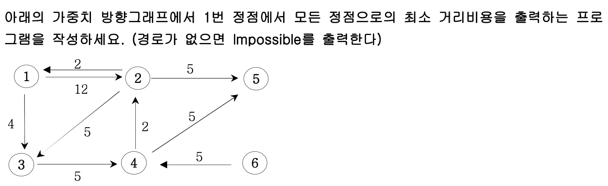
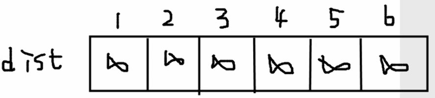
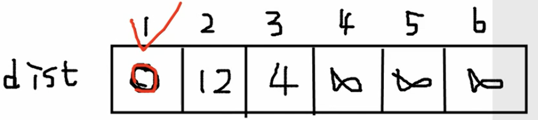
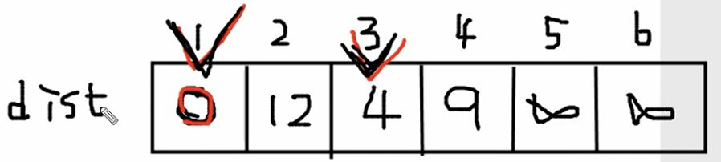
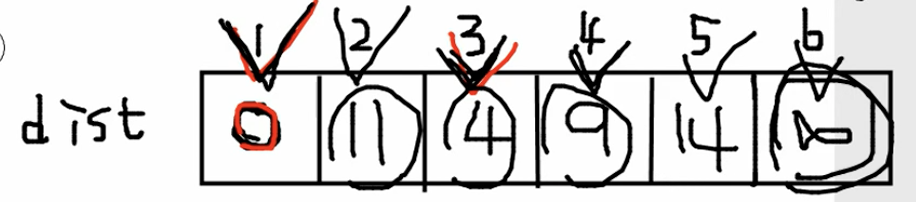
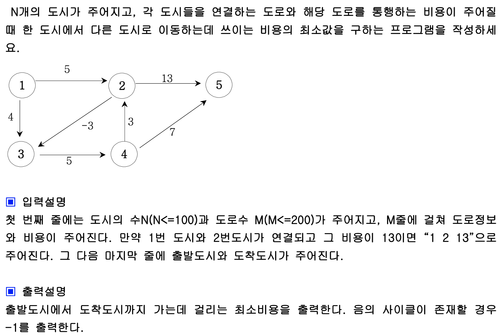
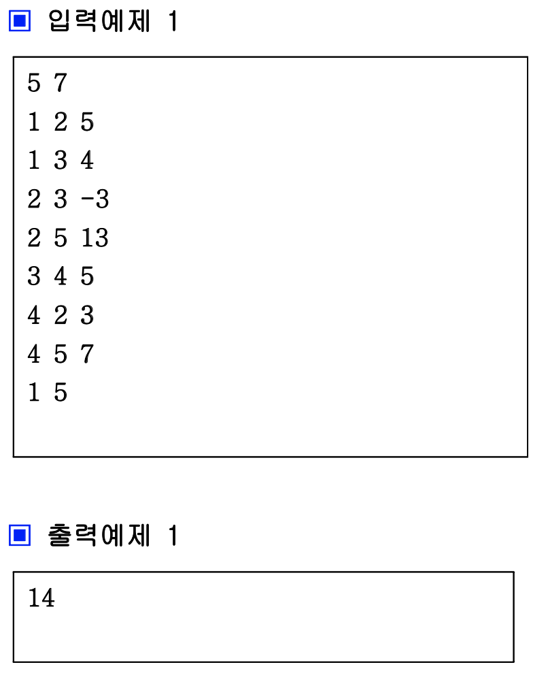

# 최단거리 알고리즘

### Dijkstra 알고리즘

어떤 그래프가 주어졌을 때, 각 노드간의 최소 거리를 구할 때 사용하는 알고리즘이다. 이 때 주의해야 할 점은 **간선의 가중치 값이 무조건 양수**여야 한다는 것이다. 예제를 들어 설명하자면 다음과 같다.



위와 같이 문제가 주어졌을 때, 1번 노드로 부터 각 노드까지의 최소거리를 저장하기 위해 배열을 하나 선언한다.



위와 같이 dist 배열을 선언하고 초기 값은 무한대로 설정하도록 한다. 실제 구현 시, **int값의 표현 범위 중 최대 값은 2^31-1이므로 그와 근접한 2147000000으로 초기화** 한다. 이후 1번 정점이 기준이므로 1번 정점의 dist값을 0으로 바꾼다. dist 배열의 뜻은 1번 정점에서 dist 배열의 각 인덱스로 향하는 최소 거리이다. 따라서 1번 정점에서 1번 정점으로 가는 최소 거리는 0이므로 dist[1] = 0이 된다. 

이후 **dist배열의 가장 작은 값은 선택하여 해당 값의 인덱스에서 향할 수 있는 모든 노드**에 대해 가중치를 검사하여 dist를 갱신해 주는데, 여기서는 2, 3번 노드로 갈 수 있다. 이 때 dist의 1번 인덱스를 이미 선택했다는 것을 **chk배열에 기록**해 두어야 한다. 2번 노드의 경우에는 가중치가 12이고 이전 가중치의 합은 0이므로 0 + 12 < 2147000000 이므로 dist[2] = 12로 갱신, 3번 노드로 가는 경우에는 가중치가 4이고 마찬가지로 0 + 4가 무한대보다 작기 때문에 dist[3] = 4로 갱신해 준다. 



여기서 다시 최솟값은 구하면 4가 입력되어 있는 3번 인덱스 이므로 chk[3]을 1로 바꾸어 주고 3에서 갈 수 있는 노드에 대해 검사해 준다. 4번 노드로 가중치가 5인 간선을 이용해 갈 수 있으므로 4 + 5 = 9를 계산하고 해당 값이 2147000000보다 작으므로 dist[4]에 9를 입력해 준다.



이 과정을 끝까지 반복하게 되면 다음과 같이 dist가 수정된다.



6번은 1번으로부터 갈 수 없으므로 무한대 그대로 있고 나머지 노드는 최소값이 구해진 것을 확인할 수 있다. 여기서 더 개선할 점은, 매번 dist 배열에서 최소값을 찾아야 하는데, dist의 인덱스가 확장되면 시간복잡도가 기하급수적으로 증가한다. 따라서 Min heap을 구현한 우선순위 큐에 {노드, 거리}를 삽입하여 top을 뽑아냄으로써 시간 복잡도를 ```n -> logn```으로 줄일 수 있다. 구현 코드는 다음과 같다.

```c++
#include <iostream>
#include <queue>

using namespace std;

struct Edge{ 
  int vex;
  int dis;
  Edge(int a, int b){
    vex = a;
    dis = b;
  }
  bool operator<(const Edge &b) const{
    return dis > b.dis;
  }
};

int main() {
  priority_queue<Edge> Q;
  vector<pair<int, int> > graph[30];
  int i, n, m, a, b, c;
  cin >> n >> m;
  vector<int> dist(n + 1, 2147000000);
  for (i = 1; i <= m; i ++) {
    cin >> a >> b >> c;
    graph[a].push_back({b, c});
  }
  
  Q.push(Edge(1, 0));
  dist[1] = 0;
  while(!Q.empty()) { 
    int now = Q.top().vex;
    int cost = Q.top().dis;
    Q.pop;
    
    if (cost > dist[now]) continue;
    for (i = 0; i < graph[now].size; i ++) {
      int next = graph[now][i].first;
      int nextDis = cost + graph[now][i].second;
      if (dist[next] > nextDis) {
        dist[next] = nextDis;
        Q.push(Edge(next, nextDis));
      }
    }
  }
  for (i = 2; i <= n; i ++) {
    if (dist[i] != 2147000000) cout << i <<" : " << dist[i] << '\n';
    else cout << i << " : impossible" << '\n';
  }
  return 0;
}
```


### Bellman-ford 알고리즘

다익스트라와 마찬가지로 노드간 이동할 때 가중치의 최소값을 구할 수 있는 알고리즘이다. 여기서 주의할 점은 음의 사이클이 존재 해서는 안된다는 것이다. 예를 들어 아래 그림에서 ```1 -> 2 -> 3 -> 4 -> 2 -> 5``` 와 같이 2를 두 번 거치게 된다면 싸이클이 존재하게 되어 계속해서 2에 해당하는 가중치가 감소하게 될 것이다. 이를 음의 싸이클이라 하며 이를 방지하기 위해 노드가 N개인 그래프에서 최대로 사용할 수 있는 간선의 수는 N - 1로 제한한다.





