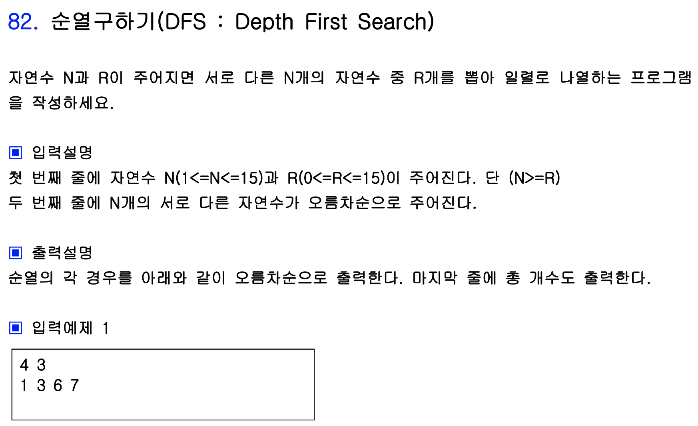
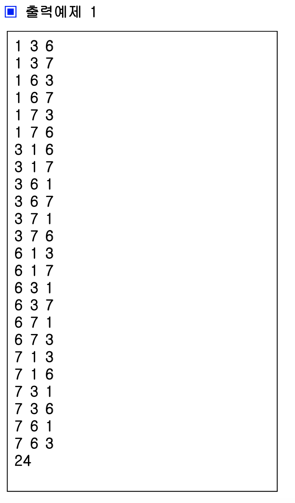
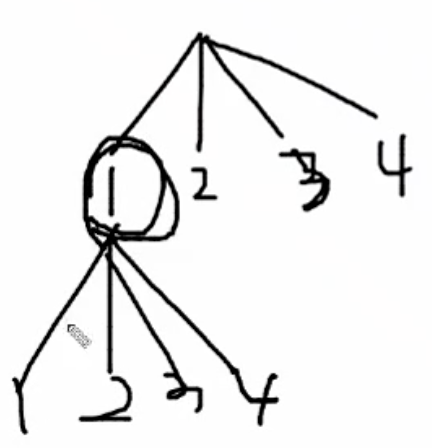
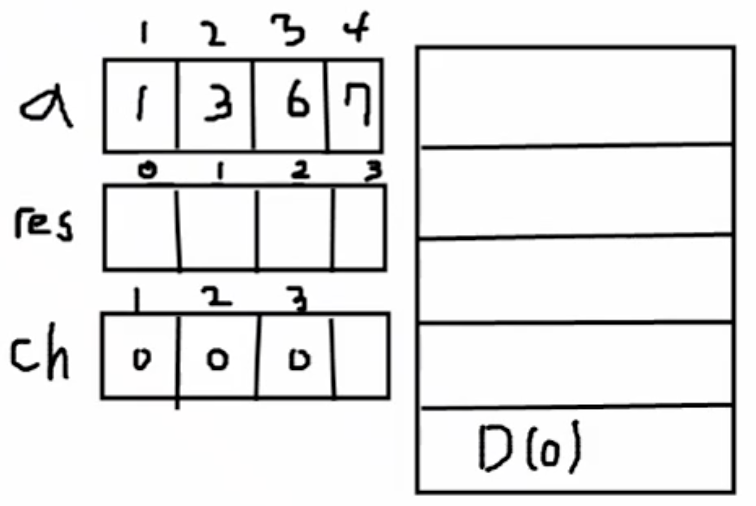
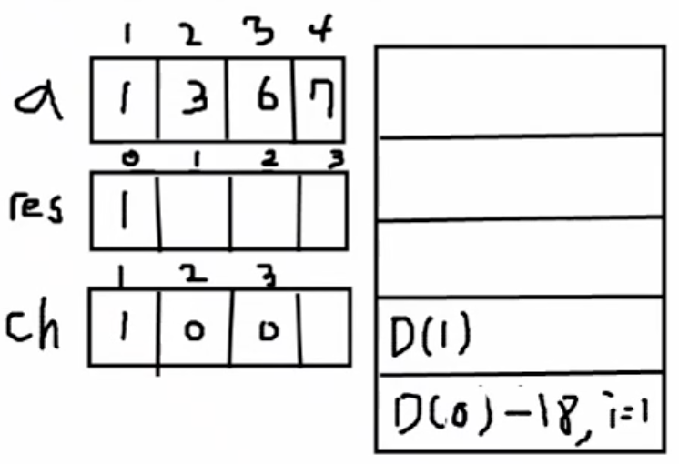

# DFS, BFS 추가 문제 풀이

## 문제 1. 순열 구하기 - DFS





백준에서 풀어보았던 문제이다. 보자마자 DFS로 접근하는 법은 알았지만 DFS의 기본적인 개념이 희미해져 재귀호출 구현을 살짝 헷갈렸던 부분이 있었다. 내가 풀 때는 이진 트리로 구현하여 한 레벨에 하나의 수를 쓸지 안 쓸지 결정하는 방식으로 구현하였으나 여기서는 한 번 레벨을 내려갈 때 4개의 수가 있다면 4개의 수를 모두 뻗어나가고 chk가 1이라면 pruning하는 방식으로 구현하였다.



```c++
#include<stdio.h>
using namespace std;
int n, r, cnt=0;
int a[20], res[20], ch[20];
void DFS(int L){
	if(L==r){
		for(int j=0; j<L; j++){
			printf("%d ", res[j]);
		}
		cnt++;
		puts("");
	}
	else{
		for(int i=1; i<=n; i++){
			if(ch[i]==0){
				res[L]=a[i];
				ch[i]=1;
				DFS(L+1);
				ch[i]=0;
			}
		}
	}
}

int main(){
	freopen("input.txt", "rt", stdin);
	scanf("%d %d", &n, &r);
	for(int i=1; i<=n; i++){
		scanf("%d", &a[i]);
	}
	DFS(0);
	printf("%d\n", cnt);
	return 0;
}
```

전개 과정을 나타내기 위해 프로그램의 변수를 그림으로 나타내면 다음과 같다.



맨 처음 레벨이 0일 때, N의 갯수만큼 for문이 돌게 된다. 이 때 i는 1 ~ 4를 돌게 되며 ch[i] 가 0이면 그 수를 아직 사용하지 않은 것이므로 ch[i]를 체크해 주고 res[L]에 a[i]를 삽입해 준다. 이후 Level을 증가시켜 DFS(L + 1)을 호출하고 이 DFS 바로 아래줄에서 **ch[i]를 0으로 다시 바꿔준다**. 다시 뒤로 돌아가 그 수를 다시 사용할 수 있기 때문이다!!

