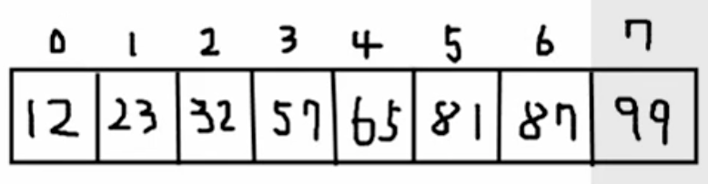
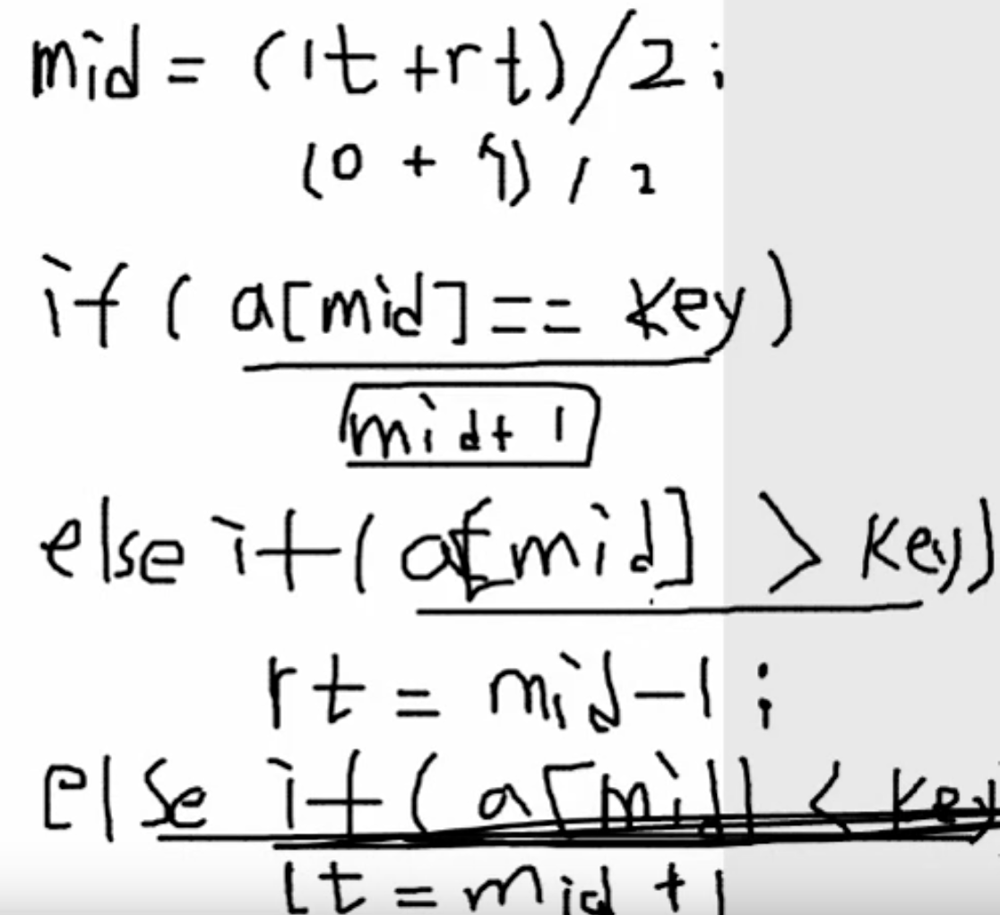
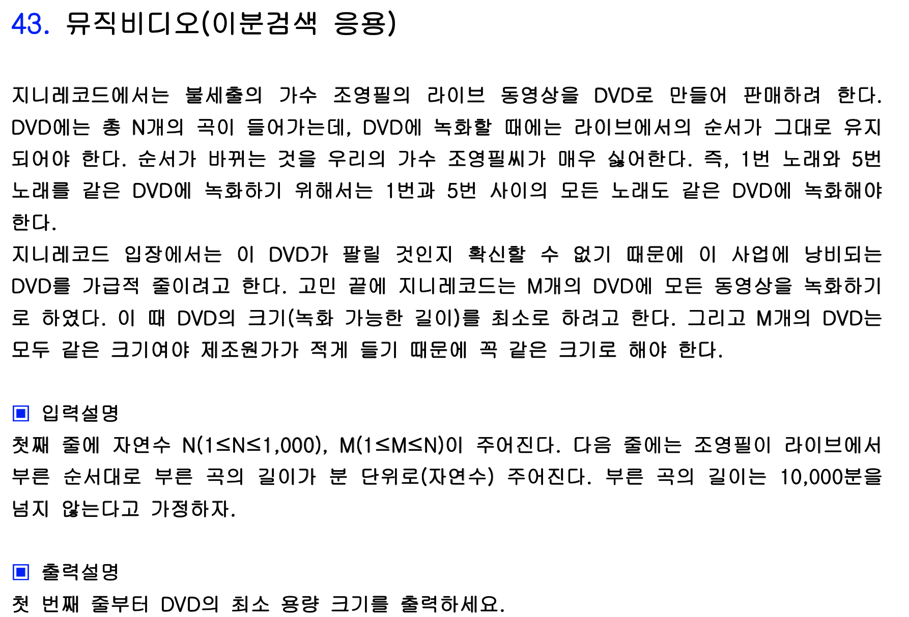
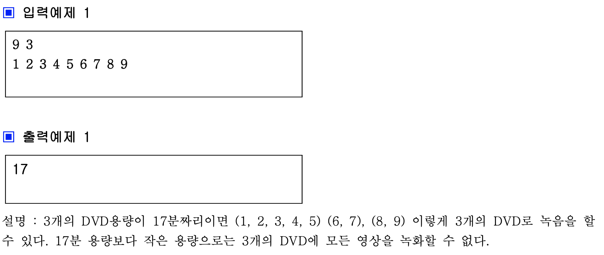
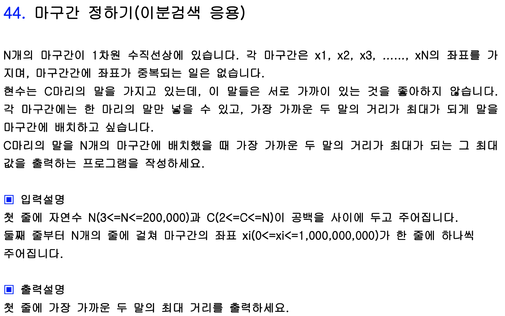
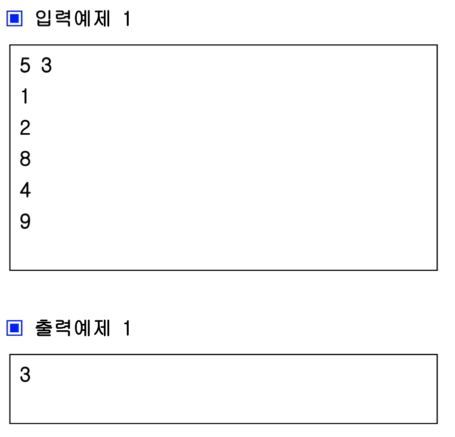

# 이분 검색

이분 검색은 **이미 정렬되어 있는 수**들에 대해 사용할 수 있는 검색 방법이다. 총 시간 복잡도는 logN이며 아래와 같이 찾고자 하는 수를 탐색한다.

```
23 87 65 12 57 32 99 81
```

위와 같이 8개의 수가 입력되고 이 중에서 ```32```가 몇  번째로 큰 수인지 알아내고자 한다. 이 때 이분검색을 사용하려면 우선 정렬 되어 있어야 하므로 오름차순으로 정렬한다.

```
12 23 32 57 65 81 87 99
```



정렬된 결과는 위와 같으며 맨 왼쪽 값의 인덱스를 lt(left), 맨 오른쪽 값의 인덱스를 rt(right)라고 하자. 맨 먼저 ```(lt + rt) / 2```를 통해 mid 값을 구한다. mid 값을 구한 후, 찾고자 하는 값 32(이제부터는 key라고 하겠다) arr[mid]값이 key값과 같은지를 검사한다. 만약 같다면 mid + 1값을 출력한 후 프로그램을 종료한다(인덱스는 0부터 시작하므로).

그렇지 않다면 key 값과 arr[mid]값을 비교하여 arr[mid] 값이 더 크다면 key값은 arr[mid]보다 앞에 존재하므로 rt값을 mid - 1로 변경한 후 다시 위 과정을 반복한다. 만약 arr[mid] < key라면 key는 mid보다 뒤에 존재하는 것이므로 lt를 mid + 1로 변경한다(mid값을 미리 검사했으므로). 



이분 탐색은 이미 오름차순으로 정렬이 됐을 경우를 전제로 하기 때문에 위와 같은 과정을 반복하게 되면 logN의 시간 복잡도로 찾고자 하는 수의 위치를 찾을 수 있다.

```c++
#include <iostream>
#include <vector>
#include <algorithm>

using namespace std;

int main() {
    ios::sync_with_stdio(false);
    cin.tie(0);
    cout.tie(0);
    
    int n, key, lt = 0, rt, mid;
    
    cin >> n >> key;
    vector<int> a(n);
    
    for (int i = 0; i < n; i ++) {
        cin >> a[i];
    }
    
    sort(a.begin(), a.end()); // 이진검색을 위해 정렬
    
    rt = n - 1;
  
    while(lt <= rt) { // lt와 rt가 교차되면 안됨
        mid = (lt + rt) / 2;
        if (a[mid] == key) {
            cout << mid + 1 << '\n';
            break;
        } else if (a[mid] > key) rt = mid - 1;
        else lt = mid + 1;
    }
    
    return 0;
}
```


## Ex) 뮤직비디오





이걸 어떻게 이진 탐색으로 풀 수 있을까 싶던 문제였다. 우선 접근법은 다음과 같다. 여기서 주어진 노래의 길이를 전부 합한 값은 45이다. DVD를 최소 개수로 하는 경우는 하나의 DVD 안에 모든 곡을 다 담는 경우일 것이므로 **하나의 DVD 용량은 무조건 45보다는 작거나 같을 것**이다. 또한 최악의 경우는 각 DVD에 한 곡씩만 녹음하는 경우일 것이므로 하나의 **DVD 용량은 무조건 제일 긴 곡의 길이와 같거나 클 것**이다.

따라서 DVD의 최소 용량 크기는 **제일 긴 곡의 길이 ~ 모든 곡의 길이의 합 사이**에서 구할 수 있다(여기서는 9 이상 45이하). 그러므로 제일 긴 곡의 길이를 left, 모든 곡의 길의의 합을 right로 두고 mid값을 구한 후에 해당 mid값을 용량으로 하는 DVD를 가지고 주어진 9개의 노래를 3개 이하의 DVD에 담을 수 있다면 해당 mid값은 답의 후보 중 하나이다. 

예를 들어 9와 45로 mid를 구한다면 27이라는 값이 나오는데 용량이 27인 DVD를 사용하면 ```1 2 3 4 5```와 ```7 8 9``` 를 같은 DVD에 녹음하여 총 2개의 DVD만으로 모든 곡을 녹음할 수 있다. 따라서 27을 정답인 res에 저장한다. **27이 정답이라면 28부터 45까지는 무조건 정답이 될 수 있는 경우이기 때문에 더 이상 검사할 필요가 없으므로** right를 mid - 1로 하여 같은 작업을 반복한다.

그 다음은 9와 26을 기반으로 mid를 구하면 14라는 값이 나오게 된다. 용량이 14인 DVD를 사용하면 ```1 2 3 4```, ```5 6```, ```7```, ```8```, ```9```와 같이 5개의 DVD를 사용해야 하므로 주어진 3개 보다 초과하게 된다. 따라서 **14보다 작은 값들은 절대 답이 될 수 없으므로** 검사하지 않고 left를 mid + 1로 하여 작업을 반복한다.

다음으로는 15와 26 사이의 값에서 검사를 하게 되고 결국 최종적으로 17이라는 값이 res에 저장된다. 이진 탐색을 반복할 수록 더 최적의 작은 값이 나오므로 조건에 맞는 답이 나올 때마다 res에 저장하면 답을 구할 수 있다.

```c++
#include <iostream>

using namespace std;

int a[1001], n;

int dvd_num(int size) { // size 크기를 갖는 dvd로 모든 노래를 담을 때 몇개의 dvd가 필요한가?
    int cnt = 1, sum = 0; // dvd는 무조건 한개는 필요
    
    for (int i = 1; i <= n; i ++) {
        if (sum + a[i] > size) { // i번째 곡을 이 dvd에 추가하면 정해진 size를 넘어버린다
            cnt ++; // dvd갯수를 하나 늘리고
            sum = a[i]; // 새로운 dvd에는 i번째 곡을 넣고 다시 그 다음 곡 추가
        } else
            sum += a[i];
    }
    
    return cnt;
}

int main() {
    ios::sync_with_stdio(false);
    cin.tie(0);
    cout.tie(0);
  
    int m, lt = 0, rt = 0, mid, res = 0, max_len = -2147000000;
    
    cin >> n >> m;
    
    for (int i = 1; i <= n; i ++) {
        cin >> a[i];
        rt = rt + a[i];
        if (a[i] > max_len) max_len = a[i];
    }
  
    lt = max_len;
        
    while(lt <= rt) {
        mid = (lt + rt) / 2;
        
        if (dvd_num(mid) <= m) {
            res = mid;
            rt = mid - 1;
        } else
            lt = mid + 1;
    }
    
    cout << res << '\n';
    
    return 0;
}
```


## Ex) 마구간 정하기





앞서 풀어보았던 문제와 비슷하지만 약간 다른 문제이다. 구해야 하는 답인 두 말 간의 최대 거리의 범위를 정한 후 그 범위를 조정해가며 이진 탐색으로 푸는 문제이다.

두 말은 무조건 서로 다른 좌표에 있으므로 두 말 간의 최대거리의 최소값은 1이다. 또한 두 말 간의 최대 거리는 제일 먼 좌표에 있는 말의 좌표값보다는 무조건 작거나 같을 것이다. 이 조건 하에 이 문제에서는 1 이상 9 이하의 값 중에 답이 존재하게 된다.

앞 문제와 동일하게 (rt + lt) / 2로 mid를 구하면 5이고 두 말 간의 최대값을 5로 설정했을 때, 주어진 좌표 상에서 말을 몇 마리 배치할 수 있는지를 검사하여 입력받은 C값(3)보다 작거나 같으면 그 값은 답이 될 수 있는 후보이다. 

그것을 확인하는 방법은 맨 앞에 위치한 마구간에 말을 한 마리 넣고, 그 다음 마구간부터 말이 있는 마구간과의 거리를 구해 5이상이면 그 곳에 말을 한마리 다시 넣고 그 마구간을 기준으로 설정한다. 그것을 반복하게 되면 이 경우에는 ```1 8``` 두 마구간에만 말을 배치하여 Count에서 2가 리턴된다. 2 < C이므로 검사한 mid(5) 이상의 값은 전부 정답이 될 수 없다. 따라서 ```rt = mid - 1```로 설정하고 다시 반복문을 시작한다.

위 과정을 반복하게 되면 최종적으로 답이 3으로 나오게 된다.

```c++
#include<stdio.h>
#include<vector>
#include<algorithm>
using namespace std;
int n;
int Count(int len, int x[]){
	int i, cnt=1, pos=x[1];
	for(i=2; i<=n; i++){
		if(x[i]-pos>=len){
			cnt++;
			pos=x[i];
		}
	}
	return cnt;
}
int main(){
	//freopen("input.txt", "rt", stdin);
	int m, i, lt=1, rt, mid, res;
	scanf("%d %d", &n, &m);
	int *x = new int[n+1];
	for(i=1; i<=n; i++){
		scanf("%d", &x[i]);
	}
	sort(x+1, x+n+1);
	rt=x[n];
	while(lt<=rt){
		mid=(lt+rt)/2;
		if(Count(mid, x)>=m){
			res=mid;
			lt=mid+1;
		}
		else rt=mid-1;
	}
	printf("%d\n", res);
	delete[] x;
	return 0;
}
```

벡터를 사용하지 않고 배열의 크기를 동적으로 할당하는 방법을 배웠다. ```int *x = new int[n + 1]```과 같이 해주면 n을 입력받고 난 후 n의 크기에 맞추어 배열을 생성할 수 있다. 이 경우에는 malloc과 같이 프로그램이 끝날 때 ```delete[] x```를 써서 메모리를 해제해 주어야 한다!