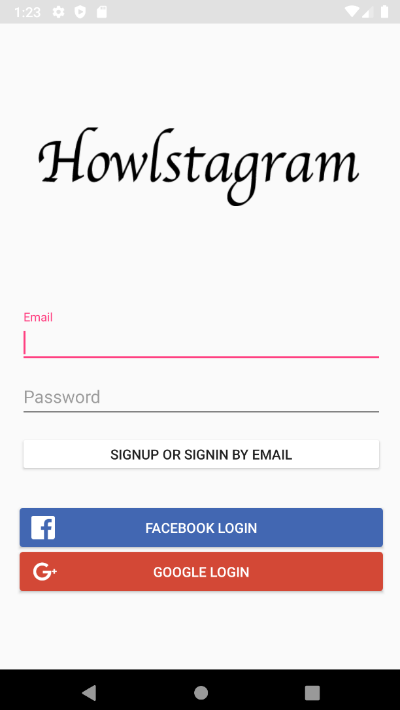
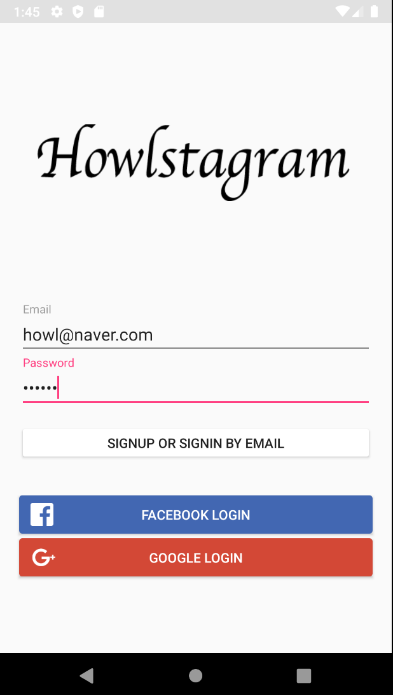
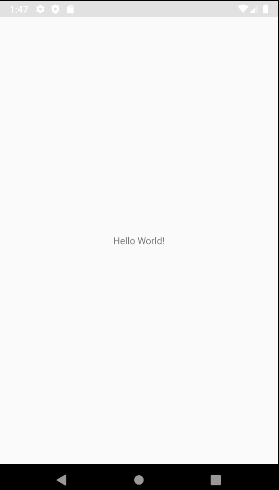
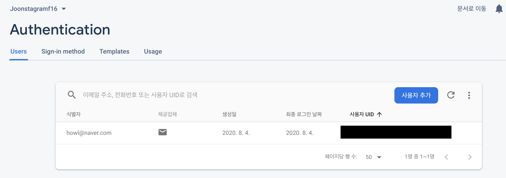

# Insta 클론 - 로그인 1

### 화면 설계 - values

안드로이드 스튜디오에서 화면을 설계할 때에는 코드로 디자인 할 수 있는 Text모드와 그래픽을 보며 디자인 할 수 있는 Design모드가 있다. Design모드로 설계하면 편할 수는 있지만 어차피 세부 사항 조율은 Text모드에서 해야하기 때문에 문법을 어느정도 익히고 있다면 오히려 Text모드가 더 편하다. 

values에는 **colors, strings, styles**가 있다. 이것들의 역할은 C언어에서 최상단에 고정 상수를 define 해 놓듯이 미리 긴 문자열을 짧은 문자열로 등록해 놓거나, 색 코드를 문자로 등록해 놓은 후, 화면 디자인 시 불러와서 쓸 수 있는 용도이다. 그 중 하나인 colors.xml은 다음과 같이 선언한다.

```xml
<?xml version="1.0" encoding="utf-8"?>
<resources>
    <color name="colorPrimary">#ededed</color>
    <color name="colorPrimaryDark">#e1e1e1</color>
    <color name="colorLightGray">#f1f1f1</color>
    <color name="colorAccent">#FF4081</color>
    <color name="colorWhite">#FFFFFF</color>
    <color name="colorDivision">#e0e0e0</color>
    <color name="colorNavIcon">#1d1d1d</color>

    <color name="colorGoogleSignIn">#d34836</color>
    <color name="colorGoogleSignInPressed">#b02513</color>
    <color name="colorEmailSignIn">#009688</color>
    <color name="colorEmailSignInPressed">#004D40</color>
</resources>
```

이렇게 선언된 color를 디자인 탭에서는 아래와 같이 ```@color/등록한 이름```과 같이 사용한다. 그 위의 string또한 color와 사용법이 같다. 이미지 같은 경우에는 drawalbe 폴더에 저장해 놓으면 아래와 같이 ```@drawable/이미지 이름```으로 사용할 수 있다.

```xml
<Button
        android:text="@string/signin_facebook"
        android:textColor="@color/colorWhite"
        android:background="@drawable/btn_signin_facebook"
        ...
/>
```


### 화면 설계 - Layout

로그인 화면 설계 시 화면 전체의 레이아웃은 **RelativeLayout**을 사용하였다. RelativeLayout은 이름으로 알 수 있듯이 자식 혹은 부모 뷰 간의 관계에 따라 배치를 적용하는 레이아웃이다. 여기서는 화면 안에 메인 이미지 구역, 로그인 입력창, 버튼 구역으로 크게 두 구역으로 나뉘므로 ImageView과 LinearLayout을 같은 수준으로 삽입해 주었다.

```xml
<RelativeLayout
    android:layout_width="match_parent"
    android:layout_height="match_parent"
    tools:context=".LoginActivity">
  <ImageView 
        android:layout_alignParentTop="true"/>
  <LinearLayout
        android:layout_alignParentBottom="true"
        android:orientation="vertical">
    ...
  </LinearLayout>
</RelativeLayout>
```

여기서 ImageView와 LinearLayout 두 뷰 간의 관계를 통해서 레이아웃을 구현할 수도 있지만 여기서는 각 뷰에서 부모 레이아웃과의 관계를 이용하여 배치를 하였다. ImageView에서는 **alignParentTop** 옵션을 true로 하여 부모 뷰 영역의 상단에 위치시켰다. LinearLayout에서는 **alignParentBottm**을 true로 하여 부모 뷰 영역의 하단에 붙여 위치시켰고 **orientation** 옵션을 vertical로 설정하여 LinearLayout 내의 뷰들을 세로로 정렬하였다.

RelativeLayout 참고: https://lktprogrammer.tistory.com/133


### 화면 구성 - 태그 활용

로그인 화면 구성 시, ID와 패스워드를 입력받을 컴포넌트는 ```<EditText> ``` 컴포넌트, 로그인을 하기 위한 버튼들은 ```<Button>``` 컴포넌트를 이용하여 구현하였다. 여기서 기본 제공되는 컴포넌트(태그) 외에 사용한 TextInputLayout이 있는데 이것은 ```app -> open Module Settings -> dependencies -> + -> design```으로 design 라이브러리를 추가하여 사용한다. EditText를 TextInputLayout으로 감싸주는데, 이를 통해 커서가 EditText위에 위치하면 EditText의 힌트를 라벨 메시지로 표시할 수 있다.

```xml
<com.google.android.material.textfield.TextInputLayout
            android:layout_width="match_parent"
            android:layout_height="wrap_content"
            android:layout_marginLeft="20dp"
            android:layout_marginRight="20dp">
            <EditText
                android:id="@+id/email_edittext"
                android:layout_width="match_parent"
                android:layout_height="wrap_content"s
                android:hint="@string/email"/>
</com.google.android.material.textfield.TextInputLayout>
```



위와 같이 Email 인풋 창에 커서를 위치하면 힌트가 작게 올라가면서 라벨 메시지로 표현되는 것을 확인할 수 있다. 이 외에도 TextInputLayout의 다른 여러 옵션을 사용할 수도 있다.

- setCounterEnabled(boolean enabled): true면 글자수를 세서 표시해줌. default는 false.
- setCounterMaxLength(boolean enabled): 텍스트 길이의 최댓값 설정. 0보다 같거나 작으면 최댓값 표시 X. default는 -1.


### 로그인 기능 구성 - Firebase Authentication

Firebase에서 제공하는 인증 서비스를 이용하기 위해 ```tools -> firebase -> Authentication```을 선택한 후 구글 로그인을 하여 Firebase를 연동해 준다. 이 때 Firebase에 프로젝트가 생성되게 되는데 Firebase 콘솔에 접속하여 해당 프로젝트의 설정에서 **google-services.json** 파일을 다운받고 프로젝트 app에 복사해야 한다. 

해당 작업이 완료됐으면 코드상에서 버튼 클릭시 이벤트를 걸어 로그인이 되게 한다. 먼저, OAuth 로그인이 아닌 이메일과 패스워드로 로그인하는 버튼을 클릭했을 때의 이벤트를 구성한다.

FirebaseAuth로부터 받아올 객체를 저장할 auth변수를 먼저 선언한다. 이 때 **auth값은 FirebaseAuth.getInstance()의 리턴 값이 저장되는데 null값이 저장될 수도 있으므로 nullable 변수로 선언**한다(자료형 뒤에 ? 삽입)!! 이후 앞서 설정한 버튼 이름을 불러와서(email_login_button) setOnClickListener를 통해 이벤트를 붙여주게 된다.

```kotlin
class LoginActivity : AppCompatActivity() {
    var auth : FirebaseAuth? = null
    override fun onCreate(savedInstanceState: Bundle?) {
        super.onCreate(savedInstanceState)
        setContentView(R.layout.activity_login)
        auth = FirebaseAuth.getInstance()
        email_login_button.setOnClickListener {
            signinAndsignup()
        }
    }
 ...
 }
```

Signup Or Signin By Email 버튼은 아이디와 패스워드를 입력하고 클릭시 해당 아이디가 없으면 아이디를 생성후, 로그인하고 아이디가 있으면 그냥 로그인 하도록 하는 버튼이다. 따라서 버튼이 클릭 됐을 때 실행되는 signinAndsignup 함수에서는 auth의 **createUserWithEmailAndPassword** 함수를 먼저 사용한다. 이 때, xml에서 설정한 id를 입력받을 edittext의 id와 password를 입력받는 edittext의 id를 불러와 해당 뷰의 text를 toString하여 parameter로 넘겨주게 된다(자바에서와 달리 따로 findViewById를 해주지 않아도 알아서 import해준다!!). 

여기서 auth와 createUserWithEmailAndPassword에서 반환되는 객체 모두 **nullable이므로 뒤에 ?를 붙여주었다**. 해당 객체에 CompletListener를 붙여 람다식을 이용하는데, 반환되는 task에 따라 3 단계로 분기하게 된다. task의 isSuccessful이 true라면 메인 페이지로 이동하게 되고, 예외가 발생한다면 Toast를 통해 예외 메시지를 출력하게 된다. 그 외의 경우라면 아이디를 생성하지 않고, 예외도 발생하지 않는 일반 로그인일 경우이므로 signinEmail 함수를 실행시킨다.

```kotlin
fun signinAndsignup() {
        auth?.createUserWithEmailAndPassword(email_edittext.text.toString(), password_edittext.text.toString())
            ?.addOnCompleteListener { task ->
                if(task.isSuccessful) {
                    // Creating user inform
                    moveMainPage(task.result?.user)
                } else if(task.exception?.message.isNullOrEmpty()) {
                    // Show error
                    Toast.makeText(this, task.exception?.message, Toast.LENGTH_LONG).show()
                } else {
                    // Login
                    signinEmail()
                }
            }
    }
```

signinEmail 함수는 auth의 signInWithEmailAndPassword 함수를 통해 Firebase Authentication 서비스를 이용하여 로그인 하는 함수를 호출한다. 마찬가지로 Id와 Password를 xml로 부터 불러와 Parameter로 넘겨주며 task.isSuccessful이 true일 경우 메인 페이지로 이동, 그렇지 않은 경우는 에러를 출력해 준다.

```kotlin
fun signinEmail() {
        auth?.signInWithEmailAndPassword(email_edittext.text.toString(), password_edittext.text.toString())
            ?.addOnCompleteListener { task ->
                if(task.isSuccessful) {
                    // Login
                    moveMainPage(task.result?.user)
                } else {
                    // Error
                    Toast.makeText(this, task.exception?.message, Toast.LENGTH_LONG).show()
                }
            }
    }
```

마지막으로 moveMainPage 함수는 로그인이 성공했을 때, 로그인 페이지에서 메인 페이지로 이동시켜주는 함수이다. Parameter로 task의 result의 user를 받는데 이것이 null이 아니면 **Intent**를 이용해 MainActivity로 화면을 전환해 준다. 여기서도 user가 nullable 변수이므로 뒤에 ?를 붙였다.

```kotlin
fun moveMainPage(user: FirebaseUser?) {
        if(user != null) {
            startActivity(Intent(this, MainActivity::class.java))
        }
    }
```



위와 같이 아이디와 패스워드를 입력하고 SIGNUP OR SIGNIN BY EMAIL 버튼을 클릭하게 되면 아래와 같이 MainActivity로 넘어가게 되고 Firebase Authenticaion에도 유저 정보가 생성되게 된다.





