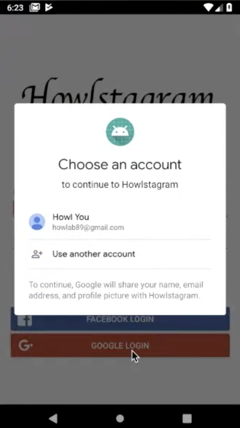

# Insta 클론 - 구글 로그인

### Dependency library 추가 - play-services-auth

```app -> Open Module Settings -> Dependencies -> + -> play-services-auth``` 를 통해 library를 추가해 준다. 구글에서 제공하는 구글로 로그인에 필요한 라이브러리이다.

### 로그인에 필요한 변수 생성

```kotlin
var googleSignInClient : GoogleSignInClient? = null
var GOOGLE_LOGIN_CODE = 9001
var gso = GoogleSignInOptions.Builder(GoogleSignInOptions.DEFAULT_SIGN_IN)
            .requestIdToken(getString(R.string.default_web_client_id))
            .requestEmail()
            .build()
googleSignInClient = GoogleSignIn.getClient(this, gso)
```

- GoogleSignInClient 객체를 저장할 googleSignInClient 변수 선언
- startActivityForResult로 실행된 Intent에 대한 결과를 받아올 때, 요청한 정보에 알맞는 리턴값인지를 검증하기 위해 확인 코드를 넣는데, 여기서는 그것을 GOOGLE_LOGIN_CODE(=9001)로 선언
- Google 로그인 옵션을 gso로 선언하여 설정(파이어베이스 공식 문서에 나와있는 그대로)
- GoogleSignIn.getClient()의 결과값을 googleSignInClient에 저장

### 로그인에 필요한 함수 생성

```kotlin
fun googleLogin() {
        var signInIntent = googleSignInClient?.signInIntent
        startActivityForResult(signInIntent, GOOGLE_LOGIN_CODE)
    }
```

- googleLogin 함수에서 googleSignInClient를 이용해 signInIntent(로그인) 실행
- StartActivityForResult로 인텐트를 실행하면 그 결과를 onActivityResult로 받을 수 있음

```kotlin
override fun onActivityResult(requestCode: Int, resultCode: Int, data: Intent?) {
    super.onActivityResult(requestCode, resultCode, data)
    if (requestCode == GOOGLE_LOGIN_CODE) {
        var result = Auth.GoogleSignInApi.getSignInResultFromIntent(data)
        if (result.isSuccess) {
            var account = result.signInAccount
            // Second Step
            firebaseAuthWithGoogle(account)
        }
    }
}
```

- signInIntent의 결과를 앞서 선언한 GOOGLE_LOGIN_CODE와 함께 반환하면 onActivityResult에서 그것을 받아 사용가능
- requestCode가 인텐트 실행시 넘겨준 GOOGLE_LOGIN_CODE와 같다면 로그인 결과를 result 변수에 저장
- result의 isSucess가 true라면 로그인이 성공한 것이므로 account 변수에 signInAccount를 저장하고 firebaseAuthWithGoogle 함수에 parameter로 전달

```kotlin
fun firebaseAuthWithGoogle(account: GoogleSignInAccount?) {
    var credential = GoogleAuthProvider.getCredential(account?.idToken, null)
    auth?.signInWithCredential(credential)
        ?.addOnCompleteListener { task ->
            if(task.isSuccessful) {
                // Login
                moveMainPage(task.result?.user)
            } else {
                // Error
                Toast.makeText(this, task.exception?.message, Toast.LENGTH_LONG).show()
            }
        }
}
```

- firebaseAuthWithGoogle에서는 parameter에서 credential을 추출하여 해당 credential로 로그인
- 그 뒤 과정은 이메일 로그인 과정과 동일

### 구글 로그인 버튼에 함수 매핑

버튼에 클릭 리스너로 함수를 연결해 주기 위해 id를 부여한다.

```xml
<Button
        android:id="@+id/google_sign_in_button"
        android:text="@string/signin_google"
        android:textColor="@color/colorWhite"
        ...
        />
```

LoginActivity.kt에서 버튼이름에 클릭리스너를 통해 함수를 연결해 준다.

```kotlin
google_sign_in_button.setOnClickListener {
    googleLogin()
}
```

### 실행시 multi-dex 오류 발생 해결

안드로이드에서는 가져다 쓸 수 있는 라이브러리의 수에 제한을 두고 있는데 너무 많은 수의 라이브러리를 import하게 되면 이러한 오류가 발생하게 된다. 이를 해결하기 위한 방법은 minSdkVersion에 따라 다른데 나의 경우에는 버전이 20이하인 경우에 해당한다.

1. Module의 gradle수정

   ```
   defaultConfig {
           applicationId "com.example.joonstagram"
           minSdkVersion 16
           targetSdkVersion 30
           versionCode 1
           versionName "1.0"
           multiDexEnabled true // 이 부분 추가
           ...
   dependencies {
           implementation 'androidx.multidex:multidex:2.0.1' // 추가
       
   ```

   

2. Manifest 수정

   ```xml
   <application
           android:name="androidx.multidex.MultiDexApplication"
            ... />
   ```

   - 이 부분은 androidx를 사용하는 것과 아닌 것의 차이가 있는데 처음에는 androidx를 사용하지 않는 버전의 설정을 했다가 위와 같이 수정하여 제대로 빌드가 되었다.

### 실행결과



위와 같이 OAuth 로그인 화면이 뜨게 되고 계정을 클릭 후 비밀번호를 입력하면 전과 같이 로그인이 되게 된다.