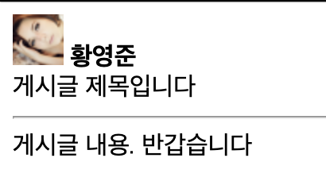
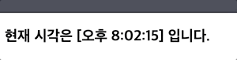

# Props와 State

## Props란

Properties의 약자이며 Vue에서도 사용해 보았듯이 상위 컴포넌트로부터 내려와 받은 attributes를 뜻한다. react식으로 코딩하려면 필수적으로 알아야 할 개념이며 특이하게 내가 본 강의에서는 state보다 먼저 props를 소개하였다.

### Html code

```html
<div id="root"></div>
```

React에서는 JSX 문법을 통해 JS단에서 html코딩을 같이 진행하므로 html 부분의 코드는 div를 하나 선언하는 것이 전부이다. 이후에 js단에서 root 태그에 JSX 문법을 이용하여 여러 태그들을 추가하여 화면에 렌더링하게 된다.

### JS code

이번에 살펴볼 예제는 title, content, user에 대한 정보를 갖는 객체인 Board 객체 정보를 Board, User 두 개의 컴포넌트로 나누어 구현하여 화면에 표현하는 것이다. 먼저 board 데이터는 다음과 같다. 구현할 내용은 최 상단에 유저 정보 그 밑에 board의 타이틀 그 하단에 가로선을 긋고 board의 content를 표현한다. imageUrl에 들어있는 주소는 테스트를 위한 이미지를 제공하는 주소이며 32 * 32 사이즈의 아무 사진이나 제공해주는 url이다.

```jsx
const board = {
  title: '게시글 제목입니다',
  content: '게시글 내용. 반갑습니다',
  user: {
    name: "황영준",
    imageUrl: "https://placeimg.com/32/32/any"
  }
}
```

위 데이터를 전체적으로 화면에 표현할 최 상단 컴포넌트 Board를 다음과 같이 코딩한다.

```jsx
function Board(props) {
  return (
    <section>
      <User user={props.user} />
      {props.title}
      <hr />
      {props.content}
    </section>
  );
}
```

여기서는 state 없이 props만 사용할 것이므로 fucntion형 컴포넌트를 사용하였다. 맨 위에 User 컴포넌트를 사용하여 유저 정보를 보여주고 그 밑에는 props로 받은 board 데이터의 title과 content를 렌더링하여 보여준다. board의 user 정보는 하위 컴포넌트인 User에서 사용해야 하기 때문에 User 컴포넌트에 user={props.user}와 같이 넘겨주어야 한다.

```jsx
function User(props) {
  return(
    <div>
      
      &nbsp;
      <strong>{props.user.name}</strong>
    </div>
  );
}
```

User 컴포넌트는 Board 컴포넌트로 받은 props인 user를 활용하여 이미지와 이름을 출력해 준다.

```jsx
ReactDOM.render(
  <Board 
    title={board.title}
    content={board.content}
    user={board.user}
  />, document.getElementById('root'));
```

위와 같이 최상단 컴포넌트인 Board에 props를 넣어주어 ReactDOM의 render 함수를 실행하면 아래와 같은 결과를 얻을 수 있다. 




## State란

앞서 알아보았던 props는 불변의 값을 부모 컴포넌트로부터 받아 화면에 나타낼 값이었다. 하지만 시간의 경과와 같이 변화가 필요한 값의 경우는 props가 아닌 state를 이용해 컴포넌트 자체가 가지는 변수로 선언하여 바꿔가면서 화면에 표시해 준다.

### JS Code

이번 예제는 1초가 지날때 마다 변한 시간을 출력해 주는 예제이다. state를 사용하기 위해서는 함수형 컴포넌트가 아닌 **클래스형 컴포넌트**를 사용해야만 한다. 따라서 다음과 같이 클래스형 컴포넌트를 선언한 뒤 contructor를 이용해 초기화 하고 render 함수를 작성해 준다.

```jsx
class Clock extends React.Component {
  constructor(props) {
    super(props);
    this.state = {
      date: new Date()
    }
  }
  
  render() {
    return (
      <h3>
        현재 시각은 [{this.state.date.toLocaleTimeString()}] 입니다.
      </h3>
    );
  }
}

ReactDOM.render(<Clock />, document.getElementById('root'));
```

위와 같이 선언하여 렌더링 된 결과를 확인하면 맨 처음의 시간은 출력이 되나 계속해서 시간이 갱신되지는 않는 것을 확인할 수 있다. 이것은 맨 처음 constructor를 이용해 생성된 이후 state의 갱신이 일어나지 않기 때문인데 이를 해결하기 위해 클래스형 컴포넌트에서만 사용 가능한 **LifeCycle**을 사용한다.

```jsx
tick() {
  this.setState({date: new Date()})
}
  
componentDidMount() {
  this.timerID = setInterval(() => this.tick(), 1000);
}
  
componentDidUnmount() {
  clearInterval(this.timerID);
}
```

componentDidMount는 컴포넌트가 마운트 되고 나면(Data와 View가 바인딩 되고 난 후) 실행되는 생명주기 함수이다. 여기서 timer란 변수를 생성하며 1초(= 1000ms)마다 클래스 내의 tick이라는 함수를 실행하게 된다.

tick이라는 함수는 현재 컴포넌트의 date 값을 새로운 Date객체로 바꾸어 주며 이때는 **반드시 setState함수**를 사용하여 state를 변경해 주어야 한다!!

이후에는 리소스 손실을 막기 위해 컴포넌트가 unmount 되면 실행되는 componentDidUnmount 생명주기 함수에서 timerID를 clear해준다. 



