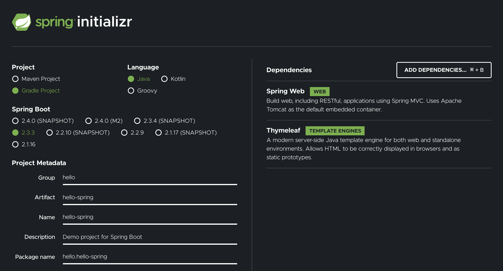
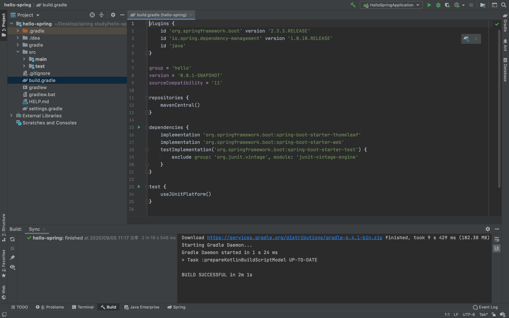
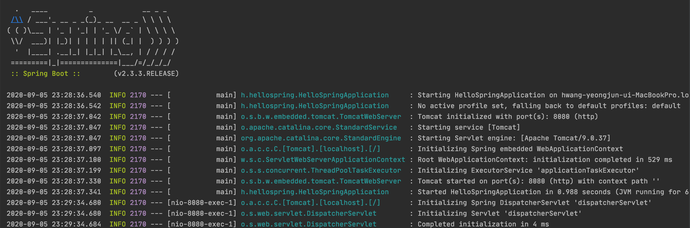
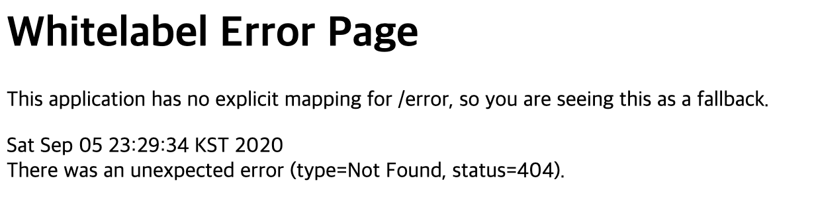
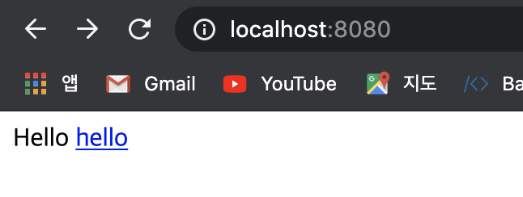
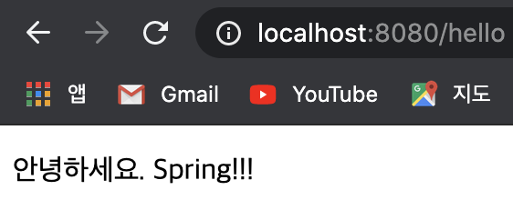
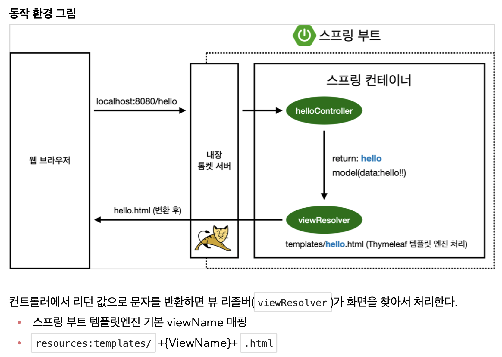

# Spring 공부

## Why spring?

spring은 자바 플랫폼을 위한 오픈소스 프레임워크이며 동적인 웹 사이트를 개발하기 위해 많은 서비스를 제공한다. 현재 우리나라에서는 전자정부 프레임워크가 spring기반이며 많은 회사에서 쓰이는 중이다. 최근 다우 기술의 인턴에 합격한 상태인데 면접 시에 자바 프로젝트 경험에 대한 질문이 들어온 것으로 예측컨데 근무시 스프링을 사용할 가능성이 높기 때문에 개인적으로 공부하고 근무를 시작하려 한다.

## 개발 환경

- java jdk 14 (강의에서는 11을 추천하였지만 이미 14가 설치되어 있는 관계로 사용)
- IntelliJ IDEA Ultimate

## Project 생성

### Spring boot

스프링 부트란 스프링 프레임 워크의 프로젝트 중 하나이며 무거운 스프링으로 프로젝트를 생성할 때, 스프링 부트를 이용하면 보다 쉽게 프로젝트 초기 설정이 가능하다.

### Spring boot를 이용한 프로젝트 프로토타입 생성

```start.spring.io```에 접속하여 스프링부트로 스프링 프로젝트를 생성한다.



- Project는 Maven대신 Gradle로 설정한다. 최근에는 Maven -> Gradle로 추세가 이동중이라고 한다.

- Spring Boot 버전은 안정적으로 배포된 버전 중 최신 버전인 2.3.3을 선택한다.

  -> SNAPSHOT은 아직 정식 릴리즈 되지 않은 버전

- 원래 Group에는 회사명을 쓰는 것이 일반적이나 개인 공부용이므로 hello를 입력한다.

- Artiface는 프로젝트가 생성됐을 시의 이름이며 여기서는 hello-spring으로 하였다.

- Dependencies는 프로젝트에서 사용할 라이브러리를 미리 선택하여 불러오는 것이며 여기서는 Spring Web, Thymeleaf(html 템플릿 엔진)를 사용하였다.

Generate 버튼을 눌러 프로젝트를 다운로드 한 뒤 압축을 풀어 IntelliJ에서 build.gradle을 선택하여 해당 프로젝트를 열어준다.



### build.gradle

1. plugins에서 프로젝트를 생성할 때 선택했던 spring boot 버전을 확인할 수 있다.

   ```java
   plugins {
   	id 'org.springframework.boot' version '2.3.3.RELEASE'
   	id 'io.spring.dependency-management' version '1.0.10.RELEASE'
   	id 'java'
   }
   ```

   

2. dependencies에서는 프로젝트 생성시 추가했던 두 개의 라이브러리 (thymeleaf, spring web)을 확인할 수 있고, 테스팅 라이브러리인 JUnit이 자동으로 추가된 것을 확인할 수 있다.

   ```java
   dependencies {
   	implementation 'org.springframework.boot:spring-boot-starter-thymeleaf'
   	implementation 'org.springframework.boot:spring-boot-starter-web'
   	testImplementation('org.springframework.boot:spring-boot-starter-test') {
   		exclude group: 'org.junit.vintage', module: 'junit-vintage-engine'
   	}
   }
   ```

3. 이러한 dependencies 라이브러리들을 다운받아올 주소(저장소)를 설정하는 것이 repositories이다. 여기서는 mavenCentral에서 다운받아 사용한다.

   ```java
   repositories {
   	mavenCentral()
   }
   ```

## Project 실행

spring boot로 생성한 프로토타입 프로젝트를 실행하면 다음과 같은 로그가 console에 찍히는 것을 확인할 수 있다.



여기서 log 중간에 ```Tomcat started on port(s): 8080 (http) with context path``` 이라는 문구를 확인할 수 있는데 chrome을 실행하여 localhost:8080으로 접속하면 다음과 같은 화면을 확인할 수 있다.




## View 환경설정

### Welcome page

기존에 localhost:8080에 접속하면 아무런 페이지 정보도 있지 않기 때문에 기본적으로 내장된 에러 페이지를 리턴하였다. 따라서 기본 페이지를 설정하여 도메인으로 접속하였을 때 보이는 welcome page를 만들어 주어야 한다. Node.js의 express와 비슷하게 index.html을 넣어두면 그 파일을 자동으로 인식하여 웹 페이지에 띄워주는데 이 파일은 ```src -> main -> resources -> static```에 넣어두면 spring에서 자동으로 인식하여 화면에 띄워주게 된다.

```html
<!DOCTYPE HTML>
<html>
<head>
    <title>Hello</title>
    <meta http-equiv="Content-Type" content="text/html; charset=UTF-8" /> </head>
<body>
Hello
<a href="/hello">hello</a>
</body>
</html>
```



### Template Engine 사용

위와 같이 welcome page를 구성할 수 있지만 이는 정적이기 때문에 다양한 동작이 불가능하다. 따라서 앞서 프로젝트 생성시 추가한 Thymeleaf를 사용하여 동적인 page를 제공할 수 있다.

먼저 동적으로 페이지의 data를 변경하기 위해 **controller**를 생성해 준다. ```src -> main -> java -> hello.hellospring``` 아래에 controller라는 package를 생성한 후 HelloController를 생성하여 다음과 같이 코딩해 준다.

```java
package hello.hellospring.controller;

import org.springframework.stereotype.Controller;
import org.springframework.ui.Model;
import org.springframework.web.bind.annotation.GetMapping;

@Controller
public class HelloController {

    @GetMapping("hello")
    public String hello(Model model) {
        model.addAttribute("data", "Spring!!!");
        return "hello";
    }
}
```

- 클래스 위에 Controller 어노테이션을 추가해 주어야 Controller로 동작한다.
- GetMapping 어노테이션은 express의 router.get과 비슷한 역할을 한다고 생각하면 된다. ```메인 도메인/{주소}```로 get요청이 들어오면 그에 대해 실행되도록 설정해 주는 역할을 한다.
- spring에서 paramter로 model를 전해주며 이 model에서 "data"라는 키의 value를 Spring!!으로 바꾼다.
- 이후 return 하는 값은 해당 이름을 갖는 html 파일을 ```resources -> templates``` 에서 찾아 웹 화면에 렌더링하라는 뜻이다.

```html
<!DOCTYPE HTML>
<html xmlns:th="http://www.thymeleaf.org"> <head>
    <title>Hello</title>
    <meta http-equiv="Content-Type" content="text/html; charset=UTF-8" /> </head>
<body>
<p th:text="'안녕하세요. ' + ${data}" >안녕하세요. 손님</p>
</body>
</html>
```

```resources -> templates -> hello.html``` 의 코드이며 위에서 설명한 바와 같이 ```localhost:8080/hello```로 접속하게 되면 data값이 Spring!!으로 치환되어 다음과 같은 결과를 확인할 수 있다. 여기서 th는 thymeleaf를 뜻하며 위에서 cdn과 비슷한 형태로 추가를 해주어 사용할 수 있다.



이 과정의 전체적인 흐름도는 다음과 같다.




## 빌드와 실행

현재까지 공부했던 내용은 실제 사용할 수 없는 수준의 간단한 프로젝트이지만 나중에 실제 개발을 완료하게 된다면 서버를 배포해야할 경우가 있다. 따라서 프로젝트를 빌드하여 어떻게 실행하는지를 간단히 공부해 보았다.

먼저 IntelliJ에서 실행중인 로컬 서버를 종료하고 iterm을 이용해 프로젝트가 있는 폴더로 들어간다. 해당 폴더에서

```bash
$./gradle build
```

명령어를 실행하게 되면 폴더 내에 ```build``` 폴더가 생성되게 되고 ```build -> libs``` 에 들어가 보면 ```hello-spring-0.0.1-SNAPOSHOT.jar``` 파일을 확인할 수 있다. 

```bash
$java -jar hello-spring-0.0.1-SNAPOSHOT.jar
```

위 명령어를 실행하게 되면 로컬 웹 서버가 구동되게 되고 이전과 같이 localhost:8080으로 접속하여 동일한 결과를 확인할 수 있다. 실제 서버를 운영한다면 코딩을 완료한 후 위와 같이 실행파일을 빌드한 후, 서버에 올려서 실행만 시켜주면 배포가 가능한 것을 배울 수 있었다.