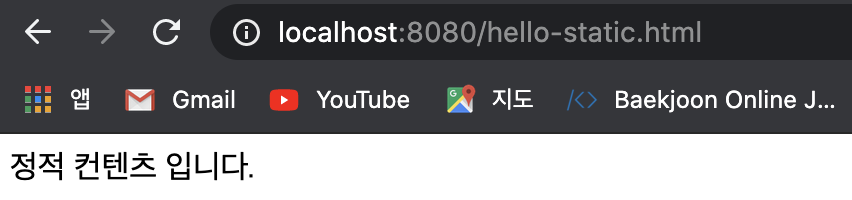
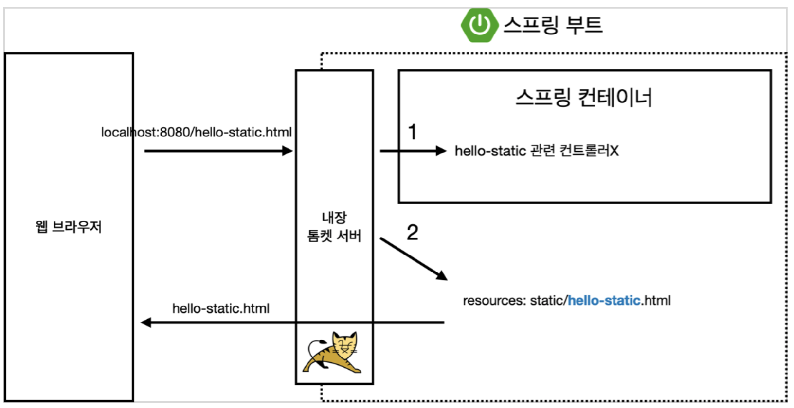
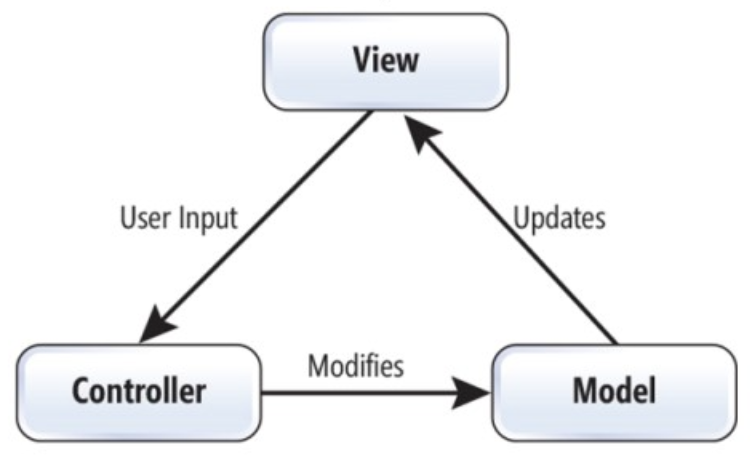
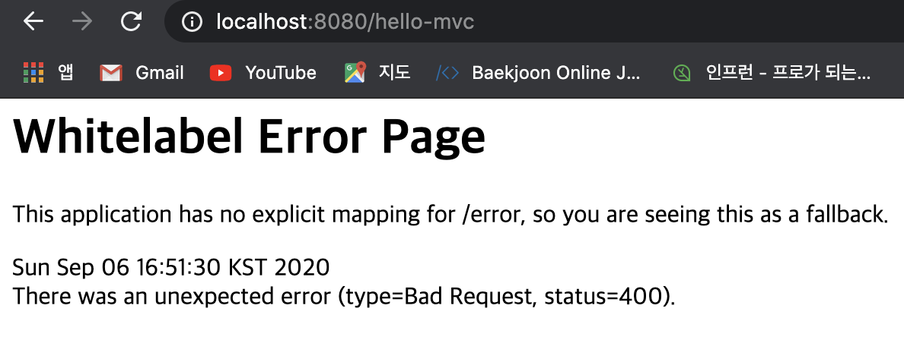
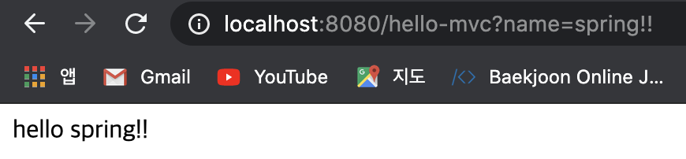
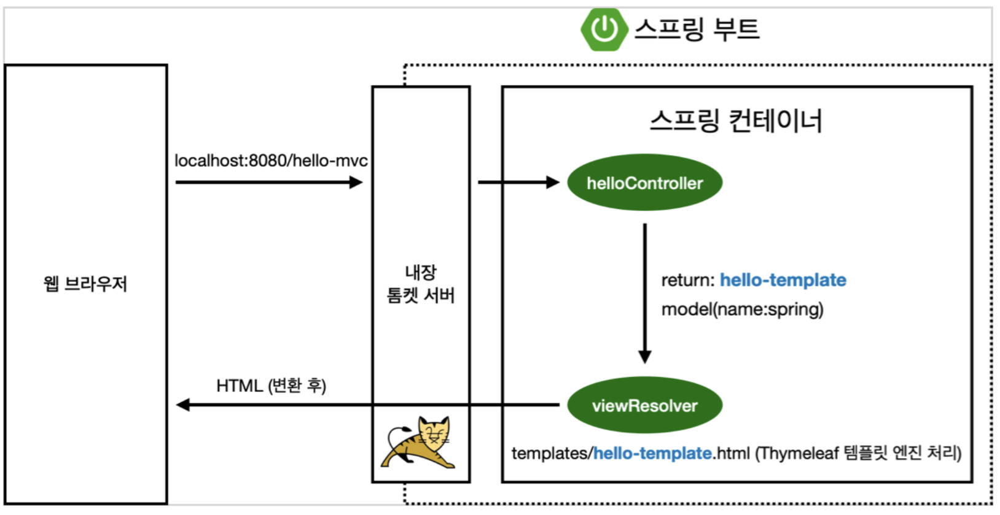
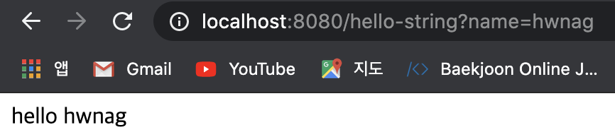
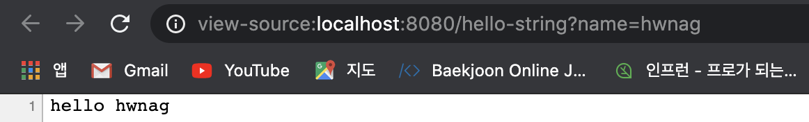
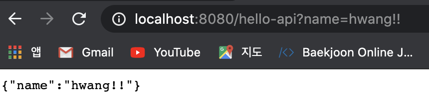
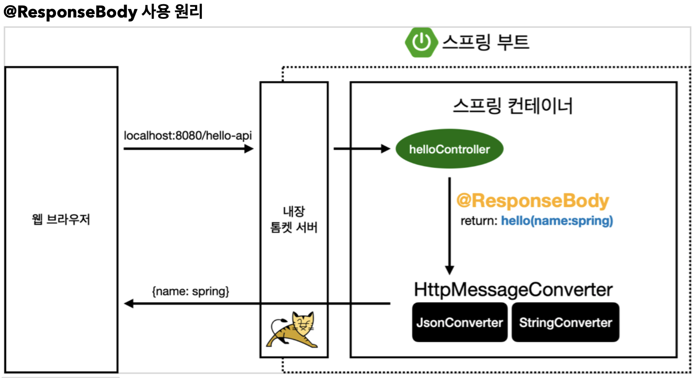

# 스프링 웹 개발 기초

## 정적 컨텐츠

말 그대로 정적인 컨텐츠를 사용자에게 보여주는 방법이다. 미리 만들어진 html 파일 그대로를 렌더링 해주며 앞선 정리에서 해보았던 Welcome page가 그 예이다.

### 정적 컨텐츠 추가하고 실행해 보기

```src -> main - > resources -> static``` 에 hello-static.html을 생성하여 다음과 같이 코딩한다.

```html
<!DOCTYPE HTML>
<html>
<head>
    <title>static content</title>
    <meta http-equiv="Content-Type" content="text/html; charset=UTF-8" /> </head>
<body>
정적 컨텐츠 입니다.
</body>
</html>
```

이후 main을 실행하고 웹 브라우저에서 ```localhost:8080/hello-static.html```로 접속하면(파일 이름) 다음과 같은 화면이 정상적으로 출력되는 것을 확인할 수 있다.



### 정적 컨텐츠 렌더링 모식도



Spring에서 정적 컨텐츠가 렌더링되는 과정을 모식도로 간단하게 표현하면 위와 같다. 우선 get요청이 들어온 url을 읽어 hello-static이라는 이름을 찾는다. **맨 첫번째**로 **Controller**에서 hello-static과 관련된 컨트롤러가 있는지를 찾고, 만약 없다면 static에서 해당 이름을 찾아 return하여 렌더링하게 된다.


## MVC와 템플릿 엔진

### MVC?



이전의 View와 Controller를 한번에 구현한 Model one방식에서 벗어나 Model, View, Controller 로 나누어 애플리케이션을 구현하는 디자인 패턴이다. 사용자가 Controller를 조작하면 model에서 데이터를 가져와 수정 등의 작업을 거친 후 View를 제어하여 사용자에게 보여지도록 구성되어 있다.

### Controller 수정

기존에 작성했던 Controller 코드에 다음 코드를 추가하여 routing path를 추가해준다.

```java
@GetMapping("hello-mvc")
public String helloMvc(@RequestParam("name") String name, Model model) {
    model.addAttribute("name", name);
    return "hello-template";
}
```

- Localhost:8080/hello-mvc 로 GET 요청이 들어오면 처리를 하기 위해 @GetMapping으로 매핑을 해준다.
- 이번 컨트롤러는 parameter를 받아 그 값으로 View를 수정할 것이므로 @RequestParam으로 parameter를 받는다. 이때의 parameter의 key값은 name이고 그 value는 String 형인 name으로 저장하여 Controller에 넘어간다.
- 마찬가지로 model을 통해 name이라는 key의 값을 paramter로 받은 name으로 바꾼 뒤에 hello-template를 화면에 띄워주기 위해 리턴한다.

### html 파일 추가

Controller에서 hello-template라는 이름의 템플릿을 리턴했으므로 ```resources -> templates``` 안에 hello-template.html을 추가하여 다음과 같이 코딩해 준다.

```java
<html xmlns:th="http://www.thymeleaf.org">
<body>
<p th:text="'hello ' + ${name}">hello! empty</p>
</body>
</html>
```

### URL을 통한 접근

기존과 같이 ```localhost:8080/hello-mvc``` 로 접속을 하게 되면 다음과 같이 에러 페이지가 뜨게 된다.



그 이유는 Controller를 생성할 때, name을 key로 갖는 parameter를 받는다고 선언하였는데 paramter가 들어오지 않아서이다. 따라서 ```localhost:8080/hello-mvc?name=spring!!``` 과 같이 param을 추가하여 GET 요청을 하게 되면 다음과 같이 정상적인 화면을 확인할 수 있다.



### MVC와 템플릿 엔진 모식도



이 과정을 모식도로 나타내면 위 그림과 같다. GET 요청이 들어오면 **가장 먼저 Controller**에 요청에 해당하는 Controller가 있는지를 확인한다. 이 경우에는 Controller가 존재하므로 해당 컨트롤러에서 처리할 로직들을 처리한 뒤 hello-template를 리턴하고 이 때, parameter로 들어온 name과 함께 model도 같이 viewResolver로 전달된다. 

viewResolver에서는 Controller로부터 받은 리턴값에 매칭되는 이름의 template를 찾고 parameter로 넘어온 값을 변환하여 html로 결과물을 사용자에게 보여준다.


## API

앞서 구현해 보았던 템플릿 엔진을 사용하지 않고 문자열 혹은 JSON 같은 오브젝트를 그대로 리턴하는 방식이다. 이전 express로 구현해 보았던 api 서버와 상당 부분 비슷한 것을 확인할 수 있었다.

### Controller 추가

앞서 작성했던 helloController에 아래와 같은 컨트롤러를 추가한다.

```java
@GetMapping("hello-string")
@ResponseBody
public String helloString(@RequestParam("name") String name) {
    return "hello " + name;
}
```

- 이전과 같이 GET 요청에 매핑하기 위해 GetMapping을 사용한다.
- @ResponseBody 어노테이션을 추가 하여 http body에 직접 데이터를 insert할 수 있도록 한다. express의 bodyparser와 비슷한 느낌인 것 같다.
- 마지막으로 template이름을 return하지 않고 string 그 자체를 리턴해 준다.



위와 같이 컨트롤러를 코딩하고 mvc와 같은 방식으로 접속을 해 보면 mvc때와 보여지는 결과는 별반 다를 것 없이 결과를 확인할 수 있다. 하지만 소스보기를 통해 현재 화면에 띄워진 소스를 보게 되면 다음과 같은 모습을 확인할 수 있다.



이전 MVC의 결과를 소스보기 하면 html 태그 안에 감싸져 있는 결과를 확인할 수 있었는데 API 방식의 결과에 대한 소스코드를 보면 html 로 이루어진 템플릿이 아닌 리턴한 string 값 자체만 화면에 띄워지는 것을 확인할 수 있다. 나중에는 string이 아닌 JSON을 리턴하는 방식으로 구현한다면 API 서버를 쉽게 구현할 수 있을 것 같다.

### 객체 리턴

앞서 구현해 보았던 string을 리턴하는 방식은 실제 현업에서 사용할 일이 없다. 따라서 express로 구현해 보았듯이 JSON과 같은 객체를 리턴해야 실무에서 사용할 수가 있는데 여기서는 해당 방식을 구현해 본다.

helloController 내부에 리턴해 줄 Hello라는 객체를 생성하여 name이라는 String 형 변수를 선언해 주고 getter, setter를 만들어 준다.

```java
static class Hello {
        private String name;

        public String getName() {
            return name;
        }

        public void setName(String name) {
            this.name = name;
        }
    }
```

이후에 앞에서 한 것과 같이 새로운 컨트롤러를 생성해 준다.

```java
@GetMapping("hello-api")
@ResponseBody
public Hello helloApi(@RequestParam("name") String name) {
    Hello hello = new Hello();
    hello.setName(name);
    return hello;
}
```

- Get 요청이 들어올 때 hello-api에 대해 처리하는 컨트롤러이다.
- 리턴할 데이터 타입이 hello 객체이기 때문에 함수 형을 Hello로 선언해 준다.
- Controller 내부에서는 Hello 객체를 한 개 선언한 다음 name을 변환하고 hello 객체 자체를 리턴해 준다.



동일한 방식으로 url을 통해 접속하면 위와 같이 객체 형태의 데이터가 렌더링 된 것을 확인할 수 있다. 이후 DB와 연동한다면 많은 데이터를 로딩해서 객체 형태로 가공하여 넘겨준다면 프론트엔드 측에서 데이터를 받아 가공하여 사용자에게 보여줄 수 있다.

### api 방식 모식도



이전 MVC 방식에서는 GET요청이 들어오면 그에 맞는 Controller를 찾고 컨트롤러가 Return을 하게 되면 ViewResolver가 동작하는 구조였다. 하지만 **@ResponseBody** 어노테이션을 사용하게 되면 ViewResolver 대신 **HttpMessageConverter** 가 동작하게 되고 넘어온 데이터가 String이면 StringConverter, 객체이면 JsonConverter가 작동하여 객체를 JSON형식으로 변환하여 return해 준다.

**@ResponseBody**

- HTTP의 Body에 string 내용을 직접 실어서 반환한다.
- 기본 문자열 처리는 StringHttpMessageConverter가 동작한다.
- 기본 객체 처리는 MappingJackson2HttpMessageConverter가 동작한다.
  - JSON 컨버터는 대표적으로 구글의 GSON과 Jackson이 있는데 spring에서는 Jackson을 채택하여 사용한다.
- 클라이언트 특에서 HTTP header에 Accept 헤더를 설정하여 xml로 받고싶다는 요청이 들어오면 xml컨버터만 추가해 놓으면 자동으로 xml 컨버터가 동작하여 xml 형식을 리턴해 준다. 

## Reference

**Inflearn** - **스프링 입문 - 코드로 배우는 스프링 부트, 웹 MVC, DB 접근 기술: 김영한**

본 포스트는 Inflearn에서 김영한 님의 스프링 입문 강의를 들으며 개인적으로 정리한 내용입니다. 내용 중에 강의에서 제공하는 pdf파일의 일부분이 포함되어 있으므로 혹시나 그림을 사용하고 싶은 분은 김영한 님의 강의자료 인용 표시를 확실하게 해주시면 감사하겠습니다.