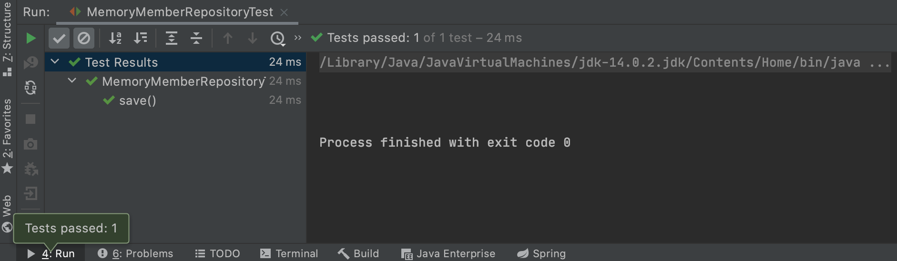

# 회원관리 예제로 간단히 백엔드 개발해 보기

## 비즈니스 요구사항 정리

서비스를 개발해 보기 전에 어떤 서비스를 만들 것이고 서비스 전반적으로 어떤 식으로 구성을 할 것인지를 먼저 정리해야 한다. 이번 예제의 경우에는 간단한 회원 관리 서비스를 구현해 볼 것이며 비즈니스 요구사항은 다음과 같다.

- 데이터: 회원 ID, 이름, 성별, 나이
- 기능: 회원 등록, 조회
- 아직 데이터 저장소(어떤 DBMS를 쓸 것인지)가 선정되지 않은 상황을 가정

### 애플리케이션 계층 구조


- 컨트롤러: 앞선 포스트에서 구현해 보았던 컨트롤러로 MVC에서의 컨트롤러 역할을 한다.
- 서비스: 핵심 비즈니스 로직을 구현한다. ex) 회원의 이름은 중복되지 않아야 한다 등등
- 도메인: 비즈니스 도메인의 객체이다. ex) 회원, 주문, 쿠폰 등 주로 DB에 저장되는 것들
- 리포지토리: DB에 접근하고 도메인 객체를 DB에 저장하고 관리하는 역할을 한다.

### 클래스 의존 관계


- 아직 DBMS를 정하지 않은 상태이기 때문에 이후 DBMS가 정해지면 바꿔서 적용하기 위한 Interface를 구현한다.
- 개발 초기에는 가벼운 메모리 기반의 데이터 저장소를 사용한다.

## 회원 도메인, 리포지토리 생성

### 도메인 생성

```src -> main -> java -> hello.hellospring``` 하위에 ```domain``` 패키지를 생성한 뒤 도메인(회원 클래스)를 선언해 준다. 기본 예제에서는 회원 id와 name만을 생성했으나 개인적으로 더 많은 정보를 시험해보고 싶어서 sex와 age를 추가하여 선언해 주었다. 이후 각 변수에 대한 getter, setter를 intelliJ의 자동완성 기능을 이용하여 생성해 주었다.

```java
package hello.hellospring.domain;

public class Member {
    private Long id;
    private String name;
    private String sex;
    private Integer age;

    public Long getId() {
        return id;
    }

    public void setId(Long id) {
        this.id = id;
    }

    public String getName() {
        return name;
    }

    public void setName(String name) {
        this.name = name;
    }

    public Integer getAge() {
        return age;
    }

    public void setAge(Integer age) {
        this.age = age;
    }

    public String getSex() {
        return sex;
    }

    public void setSex(String sex) {
        this.sex = sex;
    }
}

```

### 리포지토리 생성

```src -> main -> java -> hello.hellospring``` 하위에 ```repository``` 패키지를 만든 뒤 MemberRepository Interface를 생성한다.

```java
public interface MemberRepository {
    Member save(Member member);
    Optional<Member> findById(Long id);
    Optional<Member> findByName(String name);
    List<Member> findAll();
}
```

이후 같은 패키지 내에 MemoryMemberRepository 클래스를 생성하여 interface를 implement해준다.

```java
public class MemoryMemberRepository implements MemberRepository {

    private static Map<Long, Member> store = new HashMap<>();
    private static long sequence = 0L;

    @Override
    public Member save(Member member) {
        member.setId(++sequence);
        store.put(member.getId(), member);
        return member;
    }

    @Override
    public Optional<Member> findById(Long id) {
        return Optional.ofNullable(store.get(id));
    }

    @Override
    public Optional<Member> findByName(String name) {
        return store.values().stream()
                .filter(member -> member.getName().equals(name))
                .findAny();
    }

    @Override
    public List<Member> findAll() {
        return new ArrayList<>(store.values());
    }
}
```

- save 함수에서는 member의 id를 시스템에서 자동적으로 1씩 올려서 기록해주며 HashMap(store)에 넣어주고 membrer를 리턴해 준다.
- findById 함수에서는 sotre 에서 id값으로 찾아서 그 값을 리턴해 주는데 이 때 Null이 리턴될 수 있으므로 Optional의 ofNullable로 감싸주어 리턴해 준다.
- findByName에서는 node.js의 문법과 비슷한 람다를 사용하여 sotre내부를 돌며 member의 이름과 parameter가 같은 값을 찾아 리턴해 준다.
- findAll 함수는 sotre의 모든 값을 리턴해 주는 것이므로 ArrayList를 생성하여 store의 값들을 전부 리턴해 준다.

## 회원 리포지토리 테스트케이스 작성

캡스톤 디자인을 통해 TDD의 중요성을 알 수 있었고 JUnit을 한 번 사용해 보았는데 이번에도 JUnit을 사용해서 unit 테스트를 진행해 보려고 한다. JUnit은 손쉽게 테스트할 수 있으며 반복적으로 테스트할 수 있다는 장점이 있는 테스트 라이브러리 이다.

### save함수 테스트케이스 코드 작성

```src -> test -> java -> hello.hellospring``` 내부에 ```repository``` 패키지를 생성한 뒤 MemoryMemberRepositoryTest라는 이름의 클래스를 작성해 준다. 보통 테스트 코드를 작성할 때에는 테스트할 클래스 이름의 맨 뒤에 Test를 붙여서 네이밍 하는 것이 일반적이다. 해당 테스트 클래스는 외부에서 import해서 사용할 일이 없고 테스트에만 사용할 것이므로 public를 제거하고 아래와 같이 코딩해 준다.

```java
class MemoryMemberRepositoryTest {
    MemberRepository repository= new MemoryMemberRepository();

    @Test
    public void save() {
        Member member = new Member();
        member.setName("spring");

        repository.save(member);

        Member result = repository.findById(member.getId()).get();
        Assertions.assertEquals(member, result);
    }
}
```

- repository에 정상적으로 member가 추가되는지 확인해 보기 위해 테스트에 사용할 MemoryMemberRepository를 생성한다.
- @Test 를 사용하여 테스트 함수임을 선언하고 save함수 (store에 member를 추가하는 함수)를 선언한다.
- repository에 추가할 Member 객체를 만들고 이름을 설정한 후 repository에 save 함수를 이용해 추가해 준다.
- 이후 비교를 위해 result라는 이름의 Member 객체에 repository에서 id로 방금 넣은 member값을 할당해 준다. 이 때 리턴값이 Optional이므로 맨 뒤에 .get()을 이용하여 값을 추출해 준다.
- Assertions의 assertEquals 함수를 통해 넣어준 값 member와 repository에서 받아온 값 result를 비교한다. 이 때, **기댓값이 앞**에 오고, 비교할 값이 뒤에 와야 한다.

두 값이 일치하는 경우는 아래와 같이 테스트를 통과했다는 것을 확인할 수 있다.



AssertEquals 함수에 member와 null을 넣어 테스트를 통과하지 못하는 상황을 만들면 아래와 같이 테스트를 통과하지 못했다는 알림과 함께 어떤 값에서 통과하지 못했는지를 알려준다.


### 다른 방법의 테스트

테스트 케이스 코드의 Assertions 부분의 코드를 다른 라이브러리를 이용하여 작성할 수 있다. 해당 부분을 아래와 같이 바꾸어 코딩하면 똑같은 결과를 얻을 수 있으나 사람의 입장에서 쉽게 읽을 수 있는 테스트 코드가 된다.

```java
Assertions.assertThat(member).isEqualTo(result);
```

이 때 Assertions에 대고 ```option + enter```를 하면 Assertions를 static으로 추가할 수 있고 Assertions를 생략하고 assertThat만 사용할 수 있다.

### findByName 함수 테스트케이스 코드 작성

save함수의 테스트코드 밑에 findByName 함수의 테스트 케이스를 아래와 같이 작성한다.

```java
@Test
public void findByName() {
    Member member1 = new Member();
    member1.setName("spring1");
    repository.save(member1);

    Member member2 = new Member();
    member2.setName("spring2");
    repository.save(member2);

    Member result = repository.findByName("spring1").get();
    assertThat(member1).isEqualTo(result);
}
```

- 보다 정교한 테스트를 위해 member1, member2를 생성하여 repository에 추가한다.
- spring1이라는 name을 통해 repository에서 member를 추출하고 그 값을 member1과 비교하여 테스트한다.


위와 같이 정상적으로 테스트를 통과하는 것을 확인해 볼 수 있으며 아래는 result를 member2와 비교했을 때 테스트 실패 결과를 확인한 화면이다.


### findAll 함수 테스트케이스 코드 작성

findByName 테스트케이스 코드와 마찬가지로 그 밑에 아래와 같이 코드를 작성한다.

```java
@Test
public void findAll() {
    Member member1 = new Member();
    member1.setName("spring1");
    repository.save(member1);

    Member member2 = new Member();
    member2.setName("spring2");
    repository.save(member2);

    Member member3 = new Member();
    member3.setName("spring3");
    repository.save(member3);

    List<Member> result = repository.findAll();
    assertThat(result.size()).isEqualTo(3);
}
```

- 정교한 테스트를 위해 3명의 멤버를 추가해 주었다.
- findAll 함수의 반환형은 List이므로 result를 List로 선언하여 결과값을 저장한다.
- 제대로 작동이 되었다면 result의 길이는 3일 것이므로 3과 비교를 하여 테스트한다.


### 전체 클래스 테스트 실행

위와 같이 각 테스트 케이스 별로 테스트할 수도 있지만 테스트 코드를 포함하는 전체 클래스 단위로도 테스트를 실행할 수 있다. MemoryMemberRepositoryTest 전체를 테스트하게 되면 아래와 같은 결과를 확인할 수 있다.


원래 테스트 케이스의 실행순서는 보장되지 않으므로 **각 테스트 케이스들은 서로에 독립적으로 작성**해야 한다. 하지만 여기서는 findAll 테스트 케이스가 먼저 실행되면서 repository에 spring1이라는 이름의 다른 객체가 이미 있으므로 findByName의 테스트를 통과하지 못했다. 따라서 각 테스트케이스가 종료될 때마다 공유하고 있는 repository를 초기화 해주어야 한다.

### clear함수 작성

MemoryMemberRepository 클래스에 가서 store를 전부 비워주는 함수를 작성한다.

```java
public void clearStore() {
    store.clear();
}
```

MemoryMemberRepositoryTest에서 각 테스트케이스가 종료될 때마다 호출되는 callback인 AtferEach를 사용하여 repository를 초기화 해준다.

```java
@AfterEach
public void afterEach() {
    repository.clearStore();
}
```

위와 같이 코드를 추가한 후 테스트를 한다면 각 테스트마다 repository가 비워지므로 아래와 같이 모든 테스트 케이스를 통과하는 것을 확인할 수 있다.


