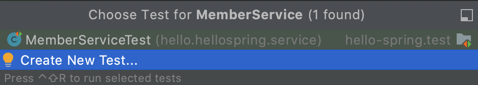
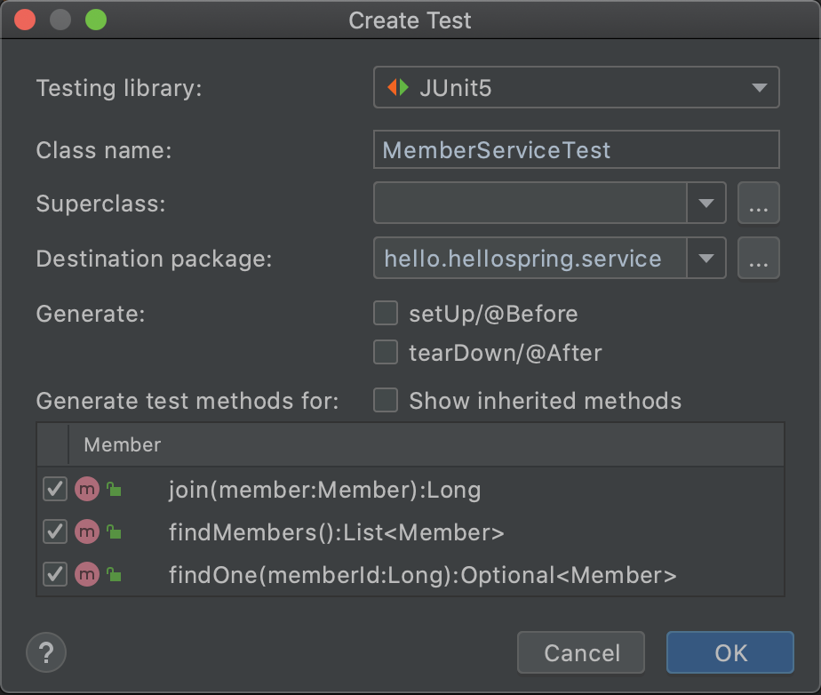
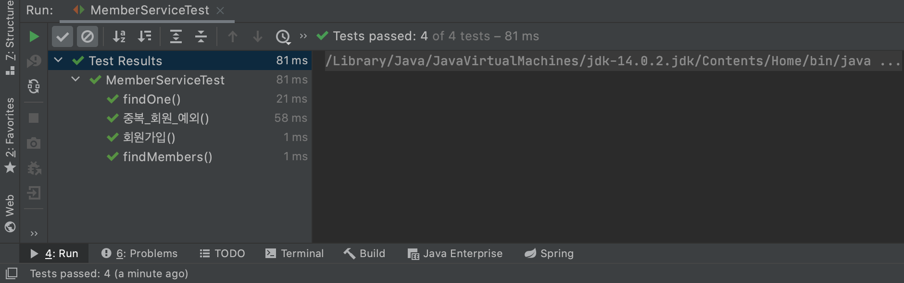

# 회원관리 예제로 간단히 백엔드 개발해 보기2

## 회원 서비스 개발

이번에는 애플리케이션 계층 구조에서 살펴보았던 서비스를 구현해 보아야 하므로 ```src -> main -> java -> hello.hellospring```에 ```service``` 패키지를 생성한 후 MemberService 클래스를 만들어준다.

### 회원가입 서비스

```java
public class MemberService {
    private final MemberRepository memberRepository = new MemoryMemberRepository();

    /*
    * 회원가입
    */
    public Long join(Member member) {
        // 같은 이름의 회원 중복가입 불가
        memberRepository.findByName(member.getName())
            .ifPresent(m -> {
                throw new IllegalStateException("이미 존재하는 회원입니다.");
            });
        memberRepository.save(member);
        return member.getId();
    }
}
```

- Join 함수를 만들어 parameter로 들어온 member를 repository에 추가해 주고 해당 member의 id를 리턴해 준다.
- 앞서 설정한 서비스에서 중복 이름을 갖는 회원은 가입이 불가능하도록 설정을 했으므로 Optional의 ifPresent를 이용하여 해당 경우를 처리해 준다.
- 만약 member의 이름으로 repository에서 검색을 하였는데 member가 이미 존재할 경우 IllegalStateException으로 경고문구를 출력해 준다.

위와 같이 코딩할 경우에는 회원 중복체크 로직이 너무 길고 복잡해 지므로 내부 함수로 Extract하여 사용하면 더욱 보기 간편하고 이후 수정도 용이하게 할 수 있다. findByName쪽에 커서를 놓고 ```control + T```를 누르면 리팩토링과 관련된 메뉴가 나오게 되는데 여기서 extract method를 선택하여 validateDuplicateMember함수로 빼서 정리한다.

```java
public class MemberService {
    private final MemberRepository memberRepository = new MemoryMemberRepository();

    /*
    * 회원가입
    */
    public Long join(Member member) {
        // 같은 이름의 회원 중복가입 불가
        validateDuplicateMember(member); // 중복 회원 검증
        memberRepository.save(member);
        return member.getId();
    }

    private void validateDuplicateMember(Member member) {
        memberRepository.findByName(member.getName())
            .ifPresent(m -> {
                throw new IllegalStateException("이미 존재하는 회원입니다.");
            });
    }
}
```


### 회원 조회 서비스

기존에 만들어 두었던 findAll, findById 함수를 통해 전체 회원 조회, 회원 한명 조회하는 서비스 로직을 구현한다.

```java
/*
* 회원 조회
*/
public List<Member> findMembers() {
    return memberRepository.findAll();
}

public Optional<Member> findOne(Long memberId) {
    return memberRepository.findById(memberId);
}
```


## 회원 서비스 테스트코드 작성

테스트케이스를 작성할 클래스를 선택한 뒤 ```command + shift + T``` 를 누르면 다음과 같이 자동으로 테스트 클래스를 생성할 수 있다.





### 회원가입 테스트케이스 작성

보통 테스트 코드는 빌드시에 포함되지 않고 테스트 용도로만 사용되기 때문에 테스트 이름을 직관적으로 나타내기 위해 한글로도 많이 쓴다. 여기서는 join을 회원가입으로 바꾸어 테스트 코드를 작성 하며 모든 테스트 케이스는 1. 무언가가 주어지고 2. 실행이 되고 3. 그런 후에 결과를 확인하는 단계가 있으므로 다음과 같이 주석을 달고 작성을 하는 것이 편한다.

```java
@Test
void 회원가입() {
	// given
	Member member = new Member();
  member.setName("spring");
  
	// when
	Long saveId = memberService.join(member);
  
	// then
  Member findMember = memberService.findOne(saveId).get();
  assertThat(member.getName()).isEqualTo(findMember.getName());
}
```

위와 같이 테스트 케이스를 작성하여 실행하면 잘 동작은 하지만 중복 회원가입이 발생하였을 때의 예외가 제대로 발생하는지를 검출할 수는 없다. 따라서 일반적인 기능 외에 예외에 대한 테스트케이스를 추가로 만들어 준다.

```java
@Test
void 중복_회원_예외() {
    // given
    Member member1 = new Member();
    member1.setName("spring");

    Member member2 = new Member();
    member2.setName("spring");

    // when
    memberService.join(member1);
    IllegalStateException e = assertThrows(IllegalStateException.class, () -> memberService.join(member2));

     // then
    assertThat(e.getMessage()).isEqualTo("이미 존재하는 회원입니다.");
}
```

- 중복된 이름을 갖는 member가 가입되면 미리 코딩해 두었던 IllegalStateException이 thorw 돼어야 한다. 이를 ㅁssertThrows 함수를 이용해 검출하며 람다를 이용해서 member2가 join되는 것을 실행해 준다.
- 검출된 Exception e와 앞서 코딩해 두었던 경고 문구가 일치하는지도 assertThat을 이용하여 테스트해 본다.

### Repository 초기화

앞서 작성했던 테스트코드와 같이 각 테스트케이스는 서로 독립적이어야 하기 때문에 공유하는 repository를 AfterEach를 통해 초기화 해준다.

```java
MemoryMemberRepository memoryMemberRepository = new MemoryMemberRepository();

@AfterEach
void afterEach() {
    memoryMemberRepository.clearStore();
}
```

위 코드를 전부 추가해 준 뒤 전체 클래스에 대한 테스트를 실행하면 아래와 같은 결과를 확인할 수 있다.



### DI(Dependency Injection)

위 단계까지 테스트 코드를 작성했다면 테스트 코드 최상단에는 아래와 같이 두 개의 인스턴스가 생성될 것이다.

```java
MemberService memberService = new MemberService;
MemoryMemberRepository memoryMemberRepository = new MemoryMemberRepository();
```

이것을 잘 살펴보면 원래 MemberService 자체에서 repository를 생성해서 작업을 처리하는데 테스트 코드에서는 그 repository외에 다른 인스턴스를 생성하여 테스트를 진행하고 있다. 현재는 repository내의 store를 static으로 생성하여 일관성 문제가 발생하지 않지만 만약 static이 아니라면 테스트가 제대로 이루어 지지 않을 것이다. 이를 일치 시켜주기 위해 우선 Memberservice를 다음과 같이 수정해 준다.

```java
private final MemberRepository memberRepository;

public MemberService(MemberRepository memberRepository) {
    this.memberRepository = memberRepository;
}
```

원래는 private final MemberRepository memberRepository = new MemberRepository(); 와 같이 되어 있었으나 외부에서 MemberRepository를 parameter로 넘겨주어 해당 리포지토리를 서비스에 사용하도록 코드를 수정하였다.

```java
MemberService memberService;
MemoryMemberRepository memoryMemberRepository;

@BeforeEach
void beforeEach() {
    memoryMemberRepository = new MemoryMemberRepository();
    memberService = new MemberService(memoryMemberRepository);
}
```

이후 위와 같이 테스트 코드를 수정해 주는데 이전과 같이 선언과 동시에 인스턴스를 생성하지 않고 각 테스트 케이스가 실행되기 직전에 호출되는 **BeforeEach**콜백을 활용하여 MemberRepository 인스턴스를 만들고 해당 인스턴스를 MemberService에서 사용할 수 있도록 parameter로 넘겨준다. 위와 같이 수정한다면 일관성 문제를 해결할 수 있고 다음과 같이 정상적으로 테스트가 수행된 것을 확인할 수 있다.


MemberServiece 입장에서는 MemberRepository를 외부에서 넣어주는 것이며 이를 **Dependency Injection**이라고 한다.