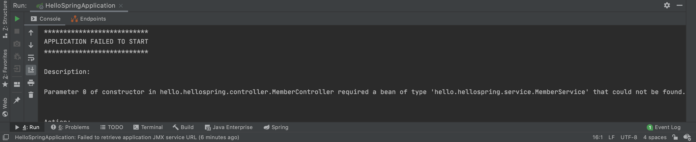

# 스프링 빈과 의존관계

## 스프링 빈을 등록하는 2가지 방법

### 컴포넌트 스캔과 자동 의존관계 설정

앞선 예제에서 **@Controller**라는 어노테이션을 사용해 보았다. 스프링에는 이것 외에도 여러 종류의 어노테이션이 존재하는데 아래 세 가지 종류의 어노테이션은 **@Component** 어노테이션을 포함하고 있다.

- @Controller
- @Service
- @Repository

Spring 컨테이너는 실행되면 기본적으로 이러한 Component를 전부 찾는데(스캔), 이러한 Component들(**스프링 빈**)을 스프링 컨테이너에 **Singleton** 패턴으로 등록하여 공유한다. 다르게 설정할 수 있지만 대부분 이대로 사용한다.

이러한 컴포넌트 스캔은 맨 처음 생성한 Application java class가 속한 패키지의 하위에서만 일어나며, 동등하거나 상위에서는 컴포넌트 스캔을 실행하지 않는다. 예를 들어 

```java
package hello.hellospring;

@SpringBootApplication
public class HelloSpringApplication {

	public static void main(String[] args) {
		SpringApplication.run(HelloSpringApplication.class, args);
	}

}
```

위 코드로 확인했을 때 Application class는 hell.hellospring에 속해 있다. 따라서 **컴포넌트 스캔은 hello.hellospring 패키지 내에서만 일어나며** 그 외부의 위치에 컴포넌트 어노테이션을 사용하더라도 컴포넌트 스캔의 대상이 되지 않는다.

### 자바 코드로 직접 스프링 빈 등록

컴포넌트 스캔을 사용하지 않고 SpringConfig 파일을 만들어 java 코드로 직접 스프링 빈을 등록하는 방법이다. 자세한 내용을 하단에서 설명한다.

### xml로 스프링 빈 등록

최근에는 잘 사용하지 않는 방법이므로 스킵한다.

### 실무에서의 사용

실무에서는 주로 정형화된 Controller, Service, Repository는 컴포넌트 스캔을 사용하며 그 외 정형화되지 않거나 상황에 따라 구현 클래스를 변경해야 할 경우에는 SpringConfig로 스프링 빈을 등록한다.

우리가 현재 구현하고 있는 서비스는 아직 DB가 정해지지 않았기 때문에 MemberRepository 인터페이스를 선언해서 그것을 MemoryMemberRepository로 구현하고 있다. 따라서 이후 DB가 정해진다면 DbMemberRepository로 구현체를 변경하기만 하면 다른 코드를 일절 손대지 않고 SpringConfig만 수정하여 저장소를 바꿀 수 있다. 따라서 Repository 부분은 컴포넌트 스캔 대신 config를 이용하여 스프링 빈을 등록해 놓는다.

```java
@Configuration
public class SpringConfig {
    @Bean
    public MemberRepository memberRepository() {
        return new DbMemberRepository();
    }
}
```

위처럼 MemberRepository의 반환값을 ```MemoryMemberRepository -> DbMemberRepository```로 한 줄만 수정하면 Repository를 변경할 수 있다.

## 컴포넌트 스캔과 자동 의존관계 설정

사용자가 회원가입을 하기 위해서는 View가 필요하고 해당 View에서 동작할 Controlloer가 필요하다. Member Controller는 이전 포스트까지 작성했던 코드 중에서 Member Service를 사용해서 회원 가입 기능을 수행해야 하기 때문에 의존한다고 표현할 수 있다.

### MemberController 생성

```java
@Controller
public class MemberController {
    
}
```

```src -> main -> java -> hello.hellospring -> controller``` 폴더에 MemberController 클래스를 만들고 @Controller 어노테이션을 붙여준다. 스프링에서는 @Controller 어노테이션을 만나면 스프링 컨테이너 안에 해당 클래스를 생성해서 갖고 있게 되는데 이를 **스프링 빈**이라고 한다.

### 자동 의존관계 생성

MemberController에서는 MemberService를 이용하여 로직을 처리해야 하므로 클래스 자체에 MemberService 인스턴스를 가져야 한다. 하지만 클래스 내부에서 new를 사용하여 MemberService를 생성해 사용한다면 다른 컨트롤러와 MemberService를 공유할 수 없다. 예를 들면 회원가입 외에서 예약 등의 작업을 처리할 컨트롤러에서 MemberService를 사용할 수 있으므로 각 컨트롤러는 **서비스를 스프링 컨테이너에 등록하고 공유되는 서비스를 컨테이너로부터 받아 써야 한다**.

따라서 MemberController의 생성자를 만들어 주고 그 위에 **@Autowired** 어노테이션을 붙여준다. 이로써 스프링 컨테이너와 자동으로 연결해서 MemberService를 가져다 쓸 수 있게 된다.

```java
@Controller
public class MemberController {
    private final MemberService memberService;

    @Autowired
    public MemberController(MemberService memberService) {
        this.memberService = memberService;
    }
}
```

하지만 이 상태로 실행을 하게 되면 spring에서 MemberService를 서비스로 인식하지 못해서 다음과 같은 에러가 뜬다.




따라서 spring이 MemberService를 서비스로 인식할 수 있게 MemberServiece 클래스 위에 **@Service** 어노테이션을 추가해 준다. 여기서 MemberRepository를 사용하므로 마찬가지로 MemberRepository를 리포지토리를 인식할 수 있게 클래스 위에 **@Repository** 어노테이션을 추가해 준다.

```java
@Service
public class MemberService {
	private final MemberRepository memberRepository;

    @Autowired
    public MemberService(MemberRepository memberRepository) {
        this.memberRepository = memberRepository;
    }
}

@Repository
public class MemoryMemberRepository implements MemberRepository {
  ...
}
```

이와 같이 코드를 짠다면 스프링이 실행될 때 스프링 컨테이너가 MemberService를 인식하고 MemberController에 집어 넣어 컨트롤러를 생성하게 되며 MemberService에서도 MemoryMemberRepository를 필요로 하므로 스프링 컨테이너가 MMR을 MS에 넣어 생성해 준다. 이를 **Dependency Injection(DI)**이라고 한다. 이렇게 생성된 의존 관계는 아래의 그림으로 나타낼 수 있다.


## 자바 코드로 직접 스프링 빈 등록

앞서 알아보았던 컴포넌트 스캔 외에 Configuration을 직접 코딩하여 빈을 등록하는 방법으로 Serviec와 Repository를 등록해 본다. 먼저 MemberService와 MemoryMemberRepository 위의 @Service, @Repository, @AutoWired 어노테이션을 지워준다.

```src -> main -> java -> hello.hellospring``` 폴더 내부에 SpringConfig java 클래스를 만든 후 클래스 이름 위에 **@Configuration** 어노테이션을 달아주어 Config 파일임을 스프링에 알려준다. 이후 클래스 내부에 **@Bean** 어노테이션으로 스프링 빈을 등록하는 것을 알려주고 MemberService와 MemberRepository를 생성해 준다.

```java
@Configuration
public class SpringConfig {

    @Bean
    public MemberService memberService() {
        return new MemberService(memberRepository());
    }

    @Bean
    public MemberRepository memberRepository() {
        return new MemoryMemberRepository();
    }
}
```

여기서 MemberRepository는 Interface이므로 반환 값은 그것의 구현체인 MemoryMemberRepository로 반환하여야 하며, MemberService는 memberRepository가 있어야 생성할 수 있으므로 parameter로 넣어준다.


## DI의 종류

DI의 종류에는 세 가지가 있으며 최근에는 생성자 주입을 대부분 사용한다. 여기서는 MemberController를 예로 들어 설명하겠다.

### 1. 필드 주입

```java
@Controller
public class MemberController {
    @Autowired private final MemberService memberService;
    ...
}
```

말 그대로 필드에서 어노테이션을 사용해 바로 주입하는 방법이며 세팅 중간에 주입할 값을 바꾸거나 할 수 없기 때문에 권장되지 않는다고 한다.

### 2. setter 주입

```java
@Controller
public class MemberController {
    private MemberService memberService;

    @Autowired
    public void setMemberService(MemberService memberService) {
        this.memberService = memberService;
    }
}
```

생성자와 비슷한 형식이지만 setter를 이용해서 의존성을 주입하는 방법이다. 생성자와 별 다를 것 없이 생겼으나 set 함수가 public으로 공개되어 혹시나 세팅이 완료된 후 외부의 접근으로 인해 setting 값이 변할 수 있다는 위험이 있다.

### 3. 생성자 주입

```java
@Controller
public class MemberController {
    private final MemberService memberService;

    @Autowired
    public MemberController(MemberService memberService) {
        this.memberService = memberService;
    }
}
```

여태까지 계속 사용했던 방법이며 가장 권장되는 방법이다. 의존관계가 실행중에 동적으로 변하는 경우는 없기 때문에 권장된다.

## Reference

**Inflearn** - **스프링 입문 - 코드로 배우는 스프링 부트, 웹 MVC, DB 접근 기술: 김영한**

본 포스트는 Inflearn에서 김영한 님의 스프링 입문 강의를 들으며 개인적으로 정리한 내용입니다. 내용 중에 강의에서 제공하는 pdf파일의 일부분이 포함되어 있으므로 혹시나 그림을 사용하고 싶은 분은 김영한 님의 강의자료 인용 표시를 확실하게 해주시면 감사하겠습니다.