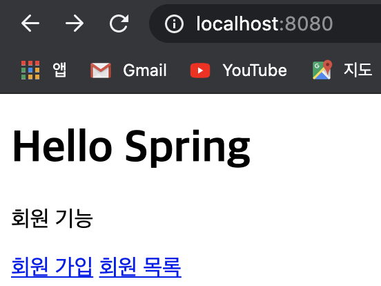
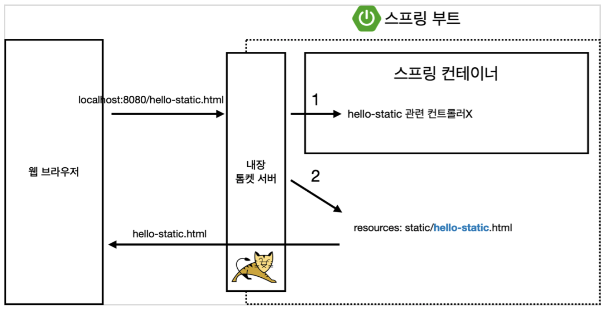
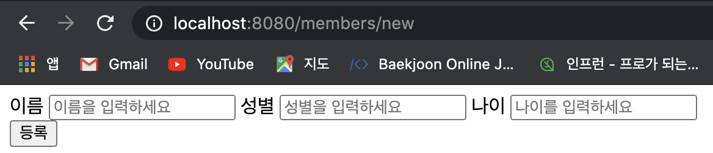
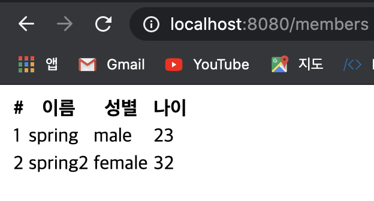

# 회원관리 예제 - 웹 MVC 개발

## 홈 화면 추가

### HomeController 생성

Routing을 처리해 줄 HomeController를 controller 패키지 안에 만들고 아래와 같이 코딩한다.

```java
@Controller
public class HomeController {

    @GetMapping("/")
    public String home() {
        return "home";
    }
}
```

### home.html 추가

HomeController에서 리턴한 home에 해당하는 템플릿을 화면에 띄워주기 위해 templates 패키지 안에 home.html 파일을 만들고 아래와 같이 코딩한다.

```html
<!DOCTYPE HTML>
<html xmlns:th="http://www.thymeleaf.org">
<body>
<div class="container">
    <div>
        <h1>Hello Spring</h1> <p>회원 기능</p>
        <p>
            <a href="/members/new">회원 가입</a> <a href="/members">회원 목록</a>
        </p> </div>
</div> <!-- /container --> </body>
</html>
```

이후 서버를 실행한 뒤 localhost:8080으로 접속하면 아래와 같이 방금 코딩한 html 화면을 확인할 수 있다.



이전에 보였던 index.html이 안 보이는 이유는 스프링의 동작 과정이 아래와 같기 때문이다. 



스프링의 동작 방식은 GET 요청이 들어오면 그에 해당하는 **컨트롤러를 먼저 찾은 다음** 컨트롤러가 존재하지 않으면 static 파일을 렌더링 해준다. 따라서 이번 경우에는 controller를 생성해 두었으므로 controller를 호출하여 정적 파일인 index.html이 렌더링 되지 않은 것이다.

## 회원 웹 기능 - 등록

### Routing Code 추가

회원가입 버튼을 누르면 /members/new로 get요청을 보내게 되므로 해당 요청을 라우팅할 코드를 MemberController에 아래와 같이 작성한다.

```java
@GetMapping("/members/new")
public String createForm() {
    return "members/createMemberForm";
}
```

### createMemberForm.html 추가

MemberController로부터 리턴된 createMemberForm을 화면에 렌더링하기 위해 templates에 members 폴더를 만들고 그 안에 createMemberForm.html 파일을 생성하여 아래와 같이 코딩한다.

```html
<!DOCTYPE HTML>
<html xmlns:th="http://www.thymeleaf.org">
<body>
    <div class="container">
        <form action="/members/new" method="post">
            <div class="form-group">
                <label for="name">이름</label>
                <input type="text" id="name" name="name" placeholder="이름을 입력하세요">
                <label for="sex">성별</label>
                <input type="text" id="sex" name="sex" placeholder="성별을 입력하세요">
                <label for="age">나이</label>
                <input type="number" id="age" name="age" placeholder="나이를 입력하세요">
            </div>
            <button type="submit">등록</button>
        </form>
    </div> <!-- /container -->
</body>
</html>
```

이후 서버를 실행하고 회원 가입 버튼을 누르면 아래와 같은 화면을 볼 수 있다.



### PostMapping 코드 추가

위 화면에서 이름, 성별, 나이를 입력한 후 등록 버튼을 누르면 /members/new 경로로 post 요청을 보내게 되는데 이를 처리하기 위해 Controller에 postMapping 코드를 아래와 같이 추가해 준다. 멤버를 멤버 서비스에 추가하고 난 뒤 메인으로 돌아가게 하기 위해 redirect를 사용한다.

```java
@PostMapping("/members/new")
public String create(MemberForm form) {
    Member member = new Member();
    member.setName(form.getName());
    member.setSex(form.getSex());
    member.setAge(form.getAge());

    memberService.join(member);

    return "redirect:/";
}
```

여기서 매개변수로 MemberForm을 사용하는데 Controller 패키지 안에 다음과 같이 MemberForm  클래스를 생성해 준다. 이 때 매개변수의 attribute와 넘어온 form 값의 id가 같으면 스프링이 자동으로 setter를 사용해서 값을 넣어준다.

```java
public class MemberForm {
    private String name;
    private String sex;
    private Integer age;

    public void setName(String name) {
        this.name = name;
    }

    public String getName() {
        return name;
    }

    public void setSex(String sex) {
        this.sex = sex;
    }

    public String getSex() {
        return sex;
    }

    public void setAge(Integer age) {
        this.age = age;
    }

    public Integer getAge() {
        return age;
    }
}
```


## 회원 웹 기능 - 조회

### Routing Code 추가

회원 목록 버튼을 누르면 members로 Get 요청이 가기 때문에 해당 로직을 처리해 줄 routing 코드를 MemberController 내에 작성해 준다.

```java
@GetMapping("/members")
public String list(Model model) {
    List<Member> members = memberService.findMembers();
    model.addAttribute("members", members);
    return "members/memberList";
}
```

### memberList.html 추가

Controller에서 memberList.html을 리턴하므로 templates의 members 폴더 안에 memberList.html을 생성하고 아래와 같이 코딩한다.

```html
<!DOCTYPE HTML>
<html xmlns:th="http://www.thymeleaf.org"> <body>
<div class="container">
    <div>
        <table>
            <thead>
            <tr>
                <th>#</th>
                <th>이름</th>
                <th>성별</th>
                <th>나이</th>
            </tr>
            </thead>
            <tbody>
            <tr th:each="member : ${members}">
                <td th:text="${member.id}"></td>
                <td th:text="${member.name}"></td>
                <td th:text="${member.sex}"></td>
                <td th:text="${member.age}"></td>
            </tr>
            </tbody>
        </table>
    </div>
</div> <!-- /container -->
</body>
</html>
```

위와 같이 코딩하고 난 후 회원 등록 창에서 두 명의 회원을 등록 후 회원 목록을 들어가게 되면 아래와 같이 목록을 확인할 수 있다. 위 html 코드에서는 템플릿 엔진인 thymeleaf의 문법을 사용하여 루프를 돌며 각 멤버에 대한 값을 출력해 주기 때문에 간단한 코드만으로 아래와 같이 중복된 코드를 처리할 수 있다.




## Reference

**Inflearn** - **스프링 입문 - 코드로 배우는 스프링 부트, 웹 MVC, DB 접근 기술: 김영한**

본 포스트는 Inflearn에서 김영한 님의 스프링 입문 강의를 들으며 개인적으로 정리한 내용입니다. 내용 중에 강의에서 제공하는 pdf파일의 일부분이 포함되어 있으므로 혹시나 그림을 사용하고 싶은 분은 김영한 님의 강의자료 인용 표시를 확실하게 해주시면 감사하겠습니다.