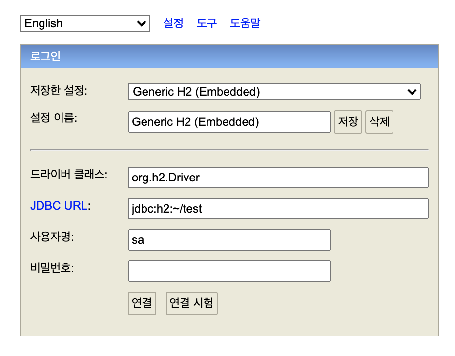
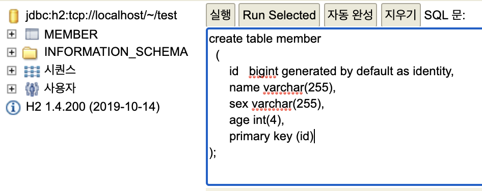
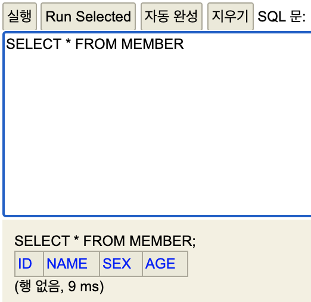
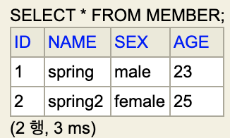
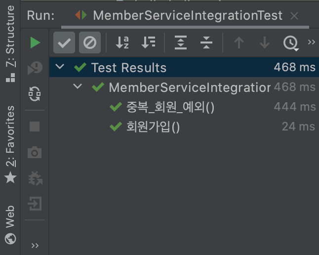
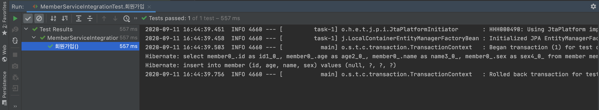
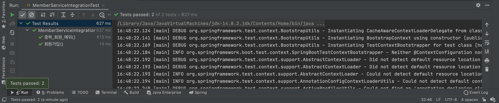
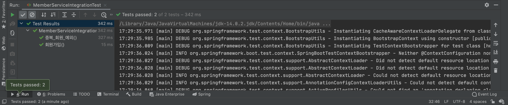
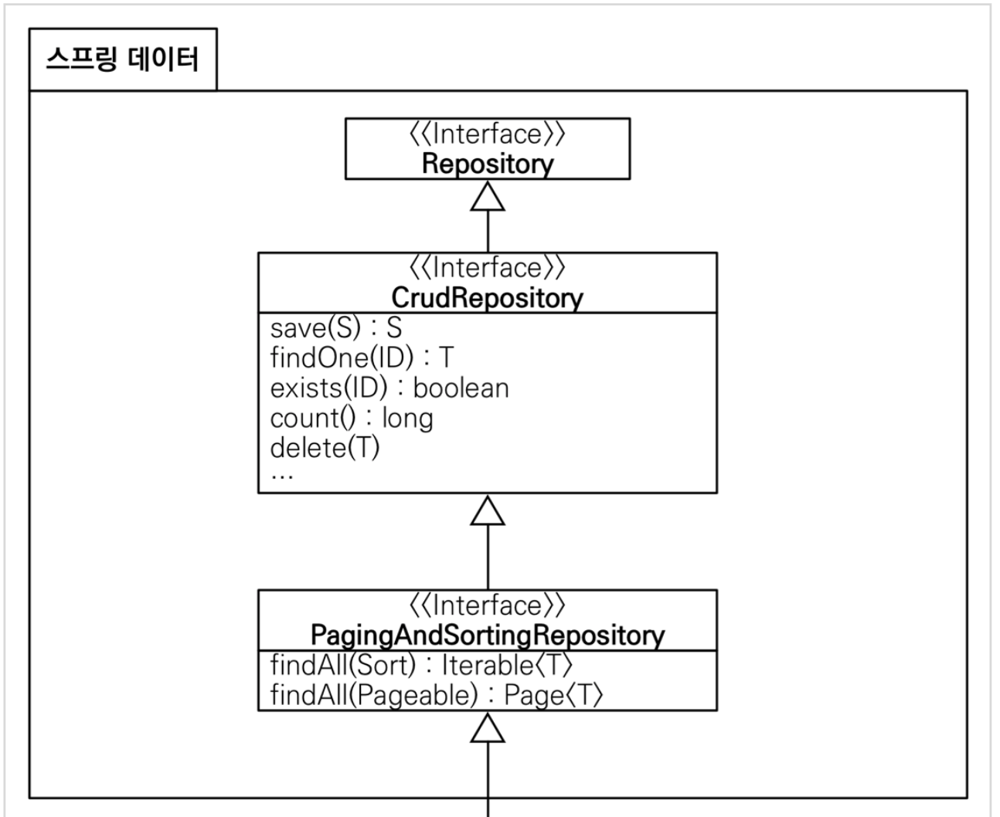
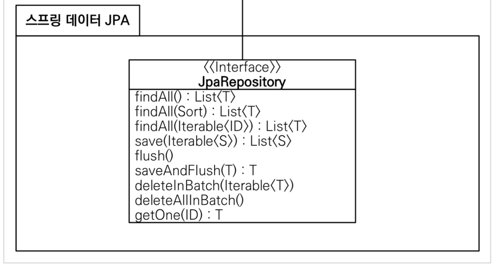

# 스프링 DB 접근 기술

## H2 DB 설치

실무에서는 MySQL, Oracle 등의 제품을 많이 사용하지만 여기서는 DB 실사용 보다는 어떻게 연동을 하는지가 중요하므로 교육용이면서 가벼운 H2 DB를 사용한다.

### 권한부여 - mac

h2를 공식 홈페이지에서 다운받은 다음(https://www.h2database.com/html/main.html) 압축을 풀고 iterm으로 h2 디렉토리에 접근한다. 내부의 bin 폴더에 들어가면 h2.sh 파일이 있는데 mac의 경우에는 권한을 미리 부여해야 실행이 가능하므로 ```chmod 755 h2.sh``` 명령어로 권한을 부여한 후 실행해 준다. 

실행이 성공적으로 된다면 기본 브라우저가 열리면서 다음과 같은 화면을 확인할 수 있다.



### DB 파일 생성

현재는 DB 파일이 만들어져 있지 않기 때문에 DB 파일을 생성해 주어야 한다. 위 화면에서 ```연결``` 버튼을 누르면 새 DB 파일이 생성되고 관리 페이지로 넘어가게 된다. 이 때, 이 페이지에서 나와서 iterm으로 home에 접근하여 ```test.mv.db``` 파일이 있는지를 확인한다.


이후부터는 윗 사진과 같이 JDBC URL로 접속하게 되면 웹 콘솔과 애플리케이션에서 동시 접속에 문제가 생길 수 있으므로 ```jdbc:h2:tcp://localhost/~/test``` 주소로 소켓을 통해 접속하도록 한다.

### DB 테이블 생성

SQL 입력창에 아래와 같이 입력을 하고 실행을 누르면 왼쪽 메뉴에서 볼 수 있듯이 MEMBER 테이블이 생성된다.



이후에는 아래와 같이 SELECT 문으로 테이블을 조회할 수도 있다.



### DB 데이터 넣기

이전에 사용해보았던 MySQL과 같이 표준 SQL 문법을 지원하므로 사용하는데 어려운 점은 없었다. 다음과 같이 데이터를 넣고 조회를 하면 아래 캡쳐한 화면을 확인할 수 있다. 이 때 ID는 넣지 않더라도 Auto increase 되어 저장된다.

```mysql
insert into member(name, sex, age) values('spring', 'male', 23);
insert into member(name, sex, age) values('spring2', 'female', 25);
```



## JDBC template

### gradle에 jdbc 관련 dependency 추가

jdbc를 사용하기 위하여 gradle파일의 dependencies에 아래와 같이 dependency를 추가해 준다.

```java
implementation 'org.springframework.boot:spring-boot-starter-jdbc'
runtimeOnly 'com.h2database:h2'
```

### H2 DB 사용 설정 추가

```src -> main -> resources -> application.properties```에 다음과 같은 코드를 추가하여 h2 db 사용 설정을 해준다. 이 코드를 통해 스프링이 h2와 연결되어 DataSource 객체를 스프링 빈으로 등록하여 갖고 있게 된다.

```java
spring.datasource.url=jdbc:h2:tcp://localhost/~/test 
spring.datasource.driver-class-name=org.h2.Driver
```


### JdbcTemplate 클래스 추가

```repository``` 패키지 안에 MemberRepository 인터페이스를 구현할 JdbcTemplateMemberRepository를 생성한다.

```java
public class JdbcTemplateMemberRepository implements MemberRepository{
    private final JdbcTemplate jdbcTemplate;

    @Autowired
    public JdbcTemplateMemberRepository(DataSource dataSource) {
        jdbcTemplate = new JdbcTemplate(dataSource);
    }
}
```

이 때 생성자 Injection으로 스프링으로부터 DataSource를 주입받아 사용하는데, **Datasource는 DB 커넥션을 획득할 때 사용하는 객체이며 스프링 부트에서는 데이터 커넥션 정보를 바탕으로 DataSource를 생성하여 Spring Bean으로 등록해 둔다.**

### MemberRepository 기능 구현

MemberRepository 내부의 4개 메소드를 전부 구현해 준다. 

```java
public class JdbcTemplateMemberRepository implements MemberRepository{
    private final JdbcTemplate jdbcTemplate;

    @Autowired
    public JdbcTemplateMemberRepository(DataSource dataSource) {
        jdbcTemplate = new JdbcTemplate(dataSource);
    }

    @Override
    public Member save(Member member) {
        SimpleJdbcInsert jdbcInsert = new SimpleJdbcInsert(jdbcTemplate);
        jdbcInsert.withTableName("member").usingGeneratedKeyColumns("id");

        Map<String, Object> parameters = new HashMap<>();
        parameters.put("name", member.getName());
        parameters.put("sex", member.getSex());
        parameters.put("age", member.getAge());

        Number key = jdbcInsert.executeAndReturnKey(new MapSqlParameterSource(parameters));
        member.setId(key.longValue());
        return member;
    }

    @Override
    public Optional<Member> findById(Long id) {
        List<Member> result = jdbcTemplate.query("select * from member where id = ?", memberRowMapper(), id);
        return result.stream().findAny();
    }

    @Override
    public Optional<Member> findByName(String name) {
        List<Member> result = jdbcTemplate.query("select * from member where name = ?", memberRowMapper(), name);
        return result.stream().findAny();
    }

    @Override
    public List<Member> findAll() {
        return jdbcTemplate.query("select * from member", memberRowMapper());
    }

    private RowMapper<Member> memberRowMapper() {
        return (rs, rowNum) -> {
             Member member = new Member();
             member.setId(rs.getLong("id"));
             member.setName(rs.getString("name"));
             member.setSex(rs.getString("sex"));
             member.setAge(rs.getInt("age"));
             return member;
        };
    }
}

```

이 때 sava 함수의 경우에는 파라미터만 설정해 주고 따로 sql을 쓰지 않는 것을 볼 수 있다. 여기서는 쿼리 대신 jdbc의 jdbcInsert 메소드의 executeAndReturnKey를 사용하여 리턴 받은 키를 멤버에 할당하여 리턴해 준다.

그 외 세 메소드의 경우에는 직접 쿼리를 작성하여 DB로부터 row들을 받아오는데, 이를 자바의 객체와 매핑시켜 줄 RowMapper를 생성해 준다. parameter인 rs를 받아 id, name, sex, age를 추출해 member 객체에 할당한 후 리턴해 준다.

### JdbcTemplate 사용 설정

SpringConfig에서 DB와 연결을 위해 DataSource를 인젝션 받아주고, 기존 MemoryMemberRepository를 MemberRepository의 구현체로 사용하던 설정을 JdbcTemplateMemberRepository로 변경해 준다. 

```java
@Configuration
public class SpringConfig {

    private DataSource dataSource;

    @Autowired
    public SpringConfig(DataSource dataSource) {
        this.dataSource = dataSource;
    }

    @Bean
    public MemberService memberService() {
        return new MemberService(memberRepository());
    }

    @Bean
    public MemberRepository memberRepository() {
        return new JdbcTemplateMemberRepository(dataSource);
    }
}
```

### 통합 테스트코드 작성

```java
@SpringBootTest
@Transactional
public class MemberServiceIntegrationTest {

    @Autowired MemberService memberService;
    @Autowired MemberRepository memberRepository;
    @Test
    public void 회원가입() throws Exception {
        //Given
        Member member = new Member(); 
        member.setName("hello");
        //When
        Long saveId = memberService.join(member);
        Member findMember = memberRepository.findById(saveId).get();
        assertEquals(member.getName(), findMember.getName());
    }

    @Test
    public void 중복_회원_예외() throws Exception {
        //Given
        Member member1 = new Member(); member1.setName("spring");
        Member member2 = new Member(); member2.setName("spring");
        //When
        memberService.join(member1);
        IllegalStateException e = assertThrows(IllegalStateException.class,
                () -> memberService.join(member2)); //예외가 발생해야 한다.
        assertThat(e.getMessage()).isEqualTo("이미 존재하는 회원입니다.");
    }
}
```

- @Transactional 어노테이션은 매 테스트가 끝날 때마다 그 결과를 Db에 커밋하지 않고 Rollback하여 실제 Db에는 테스트에 따른 변경사항이 저장되지 않게 하는 옵션이다.
- 이전 BeforeEach, AfterEach등을 사용하여 메모리를 계속 할당, 해제 해주는 역할과 비슷한 역할을 한다고 생각하면 된다.

### Jdbc Template 예제 통합 테스트

테스트 코드를 작성하지 않았다면 애플리케이션을 실행 시킨 후 인터넷 콘솔 창에서 멤버를 한명씩 넣으면서 회원가입이 되는지, 중복 체크가 되는지를 테스트해야한다. 하지만 통합 테스트 코드를 작성해 놓았기 때문에 기존 h2 db의 데이터를 모두 지우고 테스트 코드를 실행하면 다음과 같이 정상적으로 테스트되는 것을 확인해 볼 수 있다.



이와 같이 테스트코드를 통하면 테스트 시간을 훨씬 단축하고 간편하게 개발 내용을 테스트해볼 수 있다.

## JPA(Java Persistence API)

자바 진영의 ORM을 위한 표준 인터페이스이며 이에 대한 구현체로는 대표적으로 Hibernate가 있다.

### dependency 추가

이전에 사용했던 JdbcTemplate 대신 JPA를 사용할 것이므로 gradle의 내용을 다음과 같이 수정한다.

```java
// implementation 'org.springframework.boot:spring-boot-starter-jdbc'
implementation 'org.springframework.boot:spring-boot-starter-data-jpa'
```

### Application.properties 수정

JPA를 사용하기 위한 몇가지 추가 설정들을 타이핑해준다.

```java
spring.jpa.show-sql=true
spring.jpa.hibernate.ddl-auto=none
```

위 옵션은 sql의 결과를 확인할 수 있게 하는 옵션이고, 아래의 옵션을 true로 한다면 JPA가 member 객체를 보고 자동으로 테이블을 생성해준다. 여기서 우리는 이미 member 테이블을 생성해 두었으므로 옵션을 none으로 둔다.

### Entity 매핑

자바의 객체와 DB의 테이블을 매핑하기 위해 기존에 있던 **객체를 Entity에 매핑해 주어야 한다.**

```java
@Entity
public class Member {
    @Id @GeneratedValue(strategy = GenerationType.IDENTITY)
    private Long id;
    private String name;
    private String sex;
    private Integer age;
    ...
}
```

여기세어 id는 DB에서 자동으로 생성해 주어야 하는 컬럼 값이기 때문에 @GeneratedValue 어노테이션을 추가해 주고, 항상 unique한 값을 가져야 하므로 strategy를 GenerationType.IDENTITY로 설정한다.

### JPAMemberRepository 생성

repository 패키지 내부에 JPAMemberRepository를 생성하여 다음과 같이 코딩한다.

```java
public class JPAMemberRepository implements MemberRepository{

    private final EntityManager em;

    public JPAMemberRepository(EntityManager em) {
        this.em = em;
    }
	...
}
```

- 여기서 **EntityManager**는 스프링에 JPA를 추가하게 되면 자동적으로 생성되며 이를 Injection받아서 사용하게 된다.

### JPAMemberRepository 구현

```java
public class JPAMemberRepository implements MemberRepository{

    private final EntityManager em;

    public JPAMemberRepository(EntityManager em) {
        this.em = em;
    }

    @Override
    public Member save(Member member) {
        em.persist(member);
        return member;
    }

    @Override
    public Optional<Member> findById(Long id) {
        Member member = em.find(Member.class, id);
        return Optional.ofNullable(member);
    }

    @Override
    public Optional<Member> findByName(String name) {
        List<Member> result = em.createQuery("select m from Member m where m.name = :name", Member.class)
                .setParameter("name", name)
                .getResultList();
        return result.stream().findAny();
    }

    @Override
    public List<Member> findAll() {
        return em.createQuery("select m from Member m", Member.class)
                .getResultList();
    }
}
```

- save의 경우에는 따로 parameter 매핑이 필요없이 em.persist 함수를 써서 간단히 처리한다.
- findById의 경우에는 Id가 PK이므로 em.find 메소드를 통해 DB로부터 객체 형식으로 바로 데이터를 받아온다.
- findByName은 name이 PK가 아니므로 createQuery 메소드를 이용해야 하며 이 때 작성되는 쿼리는 JpQL이다. 

### Transactional 추가

JPA를 사용할 때는 항상 @Transactional 어노테이션이 있어야 하므로 JPA를 사용하는 서비스에도 @Transactional 어노테이션을 추가해 준다.

```java
@Transactional
public class MemberService {
    private final MemberRepository memberRepository;
    ...
}
```

### Configuration 수정

기존 JdbcTemplateMemberRepository를 구현체로 사용하던 MemberRepository의 리턴 값을 수정해 주며, 이 때는 DataSource 대신 EntityManager를 사용하므로 생성자 Injection 부분을 수정해 준다.

```java
@Configuration
public class SpringConfig {

    private EntityManager em;

    @Autowired
    public SpringConfig(EntityManager em) {
        this.em = em;
    }

    @Bean
    public MemberService memberService() {
        return new MemberService(memberRepository());
    }

    @Bean
    public MemberRepository memberRepository() {
        return new JPAMemberRepository(em);
    }
}
```

### Unit Test

JPA로 구현한 기능을 테스트 해보기 위해 통합 테스트 코드의 회원가입 기능만을 테스트 해보면 다음과 같은 결과 화면을 확인할 수 있다.



코드상에서 쿼리를 작성하지 않았음에도 불구하고 JPA의 구현체인 Hibrernate에서 자동으로 쿼리를 생성한 것을 확인할 수 있다.

### Integration Test

전체 통합 테스트 코드를 실행하여도 다음과 같이 정상적으로 테스트 되는 것을 확인할 수 있다.



## 스프링 데이터 JPA

JPA를 보다 쉽게 사용할 수 있도록 도와주는 도구로써 리포지토리에 구현 클래스 없이 인터페이스만으로 개발할 수 있게 해주는 도구이다. 기본 CRUD 기능 또한 제공하며 따라서 개발자는 핵심 비즈니스 개발에 보다 집중하여 개발할 수 있다는 장점이 있다.

### SpringDataMemberRepository 생성

repository 패키지 아래에 **SpringDataMemberRepository 인터페이스**를 생성한다. 주의할 점은 클래스가 아닌 인터페이스로 생성해야 한다는 점이다.

```java
import java.util.Optional;

public interface SpringDataJpaMemberRepository extends JpaRepository<Member, Long>, MemberRepository {
  // JPQL select m from Member m where m.name = ?
    @Override
    Optional<Member> findByName(String name);
}
```

- 인터페이스 이므로 implements가 아닌 **extends를 통해 다른 인터페이스 두 개**를 상속 받는다.
- JpaRepository와 MemberRepository 두 개의 인터페이스를 상속받으며 findByName만 오버라이드 해준다.

### MemberRepository 구현체 설정

SpringConfig를 다음과 같이 수정해 준다.

```java
@Configuration
public class SpringConfig {

    private MemberRepository memberRepository;

    @Autowired
    public SpringConfig(MemberRepository memberRepository) {
        this.memberRepository = memberRepository;
    }

    @Bean
    public MemberService memberService() {
        return new MemberService(memberRepository);
    }

//    @Bean
//    public MemberRepository memberRepository() {
//        return new JPAMemberRepository(em);
//    }
}
```

- 스프링 데이터 Jpa는 인터페이스를 발견하면 자동으로 그 구현체를 생성하고 스프링 빈에 등록하기 때문에 따로 구현체를 만들 필요가 없다.
- Autowired를 통해 스프링 컨테이너로부터 MemberRepository 스프링 빈을 주입받고, MemberServiec에서는 주입받은 스프링 빈을 사용한다.

### 통합 테스트 실행

이전에 짜두었던 통합 테스트 코드를 통해 실행을 하면 다음과 같이 정상적으로 테스트 되는 것을 확인할 수 있다.



### 스프링 데이터 SPA 제공 기능





- 스프링 데이터 Jpa는 그 자체에 CRUD, 조회, save등 많은 기능이 내장되어 있으므로 API 형식으로 불러와 사용하기만 하면 된다.
- SpringDataJpaMemberRespository에 findByName만 오버라이드하여 구현한 이유는 그 외 save, findById, FindAll 등의 메소드는 기본적으로 api 형식으로 제공하기 때문이다.
- findByName같은 메소드의 경우 비즈니스마다 name을 username 등으로 다르게 설정해 놓을 수 없는 공통 비즈니스가 아니므로 직접 override하여 구현해야 한다.
- 하지만 스프링 데이터 Jpa에서는 메소드 네이밍 규칙이 있어 findBy~~이라는 메소드가 있으면 entity의 ~~라는 컬럼을 통해 데이터를 찾는 등의 편의 기능을 제공한다.
- 따라서 findByName -> ```select m from Member m where m.name = ?``` 와 같은 **JPQL 쿼리**로 변형되고 해당하는 값을 자동으로 찾아올 수 있게 된다.

### 참고

- 실무에서는 JPA, 스프링 데이터 JPA를 주로 사용한다.
- 복잡한 동적 쿼리는 Querydsl을 사용한다.
- 그래도 해결하기 어려운 경우에는 앞에 배워봤던 JdbcTemplate 혹은 네이티브 쿼리(Jpa는 네이티브 쿼리도 지원한다)를 사용한다.

## Reference

**Inflearn** - **스프링 입문 - 코드로 배우는 스프링 부트, 웹 MVC, DB 접근 기술: 김영한**

본 포스트는 Inflearn에서 김영한 님의 스프링 입문 강의를 들으며 개인적으로 정리한 내용입니다. 내용 중에 강의에서 제공하는 pdf파일의 일부분이 포함되어 있으므로 혹시나 그림을 사용하고 싶은 분은 김영한 님의 강의자료 인용 표시를 확실하게 해주시면 감사하겠습니다.