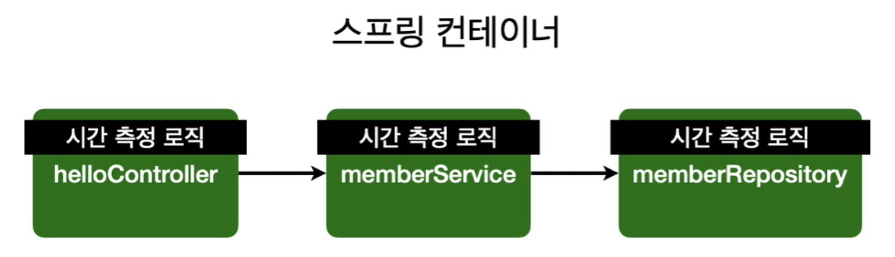
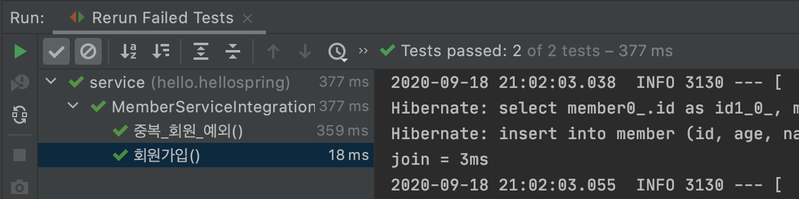
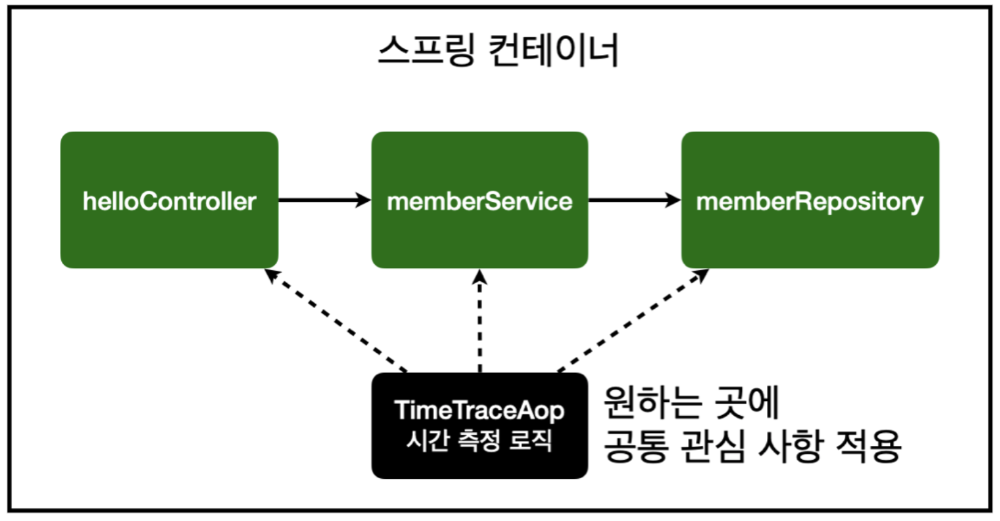
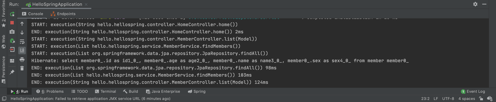
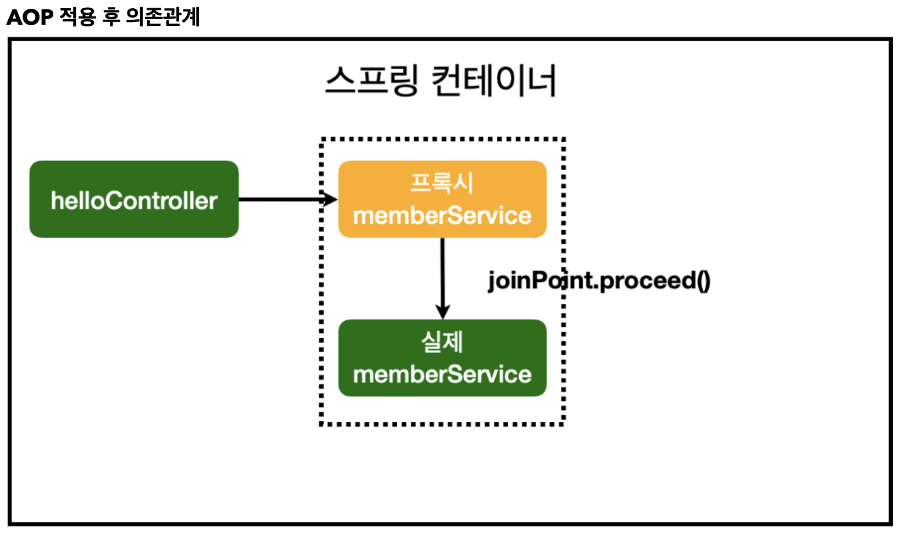
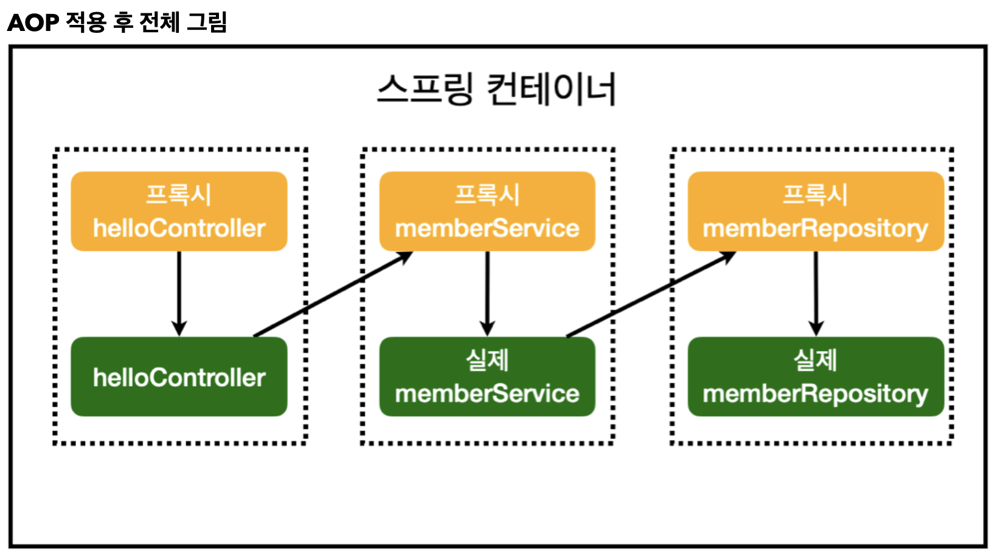

# AOP(Aspect Oriented Programming)

## AOP가 필요한 상황?

이제껏 구현한 코드상에서 성능 문제가 발생하여 어느 메소드에서 문제가 발생하는지 알아내야 하는 상황이 왔다고 가정하자. 이 때, 각 메소드의 호출 시간을 측정해서 본래 의도보다 오래 걸리는 메소드를 찾아 해당 메소드를 수정하라는 지시가 떨어진다면 우리는 각 메소드마다 시간을 측정하는 로직을 추가해야만 한다. 일반적으로 이러한 로직은 아래와 같이 try, finally 로직을 통해 구현할 것이다.

### Try, finally 구문을 통한 시간 측정



```java
public Long join(Member member) {
    long start = System.currentTimeMillis();

    try{
        // 같은 이름의 회원 중복가입 불가
        validateDuplicateMember(member); // 중복 회원 검증
        memberRepository.save(member);
        return member.getId();
    } finally {
        long finish = System.currentTimeMillis();
        long timeMs = finish - start;
        System.out.println("join = " + timeMs + "ms");
    }
}
```

- MemberService 코드의 회원가입(join) 메소드의 실행 속도를 try, finally 구문을 이용하여 구한 후 출력한다.
- 이러한 회원가입, 회원 조회에 대한 시간 측정은 회원관리 시스템의 **핵심 관심 사항(core concern)**이 아니며 이를 **공통 관심 사항(cross-cutting concern)** 이라고 한다.
- 이렇게 핵심 관심 사항과 공통 관심 사항이 섞이게 되면 유지 보수가 어려워 지는 문제점이 발생하며, **이를 분리하기 위해 AOP가 사용**된다.

### AOP를 통한 시간 측정

기존 try, finally를 사용하는 방법은 각 컨트롤러, 서비스, 레포지토리에 시간 측정 코드를 하나씩 집어 넣었다면 AOP는 시간 측정 컴포넌트를 따로 빼서 적용하고자 하는 컴포넌트에 각각 적용하는 방식으로 공통 관심 사항과 핵심 관심 사항을 분리한다.



```java
@Aspect
@Component
public class TimeTraceAop {
    @Around("execution(* hello.hellospring..*(..))")
    public Object execute(ProceedingJoinPoint joinPoint) throws Throwable {
        long start = System.currentTimeMillis();
        System.out.println("START: " + joinPoint.toString());
        try {
            return joinPoint.proceed();
        } finally {
            long finish = System.currentTimeMillis();
            long timeMs = finish - start;
            System.out.println("END: " + joinPoint.toString() + " " + timeMs + "ms");
        }
    }
}
```

- hello.hellospring 패키지 하위에 aop 패키지를 만들고 그 안에 TimeTraceAop를 생성한다.
- Join() 메소드 내부에 시간 측정 로직을 구성했던 것과 같이 코드를 구성한다.
- 이 때 메소드의 실행은 execute의 parameter인 joinPoint의 proceed() 메소드를 통해 진행한다.
- AOP 클래스 위에는 **@Aspect** 어노테이션을 추가 해 주어야 하며, SpringConfig로 스프링 빈을 등록해도 되고, 여기서처럼 @Component 어노테이션을 통해 컴포넌트 스캔을 사용하여도 된다.
- 또한 execute 상단에는 **@Around** 어노테이션을 추가 해 주어야 하며, 이 때 ```"execution(* hello.hellospring..*(..))"```은 hello.hellospring 하위의 모든 패키지에 aop를 적용한다는 뜻이다.



- 서버를 실행하고 localhost:8080에서 회원 목록을 조회하면 호출되는 메소드의 이름, 종료시의 경과시간도 위와 같이 출력되게 된다.
- 이를 통해 cc와 ccc의 분리를 할 수 있으며, 유지 보수의 용이함도 얻을 수 있다.

### 스프링 AOP의 동작 방식

AOP 동작 이전에는 아래 그림과 같이 Controller에서 Service를 직접 호출하는 방식으로 동작했다.


하지만 AOP를 등록하면 Controller가 직접 Service를 호출하는 것이 아니라 **프록시 Service**를 호출하며 진짜 Service는 AOP의 joinPoint.proceed() 메소드에 의해 실행되게 된다.



- AOP가 인식되면 스프링 컨테이너는 호출될 컴포넌트의 프록시를 만들어 놓는다.

- 해당 컴포넌트가 호출될 경우, 실제 컴포넌트 대신 프록시가 호출받으며 joinPoint.proceed()가 실행 될 때 실제 컴포넌트를 호출한다.

- 실제로 호출되는 memberService를 console에 찍어보면 아래와 같이 프록시 memberService가 주입되는 것을 확인할 수 있다.

  

따라서 AOP를 적용한 후의 전체 로직은 아래와 같이 바뀌게 된다.



## Reference

**Inflearn** - **스프링 입문 - 코드로 배우는 스프링 부트, 웹 MVC, DB 접근 기술: 김영한**

본 포스트는 Inflearn에서 김영한 님의 스프링 입문 강의를 들으며 개인적으로 정리한 내용입니다. 내용 중에 강의에서 제공하는 pdf파일의 일부분이 포함되어 있으므로 혹시나 그림을 사용하고 싶은 분은 김영한 님의 강의자료 인용 표시를 확실하게 해주시면 감사하겠습니다.