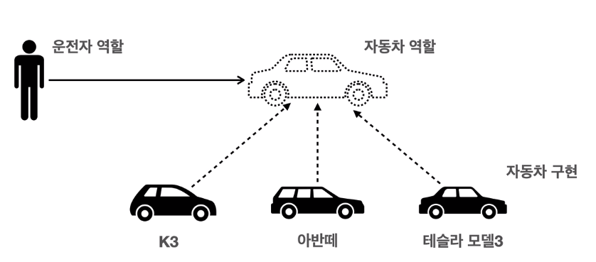

# 📜 좋은 객체 지향 설계 원칙

## ☝ 다형성(Polymorphism)

- 다형성이란 사전적 의미로는 ''여러 형태를 가질 수 있는 능력''을 의미하며 자바에서는 인터페이스의 사용을 대표적으로 꼽을 수 있다.

- 예를 들어 세상을 역할(interface)과 구현(class)로 분류하면 interface를 사용하는 client는 해당 interface의 메서드가 어떻게 구현되었는지는 알 필요가 없다.

- client는 interface의 정의만 지키며 사용하면 되고 그 구현체를 구현하는 방법은 다양하게 선택을 할 수 있다.

  

- 위 그림을 예로 들자면, 사용자는 자동차라는 인터페이스의 기능(엑셀을 밟으면 앞으로 간다던지)에 대해서만 알고 있으면 자동차의 모델이 어떤 것이든지 상관하지 않고 바로 운전할 수 있다.

  👉 주의할 점: 인터페이스에 의존적이기 때문에 **초기에 인터페이스를 안정적으로 잘 설계**하는 것이 중요하다! 
  

## ✌ SOLID 원칙

### ⚽ SRP 단일 책임 원칙(Single Responsibility Priciple)

- 한 클래스는 하나의 책임만 가져야 한다.
- 하나의 책임은 클 수 있고 작을 수 있다(경험이 필요한 부분).
- SRP를 판단할 수 있는 기준은 **변경**이다. 어떠한 변경이 있을 때, 그것에 의한 **Side Effect를 적게** 하도록 설계하는 것이 SRP를 잘 지키는 것이라고 생각할 수 있다.

### ⚾ OCP 개방 - 폐쇄 원칙(Open/Closed Priciple)

- Sw 요소는 **확장에는 열려** 있으나 **변경에는 닫혀**있다.
- 다형성(인터페이스)을 활용하면 이해할 수 있다.
- 엑셀을 밟으면 앞으로 가고 브레이크를 밟으면 멈춘다는 자동차 인터페이스 자체는 변경 X - 변경에 닫혀있다.
- 기름으로만 동작하던 자동차를 기름 + 전기로 동작하게 만들 수 있다 - 확장에 열려있다.

```java
Class A {
    MemberRepository m = new MemoryMemberRepository();
    MemberRepository m = new JdbcMemberRepository();
}
```

- 변경에 닫혀 있다고 했는데 위와 같이 클라이언트 측에서 어떤 구현체를 사용할 지 명시적으로 코드를 바꿔주면서 OCP 원칙을 위반하게 된다.
- 이를 해결하기 위해 별도의 조립, 설정자가 필요하며 이를 spring이 DI, IOC 등으로 해결할 수 있다.
- 회사에서 하던 프로젝트에서는 비슷한 경우에 아래와 같이 Factory 패턴을 사용하여 클래스로 넘어온 parameter에 따라 서로 다른 인스턴스(빈)를 반환하는 식으로 OCP 원칙을 지킬 수 있었다.

```java
Class Factory {
    public static MemberRepository getRepository(param) {
        if (param == 1) return new MemoryMemberRepository();
        else return new JdbcMemberRepository();
    }
}

Class A {
    MemberRepository m = Factory.getRepository(1);
}
```

### 🥎 LSP 리스코프 치환 원칙(Liskov Substitution Principle)

- 프로그램의 객체는 프로그램의 정확성을 깨지 않으면서 하위 타입의 인스턴스로 바꿀 수 있어야 한다.
- 인터페이스의 구현체는 인터페이스의 규약을 모두 지켜야 하며, 이는 컴파일과 무관하기 때문에 꼭 지켜야 한다.
- 예를 들면, 자동차 인터페이스에서는 엑셀은 밟으면 앞으로 가도록 정의했지만 엑셀을 밟았을 때 뒤로 가도록 구현한다면, LSP를 위반했다고 볼 수 있다.

### 🏀 ISP 인터페이스 분리 원칙(Interface Segregation Principle)

- **특정 기능을 위한 인터페이스 여러 개**가 범용 인터페이스 한 개보다 낫다.
- 자동차 인터페이스 -> 운전 인터페이스, 정비 인터페이스로 분리
- 이에 영향을 받아 사용자 클라이언트 -> 운전자 클라이언트, 정비사 클라이언트로 분리
- 이와 같은 경우, 정비 인터페이스가 변해도 운전자 클라이언트에 영향을 주지 않으며, 인터페이스가 명확해지는 장점이 있다.

### 🏐 DIP 의존관계 역전 원칙(Dependency Inversion Principle)

- 구체화에 의존하지 않고 추상화에 의존한다.
- **구현 클래스보다는 인터페이스에 의존하라!**
- 자동차를 예로 들면 자동차의 **역할**에 의존해야지 k3 등의 특정 구현체에 의존하지 않는다. 특정 구현체에만 의존한다면 같은 자동차이더라도 기종이 바뀌면 운전을 제대로 할 수 없다.

```java
Class A {
    MemberRepository m = new MemoryMemberRepository();
}
```

- 위 경우는 A 클래스가 **구현 클래스를 직접 선택**하므로 OCP 뿐만 아니라 **DIP를 위반**한다. 


## 📝 정리

- 객체 지향의 핵심은 **다형성**이다.
- 하지만 **다형성 만으로는 SOLID 원칙의 OCP, DIP를 지킬 수 없으므로** 무언가가 더 필요하다.
- Spring은 **DI, DI 컨테이너**를 통해 OCP, DIP 를 지원한다.
- 다음 포스트 부터는 예제 코드를 따라해보며 스프링이 어떻게 SOLID 원칙을 지키게 해주는지 정리해 볼 예정이다.