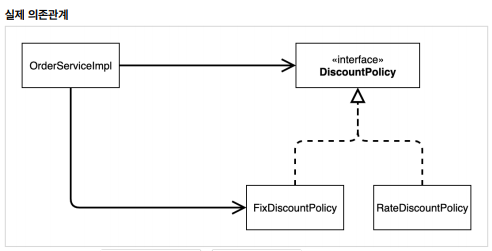
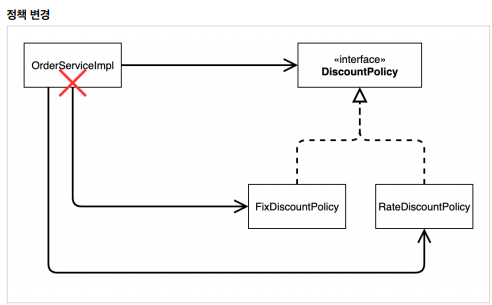
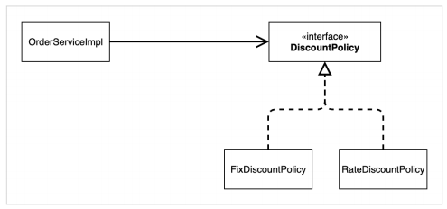
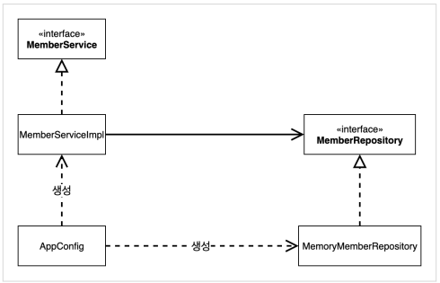
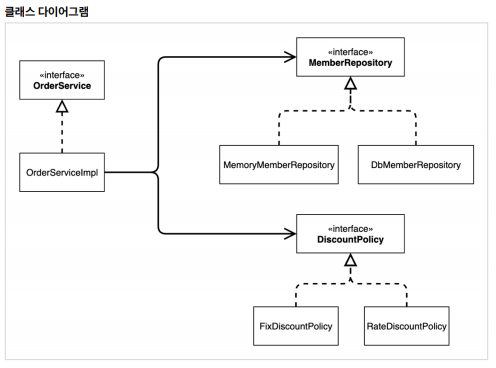
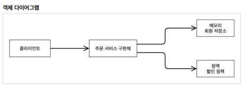

# 🛷 예제 만들기 - 순수 자바

### 🏐 Enum 타입의 값 비교

- 보통 자바에서 값을 비교할 때에는 객체끼리의 비교를 쓰므로 ```A.equals(B)```의 식으로 비교를 한다.
- 하지만 Enum의 경우에는 ```equals``` 대신에 ```==``` 기호를 사용하여 비교하는 것이 맞다.

```java
if (member.getGrade() == Grade.VIP) {
    ...
}
```

# 🎈 객체 지향 원리 적용

## 🏐 DIP, OCP의 위반

### 🔦 기존 예제

- 주문 서비스에서 고정 할인 정책만을 먼저 구현한 뒤, 이후에 추가적으로 비율 할인 정책을 요구받아 구현
- 기존의 고정 할인 정책을 비율 할인 정책으로 변경하여야 함
- 할인 정책 자제를 인터페이스 화 하였으나 실제 서비스에서 해당 인터페이스를 쓸 때는 구현체를 생성자로 직접 생성해서 사용

```java
public class OrderServiceImpl implements OrderService{

    private final MemberRepository memberRepository = new MemoryMemberRepository();
    // private final DiscountPolicy discountPolicy = new FixDiscountPolicy();
    private final DiscountPolicy discountPolicy = new RateDiscountPolicy();

    @Override
    public Order createOrder(Long memberId, String itemName, int itemPrice) {
        Member member = memberRepository.findById(memberId);
        int discountPrice = discountPolicy.discount(member, itemPrice);
        return new Order(memberId, itemName, itemPrice, discountPrice);
    }
}
```

- 역할과 구현을 분리 -> OK
- 다형성 활동, 인터페이스, 구현체 분리 -> OK
- DIP, OCP를 준수했다 -> 겉으로만 준수하고 그렇지는 않다.

### ⚽ DIP 위반(항상 추상에 의존)

- 주문서비스(OrderServiceImpl)은 DiscountPolicy에 의존하면서 동시에 그것의 **구현체(Fix, RateDiscountPolicy)에도 의존**하고 있다.



### 🥎 OCP 위반(확장에는 Open 변경에는 Close)

- 따라서 가격할인 정책을 변경하려면 OrderServiceImpl의 코드를 함께 변경해야 한다.



### 😉 해결 방안??

- OrderServiceImpl이 DiscountPolicy **인터페이스에만 의존**하도록 수정



```java
public class OrderServiceImpl implements OrderService {

    private final MemberRepository memberRepository = new MemoryMemberRepository();
    private DiscountPolicy discountPolicy;
    ...
}
```

- 위와 같이 수정한다면 인터페이스에만 의존 가능
- 하지만 인터페이스만 존재하고 **구현체가 없으므로 NPE 발생**!!
- 누군가 OrderServiceImpl에 DiscountPolicy의 **구현체를 대신 생성해서 주입**해주면 된다!!


## ⚾ 관심사의 분리

### 🏓 연극과의 비교

- 애플리케이션을 하나의 공연이라고 하고 각 인터페이스를 배역이라고 가정

- 이 전의 코드는 예를 들자면 공유라는 배우가 남 주연역을 맡으며 동시에 여 주연역을 맡을 배우를 직접 초빙하는 등의 **여러 책임**을 가짐

- 배우는 **본연의 역할인 배역을 수행하는 책임**만 가져야 한다.

- 또한 남배우는 어떤 여주연이 오더라도 똑같이 공연을 할 수 있어야 한다.

  --> 공연 구성, 담당 배우 섭외등의 역할을 하는 **공연 기획자**가 추가로 필요하다.
  --> **관심사의 분리!!**

### 🏀 AppConfig

- 애플리케이션의 전체 동작 방식을 구성(config)
- **구현 객체를 생성**하고 **연결하는 책임**
- 앞서 언급한 **공연 기획자**의 역할!

```java
public class AppConfig {

    public MemberService memberService() {
        return new MemberServiceImpl(new MemoryMemberRepository());
    }

    public OrderService orderService() {
        return new OrderServiceImpl(new MemoryMemberRepository(), 
        new FixDiscountPolicy());
    }
}
```

- 기존에는 MemberServiceImpl에서 MemoryMemberRepository 인스턴스를 생성해서 사용했으나 AppConfig에서 생성해 주입하는 방식으로 변경
- OrderServiceImpl또한 직접 MemoryMemberRepository와 DiscountPolicy를 생성해서 사용했으나 AppConfig에서 생성해 주입

```java
public class OrderServiceImpl implements OrderService {

    // private final MemberRepository memberRepository = new MemoryMemberRepository();
    // private DiscountPolicy discountPolicy;
    
    private final MemberRepository memberRepository;
    private final DiscountPolicy discountPolicy;

    public OrderServiceImpl(MemberRepository memberRepository, DiscountPolicy discountPolicy) {
        this.memberRepository = memberRepository;
        this.discountPolicy = discountPolicy;
    }
}

```

- OrderServiceImpl은 **인터페이스만 의존하고 구현체에는 신경을 쓰지 않게 되어 DIP 원칙**을 지킬 수 있게 된다.
- 해당 서비스의 생성자를 통해 구현체를 주입받으므로 **생성자 주입 방식**이라고 한다.
- 이제 서비스는 의존관계에 대해 신경쓰지 않고 실행에만 집중할 수 있다.

### 🏐 리팩토링 결과



- 객체 생성, 연결: AppConfig 담당
- `MemberServiceImpl`은 `MemberRepository`만 의존하면 되므로 **DIP**를 만족한다.
- 객체 생성, 연결 / 실행 역할이 분리됨
- `MemberServiceImpl` 입장에서는 의존관계를 외부에서 주입해주기 때문에 이를 **DI(Dependency Injection)**이라고 한다.

### 📝 AppConfig 리펙토링

- 현재 AppConfig는 OrderService와 MemberService의 역할은 잘 드러나지만 MemberRepository와 DiscountPolicy의 역할은 잘 드러나지 않는다.
- 따라서 아래와 같이 수정하여 각각의 역할이 잘 드러나도록 리펙토링할 수 있다.

```java
public class AppConfig {

    public MemberService memberService() {
        return new MemberServiceImpl(memberRepository());
    }

    private MemberRepository memberRepository() {
        return new MemoryMemberRepository();
    }

    public OrderService orderService() {
        return new OrderServiceImpl(memberRepository(), discountPolicy());
    }

    public DiscountPolicy discountPolicy() {
        return new FixDiscountPolicy();
    }
}
```


## 📜 Spring의 3개 개념(IoC, DI, 컨테이너)

### ⌚ IoC

- 기존에는 MemberServiceImpl에서 MemberRepository 객체를 직접 생성하고 사용하며 프로그램의 제어 프름을 스스로 조정
- 하지만 AppConfig를 사용함으로써 구현체에서는 객체를 직접 생성하는 것이 아닌 AppConfig로부터 구현 객체를 입력받고 자신은 **로직의 실행에만 집중**
- 이렇듯 프로그램의 **제어 흐름을 직접 하는 것이 아닌 외부에서 관리하게 되는 것을 제어의 역전(IoC)**이라 한다.

### 🛷 DI

- OrderServiceImpl은 DiscountPolicy 인터페이스에만 의존하며 어떤 구현체를 사용할 지는 알 수 없다.
- 의존 관계는 **정적인 클래스 의존관계와, 실행 시점에 결정되는 인스턴스 의존 관계를 분리**해서 생각해야 한다.
- **정적인 의존관계**: `코드`만 보고도 알 수 있음(클래스 다이어그램)



```java
public class OrderServiceImpl implements OrderService {

    private final MemberRepository memberRepository;
    private final DiscountPolicy discountPolicy;
    ...
}
```

- 위 코드만 보고도 OrderServiceImpl이 MemberRepository와 DiscountPolicy를 의존한다는 것을 알 수 있고 이것이 정적인 클래스 의존관계이다.
- 하지만 위 코드만으로는 실제 어떤 객체가 주입될 지는 알 수 없다.
- 동적인 객체 인스턴스 의존 관계: `애플리케이션 실행 시점`에 실제 생성된 객체 인스턴스의 참조가 연결된 의존 관계(객체 다이어그램)



- 런타임에 실제 구현 객체를 생성하고 클라이언트에 전달해 의존관계가 연결되는 것을 **DI**라고 한다.
- DI를 사용하면 **정적인 클래스 의존관계를 변경하지 않고, 동적인 객체 인스턴스 의존관계를 쉽게 변경**할 수 있다.

### 🔑 IoC 컨테이너, DI 컨테이너

- AppConfig처럼 **객체를 생성하고 관리하며 의존관계를 연결해 주는 것**을 IoC 컨테이너 혹은 `DI 컨테이너`라고 한다.
- 어샘블러, 오브젝트 팩토리 등으로 불리기도 한다.


## 🍠 스프링 전환

### 🎈 AppConfig 수정

```java
@Configuration
public class AppConfig {

    @Bean
    public MemberService memberService() {
        return new MemberServiceImpl(memberRepository());
    }

    @Bean
    public MemberRepository memberRepository() {
        return new MemoryMemberRepository();
    }

    @Bean
    public OrderService orderService() {
        return new OrderServiceImpl(memberRepository(), discountPolicy());
    }

    @Bean
    public DiscountPolicy discountPolicy() {
//        return new FixDiscountPolicy();
        return new RateDiscountPolicy();
    }
}
```

- @Configuration과 @Bean 어노테이션을 통해 스프링 컨테이너에 객체를 등록한다.

### 🔦 MemberApp 리펙토링

```java
public static void main(String[] args) {

    ApplicationContext applicationContext = new AnnotationConfigApplicationContext(AppConfig.class);
    MemberService memberService = applicationContext.getBean("memberService", MemberService.class);
    ...
}

```

- 기존과 달리 **스프링 컨테이너(ApplicationContext)**를 생성하고 해당 컨테이너로부터 Bean을 주입받는다.
- 이 때 Bean 이름은 앞서 AppConfig에서 메서드 명으로 자동으로 설정된다.