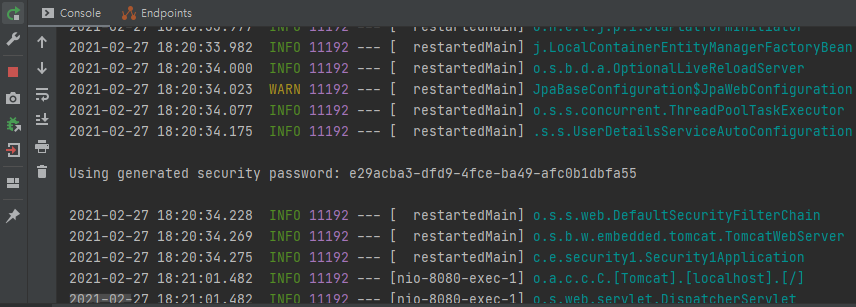
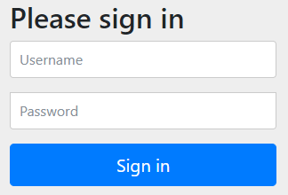

# 🔑 Spring Security 프로젝트 생성 및 환경설정

## ☝ 프로젝트 생성 및 템플릿 설정

### 🏐 프로젝트 생성

- ```start.spring.io``` 사이트에 들어가서 프로젝트 생성을 해준다.
- Maven / 스프링 부트 2.4.3 버전 / packaging Jar / Java 8 버전을 설정한다.
- Spring Boot DevTools(hot reload를 가능하게 해줌), Lombok, Spring data JPA, MySQL Driver, Spring Security, Mustache(템플릿 엔진), Spring Web 디펜던시 추가
- 자세한 사항은 spring 공부 - 1 포스트 참고

### 🥎 DB 스키마 생성

- 프로젝트에 사용할 DB 및 사용자 생성

```sql
create user 'cos'@'%' identified by 'cos1234';
GRANT ALL PRIVILEGES ON *.* TO 'cos'@'%';
create database security;
use security;
```

### 🏀 프로젝트 기본 설정

- application.yml에 DB관련 세팅을 추가

```sql
  
server:
  port: 8080
  servlet:
    context-path: /
    encoding:
      charset: UTF-8
      enabled: true
      force: true
      
spring:
  datasource:
    driver-class-name: com.mysql.cj.jdbc.Driver
    url: jdbc:mysql://localhost:3306/security?serverTimezone=Asia/Seoul
    username: cos
    password: cos1234
    
  mvc:
    view:
      prefix: /templates/
      suffix: .mustache

  jpa:
    hibernate:
      ddl-auto: update #create update none
      naming:
        physical-strategy: org.hibernate.boot.model.naming.PhysicalNamingStrategyStandardImpl
    show-sql: true
```

### ⚾ 컨트롤러 생성

- IndexContoller 생성 후 index 리턴

```java
@Controller
public class IndexController {

    @GetMapping({"", "/"})
    public String index() {
        // 현재는 mustache 엔진을 사용하고 있음
        // 이는 공식 지원 엔진이므로 src/main/resource 가 기본 path로 잡혀있음
        // 여기에 prefix로 template , suffix로 .mustache를 설정하면 설정 끝 (application.yml)에 있음
        // 근데 위 설정은 우리가 이미 프로젝트 만들때 mustache를 쓴다고 했으므로 삭제해도 정상 동작함
        return "index"; //src/main/resources/templates/index.mustache 를 찾음
    }
}
```

- controller는 기본적으로 view를 리턴하므로 index를 리턴한다고 하면 index라는 이름의 view를 찾아 리턴함.
- 현재 mustache를 기본적으로 사용하고 있으므로 prefix가 template, suffix가 .mustache로 설정이 되어 있음 -> application.yml의 관련 설정은 지워도 됨
- 기본 path는 src/main/resource로 잡혀 있으므로 index를 리턴한다고 하면 이 path에 prefix, suffix를 더해 ```src/main/resource/templates/index.mustache```를 찾아서 반환하게 된다.

### ⚽ html(view) 생성 및 view resolver 설정

- resources 아래 templates 폴더에 index.html 파일을 생성
- 앞서 언급되었듯이 기본 suffix는 .mustache이므로 이를 .html로 바꿔주는 작업이 필요하다.
- config 폴더 생성 후 내부에 WebMvcConfig.java 파일 생성

```java
@Configuration
public class WebMvcConfig implements WebMvcConfigurer {

    @Override
    public void configureViewResolvers(ViewResolverRegistry registry) {
        MustacheViewResolver resolver = new MustacheViewResolver();
        resolver.setCharset("UTF-8");
        resolver.setContentType("text/html; charset=UTF-8");
        resolver.setPrefix("classpath:/templates/"); 
        resolver.setSuffix(".html");

        registry.viewResolver(resolver);
    }
}
```

- WebMvcConfiguerer 인터페이스를 구현하고 configureViewResolvers를 오버라이드하여 suffix를 .html로 바꾸어주고 registry에 등록한다.
- 이 과정을 통해 spring에서는 .html 파일을 인식해서 리턴할 수 있게 된다.

### 🛷 프로젝트 실행

- 프로젝트를 실행하면 다음과 같이 실행 창 중간에 패스워드가 뜨게 되는데 이를 캡처해둔다.



- localhost:8080에 접속하게 되면 프로젝트에 spring security를 추가했으므로 기본적으로 다음과 같은 창이 뜨게 된다.



- 여기에 user / 아까 복사했던 비밀번호를 붙여넣게 되면 로그인이 성공되고 기본 세팅을 끝이 난다!


## ✌ Spring Security Config

### ⚽ 테스트를 위해 index이외에 다른 컨트롤러 생성

- user, admin, manager, login, join, joinProc에 대응되는 컨트롤러 생성

```java
@GetMapping("/login")
    public @ResponseBody
    String login() {
        return "login";
    }
```

- 위와 똑같은 형식으로 여러 컨트롤러를 생성했으며, 각각에 대응되는 html을 만들기 귀찮기 때문에 **@ResponseBody 어노테이션을 통해 view가 아닌 String을 반환**하도록 함
- 여기서 "localhost:8080/login"에 접속하게 되면 "login"이 적힌 페이지가 아닌 디폴트 로그인 페이지로 이동하게 되는데, **SecurityConfig를 설정하게 되면 스프링 시큐리티가 /login 요청을 낚아채지 않고 내가 만든 페이지를 보여줄 수 있게** 된다.

### 🏀 SecurityConfig 설정

```java
@Configuration
@EnableWebSecurity
public class SecurityConfig extends WebSecurityConfigurerAdapter {

    @Override
    protected void configure(HttpSecurity http) throws Exception {
        http.csrf().disable();
        http.authorizeRequests()
                .antMatchers("/user/**").authenticated() // 로그인 한 사람만
                .antMatchers("/manager/**").access("hasRole('ROLE_ADMIN') or hasRole('ROLE_MANAGER')")
                .antMatchers("/admin/**").access("hasRole('ROLE_ADMIN')")
                .anyRequest().permitAll() // 위 3개가 아닌 주소 접근은 모두 허용
                .and()
                .formLogin()
                .loginPage("/login"); // 접근 거부시 이 url로 리다이렉트
    }
}
```

- Configuration 어노테이션을 통해 spring container에 빈 등록
- EnableWebSecurity 어노테이션을 통해 **스프링 시큐리티 필터가 스프링 필터체인에 등록**되도록 함
- antMachers 내부에 접근 url을 넣고 그 뒤에는 해당 url로 접근했을 때의 동작을 적어주면 된다.
- authenticated()는 로그인 한 사람만 접근이 가능하도록 설정
- access()는 로그인을 했고 그에 더해 지정된 권한을 가진 사람만 접근이 가능하도록 설정
- anyRequest()는 antMachers에 해당하지 않는 모든 url을 뜻하며 이들은 전부 접근을 허용했다(메인 페이지나 회원가입 페이지).
- 마지막으로 접근이 거부당할 경우 login 페이지로 전부 리다이렉션 시키도록 했다.