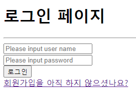
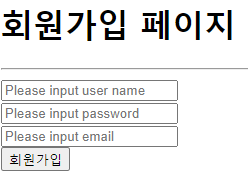
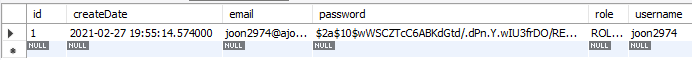
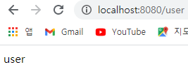

# 🏓 회원가입과 로그인

## ☝ 회원가입

### 🏀 로그인 페이지 만들기

- controller login -> loginForm으로 수정
- html을 이용해 간단한 로그인 페이지 구현

```html
<!DOCTYPE html>
<html lang="en">
<head>
    <meta charset="UTF-8">
    <title>로그인 페이지</title>
</head>
<body>
    <h1>로그인 페이지</h1>
    <hr />
    <form>
        <input type="text" name="username" placeholder="Please input user name" /> <br />
        <input type="password" name="password" placeholder="Please input password" /> <br />
        <button>로그인</button>
    </form>
<a href="/joinForm">회원가입을 아직 하지 않으셨나요?</a>
</body>
</html>
```



### ⚾ 회원가입 페이지 만들기

- joinForm GetMapping 컨트롤러 생성
- html로 간단한 회원가입 페이지 생성

```html
<!DOCTYPE html>
<html lang="en">
<head>
    <meta charset="UTF-8">
    <title>회원가입 페이지</title>
</head>
<body>
<h1>회원가입 페이지</h1>
<hr />
<form action="/join" method="POST">
    <input type="text" name="username" placeholder="Please input user name" /> <br />
    <input type="password" name="password" placeholder="Please input password" /> <br />
    <input type="email" name="email" placeholder="Please input email" /> <br />
    <button>회원가입</button>
</form>
</body>
</html>
```



### 🏐 DB에 회원 정보를 넣기 위한 모델 생성

- spring 공부에서 다뤘던 것처럼 JPA는 @Entity 어노테이션을 감지해서 DB 테이블을 생성해준다.
- model 패키지를 만들고 그 안에 id, username, pwd, email, role, createDate를 포함한 User Entity를 만들어 준다.

```java
@Entity
@Data
public class User {
    @Id
    @GeneratedValue(strategy = GenerationType.IDENTITY)
    private int id;
    private String userName;
    private String password;
    private String email;
    private String role;
    @CreationTimestamp
    private Timestamp createDate;
}
```

- PK인 id는 @Id 어노테이션과 @GeneratedValue를 이용해서 자동생성되도록 한다.
- Timestamp는 sql 패키지 내부의 것을 쓰며 @CreationTimestamp 어노테이션을 통해 자동생성되도록 한다.

### 🥎 UserRepository 생성

- 여기서는 스프링 시큐리티가 중심이기 때문에 따로 서비스를 만들지는 않고 Repository만 구현하여 사용한다.
- repository 패키지를 만들고 그 안데 UserRepository **인터페이스**를 생성한다.

```java
public interface UserRepository extends JpaRepository<User, Integer> {
}

```

- **JpaRepository를 상속하였으므로 @Repository를 쓰지 않아도 스프링 빈에 등록**이 된다!
- JpaRepository는 기본적인 CRUD를 내장하고 있으므로 별도의 함수를 구현하지 않아도 된다.
- UserRepository에서 다를 Entity는 User이며 이것의 pk는 integer이기 때문에 명시해 준다.

### ⚽ 유저 DB 등록

- 회원가입시 받는 정보는 이메일, 유저 이름, 비밀번호이기 때문에 자동 생성되는 id, createdDt외에 Role을 설정해 주어야 한다.
- 또한 스프링 시큐리티는 로그인 시 암호를 해시화해서 비교하기 때문에 암호를 해시화하여 유저 정보에 등록해주는 과정이 필요하다.
- 회원가입이 완료되면 redirct: 를 활용하여 로그인 폼으로 리다이렉션 시킨다.

```java
@PostMapping("/join")
    public String join(User user) {
        System.out.println(user);
        user.setRole("ROLE_USER");
        String rawPassword = user.getPassword();
        String encPassword = bCryptPasswordEncoder.encode(rawPassword);
        user.setPassword(encPassword);
        userRepository.save(user);
        return "redirect:/loginForm";
    }
```

### 🏀 password Encoder Bean 등록

```java
@Bean
    public BCryptPasswordEncoder encodePwd() {
        return new BCryptPasswordEncoder();
    }
```

- SecurityConfig 내부에 BcryptPasswordEncoder를 빈으로 등록한다.
- indexController에서는 @ReauiredAgrsConstructor 어노테이션을 추가한 후 UserRepository와 BCryptPasswordEncoder를 DI 해준다.

```java
@Controller
@RequiredArgsConstructor
public class IndexController {

    private final UserRepository userRepository;
    private final BCryptPasswordEncoder bCryptPasswordEncoder;
    
    ...
    
}
```

### 🏓 결과 확인

- 회원가입을 하고 DB를 확인 해보면 다음과 같이 Data가 들어가 있는 것을 확인할 수 있다.




## ✌ 로그인

### 🏀 로그인 요청 가로채기

- 로그인 로직을 직접 구현하지 않고 스프링 시큐리티를 이용하려면 SecurityConfig를 수정해서 ```/login```으로 들어오는 요청을 시큐리티가 처리하도록 해주어야 한다.

```java
@Override
    protected void configure(HttpSecurity http) throws Exception {
        http.csrf().disable();
        http.authorizeRequests()
                .antMatchers("/user/**").authenticated()
                .antMatchers("/manager/**").access("hasRole('ROLE_ADMIN') or hasRole('ROLE_MANAGER')")
                .antMatchers("/admin/**").access("hasRole('ROLE_ADMIN')")
                .anyRequest().permitAll() // 위 3개가 아닌 주소 접근은 모두 허용
                .and()
                .formLogin()
                .loginPage("/loginForm")
                .loginProcessingUrl("/login") 
                .defaultSuccessUrl("/"); // 로그인 성공시 리다이렉트할 주소
    }
```

- ```.loginProcessingUrl```에 "/login"을 적어주면 해당 주소로 들어오는 요청을 시큐리티가 가로채서 처리하므로 controlelr에 따로 로그인 로직이나 컨트롤러를 구현할 필요가 없다.
- ```.defaultSuccessUrl```은 스프링 시큐리티가 로그인을 처리하고 성공하면 리다이렉트할 주소를 입력해 준다. 여기서는 main으로 이동할 수 있게 "/"으로 설정해 주었다.

### ⚽ 스프링 시큐리티 인증시 동작 과정

- 스프링에는 Session이 존재하는데 스프링 시큐리티는 이 Spring Session 안에서 **Security ContextHolder**라는 Session 공간을 쓰며 이를 통해 로그인된 유저들의 정보를 저장한다.
- 스프링 시큐리티에서 정의한 바에 따르면 Security ContextHolder에 저장될 수 있는 객체는 우리가 정의한 User라는 형태로 저장할 수 없으며 **반드시 Authentication 타입의 객체**로만 저장되어야 한다.
- 이러한 Authentication 타입의 객체 안에 User 정보를 담아야 하는데 여기서도 우리가 정의한 User 객체 형식으로 저장할 수는 없고 **UserDetails 타입의 객체만 저장이 가능**하다.
- 따라서 먼저 UserDetails 인터페이스를 구현하는 구현체를 먼저 만들고, UserDatilService 인터페이스의 구현체를 구현한 후 그 내부의 loadUserByUsername 함수를 통해 UserDetail을 Authentication에 저장하고 그것을 Security ContextHolder에 저장한다.

### 🥎 PrincipalDetails 구현(UserDetails 상속)

- Security ContextHolder의 Authentication 내부에 저장할 UserDetails의 구현체를 만드는 과정이다.
- config 내부에 auth 패키지를 만든 후 그 안에 PrincipalDetails를 만들고 UserDetails를 상속받는다.

```java
public class PrincipalDetails implements UserDetails {

    private User user; // 컴포지션

    public PrincipalDetails(User user) {
        this.user = user;
    }

    // 해당 User의 권한을 리턴하는 곳!
    @Override
    public Collection<? extends GrantedAuthority> getAuthorities() {
        // ArrayList 는 Collection의 자식
        Collection<GrantedAuthority> collect = new ArrayList<>();
        collect.add(new GrantedAuthority() {
            @Override
            public String getAuthority() {
                return user.getRole();
            }
        });
        return collect;
    }

    @Override
    public String getPassword() {
        return user.getPassword();
    }

    @Override
    public String getUsername() {
        return user.getUsername();
    }

    // 계정이 만료되지 않았는지
    @Override
    public boolean isAccountNonExpired() {
        return true;
    }

    // 계정이 잠기지 않았는지
    @Override
    public boolean isAccountNonLocked() {
        return true;
    }

    // 계정 비번이 1년이 넘지 않았는지
    @Override
    public boolean isCredentialsNonExpired() {
        return true;
    }

    // 계정 활성화 여부
    @Override
    public boolean isEnabled() {
        // 사이트에서 1년동안 회원이 로그인 안하면 비활한다.
        // 유저에 loginData를 만들어서 이게 1년이 지났으면 false를 반환하면 됨.
        return true;
    }
}
```

- 여기에는 우리가 정의한 User 인스턴스를 담아 리턴해야 하므로 attribute로 선언해주고 생성자를 통해 값을 주입해준다.
- 이후 UserDetails의 여러 함수들을 Override 하는데 다른것들은 리턴 타입이 String이라 상관 없지만 **해당 User의 권한을 리턴하는 getAuthorities 함수만 리턴 타입이 Colletion 타입**이기 때문에별도의 절차가 필요하다.
- GrantedAuthority 타입의 Collection을 선언한다. 이 때 ArrayList는 Collection의 자식이기 때문에 할당이 가능하다.
- 이후 Collection에 add를 해주는데 GrantedAuthority의 getAuthority를 override하여 user의 권한을 추가해 준다. -> getAuthority의 리턴타입은 string이기 때문에 가능.
- 여기서 isEnables의 경우에는 이후 실제 서비스에서는 로그인 이후 1년이 지나면 계정을 비활하는 등의 방식으로 사용할 수 있는데 User 테이블에 lastLoginDate를 추가해서 이를 비교해 false를 반환하면 된다.

### 🏐 PrincipalDetailsService 구현(UserDetailsService 상속)

- 앞서 SecurityConfig에서 ```loginProcessingUrl("/login")```을 설정했는데 "/login"으로 접근이 들어오면 스프링 시큐리티는 자동으로 UserDetailsService를 찾고 그 내부의 ```loadUserByUsername``` 함수를 실행하게 된다.
- 해당 함수는 리턴값이 UserDetails이며 이 함수가 실행되고 나면 그 결과값인 **UserDetails가 저장된 Authentication 객체가 Spring Security ContextHolder에 저장**되게 된다!

```java
@Service
@RequiredArgsConstructor
public class PrincipalDetailsService implements UserDetailsService {

    private final UserRepository userRepository;

    @Override
    public UserDetails loadUserByUsername(String username) throws UsernameNotFoundException {
        User userEntity = userRepository.findByUsername(username);
        if (userEntity != null) {
            return new PrincipalDetails(userEntity);
        }
        return null;
    }
}
```

- userDtailsService를 상속받아 구현하고 유저의 정보를 받아올때 필요한 UserRepository를 DI 받는다.
- userRepository를 이용해 유저의 정보를 불러오며 이 때 불러온 값이 null이 아니라면 앞서 만들었던 PrincipalDetails에 유저 정보를 넘겨주어 UserDetails 객체를 반환한다.
- 이 때 주의할 점은 loadUserByUsername의 parameter 값인 ```username```이 **controller에서 받는 parameter의 이름과 같아야 한다**는 것이다.
- 여기서는 ```username```으로 파라미터를 받지만 예를 들어 ```name```이라고 받고 싶다면 **SecurityConfig에서 .usernameParameter("name")을 추가**하여 다른 이름으로 받을 수 있다.

### ⚾ JPA findByUsername

- PrincipalDetailsService 구현 시에 userRepository의 ```findByUsername```함수를 사용하였는데 Jpa에는 기본적인 CRUD만 있기 때문에 이는 따로 추가해 주어야 한다.
- JPA Query Method에 의해 간단히 추가할 수 있는데 아래와 같이 한 줄만 추가해주면 된다.

```java
public interface UserRepository extends JpaRepository<User, Integer> {

    // select * from user where username = ? 쿼리가 호출됨
    public User findByUsername(String username);
}
```

- findBy는 기본적으로 제공되기 때문에 테이블에서 findBy 뒤에 붙은 column과 파라미터의 값이 같은 값을 찾게 된다.
- Query로 바꾸자면 ```select * from user where username = ?``` 이라는 쿼리를 전송하여 데이터를 받아오게 된다.

### 🏓 결과 확인

- ```localhost:8080/user```로 접근하면 권한이 없으므로 로그인 페이지로 이동되고, 해당 페이지에서 앞서 가입한 정보를 입력하고 로그인을 누르게 되면 사진과 같이 로그인이 되어 user 페이지로 이동할 수 있게 된다.



- 여기서 좋은 점은 원래 **내가 접근하고자 하던 페이지를 기억해서 로그인한 뒤에 내가 접근하고자 했던 페이지로 자동으로 이동**시켜준다는 것이다.