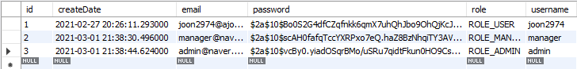
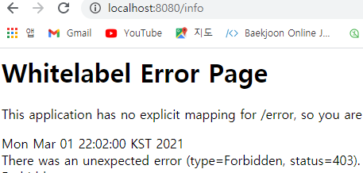

# 🎈 시큐리티 권한처리

- 기본적인 Spring Security에 관한 부분은 이 포스트가 마지막이며, 여기에서는 기존에 글로벌로 설정했던 security 설정들을 controller 메서드별로 설정하는 방법을 다룬다.

## ☝ 사전작업

### 🏐 유저 추가

- manager, admin이라는 아이디를 만들고 각각 ```ROLE_MANAGER```, ```ROLE_ADMIN``` 권한을 부여해준다.



### 🥎 EnableGlobalMethodSecurity 어노테이션 추가

- 각 Controller에 권한 체크를 하려면 SecurityConfig에 ```@EnableGlobalMethodSecurity``` 어노테이션을 추가해 주어야 한다.

```java
@Configuration
@EnableWebSecurity
@EnableGlobalMethodSecurity(securedEnabled = true, prePostEnabled = true)
public class SecurityConfig extends WebSecurityConfigurerAdapter {
	...
}
```

- ```securedEnabled = true```는 **@Secured** 어노테이션을 사용 가능하게 해준다.
- ```prePostEnabled = true```는 **@PreAuthorize**와 **@PostAuthorize** 어노테이션을 사용 가능하게 해준다.

## ✌ 컨트롤러 메서드별 권한 체크

### ⚽ info 메서드 생성 후 ADMIN 권한 부여하기

- '/info' 경로를 처리하는 메서드를 한 개 생성하고 ```@Secured``` 어노테이션을 활용하여 **"ROLE_ADMIN"** 권한을 가진 사람만 접근 가능하도록 설정한다.

```java
@Secured("ROLE_ADMIN")
@GetMapping("/info")
public @ResponseBody String info() {
    return "개인정보";
}
```

- 이 메서드는 하나의 권한만 체크할때 사용하기 용이하다.
- "ROLE_USER"권한이나 "ROLE_MANAGER" 권한을 가진 사용자로 로그인 해서 해당 주소에 접근 시 권한 에러가 뜨는 것을 확인할 수 있다.



### 🏀 data 메서드 생성 후 ADMIN, MANAGER 권한 부여하기

- '/data'경로를 처리하는 메서드를 한 개 생성한 후 ```@PreAuthorize``` 어노테이션을 활용하여 **"ROLE_MANAGER"** 권한과 **"ROLE_ADMIN"** 권한을 가진 사람만 접근할 수 있도록 한다.

```java
@PreAuthorize("hasRole('ROLE_MANAGER') or hasRole('ROLE_ADMIN')")
@GetMapping("/data")
public @ResponseBody String data() {
    return "데이터 정보";
}
```

- 이 메서드는 ```@Secured```와 다르게 여러 권한을 설정할 수 있다.

- 또한 parameter로 그냥 String을 주는 것이 아니라 SecurityConfig에서 처럼 **hasRole**을 활용한다.

  