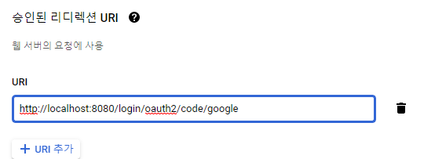
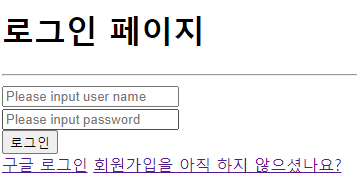

# 🛷 Spring Security와 Oauth 로그인

- 이번 포스트부터는 일반적인 Spring security 에서 나아가 oauth를 spring security로 어떻게 구현할 수 있는지를 다룰 예정이다.
- 앞으로 3개의 포스트에서 oAuth에 대해 다루고 이후에는 jwt를 이용한 로그인을 살펴볼 예정이다.

# 🏓 oAuth를 위한 준비

## ☝ Google API Console 설정

### 🏀 구글 api 콘솔에서 프로젝트 생성하기

- 구글 api 콘솔에 접속하여 새 프로젝트를 생성한다.


### 🥎 oAuth 동의

- 왼쪽 메뉴에서 OAuth 동의화면으로 들어가서 **외부**를 체크하고 만들기를 클릭한다.
- 애플리케이션 이름을 설정한다.

### ⚽ 사용자 인증 정보 생성하기

- 왼쪽 메뉴에서 사용자 인증 정보 생성하기로 들어가서 사용자 인증 정보 만들기 - OAuth 클라이언트 ID를 클릭한다.
- 애플리케이션 유형은 웹 애플리케이션으로 설정한다.
- 이름을 적당히 설정한 뒤 맨 아래의 승인된 리디렉션 URI에 ```http://localhost:8080/login/oauth2/code/google```을 입력한다.



- 이 때, oauth를 전부 직접 구현한다면 상관이 없지만 여기서는 oauth2 client 라이브러리를 이용할 것이므로 ```~login/oauth2/code~```는 **다른 이름으로 바꾸어서는 안된다.**
- 이 주소는 google oauth를 처리한 후 정보를 넘겨줄 url을 설정하는 것으로 oauth2 client 라이브러리를 이용하면 저 주소를 자동으로 가로채게 된다.
- 이후 만들기를 클릭하면 ID와 비밀번호가 주어지는데 이는 **타인에게 노출되지 않게** 관리해야 한다.

## ✌ 라이브러리 추가 및 OAuth 관련 설정

### 🏐 Dependency 추가

- pom.xml에 다음과 같이 dependency를 추가한다.

```xml
<dependencies>
    <dependency>
		<groupId>org.springframework.boot</groupId>
		<artifactId>spring-boot-starter-oauth2-client</artifactId>
	</dependency>
    ...
</dependencies>
```

### ⚾ application.yml 설정

- application.yml의 spring 하위 항목으로 다음과 같이 security를 추가한다.

```yaml
security:
    oauth2:
      client:
        registration:
          google:
            client-id: 클라이언트 아이디
            client-secret: 클라이언트 비번
            scope:
            - email
            - profile
```

- 여기서 이후에 google외에 facebook 등을 추가할 수도 있다.
- google 아래에는 아까 api console에서 얻었던 클라이언트 아이디와 비번을 입력한다.
- scope에는 어떤 정보를 받아올 지를 명시할 수 있다.

### 🏀 SecurityConfig에 oauth정보 추가

- SecurityConfig의 defaultSuccessUrl아래에 다음과 같은 정보를 추가한다.

```java
@Override
    protected void configure(HttpSecurity http) throws Exception {
        http.csrf().disable();
        http.authorizeRequests()
                ...
                .defaultSuccessUrl("/")
                .and()
                .oauth2Login()
                .loginPage("/loginForm"); // 구글 로그인 완료된 뒤의 후처리가 필요
    }
```

- OAuth가 호출되었을 때 어떤 페이지로 이동할지에 대한 정보를 입력한다.

### 🏓 버튼 추가후 클릭해 보기

- loginForm.html에 구글 로그인 버튼을 다음과 같이 추가한다.

```html
</form>
    <a href="/oauth2/authorization/google">구글 로그인</a>
    <a href="/joinForm">회원가입을 아직 하지 않으셨나요?</a>
</form>
```

- 여기서 ```/oauth2/authorization/google```은 고정이므로 다른 방식으로 적으면 정상 동작을 하지 않는다.




- 구글 로그인 버튼을 클릭하면 위와 같은 창이 나오게 되고 구글 아이디를 선택해서 로그인을 할 수 있다.
- **manager**페이지에 접근하여 로그인 페이지로 이동되고 여기서 oauth 로그인을 하게 되면 다음과 같이 권한이 없으므로 정보가 뜨지 않는다. 이제 대해서는 다음 포스트에서 다루도록 한다.

