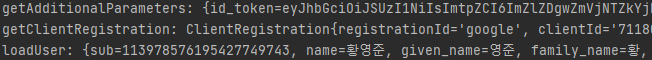

# 🎈 구글 로그인을 통해 사용자 정보 받아보기

## ☝ OAuth 후처리 이해하기

### 🏀 보통의 OAuth 로직

1. OAuth 로그인을 하게 되면 google로부터 **Code**를 받게 됨 - 앞선 포스트에서 설정한 url로 리턴받게 됨
2. 해당 코드에는 사용자 정보에 접근할 수 있는 **Access Token**이 포함되어 있음
3. 이 토큰값을 가지고 다시 google에 해당 사용자의 사용자 정보를 요청(앞선 포스트에서 설정한 email, profile)
4. 사용자 정보를 리턴받음

### ⚾ OAuth client 를 사용한 OAuth 로직

1. 라이브러리가 **자동으로 Code의 Access Token을 통해 구글로부터 사전에 설정한 email, profile 정보를 받아와서 리턴**해줌
2. 해당 리턴값에서는 엑세스 토큰값과 사용자의 토큰 값을 한번에 확인할 수 있음

### 🏐 리턴값 활용

- 보통 사이트에서는 리턴받은 값을 활용해서 강제로 자신의 서비스에 회원가입을 시킴
- 구글로부터 받은 정보 외에 추가적인 정보가 필요할 경우에는 추가 정보 입력창을 띄워주어 해당 정보를 포함하여 회원가입을 시킴

## ✌ SecurityConfig 수정 및 후처리 로직

### ⚽ PrincipalOauth2UserService 생성

- SecurityConfig에 OAuth 후처리를 위한 Service를 등록해주어야 하는데 이 서비스는 반드시 ```OAuth2UserService``` 이어야 한다.
- config 파일 아래에 oauth 패키지를 생성한 후 PrincipalOauth2UserService를 생성한다.
- SecurityConfig에 등록하기 위해 해당 클래스는 DefaultOAuth2UserService를 extend하고 Service로 등록한다.

```java
@Service
public class PrincipalOauth2UserService extends DefaultOAuth2UserService {
    // 구글로부터 받은 userRequest data에 대한 후처리되는 함수
    @Override
    public OAuth2User loadUser(OAuth2UserRequest userRequest) throws OAuth2AuthenticationException {
        return super.loadUser(userRequest);
    }
}
```

- 구글로부터 받은 userRequest 데이터에 대한 후처리 함수는 **loadUser 함수**이며 이 함수를 override하여 강제 회원가입을 할 수 있다.
- 여기서 리턴받은 Access Token과 User 정보를 프린트하면 다음과 같다.



### 🏓 SecurityConfig 수정

- 앞서 생성한 PrincipalOauth2UserService을 DI 받는다.
- 해당 서비스를 .userSerivce안에 넣어준다.

```java
@Configuration
@RequiredArgsConstructor
public class SecurityConfig extends WebSecurityConfigurerAdapter {

    private final PrincipalOauth2UserService principalOauth2UserService;
    
    @Override
    protected void configure(HttpSecurity http) throws Exception {
        http.csrf().disable();
        http.authorizeRequests()
                ...
                .defaultSuccessUrl("/") // 로그인 성공시 리다이렉트할 주소
                .and()
                .oauth2Login()
                .loginPage("/loginForm") 
                .userInfoEndpoint()
                .userService(principalOauth2UserService);
    }
}
```

### ⚾ User Entity 수정

```java
@Entity
@Data
public class User {
    @Id
    @GeneratedValue(strategy = GenerationType.IDENTITY)
    private int id;
    ...

    private String provider;
    private String providerId;
    @CreationTimestamp
    private Timestamp createDate;
}
```

- 해당 아이디가 어디서 제공되었는지를 저장할 provider, provider의 id를 저장할 providerID field를 추가해준다.

### 🛷 Todo

- PrincipalOauth2UserService의 loadUser 에서 유저의 정보를 받아오는 것을 확인했고 앞으로 이 정보를 통해 회원가입을 진행할 예정이다.
- 현재 DB의 email에는 그대로 email을 삽입
- username에는 google_sub(넘겨받은 구글 id의 PK)
- password에는 "임의의 스트링"을 암호화해서 저장할 예정 - 구글 로그인만을 통해 로그인 될 아이디이므로 이래도 상관 없음
- role은 "ROLE_USER"로 설정
- provider에는 google
- providerId에는 sub(구글 아이디의 PK)를 설정할 예정

