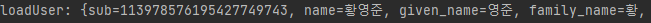
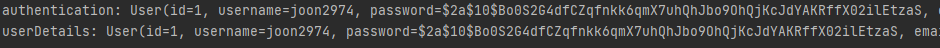
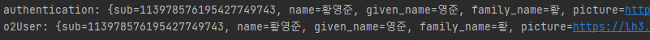
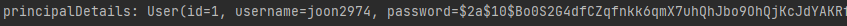
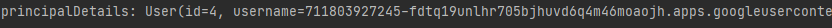

# 🎈 Authentication 객체의 타입

## ☝ Authentication 객체

### ⚾ Authentication 객체란?

- 이전의 포스트에서도 알아보았듯이 Spring에는 Session이 있고 그 세션 안에는 스프링 시큐리티가 관리하는 Security ContextHolder라는 이름의 세션 영역이 있다.
- 해당 세션 안에는 오로지 정해진 객체만 저장될 수 있는데, 그 객체가 바로 **Authentication객체**이다.
- 이 Authentication 객체 안에는 유저의 정보를 담고 있는 UserDetails 객체만 저장될 수 있다고 배웠지만 OAuth2 유저의 정보를 담고있는 OAuth2User 객체도 저장될 수 있다.
- 즉, **Authentication 객체에는 UserDetails, OAuth2User 객체 2개만 저장될 수 있다**!!

### ⚽ Authentication 객체에 OAuth2User를 저장하는 방법

- 이전에는 PrincipalDetails 객체로 UserDetails를 implement해서 유저 정보를 리턴하는 함수들을 override해주었다.
- 이후 PrincipalDetailsService로 UserDetailsService를 implement해서 loadUserByUsername을 override하여 유저의 정보를 PrincipalDetails객체의 형태로 Authentication 객체에 저장했다.
- 여기서 Authentication에 저장되는 **PrincipalDetails가 OAuth2User까지 implementation하게** 만들면 UserDetails, OAuth2User 둘 다 PrincipalDetails로 받아서 Authentication 객체에 저장할 수 있게 된다.

<br>

## ✌ 유저 정보 확인해보기

### 🏐 PrincipalOauth2UserService에서 유저 정보 확인하기

- 지난 포스트에서는 userRequest의 getter를 이용해서 내부에 토큰, 코드 등을 확인해 보았다.
- 그 아래에서는 userRequest를 파라미터로 super의 loadUser 값을 확인해 보았는데, 이 값에서 유저의 정보를 확인할 수 있다.

```java
OAuth2User oAuth2User = super.loadUser(userRequest);
System.out.println(oAuth2User.getAttributes());
```



### 🏀 Controller를 통해 유저 정보 확인하기

- "/test/login"에 매핑한 로그인 정보 확인 메서드를 만든다.
- 이 때 메서드에는 Authentication객체, @AuthenticationPrincipal 어노테이션을 활용하여 유저의 정보를 확인할 수 있다.

```java
@GetMapping("/test/login")
    public @ResponseBody String loginTest(Authentication authentication, @AuthenticationPrincipal PrincipalDetails userDetails) { //DI(의존성 주입)
        // @Authentication principal을 통해 세션 정보에 접근
        // 1번째 방법(다운 캐스팅, DI)
        System.out.println("/test/login =============");
        PrincipalDetails principalDetails = (PrincipalDetails) authentication.getPrincipal();
        System.out.println("authentication: " + principalDetails.getUser());

        // 2번째 방법(어노테이션)
        System.out.println("userDetails: " + userDetails.getUser());
        return "세션 정보 확인하기";
    }
```

- ```Authentication authenticaion``` 파라미터는 스프링 컨테이너에 의해 해당 객체가 **DI**되며 앞서 설명한 대로 **authentication 객체 내부에는 principal이 PrincipalDetails(UserDetail의 구현체) 형태로 존재**한다.
- 따라서 authentication에서 principal을 get하고 (PrincipalDetails)로 다운캐스팅을 해주면 유저 정보를 확인할 수 있다.
- 두 번째 방법으로는 ```@AuthenticationPrincipal``` 어노테이션을 활용하는 방법인데 이를 통해 authentication 객체 내부에 있는 PrincipalDetails 객체 형태의 값을 한 번에 받아올 수 있다.
- 이 두 방법을 통해 받아온 값은 전부 똑같은 값임을 확인할 수 있다.



### 🥎 Controller에서 OAuth2 유저 정보 확인하기

- 이번에는 OAuth2로 로그인한 유저의 정보를 확인하기 위한 컨트롤러 메서드를 생성한다.

```java
@GetMapping("/test/oauth/login")
    public @ResponseBody String loginOAuthTest(Authentication authentication, @AuthenticationPrincipal OAuth2User o2User) { //DI(의존성 주입)
        // @Authentication principal을 통해 세션 정보에 접근
        // 1번째 방법(다운 캐스팅, DI)
        System.out.println("/test/login =============");
        OAuth2User oAuth2User = (OAuth2User) authentication.getPrincipal();
        System.out.println("authentication: " + oAuth2User.getAttributes());

        System.out.println("o2User: " + o2User.getAttributes());
        return "OAuth 세션 정보 확인하기";
    }
```

- 여기서도 똑같이 ```Authentication을 DI``` 받거나 ```@AuthenticationPrincipal```을 통해 바로  유저의 정보를 확인할 수 있다.
- 한 가지 중요한 차이점은 **OAuth로 로그인한 유저의 정보는 Authencation 객체 안에 OAuth2User 객체 형태로 존재**하기 때문에 앞에서와 다르게 OAuth2User 로 다운캐스팅 해주어야 한다.
- 여기서도 동일하게 두 방법으로 받은 값은 같은 것을 확인할 수 있다.



<br>

## 👌 OAuth2 로그인 유저 강제 회원가입 시키기

### ⚾ PrincipalDetails 수정하기

- 앞서 언급한대로 Authentication에는 UserDetail, OAuth2User 두 개의 객체만 들어갈 수 있기 때문에 이미 UserDetails의 구현체인 PrincipalDetails 에 OAuth2User 까지 implementation을 추가해준다.

```java
public class PrincipalDetails implements UserDetails, OAuth2User {

    private User user;
    private Map<String, Object> attributes;
    
    public PrincipalDetails(User user, Map<String, Object> attributes) {
        this.user = user;
        this.attributes = attributes;
    }
	
    @Override
    public Map<String, Object> getAttributes() {
        return attributes;
    }

    @Override
    public String getName() {
        return null;
    }
    ...
}
```

- OAut2User에는 다음과 같이 getAttributes와 getName 메서드가 있으므로 이를 오버라이드 해주어야 한다.
- OAuth2User를 implement 했으므로 객체 생성 시에 attributes를 생성자에 넣어줄 수 있다. 따라서 그 값을 받아서 객체 필드에 할당한다.
- getName은 중요한 함수가 아니므로 일단 null로 처리했다.

### ⚽ PrincipalOauth2UserService 수정하기

- 앞서서 OAuth2 로그인이 실행되면 SecurityConfig에 principalOauth2UserService를 실행하도록 등록을 해두었다.
- 이 함수가 실행되면 내부의 loadUser가 실행되는데 여기서 구글로부터 받은 회원정보로 자사 서비스에 회원가입을 시킨 뒤 위에서 만든 생성자에 들어갈 PrincipalDetails 객체를 리턴 해준다.

```java
@Override
public OAuth2User loadUser(OAuth2UserRequest userRequest) throws OAuth2AuthenticationException {
    OAuth2User oAuth2User = super.loadUser(userRequest);
        
    String provider = userRequest.getClientRegistration().getClientId(); // google
    String providerId = oAuth2User.getAttribute("sub");
    String email = oAuth2User.getAttribute("email");
    String username = provider + "_" + providerId; // google_12312312312 -> 중복 X
    String password = bCryptPasswordEncoder.encode("예제");
    String role = "ROLE_USER";

    User userEntity = userRepository.findByUsername(username);
    if(userEntity == null) {
        userEntity = User.builder()
                .username(username)
                .password(password)
                .email(email)
                .role(role)
                .provider(provider)
                .providerId(providerId)
                .build();
        userRepository.save(userEntity);
    }
        
    return new PrincipalDetails(userEntity, oAuth2User.getAttributes());
}
```

- provider에 oauth 제공자인 google을 userRequest에서 추출해 넣는다.

- providerId에는 구글 아이디의 pk를 넣고 email에는 구글에서 받아온 email을 넣는다.

- username은 중복되지 않도록 provier에 providerId를 이어 넣고, role은 일반 유저의 권한을 넣는다.

- 마지막으로 로그인에 사용되지 않을 패스워드는 임의의 값을 암호화 하여 넣는다.

- DB에 이미 같은 아이디로 회원가입이 되어 있을 수 있으므로 검사를 한 뒤 존재하지 않으면 DB에 등록하여 회원가입을 시킨다.

- 마지막으로 **user와 oAuth2User의 attributes를 포함한 PrincipalDetails를 반환**하여 **두 정보를 포함한 Authentication 객체를 Security ContextHolder에 등록**시킨다.

  ==> PrincipalDetails에 생성한 user, attributes를 params로 받는 생성자를 통해 principalDetails 인스턴스를 만들고 반환한 것!!

### 🏐 Controller에서 PrincipalDetail 확인하기

```java
@GetMapping("/user")
    public @ResponseBody
    String user(@AuthenticationPrincipal PrincipalDetails principalDetails) {
        System.out.println("principalDetails: " + principalDetails.getUser());
        return "user";
    }
```

- 이제 PrincipalDetails가 UserDetails, OAuth2User를 둘 다 상속했으므로 일반 로그인, 구글 로그인 가리지 않고 PrincipalDetails 객체로 받아서 유저 정보를 확인할 수 있다.





- 여기서 ```@AuthenticationPrincipal``` 어노테이션을 이용해 Authentiaction 객체 내부의 UserDetail 객체 값(여기서는 PrincipalDetails가 UserDetails를 상속했으므로 그것으로 받아옴)을 바로 받아왔다.
- 이 때 사용하는 ```@AuthenticationPricipal``` 어노테이션은 ```PrincipalOauth2UserService의 loadUser``` 함수와 ```PrincipalDetailsService의 loadUserByUsername``` **함수가 종료되는 즉시 활성화**된다.