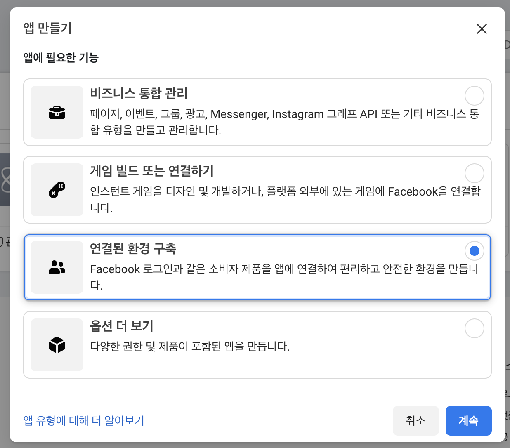
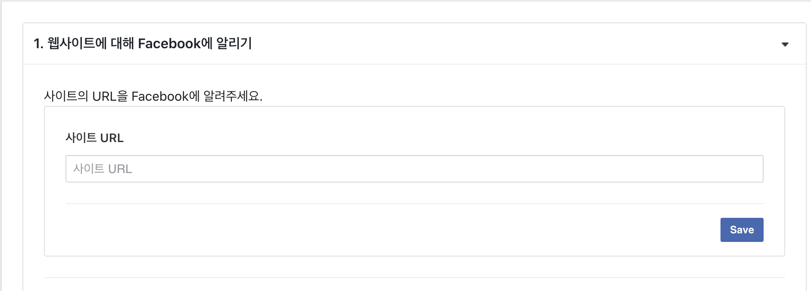
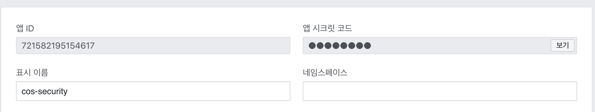

# 🏖 페이스북 로그인

## ☝️ 페이스북 api 콘솔 설정

### 🍙 페이스북 api 콘솔에서 앱 만들기

- ```developer.facebook.com``` 에 접속해서 로그인 한  내 앱 -> 앱 만들기 -> 연결된 환경 구축으로 앱을 생성한다.



- 앱 이름을 적절히 입력한 뒤 제출을 눌러 앱 생성을 완료한다.
- 페이스북 로그인 ->  웹 -> 사이트 url(localhost:8080)을 입력한 뒤 save를 누른다.



- 기본 설정에 들어가 앱 id, 시크릿 코드를 확인한다.



## ✌️ 스프링부트 프로젝트에 적용하기

### 🥮 Application.yml에 설정 추가하기

```yaml
oauth2:
      client:
        registration:
          google:
            client-id: 아이디
            client-secret: 비번
            scope:
            - email
            - profile
          facebook:
            client-id: 아이디
            client-secret: 비번
            scope:
              - email
              - public_profile
```

- 구글 설정과 똑같이 설정을 해주지만 api 문서를 참고하여 scope의 profile -> public_profile로 변경해준다.
- 이후 LoginForm에 페이스북 로그인 버튼을 추가하고 로그인을 해보면 구글 로그인때와 거의 동일하지만 페이스북 서비스 내에서 해당 id의 PK 값을 sub가 아닌 **id** 로 넘겨주는 것을 확인할 수 있다.

### 🍦 OAuth2UserInfo Interface 만들기

- 앞서 확인했듯이 구글 로그인과 페이스북 로그인은 대부분의 정보를 비슷한 키값으로 내려주지만 PK의 경우 키 값이 다르기 때문에 어떤 서비스에서 로그인 했는지에 따라 정보를 컨트롤하는 것이 복잡해진다.
- 따라서 OAuth2UserInfo Interface를 만들어 공통 함수를 만들고 그것의 구현체를 생성하여 각 리턴값에서 정보를 수월하게 얻을 수 있다.

```java
public interface OAuth2UserInfo {
    String getProviderId();
    String getProvider();
    String getEmail();
    String getName();
}
```

- auth 패키지 내부에 provider 패키지를 만들고 그 안에 OAuth2UserInfo 인터페이스를 생성한다.
- 각 OAuth의 리턴값에서 뽑아내야 할 값은 Provider, ProviderId, Email, Name 크게 네 가지 이므로 이렇게 네 가지의 함수를 정의한다.

### 🍜 GoogleUserInfo, FacebookUserInfo 구현체 생성하기

- 앞서 정의한 OAuth2UserInfo의 구현체를 구글, 페이스북 버전으로 각각 구현해준다.

```java
public class GoogleUserInfo implements OAuth2UserInfo{

    private Map<String, Object> attributes; // getAttributes 를 저장할 변수

    public GoogleUserInfo(Map<String, Object> attributes) {
        this.attributes = attributes;
    }

    @Override
    public String getProviderId() {
        return (String)attributes.get("sub");
    }

    @Override
    public String getProvider() {
        return "google";
    }

    @Override
    public String getEmail() {
        return (String)attributes.get("email");
    }

    @Override
    public String getName() {
        return (String)attributes.get("name");
    }
}
```

- parameter로는 userRequest에서 받아온 attributes를 받도록 하고 interface의 메서드 각각을 구현해 준다.

```java
public class FacebookUserInfo implements OAuth2UserInfo{

    private Map<String, Object> attributes; // getAttributes 를 저장할 변수

    public FacebookUserInfo(Map<String, Object> attributes) {
        this.attributes = attributes;
    }

    @Override
    public String getProviderId() {
        return (String)attributes.get("id");
    }

    @Override
    public String getProvider() {
        return "facebook";
    }

    @Override
    public String getEmail() {
        return (String)attributes.get("email");
    }

    @Override
    public String getName() {
        return (String)attributes.get("name");
    }
}
```

- 구글과 비슷하게 작성하지만 **ProviderId를 얻는 키값과 Provider의 리턴값을 다르게** 설정해준다.

### 🍲 PrincipalOauth2UserService 회원가입 로직 수정

```java
OAuth2UserInfo oAuth2UserInfo = null;
if (userRequest.getClientRegistration().getRegistrationId().equals("google")){
    oAuth2UserInfo = new GoogleUserInfo(oAuth2User.getAttributes());
} else if (userRequest.getClientRegistration().getRegistrationId().equals("facebook")) {
    oAuth2UserInfo = new FacebookUserInfo(oAuth2User.getAttributes());
} else {
    System.out.println("구글, 페이스북만 지원");
}

String provider = oAuth2UserInfo.getProvider();
String providerId = oAuth2UserInfo.getProviderId();
String email = oAuth2UserInfo.getEmail();
```

- userRequest로부터 어떤 oAuth 소스로부터 온 요청인지를 파악하여 조건문으로 분기한다.
- oAuth2UserInfo 객체를 해당 조건 분기에 따라 서로 다른 구현체로 선언한다면, 같은 함수를 사용해서 같은 정보를 쉽게 찾아올 수 있고 그 정보를 바탕으로 회원가입을 할 수 있게 된다.