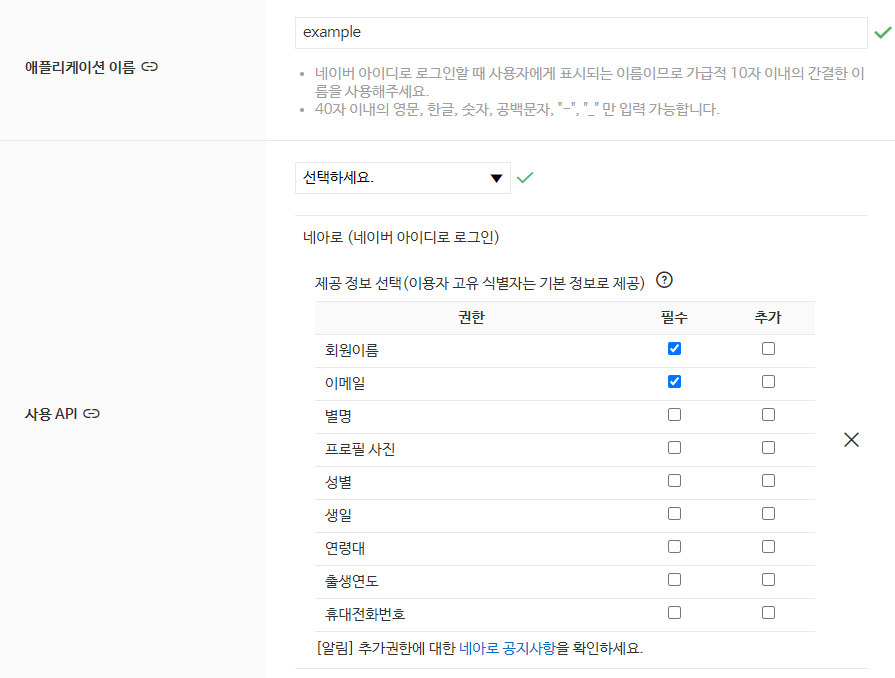
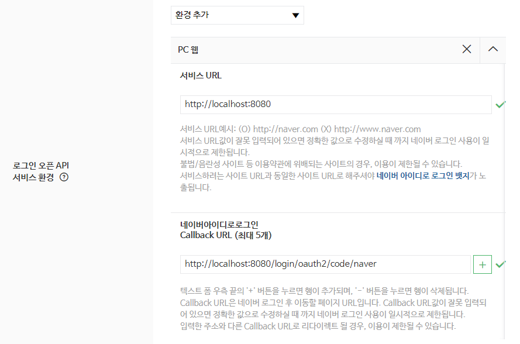
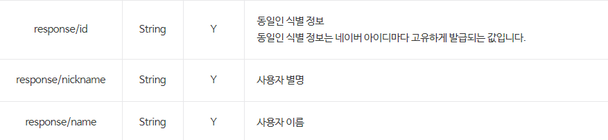
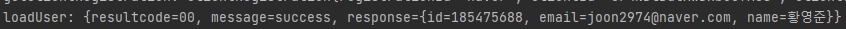
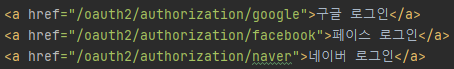
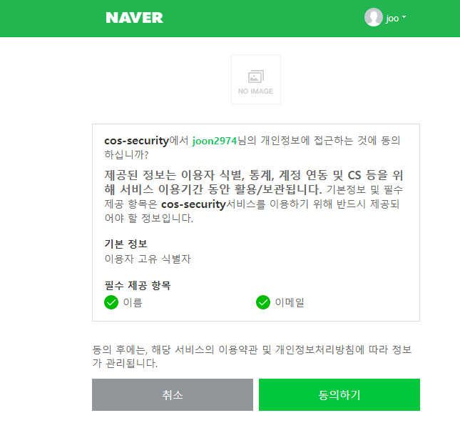
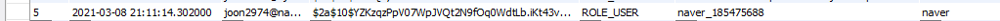

# 🏓 네이버 로그인 

## ☝ 사전 설정

### ⚽ 네이버 개발자 센터 설정

- 앞서 구글은 GCP, 페이스북은 facebook developer 사이트를 이용했던 것 처럼 네이버 로그인을 위해서도 애플리케이션을 생성해야 한다.
- ```네이버 개발자 센터```를 검색해서 로그인 한 뒤 **애플리케이션 등록** 메뉴로 들어간다.
- 애플리케이션 이름을 적어주고 사용 API는 ```네아로```를 선택해준다.



- 이러한 화면에서 예제에 사용할 회원이름, 이메일의 필수 탭을 선택해 준다.



- 환경은 PC 웹으로 선택하고 서비스 URL에는 ```http://localhost:8080```을 적어주고 callback url에는 자바 프로젝트의 **application.yml에 적어준 redirect-uri를 똑같이** 적어준다.
- 이후 프로젝트 생성이 되면 ID와 비번은 다른곳에 적어두면 설정은 끝이다.

### 🥎 application.yml 설정

- 앞서 구글과 페이스북을 registration에 등록했던 것처럼 naver도 똑같이 등록을 해준다.

```yml
naver:
  client-id: 0r4NDlBdtXwDxb****
  client-secret: nf8O***
  scope:
    - name
    - email
  client-name: Naver
  authorization-grant-type: authorization_code
  redirect-uri: http://localhost:8080/login/oauth2/code/naver
```

- 구글, 페이스북과는 조금은 다른 부분이 있는데 우리가 사용하고 있는 OAuth2-Client 라이브러리에서는 Naver를 디폴트 provider로 지원하지 않기 때문에 추가 설정이 필요하다.
- ```authorization-grant-type```은 oauth를 진행하는 방법을 뜻하는데 네이버도 이전의 다른 두 서비스와 같이 ```code```방식을 취한다.

- **redirect-uri는 아까 생성한 애플리케이션에 들어가는 주소**이다. 여기서는 OAuth2-Client의 표준형태를 맞추었지만 임의로 설정하고 개발자도구에 똑같이 넣어주기만 하면 된다.

```yaml
provider:
  naver:
    authorization-uri: https://nid.naver.com/oauth2.0/authorize
    token-uri: https://nid.naver.com/oauth2.0/token
    user-info-uri: https://openapi.naver.com/v1/nid/me
    user-name-attribute: response # 회원정보를 response라는 json으로 받음
```

- 앞에서도 언급했듯이 Naver는 기본 Provider가 아니기 때문에 ```registration```과 같은 레벨로 provider를 등록해주는 과정이 필요하다.
- 위 3개의 url은 개발자센터의 네아로 가이드를 확인하면 쉽게 알 수 있다.
- 맨 마지막 ```user-name-attribute```의 경우에는 아래에서 보다시피 네이버가 리턴값을 response라는 json으로 리턴하므로 해당 json 객체를 제대로 받기위해 적어주는 객체 키 값이다.



## ✌ 네아로 구현하기

### ⚾ NaverUserInfo 구현체 만들기

- 이전 페이스북, 구글과 같이 네이버의 리턴값을 받아 회원가입 시키는 NaverUserInfo 구현체를 만들어야 한다.

```java
public class NaverUserInfo implements OAuth2UserInfo{
    private Map<String, Object> attributes; // getAttributes 를 저장할 변수

    public NaverUserInfo(Map<String, Object> attributes) {
        this.attributes = attributes;
    }

    @Override
    public String getProviderId() {
        return (String)attributes.get("id");
    }

    @Override
    public String getProvider() {
        return "naver";
    }

    @Override
    public String getEmail() {
        return (String)attributes.get("email");
    }

    @Override
    public String getName() {
        return (String)attributes.get("name");
    }
}
```

- 전체적인 내용은 FacebookUserInfo와 다르지 않고 getProvier의 리턴값만 바꾸어 주었다.
- 이제 PrincipalOauth2UserService에서 NaverUserInfo 객체를 생성하는 부분만 추가해주면 된다.

```java
...
else if (userRequest.getClientRegistration().getRegistrationId().equals("facebook")) {
    System.out.println("facebook");
    oAuth2UserInfo = new FacebookUserInfo(oAuth2User.getAttributes());
} else if (userRequest.getClientRegistration().getRegistrationId().equals("naver")) {
    System.out.println("네이버 요청");
    oAuth2UserInfo = new NaverUserInfo((Map)oAuth2User.getAttributes().get("response"));
} else {
    ...
```

- 네이버는 구글, 페이스북과 리턴 형태가 아래와 같이 조금 다르다.



- response json 객체 안에 유저의 정보를 또 response라는 키의 value로 넣어놓았기 때문에 NaverUserInfo를 생성할 때 객체의 value를 한번 더 타고 들어가서 객체를 생성해준다.

### 🏐 결과 확인

- 사진과 같이 네이버 로그인 버튼을 만들어 준다.



- 이후 네이버 로그인 버튼을 누르면 아래와 같은 화면이 뜨게 되고 동의하게 되면 이전과 같이 잘 로그인이 되고 DB에도 값이 정상적으로 들어가는 것을 확인할 수 있다.





